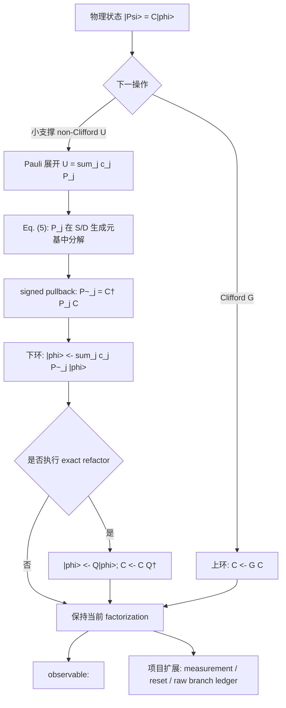

# GCAMPS 公式总表与 CAPEPS 实现映射

日期：2026-07-27
对象：Harper et al., *GCAMPS: A Scalable Classical Simulator for Qudit
Systems*, arXiv:2511.06672v2
来源：[arXiv 摘要页](https://arxiv.org/abs/2511.06672)
版本：v2，2026-01-27，9 页
本地 PDF SHA-256：
`880c44e25e9c1fd589a75ca5e824e58a2436c0c35a7ee7dddebbb61d439a0c42`

状态：

- `read_status = complete`：已逐页读完 PDF 与提取全文；
- 目视核对页：PDF pp. 1–8，包括来源身份、Eqs. (1)–(6)、Table 1、Figs. 3、5–7；
- 本文档是“论文公式 → 项目推导 → 代码/测试”的项目审计，不是论文原文；
- 当前代码是 **qubit、无截断、工程 mechanics slice**，不是完整 GCAMPS
  复现，也不是 XZZX Record 或效率结果。

## Assigned closure rows

| assigned row | exact source location | paper says | paper does not say | source-local status |
|---|---|---|---|---|
| hybrid state and Clifford top loop | PDF p. 5, Sec. 3 and Fig. 3; forward-conjugation derivation on p. 3, Sec. 2.2 | The state is \(C|\mathrm{MPS}\rangle\); a physical Clifford updates the leading tableau while leaving the residual MPS unchanged. | It does not derive a PEPS residual, measurement instrument, or QEC record law. | closed |
| Pauli word in the tableau-generator basis | PDF p. 4, Sec. 2.3.1, Eq. (5) and its surrounding displayed equations | A Pauli word is expanded in stabilizer/destabilizer generators; exponents are found from a phase-free linear system and the phase is recovered by ordered multiplication. | Row/column orientation is ambiguous, and ordinary field elimination is not specified for composite \(d\). | closed |
| small-support non-Clifford update | PDF p. 5, Sec. 3, paragraph beginning “To perform non-Clifford operations” | A small-support unitary is numerically expanded in generalized Pauli words, commuted through \(C\), and applied to the MPS. | Coefficient layout, basis order, structural-zero policy, tolerance, and reconstruction acceptance are absent. | missing |
| Clifford disentangling optimizer | PDF pp. 5–6, Secs. 3 and 3.1 | A Clifford \(Q\) may act on the residual while \(C\) becomes \(CQ^\dagger\); the paper reports 20 and 90 unique two-site entanglers for \(d=2,3\). | Gate lists, canonical key, objective, threshold, sweep, tie-break, and stopping rule are absent. | missing |
| observable bridge | PDF p. 5, Sec. 3, observable paragraph | Qubit Pauli words are commuted through \(C\) and contracted against the MPS; for \(d\ne2\), \(O_\sigma=(\sigma+\sigma^\dagger)/2\) is used. | Selective measurement, reset, branch probabilities, trajectories, and multi-time records are absent. | closed |
| reported efficiency regime | PDF pp. 6–8, Sec. 4 and Figs. 4–7 | Runtime and MPS-memory extrapolations are reported for \(T\)-doped random Clifford circuits, with axes \(t/N\) and \(2\log_d(\chi)/N\). | The paper does not establish the same scaling for a PEPS residual, XZZX circuits, or complete process memory including all workspaces. | closed |

## Operation replay

| input | transformation | assumption | output | exact source location | replay status |
|---|---|---|---|---|---|
| \(C|\phi\rangle\) and a physical Clifford \(G\) | Left-compose the physical gate into the leading frame. | \(G\) is Clifford and the tableau uses forward conjugation \(S\mapsto GSG^\dagger\). | \((GC)|\phi\rangle\) | PDF p. 3, Sec. 2.2; p. 5, Fig. 3 top loop | closed |
| A small-support physical non-Clifford \(U\) | Solve for \(U=\sum_j c_jP_j\) in the generalized Pauli basis. | The basis spans the local operator space and the numerical solve is exact enough for the intended representation. | Pauli terms \(\{(c_j,P_j)\}\) | PDF p. 5, Sec. 3 | source transformation closed; executable solver specification missing |
| A physical Pauli \(P_j\) and the current tableau | Solve Eq. (5) for stabilizer/destabilizer exponents, then explicitly multiply selected generators to recover phase. | A fixed generator/vector orientation and phase convention have been chosen; field Gaussian elimination applies directly only in the prime-\(d\) cases used in the benchmarks. | A generator-basis representation of \(P_j\) | PDF p. 4, Sec. 2.3.1, Eq. (5) | replayed with an explicit source-local orientation gap |
| \(P_jC|\phi\rangle\) | Commute the Pauli word through \(C\); in project notation this is \(\widetilde P_j=C^\dagger P_jC\), so \(P_jC=C\widetilde P_j\). | The signed phase from the generator reconstruction is retained. The displayed \(C^\dagger P_jC\) identity is project reconstruction of the paper's “commute through \(C\)” step. | \(C\widetilde P_j|\phi\rangle\) | PDF p. 5, Sec. 3 and Fig. 3; generator decomposition on p. 4 | closed with the project-derived bridge explicitly marked |
| The commuted Pauli sum and residual MPS | Apply \(\widetilde U=\sum_jc_j\widetilde P_j\) to the residual. | No truncation is introduced if exact physical-ray equality is claimed. | \(C\widetilde U|\phi\rangle\) | PDF p. 5, Sec. 3 and Fig. 3 bottom loop | closed |
| \(C|\phi\rangle\) and a chosen disentangler \(Q\) | Apply \(Q\) to the residual and right-compose \(Q^\dagger\) into the frame. | \(Q\) is unitary Clifford and both paired updates are applied. | \((CQ^\dagger)(Q|\phi\rangle)=C|\phi\rangle\) | PDF p. 5, Sec. 3 | closed algebraically at the physical-ray level; optimizer selection specification missing |
| A physical Pauli observable \(O\) | Commute it through \(C\) and contract the resulting residual Pauli word. | All conjugation phases are retained. | A residual-MPS expectation value | PDF p. 5, Sec. 3, observable paragraph | closed for the stated Pauli-observable bridge |
| An MPS bond selected for reduction | Perform an SVD and retain a fixed number of singular values. | This is an approximation whenever nonzero discarded singular values exist. | A lower-bond approximate residual | PDF p. 4, Sec. 2.4 | transformation stated; quantitative fidelity certificate missing |
| \(T\)-doped random Clifford samples | Record bond, runtime, and extrapolated tensor-memory observables versus \(t/N\) and \(N\). | The workload, MPS residual, and paper's peak-bond assumptions are retained. | Figs. 5–7 | PDF pp. 6–8, Sec. 4 | closed only for the reported workload; reproduction metadata incomplete |

## Source-local verdict

- `read_status: complete`
- `evidence_status: persisted`
- `hybrid algebra and update direction: closed`
- `Eq. (5) conceptual decomposition: closed`
- `Eq. (5) orientation and composite-d executable solver: missing`
- `non-Clifford coefficient solver specification: missing`
- `disentangler optimizer specification: missing`
- `Pauli-observable bridge: closed`
- `measurement/reset/record law: missing`
- `MPS benchmark observations: closed for the reported workload`
- `PEPS, XZZX, full-process memory, and finite-bond fidelity transfer: missing`

The source therefore closes the hybrid algebra skeleton and the reported MPS
benchmark definitions. It does not close an executable reproduction of the
optimizer or any PEPS/XZZX efficiency claim. All such mappings below are
project application or project derivation, not paper facts.

## 0. 先给结论：真正的算法骨架

论文最核心的不是“Clifford 走 tableau、非 Clifford 走 PEPS”这一句，而是
下面六层相互锁定的等式：

\[
\boxed{|\Psi\rangle=C|\phi\rangle}
\tag{A0}
\]

\[
\boxed{G|\Psi\rangle=(GC)|\phi\rangle}
\tag{A1}
\]

\[
\boxed{
U=\sum_j c_jP_j,\qquad
\widetilde P_j=C^\dagger P_jC,\qquad
UC=C\widetilde U
}
\tag{A2}
\]

\[
\boxed{
P=c\prod_jS_j^{s_j}\prod_jD_j^{d_j},
\quad
S_j=CZ_jC^\dagger,\quad D_j=CX_jC^\dagger
}
\tag{A3}
\]

\[
\boxed{
(C,|\phi\rangle)
\longmapsto
(CQ^\dagger,Q|\phi\rangle)
}
\tag{A4}
\]

\[
\boxed{
\langle\Psi|O|\Psi\rangle
=
\langle\phi|C^\dagger O C|\phi\rangle
}
\tag{A5}
\]

其中：

- (A0)、(A1)、(A3) 的构件和 (A4) 的更新方向由论文直接给出；
- (A2) 中完整的 \(UC=C(C^\dagger UC)\) 是把论文“commute through
  \(C\)”补成可执行代码所需的项目推导；
- (A5) 是论文 Pauli-observable 段落的显式写法；
- 只要 residual 更新和 \(Q\)-refactor **不截断**，两路结合在代数上严格
  正确；一旦 SVD 截断或近似 contraction 被引入，正确性就必须转为带独立
  误差证据的近似命题，不能再由上述恒等式自动保证。

精确性的统一语义是 **physical ray**：Stim tableau 不记录 Clifford 的整体
相位。因此实现中的状态恒等式按
\(|\psi_{\rm after}\rangle=e^{i\theta}|\psi_{\rm before}\rangle\) 验收；signed
Pauli conjugation 与 expectation value 仍按其可观测相位精确验收。

### 自顶至下数据流



## 1. L0：状态空间与为什么需要混合表示

### F1 — Qubit 状态：Eq. (1)

来源：PDF p. 2，Sec. 2.1，Eq. (1)。

\[
|\psi\rangle
=\alpha|0\rangle+\beta|1\rangle
=
\begin{bmatrix}\alpha\\\beta\end{bmatrix},
\qquad
\alpha,\beta\in\mathbb C,
\quad |\alpha|^2+|\beta|^2=1.
\]

论文用途：建立 state-vector 基线。

应用到我们：`DenseResidual` 使用 `complex128` 小系统向量作为独立 mechanics
referee；它不是目标 scalable backend。

代码：
`src/error_coupling_simulator/carrier/capeps/residual.py::DenseResidual`。

### F2 — Qudit 状态：Eq. (2)

来源：PDF p. 2，Sec. 2.1，Eq. (2)。

\[
|\psi_d\rangle
=\sum_{j=0}^{d-1}c_j|j\rangle
=
\begin{bmatrix}
c_0&c_1&\cdots&c_{d-1}
\end{bmatrix}^{T}.
\]

论文用途：把局域 Hilbert 空间从 \(d=2\) 推到一般 \(d\)。

应用到我们：当前 CAPEPS residual 的物理腿固定为 2；因此不能仅把
`SdimCliffordFrame(dimension=2)` 改成 3 就称为 qutrit GCAMPS。frame、
Pauli word、projector、tensor physical dimension 和 dense referee 必须一起
泛化。

当前状态：**未实现 \(d>2\) residual**。

### F3 — 直接表示成本

来源：PDF p. 2，Sec. 2.1，Eq. (2) 后。

\[
\dim|\Psi_n\rangle=d^n,
\qquad
\dim U_n=d^n\times d^n,
\]

即 state vector 存储 \(O(d^n)\)，一般 unitary 存储 \(O(d^{2n})\)。

论文用途：说明为什么不能把整个系统长期保持为 dense state/unitary。

应用到我们：dense 仅用于小 \(n\) 对拍；PEPS 保存 residual，tableau 保存
Clifford frame。

限制：这是尺寸计数，不是 GCAMPS 完整 runtime 或 peak-memory 模型。

## 2. L1：Qubit Pauli、stabilizer 与 tableau 方向

### F4 — Qubit Pauli：Eq. (3)

来源：PDF p. 2，Sec. 2.2，Eq. (3)。

\[
X=
\begin{bmatrix}0&1\\1&0\end{bmatrix},
\qquad
Z=
\begin{bmatrix}1&0\\0&-1\end{bmatrix},
\qquad
Y=iXZ=
\begin{bmatrix}0&-i\\i&0\end{bmatrix}.
\]

论文用途：定义 qubit Pauli 基和 stabilizer 生成元。

应用到我们：Stim 的 `Y` label 已经包含 \(iXZ\)。因此 Eq. (5) 若按
\(\prod S_j\prod D_j\) 有序相乘，Identity frame 下的 `+Y` 会得到

\[
Z\,X=+iY,\qquad c=-i,
\]

这不是 bug，而是必须进入 phase ledger 的有序乘法相位。

代码：
`algebra.py::decompose_pauli_in_tableau`。

测试：
`test_eq5_phase_ledger_fixes_y_order_and_conjugation_direction`。

### F5 — Stabilizer 定义

来源：PDF p. 3，Sec. 2.2。

\[
S_i|\phi\rangle=|\phi\rangle .
\]

论文用途：以一组对易 Pauli 生成元确定 stabilizer state。

应用到我们：frame 不是只保存 stabilizers；为了把任意 Pauli 在完整基中
分解，还需要 destabilizers。

### F6 — Tableau：Eq. (4)

来源：PDF p. 3，Sec. 2.2，Eq. (4)。

论文以 \(|00\rangle\) 为例列出

\[
ZI,\quad IZ,\quad XI,\quad IX
\]

以及各行相位。正文给出 tableau 大小

\[
2n\times(2n+1),
\qquad \text{memory}=O(n^2).
\]

论文用途：

- 前 \(n\) 个生成元为 stabilizers；
- 后 \(n\) 个生成元为 destabilizers；
- 相位列保存生成元的符号。

应用到我们：

\[
S_j=CZ_jC^\dagger,\qquad
D_j=CX_jC^\dagger.
\]

Stim 对应 `tableau.z_output(j)` 和 `tableau.x_output(j)`。代码不猜测内部
row/column layout，而是从这些公开输出逐列构造 Eq. (5) 的矩阵。

### F7 — Clifford 前向共轭与左合成

来源：PDF p. 3，Sec. 2.2。

\[
\begin{aligned}
U|\phi\rangle
&=US|\phi\rangle\\
&=USU^\dagger U|\phi\rangle\\
&=S'(U|\phi\rangle),
\end{aligned}
\qquad
S'=USU^\dagger.
\]

论文用途：说明 tableau 保存的是生成元的 **前向共轭**。

应用到我们：

\[
|\Psi\rangle=C|\phi\rangle
\quad\Longrightarrow\quad
G|\Psi\rangle=(GC)|\phi\rangle,
\]

所以 physical Clifford 必须

\[
C\leftarrow GC,
\]

不能写成 \(CG\)。

代码：
`frame.py::StimCliffordFrame.apply_clifford` 使用
`operation * frame`。

测试：`S` 后 `CX` 的非交换 fixture 同时检查正确方向和错误方向的相反
符号。

## 3. L2：广义 qudit Pauli 与 Table 1

### F8 — Weyl/广义 Pauli

来源：PDF p. 3，Sec. 2.3。

\[
\omega=\exp\left(\frac{2\pi i}{d}\right),
\qquad
XZ=\omega^{-1}ZX,
\]

\[
X|j\rangle=|j+1\bmod d\rangle,
\qquad
Z|j\rangle=\omega^j|j\rangle.
\]

任意局域算符可在

\[
\{X^xZ^z:x,z\in\mathbb Z_d\}
\]

中展开。

论文用途：为 generalized tableau 和任意 non-Clifford 分解建立算符基。

应用到我们：当前 `stim.PauliString` 和 GF(2) solver 只实现 \(d=2\)
specialization，不能描述成一般 \(\mathbb Z_d\) 实现。

### F9 — 奇偶 \(d\) 的相位

来源：PDF p. 3，Sec. 2.3。

奇数 \(d\)：

\[
Y=XZ.
\]

偶数 \(d\)：

\[
\tau=\omega^{1/2},
\qquad
Y=\tau XZ.
\]

论文用途：选择使 Pauli 阶数为 \(d\) 的相位约定。

风险：论文随后说 phase column 只保存
\(\omega^k,\ k\in\mathbb Z_d\)，但偶数 \(d\) 的 \(\tau\) 是 \(2d\) 阶
相位。这两处文字不足以共同定义一个完整偶数维 phase representation。

我们的边界：

- qubit phase 由 Stim 的 \(\{\pm1,\pm i\}\) 精确承担；
- SDIM source 的 `phase_order` 对奇数 \(d\) 为 \(d\)，偶数 \(d\) 为
  \(2d\)；
- 当前不声称 \(d>2\) 广义 residual 或 Eq. (5) 已实现。

### F10 — Generalized Hadamard/Fourier gate

来源：PDF p. 3，Sec. 2.3。

\[
H_d=
\frac1{\sqrt d}
\sum_{i=0}^{d-1}
\sum_{j=0}^{d-1}
\omega^{ij}|j\rangle\langle i|.
\]

Table 1 的前向共轭规则：

\[
X\mapsto Z,\qquad Z\mapsto X^{-1}.
\]

### F11 — Generalized phase gate

来源：PDF p. 3，Sec. 2.3。

奇数 \(d\)：

\[
S_d=
\sum_{j=0}^{d-1}
\omega^{j(j-1)/2}|j\rangle\langle j|.
\]

偶数 \(d\)：

\[
S_d=
\sum_{j=0}^{d-1}
\tau^{j^2}|j\rangle\langle j|.
\]

Table 1：

\[
X\mapsto(\tau)XZ=Y,\qquad Z\mapsto Z.
\]

括号中的 \(\tau\) 只在偶数 \(d\) 使用。

### F12 — SUM/CNOT gate

来源：PDF p. 3，Sec. 2.3 与 Table 1。

\[
\mathrm{SUM}_d|i,j\rangle
=|i,(i+j)\bmod d\rangle.
\]

前向共轭：

\[
\begin{array}{ll}
X\otimes I\mapsto X\otimes X,
&I\otimes X\mapsto I\otimes X,\\
Z\otimes I\mapsto Z\otimes I,
&I\otimes Z\mapsto Z^{-1}\otimes Z.
\end{array}
\]

应用到我们：当前 SDIM seam 的 `dimension=2` gate lowering 是 qubit-only；
qudit `CZ`、`SWAP` 和逆门不能沿用 qubit 分解。

## 4. L3：Eq. (5) 是 frame 与 residual 的桥

### F13 — 物理 Pauli 指数形式

来源：PDF p. 4，Sec. 2.3.1。

\[
P=\prod_{i=1}^{n}X_i^{x_i}Z_i^{z_i},
\qquad x_i,z_i\in\mathbb Z_d.
\]

论文用途：把 Pauli body 表示成 \(2n\) 维指数向量。

注意：论文随后同时用 \(P\) 表示算符和指数向量；代码必须把这两种类型
分开。

### F14 — Stabilizer/destabilizer 生成元分解

来源：PDF p. 4，Sec. 2.3.1。

\[
\boxed{
P=c\prod_jS_j^{s_j}\prod_jD_j^{d_j}
}
\]

论文用途：把任意物理 Pauli 写成当前 tableau 生成元的乘积。

论文没有完全定义：

- \(\prod S\) 与 \(\prod D\) 的全局乘法次序；
- 非对易生成元相乘时 \(c\) 的 phase convention；
- matrix 是把生成元放在 rows 还是 columns。

我们的冻结约定：

1. 先按 \(j=0,\ldots,n-1\) 乘 \(S_j=CZ_jC^\dagger\)；
2. 再按相同顺序乘 \(D_j=CX_jC^\dagger\)；
3. 使用 Stim 有符号 `PauliString` 逐项相乘；
4. 最后由

   \[
   c=\operatorname{phase}(P)/
   \operatorname{phase}\left(\prod S_j^{s_j}\prod D_j^{d_j}\right)
   \]

   恢复 \(c\in\{\pm1,\pm i\}\)。

### F15 — 线性系统：Eq. (5)

来源：PDF p. 4，Sec. 2.3.1，Eq. (5)。

论文写作

\[
P=M
\begin{bmatrix}s\\d\end{bmatrix}.
\tag{5}
\]

但正文又说 tableau 的 **rows** 是生成元。若生成元按行存储，则标准列向量
写法应包含转置。为消除歧义，我们不照抄内存布局，而明确构造：

\[
M_{\mathrm{ours}}
=
\begin{bmatrix}
|& &|&|& &|\\
\mathbf x(S_0)&\cdots&\mathbf x(S_{n-1})
&\mathbf x(D_0)&\cdots&\mathbf x(D_{n-1})\\
\mathbf z(S_0)&\cdots&\mathbf z(S_{n-1})
&\mathbf z(D_0)&\cdots&\mathbf z(D_{n-1})\\
|& &|&|& &|
\end{bmatrix},
\]

\[
M_{\mathrm{ours}}
\begin{bmatrix}\mathbf s\\\mathbf d\end{bmatrix}
=
\begin{bmatrix}\mathbf x(P)\\\mathbf z(P)\end{bmatrix}
\pmod 2.
\tag{P1}
\]

求解后必须同时通过三道检查：

1. unsigned exponent vector 回代；
2. 有序 generator product 乘回原物理 \(P\)；
3. 得到的
   \(c\prod Z_j^{s_j}\prod X_j^{d_j}\)
   与 Stim 直接计算的 \(C^\dagger PC\) 完全相同。

代码热路径：

- `algebra.py::TableauGeneratorBasis` 对当前 tableau 显式构造生成元矩阵并
  一次完成 GF(2) 逆；
- `state.py::CAPEPSState.apply_pauli_expansion` 每个 coherent update 只构造
  一个 `TableauGeneratorBasis`，同一局域 unitary 的全部 \(4^k\) 个 Pauli 项
  复用它；
- `TableauGeneratorBasis.decompose` 对每个右端项复用已缓存的逆，同时执行
  有序生成元乘积、phase ledger 与 Stim signed-pullback 三重检查；
- `algebra.py::decompose_pauli_in_tableau` 仍是单项 convenience wrapper，会
  每次新建 basis，不是 coherent-update 热路径；底层逆由 `_invert_gf2` 完成，
  不再对每个 \(4^k\) 项重复调用 `_solve_gf2`。

测试：

- 三个 phase/direction fixtures；
- 全部 24 个一比特 Clifford；
- 每个 Clifford 下 `_XYZ` 与 \(\pm1,\pm i\) 四种相位；
- 全部 unsigned two-qubit Clifford tableaus 与全部 16 个 two-qubit Pauli bodies。

### F16 — \(\mathbb Z_d\) “field” 限制

来源：PDF p. 4，Eq. (5) 后。

论文说在 “field \(\mathbb Z_d\)” 上 Gaussian elimination。

严格地说：

\[
\mathbb Z_d \text{ 是域}
\quad\Longleftrightarrow\quad
d\text{ 为素数}.
\]

论文实验的 \(d=2,3\) 没有这个问题；复合 \(d\) 不能直接使用域上的
Gauss–Jordan。

我们的边界：

- 当前 solver 只做 GF(2)；
- SDIM prime-qudit 未来路线可先限定 \(d=3\)；
- composite \(d\) 在 Smith normal form/同余求解、phase lifting 与独立
  dense 验证完成前必须 fail closed。

## 5. L4：从任意小支撑 \(U\) 到 Pauli 和

### F17 — 论文的 non-Clifford 示例

来源：PDF p. 4，Sec. 2.3.2。

\[
T_2=
\begin{bmatrix}
1&0\\0&e^{i\pi/4}
\end{bmatrix},
\qquad
T_3=
\begin{bmatrix}
1&0&0\\
0&e^{i\pi/9}&0\\
0&0&e^{8i\pi/9}
\end{bmatrix}.
\]

论文同时使用 qubit 关系

\[
T=e^{i\pi/8}R_Z(\pi/4).
\]

风险：按论文给出的 \(S_3\) 和 \(T_3\)，不能把 qubit 的
“\(T=\sqrt S\)”直接推广到 qutrit。

### F18 — 任意小支撑 unitary 的 Pauli 展开

来源：PDF p. 5，Sec. 3。

\[
\boxed{
U=
\sum_jc_j
\prod_{i=1}^{n}
X_i^{x_j(i)}Z_i^{z_j(i)}
}
\tag{F18}
\]

论文用途：把 non-Clifford gate 转换为可逐项通过 tableau 的 Pauli 和。

论文只说：对少量 sites 上的 \(U\)，数值求解一个线性系统。它没有给出：

- basis flattening 顺序；
- 系数矩阵；
- 容差；
- structural-zero policy；
- 最大局域支撑；
- condition-number 或重构验收。

我们的 qubit 项目推导使用 Pauli 正交性：

\[
\operatorname{Tr}(P_\alpha^\dagger P_\beta)
=2^k\delta_{\alpha\beta},
\]

\[
\boxed{
c_\alpha
=2^{-k}\operatorname{Tr}(P_\alpha^\dagger U)
}
\tag{P2}
\]

其中 \(k\) 是 \(U\) 的局域 qubit 数。这与在正交 Pauli 基中解线性系统
等价，但 **(P2) 不是论文显式列出的公式**。

代码映射：

- `algebra.py::expand_local_unitary_to_paulis` 的 public default 是
  `max_local_qubits=2`，并在枚举前执行资源 guard；
- `state.py::CAPEPSState.apply_local_unitary` 透传同一默认值；更大 support
  只能由调用方显式提高 `max_local_qubits` opt in。

重要语义：

- 返回全部 \(4^k\) 个系数；
- 不用浮点阈值把小系数猜成 structural zero；
- `CAPEPSState.apply_local_unitary` 再走与显式 Pauli sum 相同的路径；
- 当前仅实现 qubit Pauli basis。

测试：\(T\) gate 的 4 项完整展开、矩阵重构和带非平凡 frame 的物理态对拍；
另覆盖反序 two-site target、默认 two-qubit guard、显式 three-qubit/64-term
opt-in，以及失败后状态不变。

## 6. L5：MPS 公式、bond 与截断边界

### F19 — MPS：Eq. (6)

来源：PDF p. 4，Sec. 2.4，Eq. (6)。

\[
|\psi\rangle=
\sum_{s_1,\ldots,s_N}
A_{s_1}^{(1)}
A_{s_2}^{(2)}
\cdots
A_{s_N}^{(N)}
|s_1s_2\cdots s_N\rangle .
\tag{6}
\]

标准维数约定应写成

\[
s_i\in\{0,\ldots,d-1\},
\qquad
A_{s_i}^{(i)}
\in\mathbb C^{\chi_{i-1}\times\chi_i},
\qquad
\chi_0=\chi_N=1.
\]

论文正文末端 tensor 的文字索引略有混乱；边界条件应为
\(A^{(N)}:\chi_{N-1}\times1\)。

论文用途：\(\chi_i\) 表征切 \(i|i+1\) 的 Schmidt rank/bond cost。

应用到我们：将 residual 从 MPS 换成 PEPS：

\[
|\Psi\rangle=C|\phi\rangle_{\mathrm{PEPS}}.
\]

这保留代数分工，但 **不自动继承 MPS 的复杂度结论**。PEPS 有二维 virtual
edges 和不同的 contraction 问题。

### F20 — 局域与多站点 gate 对 bond 的影响

来源：PDF p. 4，Sec. 2.4。

- 一站点 operator 不增加 MPS bond；
- 多站点 operator 可能使相关 bond 增加因子 \(d\)；
- 因此应尽量让多站点操作作用在邻近 sites。

应用到我们：

- 一站点 pulled-back Pauli 和会收进一个 PEPS site tensor；
- 一般非局域 Pauli 和当前使用 untruncated PEPS algebraic direct sum；
- 两相邻 site 的 exact Clifford refactor 使用 Quimb `split` 且
  `cutoff=0.0`；
- 非邻接两-site refactor 当前 fail closed。

限制：论文的 MPS bond 因子不能直接升级为 PEPS 全局 theorem。

### F21 — SVD 截断

来源：PDF p. 4，Sec. 2.4。

论文描述通过 SVD 只保留固定数量 singular values 控制 \(\chi\)。

论文没有给出：

- cutoff 或 retained-rank rule；
- discarded-weight 定义；
- per-step/global error；
- normalization policy；
- observable 或 Record 误差界。

应用到我们：当前 CAPEPS 路径强制无截断。有限
\(D_{\mathrm{res}}\) 仍是 **未实现、未获科学授权** 的候选近似。

## 7. L6：GCAMPS 主循环与 exact refactor

### F22 — 混合状态不变量

来源：PDF p. 5，Sec. 3 与 Fig. 3。

\[
\boxed{
|\Psi\rangle=C|\mathrm{MPS}\rangle
}
\tag{F22}
\]

论文用途：tableau 承担 Clifford structure，MPS 承担 residual。

我们的二维版本：

\[
\boxed{
|\Psi\rangle=C|\phi\rangle_{\mathrm{PEPS}}
}
\tag{P3}
\]

这是项目表示定义，不是论文证明的 PEPS 性能结论。

### F23 — Non-Clifford commute/pullback

来源：PDF p. 5，Sec. 3 与 Fig. 3。

论文只写“decompose \(U\)”并将各 Pauli “commute through \(C\)”得到
\(\widetilde U\)。完整可执行等式为项目推导：

\[
\begin{aligned}
UC
&=CC^\dagger UC\\
&=C\widetilde U,
\end{aligned}
\qquad
\widetilde U=C^\dagger UC,
\]

\[
\widetilde U
=
\sum_jc_j C^\dagger P_jC
=
\sum_jc_j\widetilde P_j.
\tag{P4}
\]

关键点：

- 系数 \(c_j\) 保持 **coherent amplitude**；
- tableau conjugation 的 sign/phase 留在
  \(\widetilde P_j\)；
- 不能把这些项变成独立采样的 Pauli alternatives；
- 不能把 \(c_j\) 的相位和 signed Pauli 的相位重复计算。

代码：
`state.py::apply_pauli_expansion`。

新增账本：
每个 term 同时保存 physical Pauli、\((\mathbf s,\mathbf d,c)\) 和 direct
signed pullback。

### F24 — 为什么局域物理 gate 会变成非局域 residual gate

来源：PDF p. 5，Sec. 3。

\[
\widetilde P=C^\dagger PC
\]

仍是 Pauli string，但其 support 可远大于 \(P\)。

应用到我们：Quimb PEPS 当前以无截断 direct sum 执行多项、非局域
\(\sum_jc_j\widetilde P_j\)。这保证小系统代数 fidelity，但可能全局增加
virtual bonds，因此尚不能宣称效率。

### F25 — Disentangler / exact refactor

来源：PDF p. 5，Sec. 3。

论文说对 residual 施加 Clifford \(Q\)，并更新

\[
\widetilde C=CQ^\dagger.
\]

完整不变量检查：

\[
(CQ^\dagger)(Q|\phi\rangle)
=C(Q^\dagger Q)|\phi\rangle
=C|\phi\rangle.
\tag{P5}
\]

式 (P5) 对固定 unitary representative 是 vector equality；Stim-backed frame
只确定 Clifford 到整体相位，因此代码层的 “exact refactor” 明确指
\(|\psi_{\rm after}\rangle=e^{i\theta}|\psi_{\rm before}\rangle\) 的 exact
physical-ray equality，不声称保留不可观测的 Clifford global phase。

实现：

\[
(C,|\phi\rangle)
\mapsto
(CQ^\dagger,Q|\phi\rangle).
\]

代码：

- `ResidualState.apply_local_clifford`；
- `CliffordFrame.right_compose_inverse`；
- `CAPEPSState.refactor_residual_clifford`。

Stim frame 更新方向：

\[
C\leftarrow C Q^\dagger,
\]

即 `frame * embedded_q.inverse()`，不是 \(Q^\dagger C\)。

SDIM seam 不能把 left-update API 错当 right multiplication。当前
qubit adapter 将总 frame 分解成

\[
C=A_{\mathrm{SDIM}}B_{\mathrm{Stim}},
\]

物理 Clifford 更新

\[
A\leftarrow GA,
\]

residual refactor 更新

\[
B\leftarrow BQ^\dagger.
\]

因此总 frame 分别变为 \(GAB\) 和 \(ABQ^\dagger\)。

测试：

- 非对称复 residual；
- 非交换 \(C,Q\)；
- residual 独立 \(Q|\phi\rangle\) 对拍；
- frame 独立 \(CQ^\dagger\) 对拍；
- refactor 前后 physical ray fidelity；
- PEPS 相邻 two-site exact split；
- PEPS 非邻接失败后的 frame/residual 原子不变。

### F26 — 20/90 个 unique entanglers

来源：PDF p. 5，Sec. 3–3.1。

论文报告：

\[
N_{\mathrm{unique}}(d=2)=20,
\qquad
N_{\mathrm{unique}}(d=3)=90.
\]

论文描述生成全部 two-qudit Clifford tableaus，再通过 single-qudit gates
canonicalize，删除相同 entanglement structure 的重复项。

但论文没有给：

- 20/90 门的显式列表；
- canonical key；
- 左/右 local-Clifford 等价关系的精确定义；
- entanglement score；
- threshold、tie-break、layer pairing 和停止条件。

因此当前只实现 **exact refactor primitive**，不把 Stim 的 720 个 unsigned
two-qubit tableaus冒充论文的 20 个 unique entanglers，也不声称已复现
论文 optimizer。

## 8. L7：Observable 与 Born probability

### F27 — Qubit Pauli observable

来源：PDF p. 5，Sec. 3。

论文写出 residual expectation 的形式

\[
\langle\mathrm{MPS}|
\prod_iX_i\prod_jZ_j
|\mathrm{MPS}\rangle.
\]

完整关系：

\[
\boxed{
\langle\Psi|P|\Psi\rangle
=
\langle\phi|C^\dagger PC|\phi\rangle
}
\tag{P6}
\]

代码：

- `DenseResidual.expectation_pauli`；
- `QuimbPepsResidual.expectation_pauli`；
- `CAPEPSState.expectation_pauli`。

实现保留 pulled-back Pauli 的 \(\pm1\) sign，并以 residual norm 归一化。
对 Hermitian physical Pauli，超出共享数值常数的 imaginary residual 会
fail closed。

### F28 — 与测量 Born branch 的一致性

这是项目的 algebraic extension，不是 GCAMPS 论文给出的 measurement
算法。对 Hermitian Pauli \(P\)，

\[
\Pi_b=\frac{I+(-1)^bP}{2},
\]

\[
p_b
=\langle\Psi|\Pi_b|\Psi\rangle
=\frac{1+(-1)^b\langle P\rangle}{2}.
\tag{P7}
\]

测试对 dense 与 PEPS 同时验证

\[
p_0=(1+\langle P\rangle)/2,
\qquad
p_1=(1-\langle P\rangle)/2.
\]

这只验证当前 raw branch mechanics，不等于完整 QEC `RecordBatch`。

### F29 — Qudit Hermitian observable

来源：PDF p. 5，Sec. 3。

一般 generalized Pauli \(\sigma\) 非 Hermitian，论文定义

\[
O_\sigma=\frac{\sigma+\sigma^\dagger}{2}.
\]

论文说最坏可使 MPS bond 增加因子 \(d\)。

限制：

- 这个式子只给出 \(\operatorname{Re}\langle\sigma\rangle\)；
- 若要恢复 imaginary part，还需

  \[
  \frac{\sigma-\sigma^\dagger}{2i},
  \]

  但论文未写；
- 当前 qubit-only CAPEPS 不实现 generalized observable。

## 9. L8：Benchmark、bond 指标、runtime 与 memory

### F30 — T-doped random Clifford workload

来源：PDF p. 6，Sec. 4 与 Fig. 4。

每层：

\[
C_\ell\quad\text{followed by}\quad T
\text{ on the first qudit},
\]

层数 \(t\) 同时是 circuit depth 和 \(T\)-count。

论文用途：比较 GCAMPS 和 conventional MPS。

不能迁移到我们的结论：

- 这是随机 Clifford + 单点 \(T\) 的特定 workload；
- 不是 XZZX syndrome extraction；
- 没有 measurement/reset/Record；
- 论文未给随机 Clifford 分布、seed 或完整样本协议。

### F31 — Scaled bond metric：Fig. 5

来源：PDF p. 7，Fig. 5。

\[
x=\frac{t}{N},
\qquad
y=\frac{2\log_d\chi}{N}.
\]

当

\[
\chi_{\max}=d^{N/2}
\]

时 \(y=1\)（论文使用偶数 \(N\)；一般应写
\(d^{\lfloor N/2\rfloor}\)）。

论文观察：GCAMPS 在该 benchmark 中先出现近 constant-bond 区，再约在
\(t\sim N\) 附近进入增长区；MPS 很快饱和。

限制：论文没有严格说明 \(\chi\) 是哪条 edge 的 bond、全局最大值还是
其他聚合，也没有临界拟合或误差条。

### F32 — Runtime：Fig. 6

来源：PDF pp. 6、8，Sec. 4.1.1 与 Fig. 6。

比较：

- 固定 \(N=12\) 随 \(t/N\)；
- 固定 \(t=0.5N\) 随 \(N\)。

论文提到 Pauli decomposition 相关矩阵最大约为

\[
128\times128\quad(d=2),
\qquad
2187\times2187\quad(d=3).
\]

限制：无公开代码、硬件配置、seed、样本数和误差条，不能从论文单独得到
bit-for-bit benchmark 复现。

### F33 — MPS tensor memory model

来源：PDF pp. 6–8，Sec. 4.1.2 与 Fig. 7。

一个 site tensor 存

\[
\chi_l\chi_r d
\]

个 complex numbers。论文使用两个 64-bit floats 表示一个 complex，因此
项目可推得 tensor payload 近似

\[
\boxed{
M_{\mathrm{MPS,payload}}
\approx
16d\sum_{i=1}^{N}\chi_{i-1}\chi_i
\ \text{bytes}
}
\tag{P8}
\]

注意：(P8) 是从论文文字做出的项目求和，不是论文编号公式。

Fig. 7 还是 bond 推算，不是实测 whole-process RSS；它没有计入：

- tableau 的 \(O(N^2)\) 存储；
- Python/object overhead；
- SVD workspace；
- 临时 gate tensors；
- contraction-path workspace。

所以“constant \(\chi\)”最多推出 residual MPS payload 对 \(N\) 线性，不能
无条件写成“完整 GCAMPS 总内存严格线性”。

### F34 — Fig. 7 的 peak 假设

论文在 GCAMPS 曲线中采用保守模型：每个 \(T\) 在 optimization 前可令
所有 relevant bonds 增加因子 \(d\)。

这是峰值外推假设，不是逐进程 memory instrumentation。

论文的低深度观察（qutrit \(\chi\approx3\)、qubit \(\chi\approx2\)）只属于
该 random-circuit benchmark，不能当作 XZZX/PEPS 参数。

## 10. 如何保证 Stim、SDIM 与 residual 组合正确

### 10.1 Qubit/Stim 当前已闭合的代数链

对每个 physical Pauli term：

1. 从 `z_output/x_output` 构造 generator-column matrix；
2. GF(2) 解 \((\mathbf s,\mathbf d)\)；
3. 有序相乘 generators 恢复 \(P\) 和 \(c\)；
4. 构造 residual canonical word；
5. 与 Stim `P.before(C)` 的 signed pullback 完全比较；
6. residual 执行 coherent sum；
7. dense/PEPS 小系统与独立 complex128 reference 对拍。

这使 Eq. (5) 不再只是注释，而成为每次 coherent update 的运行时账本与
一致性 gate。

### 10.2 SDIM 当前承担什么

当前环境状态：

- 本地 source-inspected SDIM 版本：1.3.3；
- commit：`115c495b23ade35ef0f68b7299afef463129bf51`；
- `ecs` 环境中 SDIM 不可导入，且依赖不完整；
- 因此 live SDIM gate path 不在 acceptance 内。

当前代码仍保留：

- 显式版本 pin；
- 完整 import/API probe，残缺安装也 fail closed；
- \(d=2\) SDIM generator 到 Stim signed Pauli 的 phase translation；
- 为 \(C\leftarrow CQ^\dagger\) 设置独立 Stim post-frame，避免错误使用
  SDIM left-update API。

### 10.3 SDIM prime-qudit Eq. (5) 的后续正确公式

这部分来自对 SDIM 1.3.3 source 的接口审计，不是 GCAMPS 论文原式。
SDIM generalized Pauli 可写为

\[
\rho^p X^{\mathbf x}Z^{\mathbf z},
\qquad
r=
\begin{cases}
d,&d\text{ odd},\\
2d,&d\text{ even},
\end{cases}
\qquad
\rho=e^{2\pi i/r},
\]

\[
\kappa=
\begin{cases}
1,&d\text{ odd},\\
2,&d\text{ even}.
\end{cases}
\]

有序乘法相位：

\[
(p,\mathbf x,\mathbf z)
(q,\mathbf u,\mathbf v)
=
\left(
p+q+\kappa\,\mathbf z\cdot\mathbf u,\,
\mathbf x+\mathbf u,\,
\mathbf z+\mathbf v
\right).
\tag{S1}
\]

幂：

\[
(p,\mathbf x,\mathbf z)^a
=
\left(
ap+\kappa(\mathbf x\cdot\mathbf z)\frac{a(a-1)}2,\,
a\mathbf x,\,
a\mathbf z
\right).
\tag{S2}
\]

prime \(d\) 下的 generator matrix：

\[
M=
\begin{bmatrix}
X_S&X_D\\
Z_S&Z_D
\end{bmatrix},
\qquad
M
\begin{bmatrix}\mathbf s\\\mathbf d\end{bmatrix}
=
\begin{bmatrix}\mathbf x_P\\\mathbf z_P\end{bmatrix}
\pmod d.
\tag{S3}
\]

显式乘积得到 phase \(p_{\mathrm{prod}}\)，再取

\[
c=\rho^{p_P-p_{\mathrm{prod}}}.
\tag{S4}
\]

如果 residual word 统一写成 \(X^{\mathbf d}Z^{\mathbf s}\)，还需重排相位：

\[
\prod_jZ_j^{s_j}\prod_jX_j^{d_j}
=
\rho^{\kappa\mathbf s\cdot\mathbf d}
X^{\mathbf d}Z^{\mathbf s}.
\tag{S5}
\]

这些公式说明“接入 SDIM”不能只调用一次 backend pullback；必须对
generator basis、模域求解、phase ledger 和 dense matrix reference 一起
验收。当前没有把它们接入 qubit PEPS state machine。

## 11. 公式到代码的最终状态表

| 层 | 公式/机制 | 当前代码 | 测试状态 | 结论边界 |
|---|---|---|---|---|
| frame | \(|\Psi\rangle=C|\phi\rangle\) | 已实现 | dense/PEPS | 无截断 mechanics |
| Clifford | \(C\leftarrow GC\) | 已实现 | 非交换方向夹具 | qubit Stim owner |
| Eq. (5) | \(P=c\prod S^s\prod D^d\) | 已实现 GF(2)+phase ledger | exhaustive 1q + unsigned 2q | 仅 qubit |
| arbitrary \(U\) | \(U=\sum c_jP_j\) | 已实现 qubit trace projection | \(T\) 重构、反序 target、resource guard | 全 \(4^k\) 项；默认 \(k\le2\)，更大 support 显式 opt-in；无 zero threshold |
| pullback | \(\widetilde P=C^\dagger PC\) | 已实现并双路比较 | signed fixtures | coherent，不 twirl |
| residual | \(\widetilde U|\phi\rangle\) | dense + Quimb PEPS | 独立 complex128 | PEPS 多项可能全局增 bond |
| refactor | \((CQ^\dagger,Q|\phi\rangle)\) | 已实现 1/2-site physical-ray exact primitive | dense/PEPS/transaction | Stim 不保留 Clifford global phase；尚无论文 20/90 搜索器 |
| observable | \(\langle\phi|C^\dagger PC|\phi\rangle\) | 已实现 qubit Pauli | dense/PEPS/Born identity | 非 generalized qudit |
| SDIM | prime-qudit tableau seam | d=2 bridge + fail-closed probe | phase seam；live backend absent | d=3 residual 未接入 |
| truncation | finite \(\chi,D_{\rm res}\) | 未实现 | 无 | 无效率/误差结论 |
| QEC | measurement/reset/raw ledger | 部分项目扩展 | 小系统 branch tests | 非完整 Record |
| XZZX | 多轮 target | 未执行 | 无 | 需独立 closure + preregistration |

## 12. 这篇论文不能单独补齐的部分

arXiv:2511.06672v2 足以固定 hybrid algebra skeleton，但不能单独支持
“完全复现 GCAMPS”。来源局部缺口包括：

1. Pauli coefficient linear-system layout 与容差；
2. 20/90 个 unique entangler 的 gate list；
3. canonicalization/equivalence 的可执行算法；
4. optimizer 的 entanglement/bond objective、threshold、tie-break 和 sweep；
5. SVD cutoff、discarded weight 和累计误差；
6. measurement、reset、noise、mixed state 和 branch law；
7. random Clifford distribution、seed、shots、hardware 和源码；
8. 从 MPS 换成 PEPS 后的复杂度或 fidelity theorem；
9. 从该随机 benchmark 迁移到 XZZX Record 的证据。

因此课程作业中最稳妥的陈述是：

> 我们按照 GCAMPS 的公式骨架实现并验证了 qubit、无截断的
> Clifford-frame + PEPS-residual mechanics，包括 Eq. (5) 的显式 phase
> ledger、coherent Pauli pullback、physical-ray exact Clifford refactor 和 Pauli
> observable；optimizer、qutrit residual、finite-bond approximation 与
> XZZX Record/效率实验仍是后续工作。

不能写成：

> 我们已经复现 GCAMPS，或已经证明 CAPEPS 比 PEPS 更快。

## 13. 当前可复核命令

```bash
conda run --no-capture-output -n ecs pytest -q \
  tests/test_capeps_hybrid.py \
  tests/test_capeps_gcamps_formulas.py
```

本轮结果：`18 passed`。新增覆盖 unsigned two-qubit Eq. (5) 穷举、默认
two-qubit resource guard 与显式 larger-support opt-in、反序/纵向 target，
以及 expectation 的 roundoff clamp / unphysical-value rejection boundary。
这是聚焦 mechanics evidence，不是 scientific acceptance、完整 Record fidelity
