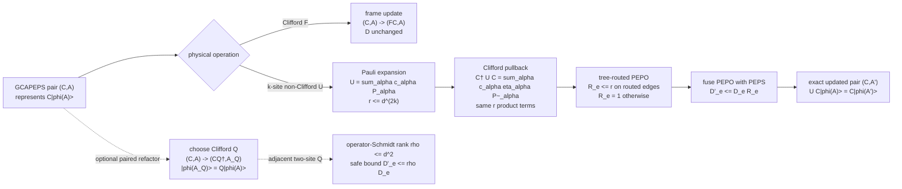

# GCAPEPS mathematical architecture

Date: 2026-07-27

Status: `CURRENT__MATHEMATICAL_FEASIBILITY_ONLY`

This is the architecture figure for the narrow GCAMPS-to-GCAPEPS result.  It
describes an exact representation calculus on a finite connected graph.  It is
not a simulator workflow, a contraction algorithm, or a QEC instrument model.

The load-bearing invariant is

\[
\mathcal R(C,A)=C|\phi(A)\rangle.
\]

The load-bearing closure bound is

\[
D'_e\le
\begin{cases}
rD_e,&e\text{ lies on the selected routing tree},\\
D_e,&e\text{ is not routed}.
\end{cases}
\]

For a nonidentity qubit Pauli rotation, \(r\le2\).  These are existence and
exact-representation statements only.  The figure deliberately omits
measurement/reset/Record loops, truncation, contraction environments, runtime,
memory, and application-specific benchmarks because none is needed to prove
GCAPEPS mathematical feasibility.

