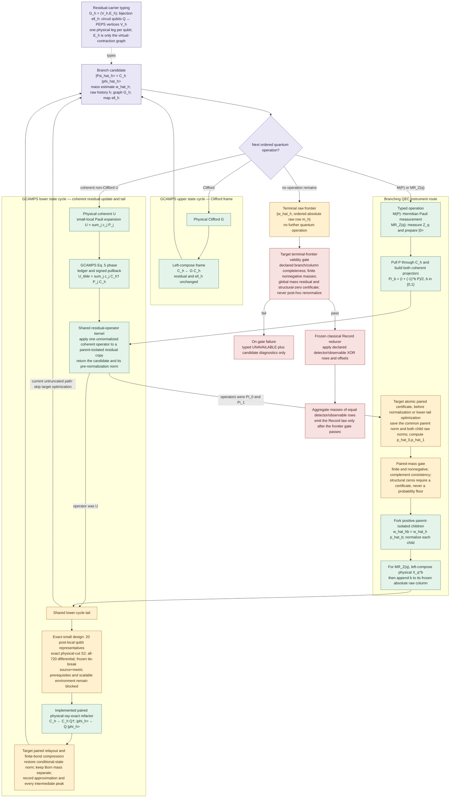
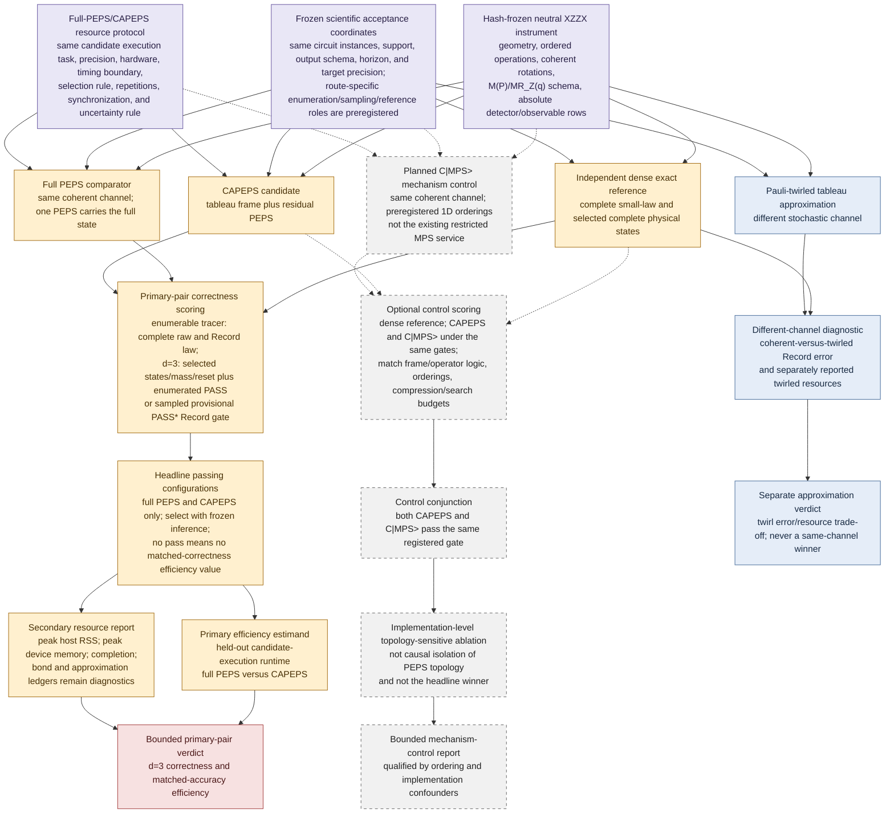
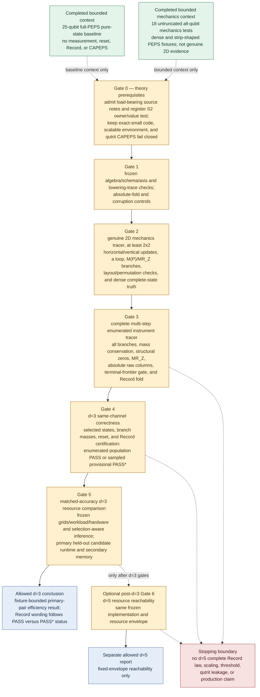

# CAPEPS paper architecture and final figure source

Companion to
[`CAPEPS_XZZX_PAPER_FULL_REWRITE_2026-07-27.md`](CAPEPS_XZZX_PAPER_FULL_REWRITE_2026-07-27.md). The source-located formula spine is
[`GCAMPS_2511_06672_FORMULA_IMPLEMENTATION_AUDIT_2026-07-27.md`](GCAMPS_2511_06672_FORMULA_IMPLEMENTATION_AUDIT_2026-07-27.md). The optimizer closure and result-blind exact-small gate are
[`CAPEPS_DISENTANGLER_THEORY_FIRST_CLOSURE_2026-07-27.md`](CAPEPS_DISENTANGLER_THEORY_FIRST_CLOSURE_2026-07-27.md)
and
[`CAPEPS_EXACT_SMALL_DISENTANGLER_PREREGISTRATION_2026-07-27.md`](CAPEPS_EXACT_SMALL_DISENTANGLER_PREREGISTRATION_2026-07-27.md).
The XZZX Record-efficiency evidence gate is
[`CAPEPS_XZZX_RECORD_EFFICIENCY_LITERATURE_CLOSURE_2026-07-27.md`](CAPEPS_XZZX_RECORD_EFFICIENCY_LITERATURE_CLOSURE_2026-07-27.md).

Formal optimizer gate: closure `OPEN`; design maturity
`EXACT_SMALL_QUBIT_DESIGN_FROZEN`; preregistration gate `FAIL`; theory-first
decision `CODE_BLOCKED`.

Recommended paper title:

> **Clifford-Augmented PEPS for Coherent XZZX Syndrome Circuits: Untruncated Mechanics and a Record-Faithfulness Protocol**

The title reports bounded untruncated mechanics and names Record faithfulness
as a protocol, not an observed result. The current
worktree implements the green untruncated-mechanics slice below. The amber
optimization and Record layers, and every red target verdict, remain open.

The paper has one protagonist:

\[
\boxed{\text{GCAMPS-inspired CAPEPS}+\text{QEC instrument}
+\text{Record correctness}}.
\]

## 1. Figure 1 — two GCAMPS state cycles, one branching instrument, and one terminal reducer

**Caption.** The two state-return cycles follow the algorithmic organization
of GCAMPS Fig. 3. A physical Clifford returns through the upper frame cycle.
A coherent non-Clifford operator returns through Pauli expansion, signed
pullback, residual application, and an optional lower-cycle optimization
tail. The QEC instrument is a branching extension of that state machine, not
a third tensor representation: both projector branches use the same coherent
residual-operator kernel, and every surviving child uses the same lower tail.
Outcome-specific Born masses are evaluated on parent-isolated, unnormalized
projector candidates before branch normalization or optional finite-bond
compression. The current green path computes those outcome probabilities; the
atomic common-parent/two-child certificate shown in amber remains target work.

A PEPS physical leg remains in one-to-one correspondence with a circuit
qubit. The residual graph controls virtual contraction only and need not equal
the XZZX hardware-adjacency graph. A physical-axis permutation \(R_h\) is
state preserving only under the paired update
\((C_h,|\phi_h\rangle)\mapsto(C_hR_h^\dagger,R_h|\phi_h\rangle)\) and a
consistent update of \(\ell_h\); changing virtual connectivity alone is not a
qubit permutation.

`M(X_q)` is the X-measurement special case of `M(P)`. The implemented reset
surface is specifically `MR_Z(q)`: measurement of physical \(Z_q\), followed
by \(X_q^b\) to prepare \(|0\rangle\). The figure makes no generic `MR`
claim. The independently checked counts 20 and 90 are one-sided
**post-action-local** coset counts,
\(720/6^2=20\) and \(51840/24^2=90\), not double-coset counts. Matrix
left/right depends on tableau convention, so the interface names the physical
semantics. This all-qubit paper preregisters an independently reconstructed qubit catalogue
and an all-720 optimum differential; neither has been implemented or executed.
The qutrit count belongs to a separate SDIM/prime-qutrit theory lane; it is
neither a current implementation target nor a CAPEPS result.

The current prototype implements the green untruncated mechanics and paired
exact-refactor primitive. Q selection, paired relayout, finite-bond control,
structural-zero certification, the terminal-frontier gate, and the Record law
remain open. The Record reducer is terminal and classical: it consumes a raw
frontier only after the global validity gate passes, applies the frozen
detector/observable map, and has no return edge into the quantum state machine.
A failed gate emits typed `UNAVAILABLE` and diagnostics, never a renormalized
Record law.

**Drawing rule.** Draw exactly two state-return cycles: the Clifford frame
cycle above and the coherent residual cycle below. Attach measurement/reset
as a branch-producing route that calls the same residual kernel and lower
tail. Put the Record reducer after a terminal raw frontier, outside every
quantum loop. Color denotes evidence status, not software ownership.

## 2. Figure 2 — one frozen instrument, four headline routes, one mechanism control

**Caption.** The four headline routes independently lower the same neutral
scientific fixture. Dense is the correctness referee and lies outside
candidate timing; it need not run on the candidate hardware. Full PEPS and
CAPEPS are the only pair entering the primary same-channel efficiency
estimand. Their comparison uses the separate frozen resource protocol and is
admissible only after both pass the registered accuracy gate. The measured
scope includes route-specific lowering, tableau work, tensor operations,
branch copies, refactor/compression, measurement/reset, synchronization, and
Record aggregation; it excludes neutral-fixture construction and dense-referee
execution.

The Pauli-twirled route deliberately changes the channel. Its Record error and
resources form a separate approximation trade-off and cannot enter the
same-channel CAPEPS-versus-full-PEPS winner rule. Branchwise coherent
pure-state fidelity is not a valid twirled-route gate.

The dashed \(C|\mathrm{MPS}\rangle\) route has a disjoint scoring path and
therefore cannot enter the primary estimand. Even after CAPEPS and this control
both pass, the output is only an implementation-level topology-sensitive
ablation: ordering, canonicalization, compression, and optimizer choices can
remain confounders. A stronger topology attribution would require
preregistered matched frame/operator logic, multiple 1D orderings, comparable
search/compression budgets, and explicit sensitivity analysis.

## 3. Figure 3 — correctness-first evidence staircase

**Caption.** Existing algebra tests and pure-state data are bounded context,
not permission to skip closure/preregistration, the frozen schema/corruption
gate, a genuine two-dimensional tracer, or the Record gate. A
\(1\times N\) or \(N\times1\) PEPS cannot discharge Gate 2; the genuine-2D
fixture also exercises measurement/reset branching. Gate 3 preserves and
validates the complete enumerated branch frontier before the deterministic
Record fold.

Gate 4 distinguishes two evidence classes. Enumeration compares population
laws and can yield the registered population-law `PASS`. Sampling folds every
sampled trajectory and uses a preregistered reference/uncertainty construction;
it yields only provisional `PASS*`, not an unqualified complete-law verdict.
Resource results are interpreted only after the applicable correctness status.
The d=3 verdict does not require a d=5 run. Optional \(d=5\) execution starts
only after the d=3 gates and establishes reachability under a fixed envelope,
not correctness transfer from \(d=3\).

## 4. Figure 4 — theory-first optimizer fork and certificate boundary

```mermaid
flowchart LR
  R["Residual two-site patch<br/>fixed parent state and physical cuts"] --> PR{"source admission + metric registry passed?"}
  PR -->|"no — current state"| PB["CODE_BLOCKED<br/>design/preregistration only"]
  PR -->|"future pass"| D{"local dimension"}

  D -->|"q=2 current paper"| G2["Enumerate G = Sp(4,F2): 720<br/>local H: 36"]
  G2 --> K2["PostLocalCoset key<br/>20 disjoint orbits x 36"]
  G2 --> A2["Independent all-720 reference"]
  K2 --> S2["Score 20 with exact physical-cut Renyi-2<br/>max, sum, canonical tie-break"]
  A2 --> X2["20-versus-720 equality gate"]
  S2 --> X2
  X2 -->|"pass"| P["Atomic paired refactor<br/>C <- C Q†; residual <- Q residual"]
  X2 -->|"fail"| F0["Reject catalogue/objective"]

  P --> C{"compression?"}
  C -->|"none"| E0["physical ray exact"]
  C -->|"finite network, exact contraction"| EF["whole-state fidelity F_t"]
  EF --> EB["trace/observable/Record error budget"]
  C -->|"approximate environment"| ETA{"certified overlap/norm errors eta?"}
  ETA -->|"yes"| FLO["construct F_lo"]
  ETA -->|"no — current state"| BLOCK["CODE_BLOCKED<br/>diagnostic only"]

  D -->|"q=3 separate lane"| G3["Enumerate Sp(4,F3): 51840<br/>local H: 576"]
  G3 --> K3["Self-generate 90 post-local orbits<br/>no public authoritative list found"]
  K3 --> SD["Hostens phase lift + SDIM differential"]
  SD --> QB["blocked from qubit CAPEPS residual/instrument"]

  classDef exact fill:#e4f4ea,stroke:#397b55,color:#163725;
  classDef proposed fill:#fff0cf,stroke:#a36c13,color:#493107;
  classDef blocked fill:#f7e1e1,stroke:#a53f3f,color:#4a1717;
  class P,E0 exact;
  class G2,K2,A2,S2,X2,EF,EB,G3,K3,SD,FLO proposed;
  class PR,PB,F0,ETA,BLOCK,QB blocked;
```

**Caption.** The exact-small qubit candidate reduction is frozen as a
mathematical design, but source admission and metric registration remain ahead
of any implementation; after those pass, the preregistered all-720 differential
is still mandatory before use. The external FOCUS cross-check must be the post-local
`clifford_2qubit_big.npz`; the older indexed asset covers the wrong pre-local
direction and is excluded. Paired refactor correctness is algebraic and
independent of whether the score improves. Exact finite-network fidelity can
support a cumulative certificate; an ordinary approximate PEPS environment
without certified overlap/norm errors cannot. Conditional results for
injective, uniformly gapped PEPS local observables and symmetry-restricted
iPEPS variational contraction do not satisfy this generic whole-state gate. The qutrit route is separate:
90 is a grounded count, while catalogue generation, phase lift, a live SDIM
environment, and a qutrit residual/instrument remain future work.

## 5. Paper-to-figure map

| paper section | visual object | purpose |
|---|---|---|
| Introduction | one-line invariant and Figure 1 thumbnail | state the resource-allocation hypothesis |
| Background | no new architecture figure | distinguish prior \(C\lvert\mathrm{MPS}\rangle\) and hybrid QEC work from the CAPEPS extension |
| Method | Figures 1 and 4 | define the two GCAMPS state cycles, post-local candidate fork, shared residual transaction/tail, branching instrument, and terminal Record reducer |
| Correctness | Figures 3 and 4 | show that branch mass and Record precede resources, and separate exact-small certificates from approximate-environment blockage |
| Experiments | Figure 2 | show four independent headline lowerings, the mechanism control, frozen workload, and primary efficiency estimand |
| Results | Figure 3 plus result tables | separate observed mechanics/baseline from `PENDING` targets |
| Limitations | cut-geometry inset from Figure 1 | emphasize operator-Schmidt rank across PEPS cuts, cut geometry, and residual diffusion rather than Pauli weight alone |

## 6. Metric, estimand, and claim contract

Before this object is frozen, the preregistration must choose its coherent
\(R_Y\) coordinate. Because \(HYH=-Y\), a local-H change gives
\(H R_Y(\theta)H=R_Y(-\theta)\) on the transformed subset. A physical-uniform
rotation therefore becomes sign-staggered, whereas a transformed-uniform
rotation defines a different project fixture. The qubit subset, sign pattern,
operation order, measurement basis, and fold coordinates are one joint identity.

The proposed target state-and-Record acceptance object, to be registered before execution, is

\[
\mathcal O=
\left(
P_{\mathrm{raw}},
P_{\mathrm{Record}},
\{\rho_h:h\in\mathcal H_{\mathrm{sel}}\},
\mathcal R_{\mathrm{reset}}
\right).
\]

It contains population raw/Record laws, selected conditional states, and
to-be-registered reset checks. It is not the full terminal classical--quantum
instrument over every conditional state. A sampled protocol estimates only a
declared projection of this object and receives a distinct provisional status.

| object | required metric or gate | forbidden substitute |
|---|---|---|
| untruncated mechanics | physical-ray equality and signed-Pauli identities against a separately formulated dense construction | test count alone |
| genuine 2D tracer | complete-vector fidelity on a PEPS with both dimensions greater than one, including horizontal/vertical updates, a loop, `M(P)`, and `MR_Z` | \(1\times N\) or \(N\times1\) strips |
| selected conditional state | complete-vector fidelity for aligned same-channel branches | local overlap or tensor residual |
| selected branch mass | per-step probability error, cumulative log-mass error, and explicit structural-zero agreement | normalized conditional state or probability flooring |
| paired measurement | real finite parent norm strictly greater than zero; real finite nonnegative child norms; complement consistency; parent isolation | division before validation, clipping, or post-hoc renormalization |
| reset | structural `MR_Z` identity and one-site trace distance to \(\lvert0\rangle\langle0\rvert\) | post-hoc state repair |
| enumerated terminal frontier | declared branch/column completeness, finite nonnegative masses, total-mass residual, and structural-zero certificate | silently dropped branches or global renormalization |
| population raw/Record law (`PASS`) | raw-TV and joint detector/observable Record-TV under the frozen absolute fold | selected paths, one realized row, or raw-syndrome TV |
| sampled Record certification (`PASS*`) | per-trajectory fold, preregistered one- or two-sample reference design, joint support, confidence band, and coverage/excluded-mass policy | population TV or an unqualified complete-law verdict |
| primary same-channel pair | held-out candidate-execution runtime at matched `PASS`, or explicitly provisional matched `PASS*` | “runtime or memory,” whichever looks favorable |
| secondary resources | peak process-tree host RSS, a frozen device-memory owner/semantics, completion, and the route-specific work ledger | maximum bond alone |
| mechanism control | CAPEPS versus \(C\lvert\mathrm{MPS}\rangle\) under matched gates, orderings, frame/operator logic, and budgets | causal attribution to PEPS topology from one ordering |
| twirled approximation | coherent-versus-twirled Record error plus separately reported resources | same-channel fidelity or winner status |
| d=5 reachability | completion under the fixed envelope after the d=3 gates pass | a d=5 correctness, scaling, or threshold claim |

The formulas below define a protocol skeleton, not an executable
preregistration. Accuracy bands, workload instances, configuration grids,
repetition count, confidence allocation, and effect threshold remain `OPEN` and
must receive hash-frozen values before target execution.

For each primary route
\(r\in\{\mathrm{full\ PEPS},\mathrm{CAPEPS}\}\), freeze a pilot/selection set,
an independent certification-and-timing holdout, a grid \(\mathcal C_r\), an
equal tuning budget, and a deterministic selection rule. Before pilot inspection,
freeze one evidence class
\(e\in\{\mathrm{PASS},\mathrm{PASS}^{\ast}\}\) for both primary routes:
\(e=\mathrm{PASS}\) is enumerated population certification and
\(e=\mathrm{PASS}^{\ast}\) is sampled provisional certification. Define

\[
\mathcal C_{r,\mathrm{sel}}^{e}
=
\{c\in\mathcal C_r:\mathcal G_{\mathrm{sel}}^{e}(r,c)=e\},
\qquad
c_r^\dagger
=
\arg\min_{c\in\mathcal C_{r,\mathrm{sel}}^{e}}
\widehat\tau_{r,\mathrm{sel}}(c).
\]

with a frozen tie-break and simultaneous or otherwise selection-valid
inference across the grid. If the evidence-class set is empty, the route is typed
`UNAVAILABLE`. The chosen configuration is then frozen; no reselection is
allowed after holdout inspection.

Conditional on \(\mathcal G_{\mathrm{hold}}^{e}(r,c_r^\dagger)=e\) on the
independent holdout, define the run-protocol population runtime target

\[
\tau_r
=
\operatorname{median}_{s\sim\Pi_{\mathrm{run}}}
T_r(W_{\mathrm{hold}},c_r^\dagger;s),
\qquad
\theta_T
=
\log\frac{\tau_{\mathrm{full\ PEPS}}}{\tau_{\mathrm{CAPEPS}}}.
\]

Here \(\Pi_{\mathrm{run}}\) is the frozen fresh-process/run-order protocol, not
the observed finite sample. The timing holdout estimates \(\tau_r\) and
\(\theta_T\) with a selection-independent confidence procedure. If
\(\delta_T\) is the preregistered minimum fractional speedup, the log-scale
threshold is \(\Delta_{\log T}=\log(1+\delta_T)\); an advantage requires the
lower confidence bound for \(\theta_T\) to exceed \(\Delta_{\log T}\).

Timing measures end-to-end **candidate execution after configuration
selection**. It includes route-specific lowering, tableau work, operator
construction/routing, tensor contractions, branch copies, internal
candidate search and rejected candidates, compression, synchronization,
measurement/reset, and Record aggregation. Neutral-fixture construction,
offline pilot tuning, and dense certification are excluded by definition but
reported separately with an amortization analysis; this endpoint is not total
research cost. Prefix memoization, batching, branch/state reuse,
contraction-plan reuse, compilation/cache policy, CPU/thread affinity, device
synchronization, run order, and fresh-process boundaries must be frozen.

Peak process-tree host RSS and device high-water are secondary. The
preregistration must name the device-memory owner and whether allocated,
reserved, external workspace, child-process, and cache memory are included.
Memory is reported at the primary-selected configurations and in a registered
Pareto table; it does not replace the primary endpoint.

The completed 25-qubit pure-state sweep belongs in a compact baseline table.
It is not evidence for measurement, reset, Record, CAPEPS, or QEC-instrument
correctness.

After an enumerated population-law `PASS`, the terminal positive sentence may
be:

> On the frozen all-qubit XZZX acceptance object and stated hardware/resource
> envelope, CAPEPS met the preregistered selected-state, branch-mass, reset,
> raw-law, and detector/observable Record population gates; its
> held-out candidate-execution runtime and secondary memory measurements were the
> reported values relative to full PEPS.

After sampled `PASS*`, the wording must instead say “provisional performance
under preregistered sampled Record certification” and must not claim complete
population-law Record faithfulness. Until numerical preregistration and target
execution, the central efficiency question remains open.
