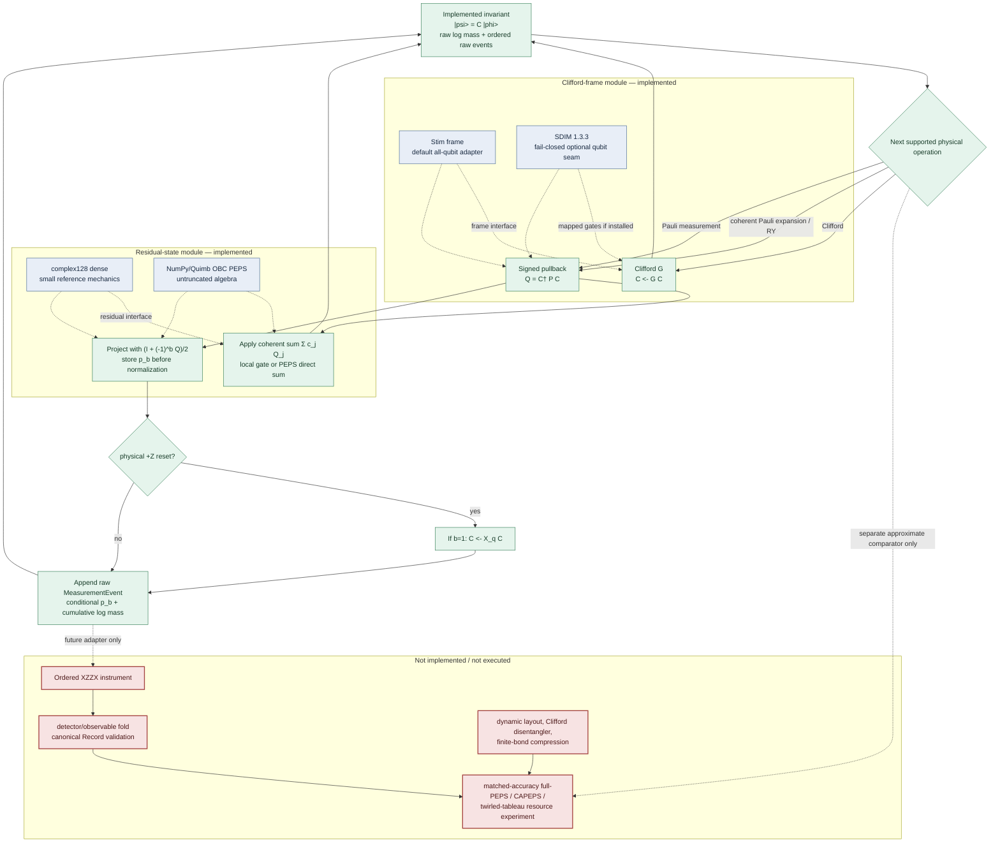
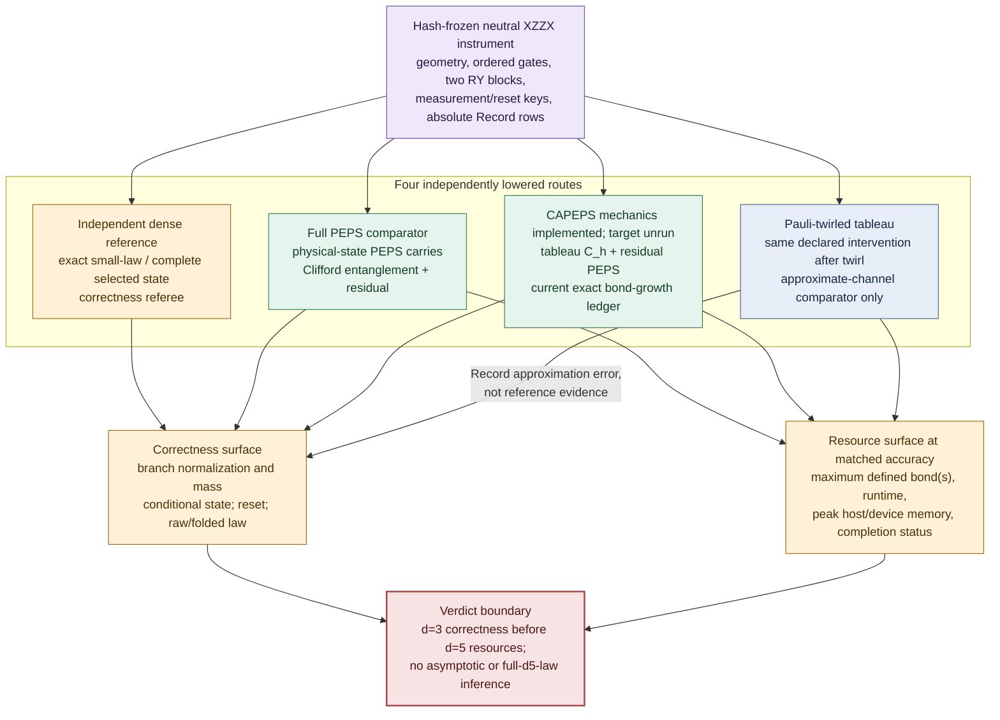
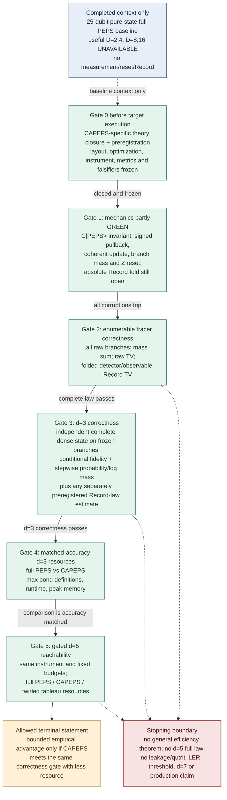

# CAPEPS-centered paper architecture

> **版本说明（2026-07-27）：** 本文件是较完整的设计审计稿。课程提交的精简
> 主图源请使用
> [`CAPEPS_XZZX_ARCHITECTURE_FINAL_2026-07-27.md`](CAPEPS_XZZX_ARCHITECTURE_FINAL_2026-07-27.md)。

Status: **paper-redesign draft, 2026-07-27; the exact small-system CAPEPS
mechanics prototype is implemented, while the XZZX target experiment and
efficiency comparison have not been executed.** This document is an
architecture and claim contract; only the explicitly named focused tests are
current engineering evidence.

Recommended title:

> **Clifford-Augmented PEPS for Coherent Qubit Dynamics: A Small-System
> Engineering Prototype toward XZZX Syndrome Circuits**

The paper separates its implemented core from its proposed scientific bridge:

\[
\boxed{\text{implemented CAPEPS mechanics}}
\longrightarrow
\boxed{\text{proposed QEC instrument and Record}}
\longrightarrow
\boxed{\text{future matched-accuracy efficiency test}} .
\]

The scientific question is:

\[
\text{while preserving the complete measurement--reset--Record law, can }
C|\mathrm{PEPS}\rangle
\text{ be more efficient than full PEPS?}
\]

Here “can” is an empirical question for a frozen, bounded instrument. It is
not a theorem, an observed result, or a claim of asymptotic advantage.

The corresponding rewritten paper is
[`CAPEPS_XZZX_PAPER_DRAFT_2026-07-27.md`](CAPEPS_XZZX_PAPER_DRAFT_2026-07-27.md).

## 1. Current status and authority boundary

| object | status on 2026-07-27 | permitted use in the paper |
|---|---|---|
| 25-qubit, 5-by-5 full-PEPS pure-state sweep | **executed**; Quimb and Pepsy completed \(D=1,2,4\), while \(D=8,16\) were `UNAVAILABLE`; registered aggregate `inconclusive_partial` | one bounded **baseline** showing the cost and attainable fidelity of putting the whole state in PEPS; no measurement, reset, syndrome, or Record claim |
| all-qubit XZZX full-PEPS instrument | bounded literature closure and v2 preregistration are frozen; **no admissible target result has been run** | reusable fixture, instrument, independent-reference, corruption, and evidence design; not a result |
| CAPEPS invariant, frame update, coherent signed-Pauli pullback, untruncated residual update, Pauli measurement and Z reset | **implemented engineering prototype** in `carrier/capeps`; eight focused tests pass in the current worktree | focused complex128 mechanics only; no complete Record, truncation, efficiency, or novelty conclusion |
| dynamic layout map, finite-bond compression, Clifford disentangler, and XZZX Record fold | **proposed only** | future algorithm/experiment surface; no result |
| dense/full-PEPS/CAPEPS/twirled-tableau comparison | **proposed only** | experiment design; no chart may contain invented CAPEPS points |

The current bounded instrument foundation is:

- [measurement/reset/Record literature closure](PEPS_XZZX_MEASUREMENT_RESET_RECORD_LITERATURE_CLOSURE_2026-07-26.md);
- [superseding v2 preregistration](PEPS_XZZX_MEASUREMENT_RESET_RECORD_PREREG_V2_2026-07-27.md);
- [pre-target audit that killed the v1 Aer route](PEPS_XZZX_PRETARGET_IMPLEMENTATION_AUDIT_2026-07-27.md);
- [completed 25-qubit full-PEPS baseline](PEPS_D5_COMPLETE_STATE_FIDELITY_RESULTS_2026-07-26.md).

The closure and preregistration above authorize only their bounded full-PEPS
instrument experiment. They do not close CAPEPS novelty, the two-dimensional
residual representation, the proposed disentangler, an efficiency prediction,
or the four-way comparison. The current code is therefore restricted to
exact engineering mechanics and does not run that target. Those
CAPEPS-specific scientific rows require a new literature-closure packet and a
new preregistration before target execution or an efficiency verdict. The v2
numerical bands must not be silently reused for CAPEPS.

### 1.1 Implemented vertical slice

The new package
[`carrier/capeps`](../../src/error_coupling_simulator/carrier/capeps/README.md)
implements the smallest auditable slice of Figure 1:

- `frame.py`: exact left-composed Clifford frame, with Stim as the installed
  default and a version-pinned, qubit-only SDIM 1.3.3 adapter;
- `residual.py`: `complex128` dense truth mechanics and a finite open-boundary
  Quimb PEPS residual;
- `state.py`: coherent Pauli expansions, Pauli rotations, immutable two-way
  measurement forks, conditional log mass, and physical-Z measured reset;
- `tests/test_capeps_hybrid.py`: independent matrix checks for composition
  direction and Pauli sign, coherent-versus-twirled separation, exact local
  and nonlocal Quimb updates, branch isolation, reset, and a positive
  \(10^{-28}\) Born branch.

For nonlocal coherent sums, the current Quimb path uses an exact virtual
direct sum. It deliberately performs no SVD, cutoff, environment
approximation, or dense fallback. This makes the algebra testable but causes
additive global bond growth; it is not yet the proposed efficient CAPEPS
algorithm. SDIM is not installed in the current `ecs` environment, so its
availability failure and phase-translation seam are tested, but no SDIM
runtime benchmark is reported. PECOS remains isolated from the candidate and
is reserved for a differential tableau comparison.

## 2. Contribution and claim contract

The course paper separates two implemented engineering contributions from one
unexecuted scientific comparison:

1. Implement the exact small-system \(C|\mathrm{PEPS}\rangle\) invariant and
   coherent update split with explicit signed-Pauli pullback.
2. Implement Pauli branch projection, pre-normalization Born mass, and
   physical-Z measured reset in a raw ordered ledger.
3. **Proposed:** add the frozen XZZX instrument and Record fold, validate
   against an independently lowered dense reference, then compare accuracy
   and resources with full PEPS and a Pauli-twirled tableau approximation.

Only the first two may be written as “we implemented,” and only at their
declared mechanics boundary. The third must remain “we propose” or “we will
test.” A priority/first-of-kind statement also remains open. The
[GCAMPS paper](https://arxiv.org/abs/2511.06672) uses a leading Clifford plus
MPS, decomposes non-Clifford operations into Paulis, and optimizes the residual
with Clifford disentanglers; replacing MPS by PEPS and adding a QEC
instrument are project adaptations, not claims made by that source.

## 3. Mathematical object

For every raw measurement history \(h\), CAPEPS must maintain

\[
|\psi_h\rangle=C_h|\phi_h\rangle_{\mathrm{PEPS}},\qquad
w_h=\prod_k p(b_k\mid h_{<k}),
\]

where \(C_h\) is a branch-history-dependent Clifford frame and
\(|\phi_h\rangle_{\mathrm{PEPS}}\) is the residual not currently absorbed into
that frame. Its tensor
sites are **tableau-coordinate labels placed on an explicitly declared
residual graph**. They are not automatically the physical XZZX lattice. A
layout map

\[
L_h:\{\text{tableau/residual coordinates}\}\longrightarrow
     \{\text{residual-PEPS sites and edges}\}
\]

is therefore part of the algorithm and provenance.

The current prototype uses only a fixed row-major open-boundary map and
records union support weight plus the maximum bond before and after each
residual update. Dynamic layout, graph diameter, routing length, and
affected-cut diagnostics remain open.

The split is operational, not canonical. For every Clifford \(W\),

\[
C|\phi\rangle=(CW)(W^\dagger|\phi\rangle).
\]

The current residual is therefore not proved to contain only magic or to be a
minimum-entanglement representative. Selecting \(W\) to reduce residual bond
growth is precisely the open disentangler problem.

For a Clifford gate \(G\),

\[
G C_h|\phi_h\rangle=(G C_h)|\phi_h\rangle .
\]

For \(U=\sum_j\alpha_jP_j\),

\[
U C_h|\phi_h\rangle
=C_h\!\left(\sum_j\alpha_j\,C_h^\dagger P_jC_h\right)
|\phi_h\rangle .
\]

This equation exposes the main risk: a physically local \(P_j\) may become a
high-weight, nonlocal residual Pauli string after conjugation. The current
prototype reports its union support weight and maximum bond before/after the
update. A future target implementation must additionally report diameter on
\(L_h\), routing length, affected residual bonds, and resulting bond growth.
A two-dimensional residual graph may reduce some routing costs relative to an
MPS, but neither the GCAMPS results nor the stabilizer-TN routing bounds prove
that CAPEPS stays low-bond or efficient.

The proposed Clifford disentangler is an exact frame refactorization before
any truncation:

\[
(C_h,|\phi_h\rangle)\mapsto
(C_hW_h,W_h^\dagger|\phi_h\rangle),
\qquad W_h\ \text{Clifford}.
\]

Its search policy, cadence, layout changes, and cost must be frozen. Exact
refactorization preserves the physical state; any subsequent residual-PEPS
compression is approximate and must be charged to the candidate. The
disentangler is not allowed to inspect dense-reference states, target
outcomes, or evaluator-only truth.

For a selected physical instrument outcome \(b\), choose a branch update
satisfying

\[
K_b C_h|\phi_h\rangle
=C_{hb}\widetilde K_{b,h}|\phi_h\rangle ,
\]

\[
p(b\mid h)=
\frac{\|\widetilde K_{b,h}|\phi_h\rangle\|^2}
     {\||\phi_h\rangle\|^2},\qquad
|\phi_{hb}\rangle=
\frac{\widetilde K_{b,h}|\phi_h\rangle}
     {\sqrt{p(b\mid h)\langle\phi_h|\phi_h\rangle}},
\qquad
w_{hb}=w_h p(b\mid h).
\]

For measured reset in the computational basis,

\[
K_b=A_b=I_{\mathrm{rest}}\otimes|0\rangle\langle b|.
\]

The conditional probability is stored before normalization. Structural-zero
branches remain exactly zero; a numerical floor may not create or delete
probability mass. For raw outcome string \(m\), the detector/observable law is
the deterministic push-forward

\[
P(R=r)=\sum_{m:f_{\mathrm{fold}}(m)=r}w_m .
\]

Raw-outcome TV and folded-Record TV are distinct metrics.

## 4. Figure 1 — implemented core and open scientific bridge

**Figure 1 caption.** Solid green paths are present in the current engineering
prototype; blue boxes are swappable interfaces, and red boxes are future
work. “Untruncated” means that the focused updates introduce no SVD cutoff:
a nonlocal coherent PEPS sum uses Quimb's algebraic direct sum and can increase
virtual bonds globally. It does not mean scalable exact PEPS contraction.
The raw measurement ledger is not a detector/observable Record.

## 5. Figure 2 — four-way experiment on one neutral instrument

**Figure 2 caption.** All routes share only the neutral scientific object and
must lower its operations and instruments independently. Candidate tensors,
tableaux, compiled projectors, contraction plans, diagnostics, and hidden
truth cannot enter the dense reference. Full PEPS is a comparator, not the
paper protagonist. The twirled tableau deliberately changes the coherent
channel and is therefore an accuracy-losing approximation baseline, never a
correctness candidate. Its state output need not be a pure state comparable
by the same conditional-state fidelity; Record distance is the common
accuracy surface.

## 6. Figure 3 — correctness-first evidence staircase

**Figure 3 caption.** A resource point is interpretable only after the same
route passes its correctness gate. The completed 25-qubit pure-state result
does not skip any CAPEPS gate. A d5 completion can establish bounded
reachability under the fixed resource envelope; it cannot establish a d5
joint Record law or asymptotic scaling.

## 7. Experiment and metric matrix

| scale | dense role | full PEPS role | CAPEPS role | twirled tableau role | maximum allowed conclusion |
|---|---|---|---|---|---|
| enumerable tracer | complete raw and folded Record law | instrument comparator | proposed complete CAPEPS instrument test | approximate Record law | implementation and full-law correctness on this tracer only after execution |
| \(d=3,R=2\) | complete selected conditional states and stepwise Born mass | same-fixture accuracy/resource comparator | principal correctness candidate | coherent-information-loss comparator | selected-branch correctness; a joint \(d=3\) Record claim only if newly preregistered and actually evaluated |
| \(d=5,R=2\) | bounded selected data-vector reference only where the frozen construction and resources permit | resource/reachability comparator | resource/reachability candidate | cheap approximate-channel comparator | completion, resource use, and at most a selected-branch statement; never full-law or scaling |
| existing 25-qubit pure-state fixture | completed dense referee | completed baseline values only | not run | not applicable | context for full-PEPS cost only |

The principal metrics are:

| object | metric | required guard |
|---|---|---|
| selected normalized pure state | \(F=|\langle\psi_{\rm dense}|\psi_{\rm cand}\rangle|^2/(\langle\psi_{\rm dense}|\psi_{\rm dense}\rangle\langle\psi_{\rm cand}|\psi_{\rm cand}\rangle)\) | complete vectors in one frozen axis order; no local overlap proxy |
| selected raw path | maximum conditional-probability error and cumulative log-mass error | every \(p(b_k\mid h_{<k})\) stored before normalization; no probability floor |
| reset | one-site trace distance to \(|0\rangle\langle0|\), plus exact structural checks where available | reset may not be “repaired” after the fact |
| complete raw or Record law | \(\mathrm{TV}(p,q)=\tfrac12\sum_x|p(x)-q(x)|\) | raw and folded supports are separately declared; selected-branch agreement is not TV of a law |
| CAPEPS locality | current: conjugated-Pauli union support and max bond before/after; proposed: residual-graph diameter/routing length and crossed bonds | diagnostic of the mechanism, not an accuracy certificate |
| resources | wall time, peak host RSS, peak device allocation, completion status, and explicitly defined maximum bond(s) | same fixture, precision, hardware, resource envelope, and accuracy gate |

Full-PEPS \(D\) and CAPEPS residual bond \(D_{\rm res}\) encode different
objects and must not be compared as if the numbers were commensurate. The
headline efficiency comparison is runtime and peak memory at matched
correctness. Bond values remain explanatory diagnostics.

## 8. Paper rewrite map

1. **Introduction.** Start from the resource-allocation hypothesis: full PEPS
   spends bond dimension on both the accumulated Clifford history and
   remaining residual structure. State the bounded question of whether a
   tableau should carry the Clifford skeleton while PEPS carries only the
   residual. Do not lead with the old 25-qubit result.
2. **Background.** Present stabilizer-TN/GCAMPS
   \(C|\mathrm{MPS}\rangle\), finite PEPS, and the XZZX
   measurement--reset--Record instrument. Keep source claims separate from
   the proposed two-dimensional extension.
3. **Method.** Define the branch invariant, explicit residual layout map,
   upper Clifford loop, lower residual loop, conjugated-support diagnostics,
   exact disentangler refactorization, finite-bond compression, and
   instrument loop.
4. **Correctness.** Separate representation invariance, branch-mass
   conservation, reset, raw-law normalization, and deterministic Record
   push-forward. State exactly which assertions are algebraic, tested, or
   still proposed.
5. **Experiments.** Put dense, full PEPS, CAPEPS, and twirled tableau on the
   same neutral fixture with independent lowering and frozen resource
   envelopes.
6. **Results.** Report accuracy first: conditional fidelity, probability/log
   mass, reset, and Record TV at the scales that actually support them. Only
   then report maximum bonds, runtime, and peak memory. Use \(d=3\) for
   correctness and \(d=5\) only for gated resource reachability unless a
   stronger law is separately preregistered and executed.
7. **Limitations.** Lead with conjugated-support growth and all-data
   \(R_Y\)-driven residual diffusion; then general PEPS contraction cost,
   disentangler-search cost, selected-branch versus full-law limits, and the
   exclusion of qutrit leakage.

The completed 25-qubit full-PEPS numbers belong in a compact baseline
paragraph/table or appendix. They may say that a bounded coherent pure-state
fixture reached high complete-state fidelity at \(D=2,4\), with larger bonds
resource-unavailable. They may not be described as QEC, CAPEPS, instrument, or
Record evidence.

## 9. Scientific caveats that must survive every rewrite

- Harper/GCAMPS demonstrates \(C|\mathrm{MPS}\rangle\) for its declared
  coherent-crosstalk setting. Its observed MPS bond envelope does not transfer
  to CAPEPS, this all-data \(R_Y\) fixture, or a general coherent channel.
- Higher-connectivity residual tensor networks are a motivated future-work
  direction, not an existing CAPEPS correctness or efficiency theorem.
- Clifford conjugation can turn a local physical error into a high-weight
  residual Pauli string. Full-data \(R_Y\) layers can therefore spread the
  residual broadly enough to erase the proposed advantage.
- Measurements may reduce residual support in the stabilizer-TN formalism,
  but no monotonic CAPEPS bond decrease may be assumed.
- The disentangler is useful only if its exact invariant, search cost, and
  post-compression error are all accounted for. It cannot be tuned against
  dense target results.
- The twirled tableau answers a different, approximate-channel question. Its
  speed is not evidence that the coherent Record law is correct.
- Conditional fidelity can be high while branch mass is wrong. A realized
  Record row is not a Record distribution, and a selected branch is not a
  complete law.
- The current bounded closure is all-qubit. Qutrit leakage, Kraus noise,
  decoder/LER, threshold behavior, long-round scaling, \(d=7\), and
  production `RecordBatch` promotion remain outside scope.
- General exact PEPS contraction has a worst-case complexity obstruction.
  Success on \(d=3\) or reachability at \(d=5\) cannot become a general
  scalable/exact claim.
- Evaluator-only conditional states, branch probabilities, and reference
  truth remain outside emitted Records and downstream estimator input.

The terminal paper claim, if all new gates pass, must remain fixture-bounded:

> On the frozen all-qubit XZZX instrument and stated hardware/resource
> envelope, CAPEPS met the preregistered conditional-state and Record
> correctness gates and used [measured resources] relative to full PEPS.

If CAPEPS misses, that miss is the result. If only \(d=5\) completion differs,
the claim is bounded reachability, not superior scaling.
