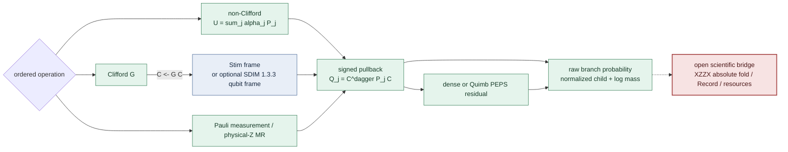

# Clifford-Augmented PEPS 的最小实现：相干非 Clifford 更新与测量—复位正确性

> **版本说明（2026-07-27）：** 本文件是较短的早期实现稿，保留作审计材料。
> 课程提交主文请使用
> [`CAPEPS_XZZX_PAPER_FULL_REWRITE_2026-07-27.md`](CAPEPS_XZZX_PAPER_FULL_REWRITE_2026-07-27.md)。

## A minimal Clifford-Augmented PEPS prototype for coherent non-Clifford updates and measurement–reset correctness

作者：`[姓名]`
课程：`[课程名称]`
单位：`[院系/学校]`
日期：2026 年 7 月

Draft status: **v0.1, 2026-07-27.** 本文区分三类陈述：

- **implemented**：`carrier/capeps` 中已经存在的代码；
- **focused evidence**：当前 worktree 上八个小系统 exact-mechanics 测试；
- **proposed**：尚未执行的 XZZX Record 与效率比较。

本文没有运行目标 XZZX 实验，也不声称完整 Record、有限键维误差界、
leakage/qutrit 忠实性或可扩展性。配套架构图见
[`CAPEPS_XZZX_PAPER_ARCHITECTURE_2026-07-27.md`](CAPEPS_XZZX_PAPER_ARCHITECTURE_2026-07-27.md)。

## 摘要

二维量子纠错电路同时包含大量 Clifford 纠缠、少量相干非 Clifford
操作以及中途测量和复位。若把全部结构都放进 PEPS，Clifford 纠缠也会
消耗虚拟键维；若把相干误差直接 Pauli twirl 后交给 tableau，又会删除
不同 Pauli 振幅之间的干涉。本文实现一个 GCAMPS-inspired
Clifford-Augmented PEPS（CAPEPS）最小原型，用

\[
|\psi\rangle=C|\phi\rangle_{\rm PEPS}
\]

表示物理态，其中 \(C\) 为精确 Clifford frame，PEPS 只承载 residual。
Clifford 门通过左乘更新 frame；非 Clifford 操作先保持其复 Pauli
振幅，再将每个带符号 Pauli 以 \(C^\dagger P C\) 拉回 residual。
Pauli 测量从同一父态生成两个条件分支，先保存 Born 概率，再归一化；
计算基测量—复位使用
\(A_b=|0\rangle\langle b|=X^b\Pi_b\)。

当前实现以 Stim 作为默认 qubit frame，并提供版本固定到 SDIM 1.3.3
的可选 qubit adapter；residual 可选独立 `complex128` dense 状态或
Quimb 开边界 PEPS。非局域相干 Pauli 和通过 exact PEPS algebraic
direct sum 实现，不做截断或隐藏 dense fallback，因此该路径正确但会
全局加性增长键维，尚不是效率结论。八个聚焦测试覆盖 frame 合成方向、
Pauli 符号、相干更新与 twirl 的区别、局域/非局域 PEPS 更新、测量分叉、
物理复位以及 \(10^{-28}\) 的严格正分支，当前全部通过。本文最后给出
在同一冻结 XZZX instrument 上比较 dense、full PEPS、CAPEPS 与
twirled tableau 的 correctness-first 实验设计。

**关键词：** PEPS；Clifford tableau；GCAMPS；SDIM；相干误差；
中途测量；量子纠错 Record

## 1. 问题与研究边界

张量网络的成本通常随所需键维增长，而 stabilizer tableau 能以多项式
资源精确处理 Clifford 电路。量子纠错综合提取恰好具有“Clifford 骨架
很大、非 Clifford residual 可能较小”的结构，因此自然问题是：

> 是否可以让 tableau 承担 Clifford 结构，只让 PEPS 表示真正的
> non-stabilizer residual，并在不改变相干测量—复位 law 的前提下降低
> full PEPS 的资源？

本文将它拆成三个研究问题：

- **RQ1（已实现 mechanics）：** \(C|\mathrm{PEPS}\rangle\) 分流能否在
  小系统上逐操作保持物理态？
- **RQ2（已实现 mechanics）：** 测量概率、条件态和物理 Z reset 能否
  在 frame/residual 分解下保持正确，并保留极小正分支？
- **RQ3（尚未执行）：** 在冻结 XZZX instrument 和相同 accuracy gate
  下，CAPEPS 是否比 full PEPS 使用更少 wall time 或 peak memory？

八个测试只能回答 RQ1/RQ2 的一个小型 exact slice。RQ3 必须由独立
reference、完整 instrument、Record fold 和匹配精度的资源实验回答。

## 2. 相关工作

[GCAMPS](https://arxiv.org/abs/2511.06672) 将 CAMPS 推广到 qudit：
状态由 leading Clifford 与 MPS 共同表示；Clifford 门只更新 tableau，
非 Clifford 门分解成 Pauli 和并穿过 tableau 后作用于 MPS，随后可搜索
Clifford disentangler 以降低 residual entanglement [1]。其 Figure 3
的上下双循环是本文架构的直接启发。

本文只借用这一表示原则，不转移 GCAMPS 的 benchmark 结论。这里把 MPS
换成二维 PEPS，并加入 QEC measurement/reset/Record 问题；这两项都是
项目扩展。尤其是，一个物理局域 Pauli 经 \(C^\dagger P C\) 后可能成为
高权重 residual string。二维 residual graph 可能缩短部分 routing，
但不能由此推出低键维或加速。

有限 PEPS 为二维局域态提供自然表示，但 exact contraction 在一般情形
具有最坏复杂度障碍 [2,3]。因此局部 discarded weight、环境 residual
或单个 bond 不能替代完整状态或 Record-law 指标。XZZX 综合提取还要求
有序 ancilla 测量、复位以及跨轮 detector fold [4,5]；仅验证终态不足以
证明 QEC 模拟正确。

## 3. CAPEPS 架构

### 3.1 表示不变量

对每个条件历史 \(h\)，目标表示为

\[
|\psi_h\rangle=C_h|\phi_h\rangle,\qquad
\log w_h=\sum_k\log p(b_k\mid h_{<k}).
\]

当前原型的 \(C_h\) 是 Stim 或可选 SDIM qubit tableau，
\(|\phi_h\rangle\) 是 dense vector 或固定 row-major open-boundary
Quimb PEPS。动态 layout、disentangler 与有限键维压缩尚未实现。

这里的 residual 是操作性定义，并不自动等于“纯 magic”或最小纠缠态。
分解并不唯一：对任意 Clifford \(W\)，

\[
C|\phi\rangle=(CW)(W^\dagger|\phi\rangle).
\]

当前 frame 保存已经吸收的 Clifford 历史，residual 保存 pulled-back
coherent Pauli sums 与测量 projector 产生的其余结构。寻找能降低
residual bond growth 的 \(W\) 正是未来 disentangler 问题。



**图 1.** 当前实现的分流边界。绿色部分有小系统 exact-mechanics
测试；红色虚线部分仍是研究计划。

### 3.2 Clifford 路径

若下一个物理操作为 Clifford \(G\)，则

\[
G|\psi\rangle=GC|\phi\rangle ,
\qquad C\leftarrow GC .
\]

Residual 完全不动。这里合成方向必须是左乘；错误的
\(C\leftarrow CG\) 对非交换门序列会产生不同物理态。

Stim 是当前已安装的默认 owner。SDIM adapter 面向 SDIM 1.3.3，
读取其 qubit generator 的
\(i^pX^xZ^z\) 相位并转换为 Stim 的 signed Pauli interface。
adapter 在候选 tableau 全部生成元通过验证后才提交更新，且不允许静默
退回 Stim。

### 3.3 相干 non-Clifford 路径

对

\[
U=\sum_j\alpha_jP_j ,
\]

有

\[
UC|\phi\rangle
=C\left(\sum_j\alpha_jC^\dagger P_jC\right)|\phi\rangle .
\]

因此 residual update 为

\[
|\phi'\rangle=
\left(\sum_j\alpha_jQ_j\right)|\phi\rangle,\qquad
Q_j=C^\dagger P_jC .
\]

Tableau conjugation返回的 \(\pm1\) 符号必须保留在 \(Q_j\) 中。对 Pauli
rotation，

\[
R_P(\theta)=
\cos\frac{\theta}{2}I-i\sin\frac{\theta}{2}P .
\]

这两个系数是振幅，不是概率。将其替换为概率
\(\cos^2(\theta/2)\) 与 \(\sin^2(\theta/2)\) 的随机 Pauli mixture
就是 twirl，会删除交叉项，因而模拟的是不同物理 channel。

当前 Quimb residual 对单点 pulled-back 和先合成一个 \(2\times2\)
operator 再吸收到 site tensor；对多点和则对每个 Pauli term 构造一个
PEPS，并用 exact algebraic direct sum 相加。后者不做 SVD，但会令匹配
虚拟键加性增长。因此它是 correctness construction，不是 scalable
optimization。

### 3.4 测量、分叉与复位

物理 Hermitian Pauli \(P\) 的结果 \(b\in\{0,1\}\) 对应

\[
\Pi_b=\frac{I+(-1)^bP}{2}.
\]

令 \(Q=C^\dagger PC\)，则 residual 上的未归一化分支为

\[
|v_b\rangle=
\frac{I+(-1)^bQ}{2}|\phi\rangle ,
\qquad
p_b=\frac{\langle v_b|v_b\rangle}
          {\langle\phi|\phi\rangle}.
\]

实现从同一个 parent snapshot 分别构造 \(b=0,1\)，保存 \(p_b\) 后才
归一化。只有 exact zero 被标记为不可达；浮点阈值不能删除一个仍可表示的
正概率。

对物理 qubit \(q\) 的 Z measurement-and-reset，

\[
A_b=|0\rangle\langle b|
=X_q^b\Pi_b .
\]

故先在 residual 上完成 pulled-back projector，再在 \(b=1\) 时执行

\[
C\leftarrow X_qC .
\]

这避免了把非幺正 reset 错塞进 Clifford tableau，也避免把 MR 误写成
只测量不复位。

## 4. 为什么组合后仍然正确

不截断时，正确性可由操作序列长度归纳。

**基例。** 初始 \(C=I\)，dense 或 product PEPS residual 等于声明初态，
故 \(|\psi\rangle=C|\phi\rangle\)。

**Clifford 步。** 若更新前不变量成立，
\[
G|\psi\rangle=GC|\phi\rangle=C'|\phi\rangle .
\]

**相干 Pauli 和。**
\[
\begin{aligned}
U|\psi\rangle
&=\sum_j\alpha_jP_jC|\phi\rangle\\
&=C\sum_j\alpha_j(C^\dagger P_jC)|\phi\rangle\\
&=C|\phi'\rangle .
\end{aligned}
\]

该等式逐项保留复系数和 Pauli sign，所以没有 twirl 近似。

**测量步。** 同一恒等式适用于 \(\Pi_b\)。物理分支与 residual 分支的
范数相等，因为 \(C\) 幺正；因此 residual norm ratio 就是物理 Born
概率。归一化后仍满足 branch invariant。

**复位步。** \(A_b=X_q^b\Pi_b\)，投影已由上一项覆盖，剩余 \(X_q^b\)
是 Clifford 左乘，故物理条件态也保持。

该证明只覆盖 exact algebra。未来一旦引入 finite-\(D\) compression 或
近似 contraction，误差必须由独立 dense truth、完整向量 fidelity、
stepwise branch mass 与 Record-law metric 另行限制，不能由本归纳证明
自动获得。

## 5. 软件实现

| 模块 | 当前职责 | 明确不负责 |
|---|---|---|
| `capeps/frame.py` | Stim frame；可选 SDIM 1.3.3 qubit frame；signed pullback；事务性更新 | measurement/reset/noise；leakage qutrit |
| `capeps/residual.py` | dense `complex128`；Quimb OBC PEPS；exact Pauli sum/projector；bond ledger | cutoff、SVD、近似环境、隐藏 dense fallback |
| `capeps/state.py` | invariant router；Pauli rotation；fork；log mass；physical-Z MR | XZZX compiler、detector/observable fold、`RecordBatch` |
| `tests/test_capeps_hybrid.py` | 独立小矩阵与 dense-state falsifiers | 可扩展性或完整 QEC law |

后端角色为：

- **Stim**：当前默认 qubit frame；
- **SDIM**：显式、版本固定的可选 frame。当前 `ecs` 环境未安装 SDIM，
  因而本文不报告 SDIM runtime 结果；
- **Quimb**：candidate PEPS algebra；
- **NumPy dense**：小系统 mechanics reference；
- **PECOS**：保留在隔离环境中的未来 tableau differential comparator，
  不被 candidate 导入。

GCAMPS 的 generalized-qudit tableau 与本项目的
“computational qubit \(\oplus\) leakage level”并不是同一语义。当前
SDIM adapter 因而主动限制为 qubit。真正的 qutrit CAPEPS 需要同时定义
generalized Weyl/Pauli expansion、local dimension-3 residual 和测量
instrument；不能仅把 `dimension=3` 当作 leakage 支持。

## 6. 当前聚焦证据

运行

```bash
conda run -n ecs python -m pytest -q tests/test_capeps_hybrid.py
```

当前得到 `8 passed`。这些测试均为 CPU 小系统测试：

| test object | observed engineering result | 捕获的错误 |
|---|---|---|
| two-qubit Stim frame | \(C=CX(S\otimes I)\)，物理 \(Y_0\) 拉回为 \(+X_0X_1\) | 左/右合成方向；丢失 Pauli sign |
| dense coherent \(R_Y(0.02)\) | 与独立 `complex128` 物理矩阵 fidelity error \(\le 10^{-12}\) | 角度/方向错误；把 coherent sum 写成 twirl |
| Quimb nonlocal pulled rotation | untruncated algebraic direct sum，bond \(1\to2\)，fidelity error \(\le10^{-12}\) | 只更新 frame；漏执行 residual；非局域和错误 |
| Quimb local rotation | bond 保持 1；caller-owned vectors 不共享 | shallow copy；不必要 bond growth |
| dense measurement/reset | \(p_0=0.8,p_1=0.2\)，两 branch 均复位到 \(|0\rangle\) | 顺序修改同一 parent；MR→M |
| framed Quimb measurement/reset | pulled Pauli \(+X_0Z_1\)；两个分支各 \(0.5\)；物理 reset 态正确 | 用 residual 单点测量代替物理 pulled-back measurement |
| tiny positive branch | \(p=10^{-28}>0\) 被保留 | 用一般 numerical threshold 制造 structural zero |
| SDIM seam | \(+Y/-Y\) phase translation；缺包时显式 fail closed | 忽略 SDIM；丢 generalized-tableau phase；silent fallback |

这些结果证明的是实现与上述 exact identities 在已测 fixtures 上一致。
它们不是 statistical sample，不是完整 Record-law 验证，也没有测量
full PEPS 相对 CAPEPS 的 runtime 或 memory。

## 7. 面向效率问题的后续实验

后续目标实验必须让四条路径读取同一个中性 XZZX instrument：

1. **独立 dense reference**：在 enumerable tracer 上给出完整 raw 与
   folded Record law，在 \(d=3\) 上给出 selected conditional states；
2. **full PEPS comparator**：PEPS 同时承载 Clifford 与 residual；
3. **CAPEPS candidate**：tableau 承载 Clifford，PEPS 承载 residual；
4. **twirled tableau baseline**：显式改变 coherent channel 后的廉价近似，
   只用于量化 twirl error，绝不作为正确性 reference。

证据顺序必须为：

\[
\text{algebra controls}
\rightarrow \text{enumerable full law}
\rightarrow d=3\text{ selected-state correctness}
\rightarrow \text{matched-accuracy resources}.
\]

只有 full PEPS 与 CAPEPS 都先通过同一 correctness gate，才比较 wall
time、peak host/device memory 和 completion status。Full-PEPS bond
\(D\) 与 residual bond \(D_{\rm res}\) 表示不同对象，不能只比较两个
数字；资源结论必须在相同 fixture、precision、hardware 和 accuracy 下
报告。

建议的主要图表为：

- 图 1：本文 frame/residual/instrument 架构；
- 图 2：每步 pulled-back Pauli support weight 与 PEPS maximum bond；
- 图 3：dense/full PEPS/CAPEPS 的 conditional infidelity 与 branch-mass
  error；
- 图 4：通过 accuracy gate 后的 wall time 与 peak memory；
- 图 5：twirled tableau 的 folded-Record TV，用来显示其速度所交换掉的
  coherent information。

## 8. 局限性

1. 当前 nonlocal exact direct sum 会在所有匹配虚拟边上加性涨 bond；
   没有 disentangler 或 compression，故尚未实现题目中的“优化效率”。
2. 当前 PEPS contraction 是 exact small-system 路径。一般 exact PEPS
   contraction 不可由本结果推广为 scalable。
3. 当前 measurement ledger 只是 ordered raw outcomes 与 conditional
   mass，不是 detector/observable `RecordBatch`。
4. 当前只支持 all-qubit Pauli instrument；没有 Kraus noise、qutrit
   leakage、generalized-qudit measurement 或 decoder/LER。
5. SDIM source/API 已固定，但当前环境没有可执行安装；因此只有 adapter
   seam evidence，没有 Stim–SDIM runtime differential evidence。
6. PECOS 和 candidate 当前没有端到端隔离比较；它只是未来独立
   Clifford differential oracle。
7. 小系统 fidelity 可以检查 algebra，不能证明长轮次误差不会积累。

## 9. 结论

本文把“Clifford 走 tableau、non-Clifford 走 PEPS”的想法具体化为一个
可运行、可证伪的 CAPEPS 原型。关键不是简单做一次 Pauli twirl，而是保持
复 Pauli 振幅，并用带符号的 \(C^\dagger PC\) 将操作精确拉回 residual。
同一表示还可正确处理 Pauli measurement、branch mass 和 physical-Z
measured reset。当前八个测试为这些 exact mechanics 提供了小型工程证据。

课程作业目前可以诚实报告：“我们实现并验证了 CAPEPS 的核心代数和
measurement/reset mechanics，并识别出 nonlocal pulled-back Pauli 导致
global bond growth 的主要瓶颈。”是否真正比 full PEPS 高效仍是下一阶段
的实验问题；即使未观察到优势，support growth 与 bond-growth 关系本身
也是一个可报告的负结果。

## 参考文献

[1] B. Harper, A. C. Nakhl, T. Quella, M. Sevior, and M. Usman,
“GCAMPS: A Scalable Classical Simulator for Qudit Systems,”
SCA/HPCAsia 2026; [arXiv:2511.06672v2](https://arxiv.org/abs/2511.06672).

[2] M. Lubasch, J. I. Cirac, and M.-C. Bañuls, “Algorithms for finite
projected entangled pair states,” *Physical Review B* **90**, 064425 (2014);
[arXiv:1405.3259](https://arxiv.org/abs/1405.3259).

[3] N. Schuch, M. M. Wolf, F. Verstraete, and J. I. Cirac,
“Computational complexity of projected entangled pair states,”
*Physical Review Letters* **98**, 140506 (2007).

[4] J. P. Bonilla Ataides, D. K. Tuckett, S. D. Bartlett, S. T. Flammia,
and B. J. Brown, “The XZZX surface code,” *Nature Communications* **12**,
2172 (2021); [arXiv:2009.07851](https://arxiv.org/abs/2009.07851).

[5] A. S. Darmawan *et al.*, “Practical quantum error correction with the
XZZX code and Kerr-cat qubits,” *PRX Quantum* **2**, 030345 (2021);
[arXiv:2104.09539](https://arxiv.org/abs/2104.09539).

## 代码与证据索引

- 实现：
  [`src/error_coupling_simulator/carrier/capeps/README.md`](../../src/error_coupling_simulator/carrier/capeps/README.md)
- 聚焦测试：
  [`tests/test_capeps_hybrid.py`](../../tests/test_capeps_hybrid.py)
- 完整架构与 claim contract：
  [`CAPEPS_XZZX_PAPER_ARCHITECTURE_2026-07-27.md`](CAPEPS_XZZX_PAPER_ARCHITECTURE_2026-07-27.md)
- XZZX measurement/reset/Record v2 preregistration：
  [`PEPS_XZZX_MEASUREMENT_RESET_RECORD_PREREG_V2_2026-07-27.md`](PEPS_XZZX_MEASUREMENT_RESET_RECORD_PREREG_V2_2026-07-27.md)
- 已完成 full-PEPS pure-state baseline：
  [`PEPS_D5_COMPLETE_STATE_FIDELITY_RESULTS_2026-07-26.md`](PEPS_D5_COMPLETE_STATE_FIDELITY_RESULTS_2026-07-26.md)
- SDIM source boundary：
  [events555/sdim](https://github.com/events555/sdim), inspected adapter target
  `1.3.3` / `115c495b23ade35ef0f68b7299afef463129bf51`.
