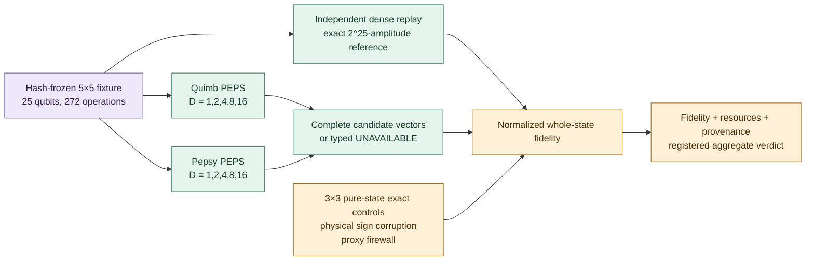
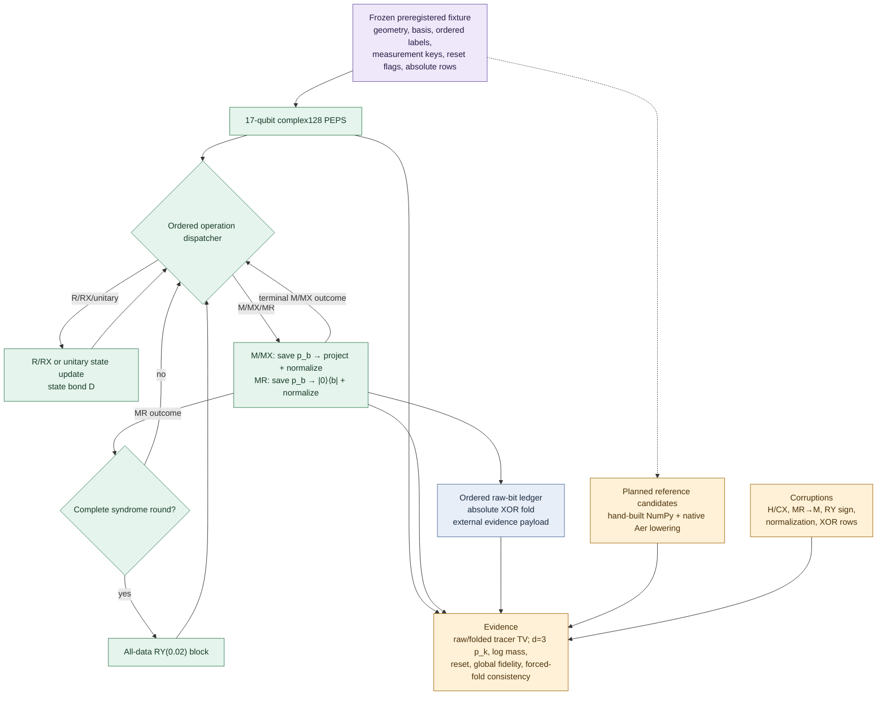

# 有限 PEPS 的二维相干电路基准：25 比特完整态保真度与面向 XZZX 测量—复位—Record 的拟议扩展

> **定位更新（2026-07-27）：** 本文件保留为已完成 25-qubit full-PEPS
> baseline 与旧 explicit-ancilla Record-bridge 设计的背景材料。当前主报告
> 是
> [`CAPEPS_XZZX_PAPER_FULL_REWRITE_2026-07-27.md`](CAPEPS_XZZX_PAPER_FULL_REWRITE_2026-07-27.md)，
> 对应新建的 all-qubit `carrier/capeps` engineering prototype。该原型尚未
> 运行本文的 tracer、d3、d5 或 Record 实验；两条证据线不得合并为一个
> 已执行结果。

## Benchmarking finite PEPS for coherent two-dimensional circuits: 25-qubit complete-state fidelity toward an XZZX measurement–reset–Record extension

作者：`[姓名]`
课程：`[课程名称]`
单位：`[院系/学校]`
日期：2026 年 7 月

Draft status: **v0.1, 2026-07-27.** 第 6 节只报告已经存在并有机器证据的
纯态基准结果。显式 ancilla 的 measurement/reset/Record 路径尚未运行，
因此只作为已经完成源文献闭合并在 commit
`15bb541f91f243f9d328b00357ff125bc44554db` 冻结的扩展方案，不写成
实验结果。方括号
`[待填]` 表示排版或后续实验占位，不代表观测值。

配套架构图：
[`PEPS_XZZX_COURSE_PROJECT_ARCHITECTURE_2026-07-27.md`](PEPS_XZZX_COURSE_PROJECT_ARCHITECTURE_2026-07-27.md)。

## 摘要

投影纠缠对态（projected entangled pair states, PEPS）为二维量子电路提供了
结构化的经典表示。在本项目的 product contract 中，量子纠错模拟的最终对象
不是单个终态，而是由多轮测量形成的 detector/observable Record。本文首先
研究一个可验证的较小问题：
有限 PEPS 能否在可用键维下准确表示一个 25 比特、5×5 开边界的相干
非 Pauli 电路。我们使用独立的 `complex128` 稠密态作为裁判，比较 Quimb
和 Pepsy 两条有限 PEPS 路径生成的全部 \(2^{25}\) 个振幅。两者在
\(D=2\) 时分别得到 \(F=0.9998969173\) 和 \(0.9998327621\)，在
\(D=4\) 时分别达到 \(0.9999999861\) 和 \(0.9999995336\)。
\(D=8,16\) 因资源限制不可用，因此预注册的完整五点扫描结论仍为
`inconclusive_partial`，而不是“通过”。

在此基础上，本文提出一条由已冻结预注册定义、要求各实现独立 lowering 的
XZZX Record 扩展架构：在 \(d=3,R=2\) 综合提取中显式表示 9 个数据比特
与 8 个辅助比特，以选择性算子
\(A_b=|0\rangle\langle b|\) 实现测量并复位，在每轮后加入
\(R_Y(0.02)\)，保留归一化前的分支质量，并用绝对测量列构造
detector/observable evidence。验证分为两层：Stim-derived 的七比特 tracer
枚举全部 1024 个十比特轨迹，分别比较 raw-trajectory TV 与折叠后的
五-detector/一-observable Record TV；\(d=3,R=2\) 则计划在 dense NumPy
与 Aer-MPS 先相互一致后，比较逐步 Born 概率、累计分支质量、复位状态、
条件全局态保真度和 forced-branch fold consistency。tracer 与 \(d=3\)
使用验证过的 complete graph；环境半径 \(r_{\rm env}\) 只在 gated
\(d=5\) 中扫描。
物理 corruption 测试用于防止局部代理指标被误当作完整 Record 忠实性。

**关键词：** PEPS；XZZX surface code；张量网络；中途测量；量子纠错
Record；完整态保真度；总变差距离

## Abstract

Projected entangled pair states (PEPS) provide a structured classical
representation of two-dimensional quantum circuits. Under this project's
product contract, a quantum-error-correction simulation produces a temporally
ordered detector/observable Record rather than a terminal state alone. We first study
a bounded and directly verifiable question: whether finite PEPS can represent
a 25-qubit, open-boundary 5×5 coherent non-Pauli circuit at attainable bond
dimension. Against an independent `complex128` dense-state reference, Quimb
and Pepsy reach complete-state fidelities of 0.9998969173 and 0.9998327621 at
\(D=2\), and 0.9999999861 and 0.9999995336 at \(D=4\), respectively.
The \(D=8,16\) contractions are resource-unavailable, so the preregistered
five-point aggregate remains `inconclusive_partial`.

We then specify a preregistered extension from pure-state evidence to an
explicit-ancilla XZZX measurement–reset–Record bridge. The bounded
\(d=3,R=2\)
design represents nine data and eight ancilla qubits, records raw Born mass
before branch normalization, realizes measured reset with
\(A_b=|0\rangle\langle b|\), inserts \(R_Y(0.02)\) after each syndrome round,
and folds absolute measurement columns into detector and observable evidence.
Validation separates all 1024 paths of a seven-qubit, ten-raw-bit tracer from
selected \(d=3\) trajectories. Dense NumPy and Aer-MPS are planned reference
candidates and become accepted references only after independent lowering,
isolation checks, and \(d=3\) agreement. Forced-branch fold consistency is a
plumbing invariant, while complete Record-law evidence belongs only to the
tracer. The resulting architecture is a falsifiable course-project path, not
a claim of leakage faithfulness, \(d=5\)/\(d=7\) Record certification, or scalable
exact PEPS contraction.

## 1. 引言

二维量子纠错电路同时具有局域几何、重复时间结构和测量条件分支。直接保存
全部量子态的成本随比特数指数增长，而矩阵乘积态在二维几何上又容易受到
一维排序的限制。PEPS 将每个物理格点与二维虚拟键相连，是研究二维局域
电路的一条自然路线 [1,2]。近年来，有限 PEPS 的门更新、边界收缩和采样
已经能够在 GPU 上处理有结构的二维电路 [3]。

然而，“可以演化一个 PEPS”并不等于“已经模拟了量子纠错”。XZZX 稳定子
综合提取包含有序的 ancilla–data 纠缠、选择性测量、复位以及跨轮次的
detector fold [4,5]。如果每次测量后只保留归一化态而丢弃原始 Born
质量，最终得到的条件态即使很准确，也可能对应错误的轨迹概率。如果只比较
局部截断误差、环境残差或终端 bitstring，也无法推出完整
detector/observable Record 分布正确。

本文将问题拆成两个层次。第一层是已经完成的纯态基准：在一个冻结的
25 比特 5×5 相干非 Pauli 电路上，以完整全局态保真度而非局部代理量评价
Quimb 和 Pepsy。第二层是面向课程项目后续实现的 Record 桥：先在一个可
完全枚举的小型 tracer 上检查完整分布，再在 \(d=3,R=2\) XZZX 电路上
检查选定轨迹的概率和条件态，只有这些门全部通过后才考虑 \(d=5,R=2\)。

本文的贡献为：

1. 给出一个 25 比特有限 PEPS 的完整态基准，报告全部已完成键维点、资源
   不可用点和独立 corruption control，不把局部截断量当作全局保真度。
2. 设计一条 external-baseline 范围内的显式 ancilla XZZX
   measurement/reset/Record 架构，将原始分支质量、条件态、折叠证据和未来
   production product mapping 分成清晰边界。
3. 建立从完整小型 raw/folded law 到 \(d=3\) 选定轨迹的分层验证协议，
   并区分状态键维 \(D\) 与 gated \(d=5\) 的测量环境半径
   \(r_{\rm env}\)。
4. 明确可报告与不可报告的结论：本文不声称 leakage/Kraus 忠实性、逻辑
   错误率、阈值、\(d=7\) 可行性或一般 PEPS 的可扩展精确收缩。

## 2. 背景与相关工作

### 2.1 XZZX 稳定子与跨轮次 Record

XZZX surface code 的体稳定子可写为

\[
S_f = X_{1}Z_{2}Z_{3}X_{4},
\]

并且可通过交错局部 Hadamard 变换与常规 surface code 联系起来 [4]。
实际综合提取使用位于面中心的辅助比特：先制备辅助比特，再依次执行与四个
数据比特的 `CZ–CX–CX–CZ` 耦合，最后在 \(X\) 基测量辅助比特 [5]。
在重复测量中，若本轮稳定子结果与前一轮不同，则相应时空位置出现 defect
[4,5]。

production `RecordBatch` contract 使用 round-major syndrome 表，并执行首轮
anchor 与相邻轮 XOR。本文尚未把拟议路径映射到该 product contract；冻结的
external-baseline fixture 另以绝对测量列索引表示 detector/observable
evidence。第 \(j\) 个 detector 和 observable
分别为

\[
d_j=\bigoplus_{k\in \mathcal D_j}m_k,\qquad
o_j=\bigoplus_{k\in \mathcal O_j}m_k ,
\]

其中 \(m_k\) 是第 \(k\) 个原始测量位，\(\mathcal D_j\) 与
\(\mathcal O_j\) 可以具有不同元数。这一 external evidence 表示可以覆盖
首轮边界、相邻轮差分和包含终端数据读出的 closure；未来若映射到 production
`RecordBatch`，需要单独授权并证明与其矩形 syndrome/terminal-readout fold
语义一致。

### 2.2 选择性测量、分支概率与复位

对状态 \(\rho\) 的选择性测量，若结果 \(b\) 对应算子 \(A_b\)，则

\[
p_b=\mathrm{Tr}(A_b^\dagger A_b\rho),\qquad
\rho_b=\frac{A_b\rho A_b^\dagger}{p_b}.
\]

顺序测量的联合概率依赖算子次序；一般情况下，
\(\mathrm{Tr}(ABA\rho)\) 与 \(\mathrm{Tr}(BAB\rho)\) 不相等 [6]。
因此，中途测量不能被无条件局部门或终端采样替代。

对测量后复位到 \(|0\rangle\) 的纯态轨迹，本项目使用

\[
A_b=I_{\mathrm{rest}}\otimes|0\rangle\langle b|,
\]

并在归一化之前保存 \(p_b\)。这一做法将“观测结果为 \(b\)”与“把已测
辅助比特重置为 \(|0\rangle\)”放在同一个选择性 instrument 中。重复测量
循环中把 ancilla 重置为 \(|0\rangle\) 的电路结构也可在 Ghosh 等人的
ancilla-assisted protocol 中直接看到 [7]。

### 2.3 有限 PEPS 的能力与限制

有限开边界 PEPS 可以通过局部张量和虚拟键表示二维量子态 [1]。局域门更新
通常增加邻接键的秩，实际算法再以有限键维 \(D\) 截断。边界 MPS、belief
propagation 或局部图环境则用于估计归一化、边缘概率和采样分布 [2,3]。
状态更新的键维与计算测量概率时的环境精度是两类不同误差，不能合并成一个
“PEPS 精度”参数。

Rudolph 和 Tindall 将局部门截断的奇异值尾和乘积保真度作为实用诊断，
同时明确这些量是近似指标；边界采样分布 \(q(x)\) 与张量网络实际权重
\(p(x)\) 也需要区分 [3]。本文因此只将 discarded weight、局部环境
fidelity 和 contraction residual 作为诊断，不允许它们替代完整态保真度
或 Record 总变差距离。

更一般地，Schuch 等人证明论文中定义的精确 PEPS norm/expectation 与一般
张量网络收缩在最坏情形具有 `#P`-complete 边界 [8]。这一结果不说明每个
固定 QEC 实例都不可算，但禁止我们把一个 \(d=3\) 或 \(d=5\) 成功案例推广成“一般
二维 PEPS 可精确多项式求解”。

### 2.4 外部库与独立性

| library | 本项目中的角色 | 关键限制 |
|---|---|---|
| Quimb, `3c89529f…` | 最短的有限 PEPS candidate；已完成纯态基准 | 当前 ECS PEPS 也直接依赖 Quimb，不能兼任独立 oracle |
| Pepsy, `27cb956e…` | 第二条工程 API 和纯态 candidate | 封装 Quimb；没有 turnkey 的 selective PEPS measurement/reset trajectory |
| YASTN, `595bd802…` | 已审计库中最适合规划为 non-Quimb finite-PEPS comparator 的候选 | 端到端独立性仍需独立 lowering、自有 QEC trajectory/reset adapter、provenance 和 corruptions |
| TensorNetworkQuantumSimulator.jl, `b5d4089…` | 可选 qutrit-capable、arbitrary-graph terminal sampling/RDM 交叉检查 | Julia 接入成本高，没有公共 conditioned-state/reset 路径 |
| variPEPS_Python, `0edc81ac…` | iPEPS/CTMRG 背景比较 | 面向热力学极限/unit-cell workflow，没有有限选择性 circuit/reset/Record 路径 |
| Aer MPS | 计划中的 \(d=3\) 条件轨迹 reference candidate | 尚未在此 fixture 上通过 dense agreement；它也不是第二套 PEPS |

Quimb 与 Pepsy 的一致性只能算 adapter evidence，因为 Pepsy 的相关路径仍
复用 Quimb 张量原语。纯态基准的数值裁判是已经执行的独立稠密向量。
拟议 Record 扩展中的 NumPy 与隔离 Aer-MPS 目前只是计划参考；只有两者
分别 lowering 操作、通过隔离检查并在 \(d=3\) 上一致后，才能称为 reference。

## 3. 研究问题与结论边界

本文包含一个已执行问题和一个预注册扩展问题。

下文中，\(d\) 表示 code distance，\(R\) 表示 syndrome-extraction rounds，
\(D\) 表示 PEPS state-bond cap；\(r_{\rm env}\) 仅表示 gated \(d=5\)
近似 measurement-RDM 的图半径，不能与 \(D\) 互换。

**RQ1（已执行）：** 对冻结的 25 比特 5×5 相干非 Pauli 纯态电路，是否
存在 \(D\leq16\) 的有限 PEPS 点，使完整态保真度
\(F\geq0.99\)？

**RQ2（尚未执行）：** 对显式 ancilla 的两轮 XZZX 电路，有限 PEPS 是否
能在可枚举 tracer 上复现完整 raw trajectory law 与 folded Record law，
并在 \(d=3,R=2\) 的预注册分支上同时保持条件概率、累计分支质量、复位
状态、条件全局态和 forced-branch fold consistency？

| 层级 | 对象 | 能回答的问题 | 不能回答的问题 |
|---|---|---|---|
| 5×5 pure-state geometry benchmark | 25 个 lattice qubits，4 个相干周期；无 ancilla/syndrome | 固定电路的完整终态保真度与资源 | code distance、测量、复位、Record、LER |
| \(d=2,R=2\) tracer | 4 data + 3 ancilla，7 active qubits，1024 个十比特轨迹 | 完整 raw trajectory law 与 folded 5-detector/1-observable Record law | 规模行为 |
| \(d=3,R=2\) | 9 data + 8 ancilla，25 个测量列 | 两条预注册分支的概率、条件态与 fold plumbing | 完整 \(d=3\) Record law |
| gated \(d=5,R=2\) | 25 data + 24 ancilla，单一选定分支 | 一个条件轨迹及完整 25-data vector 是否资源可达 | \(d=5\) 完整 law、罕见分支、\(d=7\) |

## 4. 系统架构

### 4.1 已完成的纯态验证 pipeline



**图 1.** 已完成的 25 比特验证 pipeline。三个 replay 只共享 neutral
fixture；独立 dense replay 是数值裁判。PEPS candidate 必须生成完整
向量，否则按资源规则返回 `UNAVAILABLE`，不能用局部 proxy 替代。

### 4.2 从现有 carrier 到显式 ancilla bridge

现有 PEPS research carrier 将完整方形 data register 构造成 single-wire
qutrit PEPS，执行数据寄存器操作，并在数据寄存器上直接应用编译后的稳定子
POVM；当前有界 exact/owner evidence 主要集中在 \(d=3\) 的 9 个数据
qutrit。它还执行 terminal data readout，输出矩形 syndrome 与逻辑读出，
再通过首轮 anchor 和相邻轮 fold 转换为 Record。这条路径已有 GPU
`complex128`、动态键维、FET 和分支采样等工程能力，但没有显式辅助比特
电路、`MR` 复位、`RY` 或任意元数的绝对 XOR 行；\(d=5\)/\(d=7\) 分布证据仍是
provisional。

拟议 Record bridge 不静默改变旧 carrier 的 qutrit 语义，而是建立一条
并行的 all-qubit bounded external-baseline path。它从 neutral fixture
生成不可变执行计划，在 17 个物理维数为 2 的 PEPS 张量上按序执行门和
选择性 instrument，并将 folded evidence 与 evaluator-only 状态/概率
证据分离。该旧 full-PEPS Record bridge 本身没有 `src/**` 实现、
production promotion 或 simulator claim；另行登记的 `carrier/capeps`
小型 mechanics prototype 不改变这一状态。

### 4.3 拟议的 Record 验证架构



**图 2.** 拟议的显式 ancilla PEPS–Record external baseline。候选与计划
参考只共享 neutral geometry、operation labels/angles/order、basis、
measurement keys 和 XOR rows；NumPy、Aer 与候选必须各自 lowering
matrix/instrument。候选 operator、projector、reset builder、compiled plan、
张量、gauge、环境、收缩路径、diagnostics 和 hidden truth 均不得进入参考。
计划参考只有在 isolation controls 与 dense–Aer \(d=3\) agreement 通过后才取得
reference status。详细三联图和 evidence staircase 见配套架构文档。

### 4.4 外部证据、未来产品映射与 evaluator truth 的隔离

本阶段只生成外部 binary detector/observable fold evidence 及必要
provenance，不宣称已经接入 production `RecordBatch`。逐步 Born 概率、
累计分支质量、完整条件态、post-reset 单点密度矩阵和参考对照属于
evaluator sidecar。这样既能审计候选，又不会把只在模拟器内部可见的过程
真值泄露给下游估计器。未来若映射到公共 `RecordBatch`，需要单独的
`src/**` 授权、phase diff 与 product-boundary 测试。

## 5. 方法

### 5.1 25 比特纯态基准

RQ1 使用 5×5 开边界、行优先编号的 25 比特 lattice。初态在棋盘格两个
子格上分别为 \(|0\rangle\) 与 \(|+\rangle\)。每个周期按四种不相交边色
执行最近邻两体相干门

\[
U_{ij}(\theta_c)=
\exp\left[-\frac{i\theta_c}{2}P_i\otimes P_j\right],
\]

其中两个子格分别使用 \(P=X\) 和 \(P=Z\)。每轮边门后，对所有格点施加
带棋盘格符号的 \(R_Y(\phi_c)\)。四轮参数为：

| cycle \(c\) | \(\theta_c\) | \(\phi_c\) |
|---:|---:|---:|
| 0 | 0.17 | 0.11 |
| 1 | 0.23 | -0.07 |
| 2 | 0.31 | 0.13 |
| 3 | 0.37 | -0.19 |

这些角度是 controlled fixture values，不是硬件 calibration。该对象只是
5×5 pure-state data-patch geometry benchmark，不含 ancilla、syndrome
extraction、measurement、reset 或 code-distance 认证。

完整 fixture 含 272 个有序操作。候选键维预注册为
\(D\in\{1,2,4,8,16\}\)，所有成功结果必须导出恰好 \(2^{25}\) 个
`complex128` 振幅。参考实现直接对完整稠密向量逐门作用，不导入候选
PEPS 包，也不读取候选张量、gauge 或截断诊断。

主指标采用 Evenbly 的归一化 whole-network overlap 约定 [2]：

\[
F(\psi,\phi)=
\frac{|\langle\psi|\phi\rangle|^2}
{\langle\psi|\psi\rangle\langle\phi|\phi\rangle}.
\]

每个 candidate/bond 点的资源上限为 1800 s、64 GiB host RSS 和
28 GiB device allocation。超过资源上限的点记为 `UNAVAILABLE`，不能
记成低保真度，也不能以局部 overlap 或 retained-weight product 替代。

### 5.2 Record tracer

已冻结预注册不再使用手工单-ancilla tracer，而使用与 \(d=3\)/\(d=5\) 相同
Stim-derived family 的 \(d=2,R=2\) 实例。它含 4 个 data、3 个 syndrome
ancilla，共 7 个 active qubits；57 个 base operations 中有 6 次 `MR`。
每完成一组 3 次 `MR`，在 4 个 data qubits 上插入一个
\(R_Y(0.02)\) block，因此目标共有 65 个操作。

终端 closure 后共有 10 个 raw measurement bits，即 1024 个待枚举字符串，
其中结构零仍保留。5 个 absolute detector rows 与 1 个 observable row 为：

```text
detectors = [[1], [3,0], [4,1], [5,2], [9,8,7,6,4]]
observable = [[7,6]]
```

transformed Stim SHA-256 为
`18492ad9bc8b286d1cf9f97f45546fac40552a10d83be9ef61fa892a941cb671`。
在 complete raw ten-bit trajectory law 和 complete folded
five-detector/one-observable Record law 上分别计算

\[
\mathrm{TV}(p,q)=\frac12\sum_x|p(x)-q(x)|.
\]

两者是不同的 declared objects：raw TV 必须有独立 metric owner 和 firewall，
不能被标成 `Record`；folded TV 才是完整 joint Record metric。该 tracer 是
本扩展中唯一可以在执行后声称“完整联合 law 已比较”的对象。

### 5.3 \(d=3,R=2\) 选定轨迹

该 fixture 源自 Stim `surface_code:rotated_memory_z`，再按项目 emitter
执行 checkerboard local-H 变换。它含 9 个数据比特和 8 个辅助比特；
154 个 base operations 中，两轮共发生 16 次测量并复位。每轮结束后加入
9 个 \(R_Y(0.02)\)，目标共 172 个操作。终端测量 9 个数据比特后共有
25 个原始测量列、16 个 detectors 和 1 个 observable。transformed Stim
SHA-256 为
`7067b1241251bd7558e7dc85b2f84bc13a45c1217a49f8fcfa2e51205879ecb0`。
完整 schedule、首轮 anchors 和终端 rows 是项目工程输入；Bonilla
Ataides 与 Darmawan 的论文支持 geometry、ordered check shell 和 defect
解释，但没有发表这份完整操作表。

主分支计划由 Aer seed `2026072603` 选择。alternate 分支先复制主分支在
所有更早列上的 bit，只按升序扫描 `MR` 列并排除 terminal data
measurements；在第一个 opposite outcome 的 dense 条件概率至少为
\(10^{-8}\) 的 `MR` 列选择 opposite。此后每个 `MR` 与 terminal 列都选择
dense 条件概率较大的结果，精确平局取 0。若没有这样的 `MR` 列，
alternate=`UNAVAILABLE` 且 \(d=5\) 被阻断。该规则防止看完结果后手工挑选
“容易”的轨迹。

NumPy 与 Aer 目前只是计划 reference candidates；二者必须分别 lowering
gate/projector/reset，并先在 \(d=3\) 的逐步概率和完整条件态上达到冻结 band。
Aer 路径固定使用 double-precision
`method="matrix_product_state"`、truncation threshold `0.0` 和显式
maximum bond `65536`，同时保存 bond/Schmidt/truncation log。若 metadata
没有回显这些设置、出现正 discarded value，或实际最大 bond/Schmidt 长度
触及上限，则 reference 直接记为 `UNAVAILABLE`，不能把隐藏截断当作精确
参考。
对每个测量列 \(k\)，计划保存候选与参考对预先指定 bit 的条件概率，并报告

\[
\epsilon_p=\max_k|p_k^{\mathrm{PEPS}}-p_k^{\mathrm{ref}}|,
\]

\[
\epsilon_{\log m}=
\left|\sum_k\log p_k^{\mathrm{PEPS}}
-\sum_k\log p_k^{\mathrm{ref}}\right|.
\]

第二轮 `RY` 后、终端数据测量前，使用完整 `complex128` 向量比较条件全局
态保真度。每个 `MR` 后还检查辅助比特约化态到
\(|0\rangle\langle0|\) 的 trace distance。把同一组 forced raw bits
代入 absolute rows 后，detector/observable 位必须逐位相同；这只验证
row lowering 和 plumbing。轨迹概率证据来自逐步 Born probability 与
log branch mass，完整 Record-law 证据只属于 tracer。

### 5.4 状态键维与测量环境

状态键维 \(D\) 与 measurement-RDM 环境 \(r_{\rm env}\) 是不同控制量，
但冻结协议并不在 \(d=3\) 上做二维 \(D\times r_{\rm env}\) 扫描：

- tracer 与 \(d=3\) 使用 \(D\in\{1,2,4,8\}\) 和经过 tensor-id 集合相等性验证
  的 complete graph；\(d=3\) 的 sampled 与 alternate 两条分支都必须在
  primary \(D=8\) 点通过；
- gated \(d=5\) 使用 \(D\in\{1,2,4\}\)，\(D=8\) 只是 optional resource leg；
- 只有 \(d=5\) 的 approximate measurement-RDM diagnostic 扫描
  \(r_{\rm env}\in\{0,1,2,3\}\)。

增大 \(D\) 或 \(r_{\rm env}\) 预期但不保证单调改善；出现非单调性时应作为
结果保留，不能删除不利点。\(d=3\) complete graph 也不把 bond dimension
变成误差证书。

### 5.5 Corruption falsifiers

| 被破坏的语义 | deliberate corruption | 必须触发的证据 |
|---|---|---|
| fixture/run-spec identity | 改变一个字节、distance、seed、intervention placement 或 absolute row | canonical hash/schema validator 拒绝 |
| 既有 \(d=7\) emitter 冻结边界 | 通过修改既有 \(d=7\) emitter 生成 \(d=3/d=5\) | 既有 fixture 的 byte/hash regression 失败 |
| local-H XZZX frame | 删除第一处 entangler 周围的一对 data-frame `H` | \(d=3\) 状态或概率变化 \(>10^{-8}\) |
| `CX` 方向 | 交换第一个非对称 tracer `CX` 的 control/target | tracer raw 或 folded TV \(>10^{-8}\) |
| 测量后复位 | 把第一处 `MR` 改成不复位的 `M` | tracer raw 或 folded TV \(>10^{-8}\)，且 reset check 失败 |
| reset map | 把 \(A_1=|0\rangle\langle1|\) 改成 \(|1\rangle\langle1|\) | post-reset structural-zero/RDM check 失败 |
| non-Pauli nondegeneracy | 把全部 `RY(0.02)` 改成 0 | tracer folded-Record TV \(>10^{-6}\) |
| intervention sign | 把 0.02 改成 -0.02 | \(d=3\) 状态或概率变化 \(>10^{-8}\) |
| intervention placement | 把两个 `RY` blocks 移到 terminal measurement 后 | tracer/\(d=3\) 状态或 law 变化 \(>10^{-8}\) |
| X readout basis | 删除第一处实现 X readout 的 `H` | tracer/\(d=3\) 概率或状态变化 \(>10^{-8}\) |
| Born normalization | 用另一分支概率归一化 | norm 或 mass invariant 失败 |
| projector completeness | 把一个 projector 乘以 0.9 | \(|p_0+p_1-1|>10^{-10}\) |
| cumulative path mass | 从乘积中漏掉一个条件概率 | 独立 log-mass ledger 误差 \(>10^{-8}\) |
| absolute fold | 把 terminal arity-five row 改成矩形二列 XOR | synthetic vector 与至少一个 tracer event 不一致 |
| amplitude order | 只在一个 overlap operand 中反转物理轴 | \(d=3\) complete-vector identity 与 \(d=5\) extractor-order test 失败 |
| exact \(d=5\) fidelity | 用 retained-weight、cluster/boundary overlap、partial vector 或 sampled estimator 替代 complete-vector overlap | validator 拒绝或返回 `UNAVAILABLE`，不给 numeric fidelity verdict |
| Aer cap firewall | Bell-pair control 强制 MPS max bond 1 | 必须报告正 truncation 并拒绝 reference |
| global phase | 给一个完整向量乘 unit-modulus phase | fidelity 变化至多 \(10^{-12}\) |
| reference isolation | dense truth 导入 Quimb 或复用 candidate builder/tensor | static/process isolation 失败 |

RQ2 的所有注册 corruption 都必须触发；不是任取一个 control 通过即可。

### 5.6 Gated \(d=5,R=2\) 完整 data-vector 规则

只有所有 metric-owner/independent tests、tracer、dense–Aer reference、
全部 corruption，以及 \(d=3\) sampled/alternate 两条分支的 primary
\(D=8\) frozen bands 均通过后，才能运行 \(d=5\)。
preterminal checkpoint 上，24 个 syndrome ancillas
都应刚完成 rank-one reset。冻结对象含 25 个 data、24 个 syndrome
ancillas，共 49 个 active qubits；base schedule 有 490 个操作、48 次
`MR`、73 个 raw measurement columns、48 个 detectors 和 1 个
observable，两轮后各插入一个覆盖 25 个 data 的 \(R_Y(0.02)\) block。
候选 Quimb 路径必须证明每个 ancilla 的 physical-\(|1\rangle\) tensor
slice 是 structural zero；Aer 路径则使用 gauge-invariant 的精确 one-site
RDM 证明其 \(|1\rangle\) sector weight 不超过 \(10^{-10}\)。随后两条路径
都把 24 个 ancilla 固定到 \(|0\rangle\)，精确导出按 data-qubit id 排序的全部
\(2^{25}\) 个 `complex128` amplitudes；单个向量占 512 MiB。

提取过程中不允许 boundary compression、contraction bond、tensor
truncation、partial vector 或 sampled estimator。做不到完整向量即记
`UNAVAILABLE`。未另行注册并
在 tracer/\(d=3\) 证明等价之前，direct MPS–PEPS scalar overlap 也不能替代
完整向量公式。

### 5.7 冻结判定门

以下是 commit `15bb541f…` 中
[`§4 Frozen predictions and decision bands`](PEPS_XZZX_MEASUREMENT_RESET_RECORD_PREREG_2026-07-26.md#4-frozen-predictions-and-decision-bands)
的报告级摘要；完整的 hard-error、reset 与资源规则仍以冻结预注册为准。

| gate | 冻结判定 |
|---|---|
| tracer normalization/law | dense 概率和残差 \(\leq10^{-12}\)；Quimb \(D=8\) 残差 \(\leq10^{-10}\)；raw TV 与 folded-Record TV 均 \(\leq10^{-8}\) |
| tracer non-Pauli nondegeneracy | \(\mathrm{TV}_{\rm Record}(R_Y=0.02,R_Y=0)>10^{-6}\) |
| dense–Aer \(d=3\) agreement | \(1-F\leq10^{-10}\)，逐列最大概率误差 \(\leq10^{-10}\)，log-mass 误差 \(\leq10^{-9}\) |
| PEPS \(d=3,D=8\) sampled **and** alternate | 每条分支 \(F\geq0.99\)，最大概率误差 \(\leq5\times10^{-3}\)，log-mass 误差 \(\leq10^{-1}\)，全部 reset checks 与 realized fold 通过 |
| \(d=3\) bond-knob evidence | \(|F(D=8)-F(D=1)|>10^{-4}\)；\(F(D)\) 若不满足 \(10^{-8}\) 容差内非递减，作为不利结果报告而不删点 |
| gated \(d=5,D=4,r_{\rm env}=3\) | complete-data-vector \(F\geq0.99\)，最大概率误差 \(\leq10^{-2}\)，log-mass 误差 \(\leq5\times10^{-1}\)，reset/fold checks 通过 |
| fail-closed | 任一必要 reference、完整向量、alternate 或前置 gate 缺失即 `UNAVAILABLE`/block；只有 \(d=5,D=8\) 是 optional resource leg |

## 6. 已完成结果

本节结果来自 external-baseline workers，而不是 production
`src/error_coupling_simulator/carrier/peps` 的运行。

| provenance field | value |
|---|---|
| run commit | `a95ba0fa05f423d4d7949600669ce8ff163a304f` |
| fixture canonical SHA-256 | `c73b932ff8c213d6dce956cddb9bee0c9bfa2b465bde3bc6a3ece5789aed1324` |
| terminal artifact | `outputs/simulator_validation/peps_d5_sweeps_20260726_a95ba0f/sweep_result.json` |
| terminal file SHA-256 | `d38298d99f71bce356bdc7d453b26f4fa43e7a7595f4c084b79059a6c3f826b4` |
| device | NVIDIA GeForce RTX 5090 |
| artifact status | ignored local numerical bundle; the result document binds its files by SHA-256 |

### 6.1 完整态保真度

| implementation | \(D=1\) | \(D=2\) | \(D=4\) | \(D=8\) | \(D=16\) |
|---|---:|---:|---:|---|---|
| Quimb | 0.0000851688316772 | 0.9998969172932962 | 0.9999999860634252 | `UNAVAILABLE`: CUDA OOM | `UNAVAILABLE`: CUDA OOM |
| Pepsy | 0.0000851688316772 | 0.9998327620972642 | 0.9999995335988606 | `UNAVAILABLE`: CUDA OOM | `UNAVAILABLE`: predicted 4 TiB intermediate |

两条路径都在 \(D=2\) 越过预注册的 \(F\geq0.99\) usefulness band，并在
\(D=4\) 达到大于 0.9999995 的完整态保真度。这说明对这个固定、浅层、有
结构的 5×5 电路，较小键维已经能够给出很好的全局态近似；因此 RQ1 中
“是否存在 \(D\le16\) 的 useful point”可以回答为是。

更强的预注册 aggregate 判定要求完成 \(D=1,2,4,8,16\) 全部五点，并在
\(D=16\) 检查
无秩丢弃条件。由于两个高键维点均不可用，aggregate 必须保留为
`inconclusive_partial`。不能在看到结果后把“完整扫描”改成“完成的前缀
扫描”，也不能把 \(D=4\) 替换为原先冻结的 \(D=16\) control。

### 6.2 最佳完成点的资源

| implementation | best completed \(D\) | infidelity \(1-F\) | host peak | device peak | wall time |
|---|---:|---:|---:|---:|---:|
| Quimb | 4 | \(1.39365748\times10^{-8}\) | 2.533 GB | 1.678 GB | 9.552 s |
| Pepsy | 4 | \(4.66401139\times10^{-7}\) | 2.509 GB | 1.678 GB | 6.536 s |

资源结果显示，主要障碍不是 \(D=4\) 的状态生成，而是更高键维下完整态
收缩的中间张量。Pepsy 对 \(D=16\) 的预计中间量为
4,398,046,511,104 bytes，因而在分配前即按资源规则拒绝。该结果与
PEPS 最坏情形收缩复杂度边界相符，但不能据此推出所有更大 QEC 实例均
不可运行。

### 6.3 Reference, integration, and corruption controls

| control | result | frozen requirement |
|---|---:|---:|
| 3×3 pure-state Torch 与独立 NumPy 的全部振幅 | pass | 每个振幅误差 \(\leq10^{-12}\) |
| Quimb 3×3 pure-state, \(D=16\) | \(F=0.9999999999999998\) | \(F\geq1-10^{-10}\) |
| Pepsy 3×3 pure-state, \(D=16\) | \(F=1.0\) | \(F\geq1-10^{-10}\) |
| 5×5 operation-156 符号翻转 | \(1-F=0.0930572224\) | \(1-F>10^{-4}\) |
| focused contract suite | 26 passed | all pass |

符号翻转 control 表明完整态指标能够识别一个实际改变物理演化的 corruption，
而不是只检查 dtype、shape 或 norm。

### 6.4 Record 扩展的当前状态

| extension object | status at this draft | result language |
|---|---|---|
| 文献机制闭合 | internal `closure_status: closed` for bounded all-qubit scope; committed with the preregistration | 可作为已冻结方法依据；仍不等于 target execution evidence |
| tracer/\(d=3\)/\(d=5\) fixture 与 bands | frozen at commit `15bb541f…` before target execution | 可称为 preregistered；不能称为已执行 |
| tracer complete raw/folded laws | not run | 不给数值，不写 pass/fail；raw law 不称为 Record |
| dense/Aer \(d=3\) agreement | not run for this fixture | 不写成 reference validation |
| \(d=3\) PEPS selected trajectories | not run | 不写成 PEPS Record evidence |
| \(d=5,R=2\) selected trajectory | blocked by earlier gates | 不写 feasibility claim |

因此，本文当前的实证结论只属于纯态 RQ1；RQ2 是严格定义的后续工作。

## 7. 讨论

### 7.1 为什么纯态结果仍然有价值

纯态基准排除了一个最直接的失败模式：有限 PEPS 在 25 比特、二维、相干
非 Pauli 门下完全无法达到有用全局态保真度。\(D=2\) 已经达到
\(F>0.9998\)，说明候选库和 basis/order adapter 在这一固定电路上是可用的
工程起点。完整向量裁判也比局部 discarded weight 更适合作为课程报告的
量化结果。

### 7.2 为什么纯态保真度不是 QEC Record 忠实性

完整终态保真度仍然遗漏三类语义。第一，选择性测量会生成带概率的条件分支；
第二，复位改变后续轮次的量子态；第三，QEC 输出是对所有原始测量列做
绝对 XOR 后得到的 detector/observable Record。一个候选可以在某条选定
分支上具有很高条件态保真度，却给这条分支错误的概率；也可以产生正确
终端数据分布，却错误处理 ancilla reset 或 detector fold。

因此，拟议扩展同时报告状态指标和概率指标，并只在可枚举 tracer 上使用
“完整 law”措辞；其中 raw trajectory law 与 folded Record law 仍是两个
不同对象。\(d=3\) 的两条 forced trajectories 及其 fold consistency 不会被
包装成 \(d=3\) 全分布认证。

### 7.3 状态键维与环境精度必须分开

两体门后的 SVD 截断决定 PEPS 实际表示的条件态；局部 RDM 或边界收缩则
决定从该 PEPS 中计算 Born 概率的误差。这两个过程分别由 \(D\) 与
\(r_{\rm env}\) 控制。当前 tracer/\(d=3\) 为避免隐藏环境误差而固定使用经过
集合相等性验证的 complete graph，只扫描 \(D=1,2,4,8\)；\(d=5\) 才额外扫描
\(r_{\rm env}=0,1,2,3\)。因此，概念上必须分开两个旋钮，但不能在报告中
虚构一个并未预注册的 \(d=3\) 二维扫描。

### 7.4 外部库能提供什么

Quimb 是最快的 candidate path，Pepsy 证明类似高层 API 可以组织相同
有限 PEPS 任务，但二者并不独立。YASTN 具有 finite PEPS、gate evolution
以及 NTU/CTM/BoundaryMPS 环境，适合规划为 non-Quimb comparator；它只有
在使用独立 lowering、自有 adapter、独立 provenance 和 corruption 后才
形成端到端独立路径。TNQS.jl 的 qutrit-capable arbitrary-graph terminal
sampling/RDM 可作为第三实现。课程作业第一版不需要一次接入所有库：
一个 candidate 加通过隔离和数值一致性门的 reference 足以执行第一里程碑，
但 RQ2 仍必须通过全部注册 falsifiers，而不是只展示一个能触发的
corruption。

## 8. 局限性与有效性威胁

1. **固定电路偏差。** 纯态 benchmark 只覆盖一个 5×5、四周期 fixture；
   高保真度不能外推到随机深电路、长期综合提取或其他噪声模型。
2. **高键维缺失。** \(D=8,16\) 未完成，完整扫描结论不是 pass；已完成
   前缀的单调性也不能替代预注册的五点单调性命题。
3. **实现非独立。** Pepsy 依赖 Quimb，因此两者一致不能被描述成两套独立
   PEPS 算法验证。独立性来自稠密 reference。
4. **all-qubit 简化。** 拟议 Record bridge 不含 qutrit leakage、Kraus
   channel 或 seepage；它不能验证现有 qutrit carrier 的完整 leakage law。
5. **分支覆盖。** \(d=3\) 只检查预注册的 sampled branch 和一个规则化
   alternate branch；罕见分支与 \(d=3\) 完整 joint law 仍未覆盖。
6. **资源依赖。** exact contraction 的 `UNAVAILABLE` 与硬件和收缩路径
   有关；它既不是低保真度，也不是一般不可计算性证明。
7. **指标边界。** 局部 fidelity、discarded weight、environment residual、
   terminal samples 都不能替代完整 Record TV。
8. **预注册不等于实验完成。** Record closure、preregistration 与 source
   reviews 已在 commit `15bb541f…` 冻结；但 tracer、\(d=3\) 与 \(d=5\)
   target 尚未执行，冻结的 canonical hashes 和 bands 不能被写成观测结果。
9. **external baseline 不等于 production carrier。** RQ1 workers 与拟议
   RQ2 都位于 external-baseline evidence 边界；本文没有修改或提升
   production PEPS service。

## 9. 后续实验与预期图表

下一阶段严格按 evidence staircase 进行。任何 target 之前先完成并审阅
metric-owner tests、fixture/run-spec hash tests、reference isolation 与全部
注册 corruptions：

1. 先枚举 \(d=2,R=2\) tracer 的 1024 个 ten-bit raw strings，保留结构
   零；分别比较 raw-trajectory TV 与 folded-Record TV，并运行所有
   corruption。
2. 再检查 dense NumPy 与 Aer-MPS 在 \(d=3\) fixture 上的逐步概率和完整条件态。
3. 对 \(d=3\) 两条预注册分支在 verified-complete graph 上扫描
   \(D=1,2,4,8\)，两条分支都以 \(D=8\) 作为 primary usefulness gate。
4. 只有 tracer、reference、全部 corruption 和两条 \(d=3\) primary gates
   全部通过，
   才启动 \(d=5,R=2\) 的 \(D=1,2,4\) 单分支；\(D=8\) 仅为 optional
   resource leg，measurement-RDM 才扫描
   \(r_{\rm env}=0,1,2,3\)。
5. \(d=5\) 必须先证明 reset：Quimb 检查 24 个 ancilla 的
   physical-\(|1\rangle\) slices 为结构零，Aer 以精确 one-site RDM 检查
   \(|1\rangle\) sector weight；随后固定它们为 \(|0\rangle\)，精确导出
   全部 \(2^{25}\) 个 data amplitudes。做不到即 `UNAVAILABLE`，不得改用
   未注册 scalar overlap。

最终报告建议包含：

- 图 1：本文架构图；
- 图 2：Quimb/Pepsy 的 \(\log_{10}(1-F)\)–\(D\) 曲线，并把
  \(D=8,16\) 标为 `UNAVAILABLE`；
- 图 3：\(D=4\) 的 wall time、host/device peak；
- 图 4（执行后）：\(d=3\) fidelity 与 \(\epsilon_p\) 关于 \(D\) 的曲线；
- 图 5（仅在 gated \(d=5\) 执行后）：\(d=5\) branch diagnostics 关于
  \(D,r_{\rm env}\) 的分面图；
- 表 1：完整态结果；
- 表 2：corruption trip matrix；
- 表 3：claim ledger，逐项区分 observed、preregistered 和 excluded。

## 10. 结论

本文给出了一条适合作为研究生课程作业的、从已有结果到可信扩展的 PEPS
研究路线。已完成的 25 比特基准表明，在一个冻结的二维相干非 Pauli 电路
上，Quimb 和 Pepsy 都能在 \(D=2\) 达到 \(F>0.9998\)，在 \(D=4\)
达到 \(F>0.9999995\)。与此同时，高键维完整收缩因资源不可用，预注册
aggregate 仍为 `inconclusive_partial`。

更重要的是，本文没有把纯态成功误写成 QEC 成功。拟议的显式 ancilla
架构把有序测量、复位、raw branch mass 和 absolute Record fold 变成可
单独验证的对象，并以完整 tracer raw/folded laws、\(d=3\) 条件轨迹和全部
corruption falsifiers 构成下一阶段证据链。即使最终某一 gate 未通过，
该结果仍是可报告的有限 PEPS 适用边界，而不是需要修改指标才能消除的
“失败”。

## 参考文献

[1] M. Lubasch, J. I. Cirac, and M.-C. Bañuls, “Algorithms for finite
projected entangled pair states,” *Physical Review B* **90**, 064425 (2014).
[arXiv:1405.3259](https://arxiv.org/abs/1405.3259)

[2] G. Evenbly, “Gauge fixing, canonical forms, and optimal truncations in
tensor networks with closed loops,” *Physical Review B* **98**, 085155
(2018). [arXiv:1801.05390](https://arxiv.org/abs/1801.05390)

[3] M. S. Rudolph and J. Tindall, “Simulating and Sampling from Quantum
Circuits with 2D Tensor Networks,” arXiv:2507.11424v2 (2025).
[arXiv:2507.11424](https://arxiv.org/abs/2507.11424)

[4] J. P. Bonilla Ataides, D. K. Tuckett, S. D. Bartlett, S. T. Flammia,
and B. J. Brown, “The XZZX surface code,” *Nature Communications* **12**,
2172 (2021). [arXiv:2009.07851](https://arxiv.org/abs/2009.07851)

[5] A. S. Darmawan *et al.*, “Practical quantum error correction with the
XZZX code and Kerr-cat qubits,” *PRX Quantum* **2**, 030345 (2021).
[arXiv:2104.09539](https://arxiv.org/abs/2104.09539)

[6] J. Czajkowski and A. B. Grilo, “On-State Commutativity of Measurements
and Joint Distributions of Their Outcomes,” arXiv:2101.08313v2 (2021).
[arXiv:2101.08313](https://arxiv.org/abs/2101.08313)

[7] J. Ghosh, A. G. Fowler, J. M. Martinis, and M. R. Geller,
“Understanding the effects of leakage in superconducting
quantum-error-detection circuits,”
*Physical Review A* **88**, 062329 (2013).
[arXiv:1306.0925](https://arxiv.org/abs/1306.0925)

[8] N. Schuch, M. M. Wolf, F. Verstraete, and J. I. Cirac,
“Computational complexity of projected entangled pair states,”
*Physical Review Letters* **98**, 140506 (2007).
[DOI:10.1103/PhysRevLett.98.140506](https://doi.org/10.1103/PhysRevLett.98.140506)

## 证据与复现索引

- 已完成数值结果：
  [`PEPS_D5_COMPLETE_STATE_FIDELITY_RESULTS_2026-07-26.md`](PEPS_D5_COMPLETE_STATE_FIDELITY_RESULTS_2026-07-26.md)
- 纯态预注册：
  [`PEPS_D5_PURE_STATE_FIDELITY_PREREG_2026-07-26.md`](PEPS_D5_PURE_STATE_FIDELITY_PREREG_2026-07-26.md)
- Record 文献闭合：
  [`PEPS_XZZX_MEASUREMENT_RESET_RECORD_LITERATURE_CLOSURE_2026-07-26.md`](PEPS_XZZX_MEASUREMENT_RESET_RECORD_LITERATURE_CLOSURE_2026-07-26.md)
- Record 冻结预注册：
  [`PEPS_XZZX_MEASUREMENT_RESET_RECORD_PREREG_2026-07-26.md`](PEPS_XZZX_MEASUREMENT_RESET_RECORD_PREREG_2026-07-26.md)
- 软件与文献 landscape：
  [`PEPS_PEPO_LITERATURE_LIBRARY_LANDSCAPE_2026-07-26.md`](PEPS_PEPO_LITERATURE_LIBRARY_LANDSCAPE_2026-07-26.md)

外部软件事实于 2026-07-26 检查；下列均为 full、non-shallow、包含 ignored
paths 在内保持 clean 的 clone：

| software | inspected commit | bounded role |
|---|---|---|
| [Quimb](https://github.com/jcmgray/quimb) | `3c89529fe0a3487133a3928201691161e110abdf` | executed pure-state candidate; planned Record candidate |
| [Pepsy](https://github.com/quantinuum-dev/pepsy) | `27cb956ec88a739daece90407833bd3c3f8e1d8f` | executed pure-state candidate and API comparator |
| [YASTN](https://github.com/yastn/yastn) | `595bd802ba0753a187b4bf7fd5c6d5007c0170d0` | planned non-Quimb finite-PEPS comparator |
| [TensorNetworkQuantumSimulator.jl](https://github.com/JoeyT1994/TensorNetworkQuantumSimulator.jl) | `b5d4089849de1cc23806aa8325e8db56a55f2e0b` | optional qutrit-capable sampling/RDM comparison |
| [variPEPS_Python](https://github.com/variPEPS/variPEPS_Python) | `0edc81acc634e1465264d53f224101d66dcf04e2` | excluded finite-trajectory route; iPEPS/CTMRG context |

Aer 的计划运行时边界是 `qiskit-aer==0.17.2` wheel。源码参考 clone
`837c3ef3c39248aae936580360c22224dcefb265` 仅用于审阅，不是运行时 VCS
身份；因此 provenance 必须记录 `runtime_is_vcs_bound=false`，不能把该
clone commit 写成实际 wheel 的构建提交。
