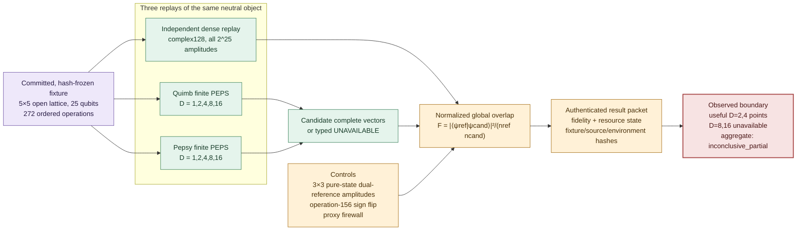
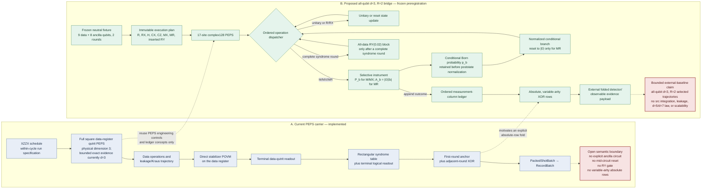
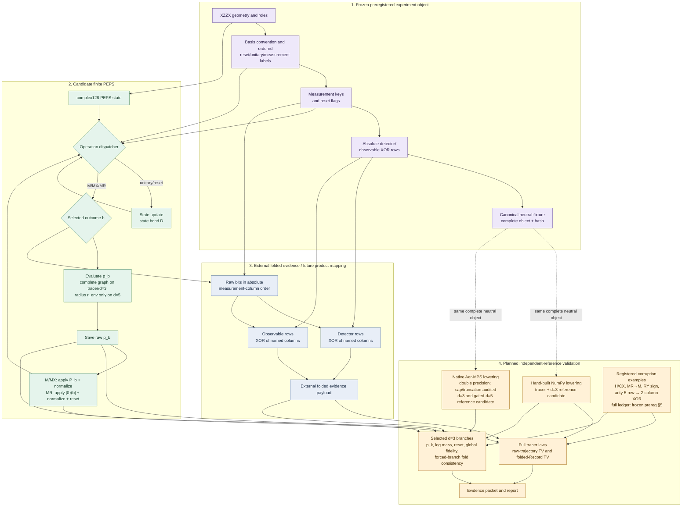
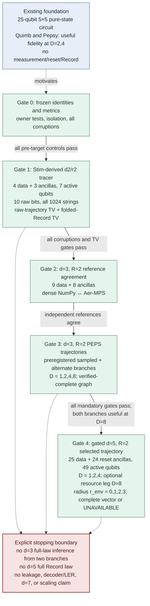

# PEPS–XZZX course-project architecture

> **定位更新（2026-07-27）：** 本文件保留为已完成 25-qubit full-PEPS
> baseline 与旧 explicit-ancilla Record-bridge 设计的背景材料。当前主报告
> 已转向单独实现的 all-qubit `carrier/capeps` engineering prototype，见
> [`CAPEPS_XZZX_ARCHITECTURE_FINAL_2026-07-27.md`](CAPEPS_XZZX_ARCHITECTURE_FINAL_2026-07-27.md)。
> 该原型尚未运行这里的 tracer、d3、d5 或 Record 实验；两条工作线不得
> 合并成一个已执行结果。

Status: **paper-design draft, 2026-07-27.** This document contains original
architecture diagrams and a report plan. It is not execution evidence. No
experiment result is inferred from the proposed path.

The shortest defensible course-project story is:

> A completed 25-qubit pure-state PEPS benchmark establishes that finite PEPS
> can represent one bounded coherent non-Pauli circuit accurately at modest
> bond dimension. A separate frozen \(d=3,R=2\) preregistration then makes the missing
> QEC semantics—explicit ancillas, ordered measurement, reset, branch mass, and
> absolute detector/observable Records—visible and independently testable.

The expanded paper draft is
[`PEPS_XZZX_COURSE_PAPER_DRAFT_2026-07-27.md`](PEPS_XZZX_COURSE_PAPER_DRAFT_2026-07-27.md).
The extension preregistration was frozen at its first commit
`15bb541f91f243f9d328b00357ff125bc44554db`; no target result has been run. It is
[`PEPS_XZZX_MEASUREMENT_RESET_RECORD_PREREG_2026-07-26.md`](PEPS_XZZX_MEASUREMENT_RESET_RECORD_PREREG_2026-07-26.md).

## 1. Visual language and literature provenance

These diagrams borrow only the **explanatory pattern** of the source figures;
their layout, labels, grouping, and graphics are original.

| source figure | useful explanatory pattern | adaptation here |
|---|---|---|
| Bonilla Ataides et al., Fig. 1, PDF p. 2 | connect local XZZX geometry to the global code object | start from a hash-specified spatial fixture rather than from an abstract tensor network |
| Bonilla Ataides et al., Fig. 5, PDF p. 6 | make time and consecutive-round defects visible | draw measurement columns and the Record fold as a separate temporal layer |
| Darmawan et al., Fig. 2, PDF p. 3 | map a stabilizer face to an ordered ancilla circuit | expose ancilla preparation, entangling gates, measurement, and reset |
| Ghosh et al., Fig. 1, PDF p. 2 | show reset as part of every repeated measurement cycle | put the selective `MR` instrument inside the feedback loop |
| Rudolph and Tindall, Sec. II, PDF pp. 3–4 | separate state update, contraction, and sampling | keep the PEPS state bond and measurement-environment control independent |

Source-located reviews:

- [`bonilla_ataides_xzzx_2009.07851_source_review.md`](../papers/reading_notes/bonilla_ataides_xzzx_2009.07851_source_review.md)
- [`darmawan_xzzx_circuit_2104.09539_source_review.md`](../papers/reading_notes/darmawan_xzzx_circuit_2104.09539_source_review.md)
- [`ghosh_leakage_paralysis_1306.0925v2.md`](../papers/reading_notes/ghosh_leakage_paralysis_1306.0925v2.md)
- [`rudolph_tindall_gpu_peps_2507.11424.md`](../papers/reading_notes/rudolph_tindall_gpu_peps_2507.11424.md)

## 2. Figure 1 — completed 25-qubit evidence pipeline

**Figure 1 caption.** The completed benchmark compares every amplitude of two
finite-PEPS candidate vectors with an independently replayed dense reference.
Pepsy and Quimb are separate adapters but not independent numerical oracles;
the dense route owns the fidelity truth. Resource rejection is retained as
`UNAVAILABLE` rather than converted into a low-fidelity point.

## 3. Figure 2 — current carrier versus proposed Record bridge

**Figure 2 caption.** The existing research carrier represents a complete
square data register as a single-wire qutrit PEPS and evaluates compiled
stabilizer POVMs directly; its bounded exact owner evidence is concentrated
at d3. The proposed bridge is deliberately an external-baseline path rather
than a silent production-carrier modification: it uses 17 explicit qubits,
retains unnormalized branch mass, applies measured reset, and constructs
detector/observable evidence from absolute measurement columns.

## 4. Figure 3 — end-to-end candidate, planned references, and folded evidence

**Figure 3 caption.** Candidate and planned references read only the same
neutral geometry, labels, angles, order, basis convention, measurement keys,
and XOR rows. Each implementation must independently lower those labels:
candidate matrices, projectors, reset builders, compiled plans, tensors,
gauges, contraction paths, diagnostics, and hidden truth cannot enter either
reference. Dense–Aer \(d=3\) agreement is required before those planned routes
become accepted references. This phase produces external folded evidence,
not a production `RecordBatch`; conditional states and branch ledgers remain
evaluator-only. A later product mapping would require separate `src/**`
authority and review.

## 5. Figure 4 — evidence staircase and stopping rule

**Figure 4 caption.** The completed pure-state benchmark is prior engineering
evidence, not Record evidence. Complete-law comparison belongs to the
enumerable tracer; \(d=3\) owns selected-trajectory state and branch
diagnostics. Once every prior gate passes, the \(d=5\) \(D=1,2,4\) leg is
required and fail-closed; only its \(D=8\) resource leg is optional.

### 5.1 Frozen acceptance bands

The report-level gates below summarize
[`§4 of the frozen preregistration`](PEPS_XZZX_MEASUREMENT_RESET_RECORD_PREREG_2026-07-26.md#4-frozen-predictions-and-decision-bands).
Metric-owner tests, hard branch errors, reset thresholds, and resource limits
remain binding there.

| stage | frozen acceptance |
|---|---|
| tracer | dense probability-sum residual `≤1e-12`; Quimb \(D=8\) residual `≤1e-10`; raw and folded-Record TV each `≤1e-8`; `RY(0.02)` versus zero folded-TV separation `>1e-6` |
| dense–Aer \(d=3\) | `1-F ≤1e-10`, maximum per-column probability error `≤1e-10`, log-mass error `≤1e-9` |
| PEPS \(d=3,D=8\) | sampled **and** alternate branches each require `F≥0.99`, probability error `≤5e-3`, log-mass error `≤1e-1`, plus every reset and realized-fold check |
| bond-knob evidence | `abs(F(D=8)-F(D=1)) >1e-4`; nonmonotonic \(F(D)\) is retained as a finding |
| gated \(d=5,D=4,r_env=3\) | complete-data-vector `F≥0.99`, probability error `≤1e-2`, log-mass error `≤5e-1`, plus reset/fold checks; missing exact vectors or prerequisites yield `UNAVAILABLE`/block |

## 6. Data contracts

| boundary | minimum content | ownership |
|---|---|---|
| neutral fixture | qubit ids and roles, graph, basis order, ordered operations, measurement-column order, reset flags, absolute detector/observable rows, canonical hash | shared immutable input |
| candidate PEPS | selected bits, conditional probabilities, cumulative log branch mass, conditional state handle, state-bond ledger, environment-radius ledger | candidate process |
| external folded evidence | binary detector vector, binary observable vector, raw-column identity, declared evidence schema | external-baseline process |
| future product mapping | binary detector/observable matrices, shot count, declared Record schema | out of scope here; would require separately authorized `RecordBatch` integration |
| evaluator sidecar | complete conditional state where feasible, post-reset one-site state, probability comparisons, fidelity, corruption results, runtime/memory | validation only; never exposed to estimators |
| provenance packet | fixture/run hashes, repository commit/tree, environment lock, dtype, exact/approximate labels, child-artifact hashes | report evidence |

For an `MR` outcome \(b\), the frozen preregistration declares the reset
instrument

\[
A_b = I_{\mathrm{rest}}\otimes |0\rangle\langle b|,\qquad
p_b = \frac{\langle\psi|A_b^\dagger A_b|\psi\rangle}
           {\langle\psi|\psi\rangle},
\]

\[
|\psi_b\rangle =
\frac{A_b|\psi\rangle}
     {\sqrt{p_b\langle\psi|\psi\rangle}}.
\]

The architecture must retain \(p_b\) before normalizing
\(|\psi_b\rangle\). Otherwise a correct-looking conditional state can hide an
incorrect trajectory probability.

## 7. Independent numerical controls

| control | values | what it measures | forbidden interpretation |
|---|---:|---|---|
| PEPS state bond | tracer/\(d=3\): `D = 1,2,4,8`; \(d=5\): `D = 1,2,4` plus optional resource leg `D=8` | truncation of the represented state | not an error certificate by itself |
| measurement environment | verified-complete graph on tracer/\(d=3\); \(d=5\) radius `r_env = 0,1,2,3` | approximation used to obtain a local measurement probability | not interchangeable with `D`; \(d=3\) has no radius sweep |
| complete-law metrics | `TV = 0.5 Σ_x |p(x)-q(x)|` on the tracer | raw-trajectory TV and folded-Record TV on two separately declared objects | the raw law must not be labelled a Record; neither metric is replaced by terminal sample agreement |
| selected-state metric | normalized global fidelity on \(d=3\) | one conditioned global state | does not certify the \(d=3\) joint Record law |
| branch metric | maximum conditional-probability error and log-mass error | probability of the selected path | does not cover unvisited branches |
| reset invariant | one-site trace distance to `|0⟩⟨0|` after every `MR` | correct measured reset | not a global-state metric |

## 8. External-library placement

| library | bounded role | decisive boundary |
|---|---|---|
| Quimb, commit `3c89529f…` | shortest candidate adapter; finite PEPS gates and complete dense materialization of the represented, possibly truncated PEPS | current ECS PEPS also uses Quimb; therefore not an independent oracle |
| Pepsy, commit `27cb956e…` | API and pure-state engineering comparator | wraps Quimb and has no turnkey selective PEPS measurement/reset trajectory |
| YASTN, commit `595bd802…` | best-fit planned non-Quimb finite-PEPS comparator among the audited clones | end-to-end independence still requires separately lowered operators, an owned QEC trajectory/reset adapter, provenance, and corruptions |
| TensorNetworkQuantumSimulator.jl, commit `b5d4089…` | optional native-qutrit/general-dimension `TensorNetworkState` sampling/RDM cross-check | new Julia bridge; no public conditioned-state/reset path |
| variPEPS_Python, commit `0edc81ac…` | iPEPS/CTMRG context only | thermodynamic-limit/unit-cell workflow; no finite selective circuit/reset/Record path |
| Aer MPS | planned conditioned-trajectory reference candidate after dense \(d=3\) agreement | double precision, threshold `0.0`, declared cap `65536`, log/Schmidt audit, and strictly sub-cap zero-discard evidence are mandatory; MPS reference, not a second PEPS implementation |

Quimb and Pepsy agreement is useful adapter evidence, while dense NumPy owns
the already completed 25-qubit pure-state fidelity truth. For the unexecuted
Record extension, separately lowered dense NumPy and Aer are only planned
reference candidates; they acquire reference status only after isolation
checks and dense–Aer \(d=3\) agreement pass. YASTN is the best-fit planned
non-Quimb finite-PEPS comparison, not an automatically independent oracle.

## 9. Reportable claim boundary

| timing | defensible statement |
|---|---|
| now | two finite-PEPS routes completed the frozen 25-qubit pure-state fixture at `D=1,2,4`; both exceeded `F=0.99` at `D=2` and `F=0.9999995` at `D=4`; the registered aggregate remains `inconclusive_partial` because `D=8,16` were unavailable |
| now | the explicit-ancilla \(d=3,R=2\) extension has a source-grounded, hash-bound architecture frozen at commit `15bb541f…`; no tracer/\(d=3\)/\(d=5\) target result has been run |
| after tracer pass | the implementation reproduces the complete ten-bit raw law and five-detector/one-observable folded Record law on the declared seven-qubit tracer |
| after \(d=3\) pass | the implementation preserves both preregistered \(d=3\) branches' probabilities, reset invariants, conditional-state fidelity, and forced-branch absolute-fold consistency within the frozen bands; this is not \(d=3\) Record-law evidence |
| never from this study alone | full \(d=3\)/\(d=5\) Record certification, leakage or Kraus faithfulness, decoded LER, threshold behavior, \(d=7\) feasibility, or general scalable/exact PEPS contraction |

## 10. Paper and presentation figure inventory

1. **Completed evidence pipeline:** Figure 1 above.
2. **Scientific gap:** Figure 2 above.
3. **Proposed Record architecture:** Figure 3 above.
4. **Evidence logic:** Figure 4 above.
5. **Measured result plot:** log-scale infidelity `1-F` versus `D` for Quimb
   and Pepsy, with `D=8,16` rendered as `UNAVAILABLE`, not as zero or missing
   low-fidelity points.
6. **Resource plot:** best completed `D=4` wall time, host peak, and device
   peak for both adapters.
7. **Extension result plot, after execution only:** \(d=3\) state fidelity and
   branch-probability error versus `D`; a separate optional \(d=5\) panel may
   show radius `r_env`. Do not invent a \(d=3\) radius sweep or collapse `D`
   and `r_env`.
8. **Falsifier table:** expected trip and observed trip for `MR→M`, RY
   zero/sign, H/CX, normalization, and absolute-row corruptions.
