# CODE_MAP — code + runtime-service inventory (GENERATED — do not hand-edit)

<!-- code-map-inputs-sha256: f4cfc75988c8dd9caf5a99e84636235ee5084d26575850401c618a90a4d714c1 -->
- **code-map inputs sha256:** `f4cfc75988c8dd9caf5a99e84636235ee5084d26575850401c618a90a4d714c1`  •  **git HEAD:** `06be538`
- Generated by `tools/gen_code_map.py` from AST + validated service metadata (no project imports). Regenerate after ANY listed `src/`, developer-tooling, status/catalog, or packaging change: `python tools/gen_code_map.py`. Staleness: `python tools/gen_code_map.py --check` exits 1 when the input hash above no longer matches code, `docs/code_status.json`, `docs/service_status.json`, `pyproject.toml`, `MANIFEST.in`.
- **Status** (ACTIVE / PLACEHOLDER / RESEARCH + one-line note) is the hand-maintained module overlay `docs/code_status.json`. Runtime-service inclusion/exclusion, controls, dependencies, acceptance paths, and flow live in `docs/service_status.json`.

## DRIFT CHECK
- ✅ clean — every package has a status entry, no status entry is orphaned.

## RUNTIME SERVICE MATRIX — validated distribution contract

> Generated from `docs/service_status.json`. CORE means shipped in the default distribution; it does not erase the scientific claim boundary stated in the final column.

- ✅ catalog validation clean — 28 services, 6 explicit exclusions, 48 flow nodes, 92 flow edges.
- ✅ reverse module coverage clean — all 116 installed Python modules are classified (92 service implementation modules + 24 explicit support modules).
- ✅ canonical ownership clean — installed modules and all 106 declared acceptance files have no executable retired-namespace import, dynamic-import, or patch-target edge.
- ✅ native-backend lifetime isolation — one_test_file_per_process; runner `tests/harness/service_acceptance.py`, default environment `ecs` with explicit per-file environment overrides.
- ✅ acceptance execution lanes — default `cpu_light`; `cpu_exclusive`=7, `cpu_light`=53, `gpu_serial`=46. Every acceptance file resolves to exactly one validated lane.
- Exact owner files, package entry points, dependency extras, control methods, unique IDs, reverse module coverage, and complete-flow references were checked without importing project code.
- API surface: Installed Python API only; the distribution currently installs no console-script entry point. Optional PyMatching and CUDA-Q capabilities require their declared extras, and CUDA-Q runs in the retained aiqec environment as a separate process.
- Included as a service when: A caller-visible, independently invokable package capability that returns a simulator record, a physical channel/state/trajectory result, a replayable source process, or explicitly bounded certification/research evidence.; Workload adapters and isolated plugins are counted separately when they have their own public entry point, dependency boundary, and output contract.
- Kept out of the service count when: Types, IRs, guards, layout helpers, native loaders, controlled fixtures, and runners that only support another service.; Downstream inference, decoder-floor/headroom analysis, hardware datasets, unimplemented scientific bridges, and repository-only experiments.

| Service | Status / kind / record | Installed owners | Public entry points and controls | Dependencies | Inputs → outputs | Claim / maturity boundary |
|---|---|---|---|---|---|---|
| **`frontend_compile_and_records`** Circuit/CodeSpec compile and Stim-Pauli record frontend | **CORE** frontend canonical `{det, obs}` frontend | `src/error_coupling_simulator/frontend/circuit_ir.py` `src/error_coupling_simulator/frontend/code_spec.py` `src/error_coupling_simulator/frontend/compiler.py` `src/error_coupling_simulator/frontend/noise.py` `src/error_coupling_simulator/frontend/noise_spec.py` `src/error_coupling_simulator/frontend/operation.py` `src/error_coupling_simulator/frontend/schedule.py` `src/error_coupling_simulator/frontend/simulator.py` `src/error_coupling_simulator/frontend/stim_io.py` `src/error_coupling_simulator/frontend/stim_source.py` `src/error_coupling_simulator/frontend/xzzx_code.py` | `error_coupling_simulator.frontend:Simulator` `error_coupling_simulator.frontend:compile_code_spec` `error_coupling_simulator.frontend:NoiseBuilder` `error_coupling_simulator.frontend:StimCircuitSource` | core: stim, numpy, PyYAML; extras: none | Caller CircuitIR, CodeSpec, CompiledCircuit, or Stim circuit → Compiled Stim circuit, canonical detector/observable records, DEM and provenance artifacts | This is the Stim-representable product path. Analog joint-L, leakage, and source-conditioned reduced projection have separate services and claim boundaries. acceptance: tests/test_simulator_frontend.py, tests/test_simulator_codespec.py, tests/test_simulator_noise_module.py, tests/test_numerics_units.py, tests/test_stim_source_units.py |
| **`axis1_schedule_adapter`** Axis-1 analog compiler and sealed substep schedule adapter | **CORE** adapter no canonical record frontend/schedule | `src/error_coupling_simulator/frontend/analog_schedule.py` | `error_coupling_simulator.frontend:compile_code_spec_to_substep_schedule` `error_coupling_simulator.frontend:circuit_ir_to_substep_schedule` `error_coupling_simulator.frontend:stim_circuit_to_substep_schedule` | core: stim, numpy; extras: none | CodeSpec compiler result, CircuitIR, or Stim circuit with explicit duration policy → Compiler-sealed SubstepSchedule with supports, durations and record boundaries | This is the Axis-1 schedule seam. It does not select the XZZX within-cycle RunSpec carrier. acceptance: tests/test_analog_schedule_units.py, tests/test_simulator_axis1_schedule.py |
| **`xzzx_external_schedule`** External XZZX/Google circuit and within-cycle schedule adapter | **CORE** adapter no canonical record frontend/schedule | `src/error_coupling_simulator/frontend/xzzx_parser.py` `src/error_coupling_simulator/frontend/experiments.py` `src/error_coupling_simulator/frontend/xzzx_code.py` | `error_coupling_simulator.frontend:parse_xzzx_circuit` `error_coupling_simulator.frontend:load_xzzx_d3` `error_coupling_simulator.frontend:run_spec_from_preset` | core: stim, numpy; extras: none | Explicit Google/user .stim circuit plus metadata geometry/schedule paths → XZZXSchedule and explicit within-cycle RunSpec | Google files are optional caller inputs for this adapter, not hidden package data and not required by other simulator services. acceptance: tests/test_frontend_experiments.py, tests/test_xzzx_parser_owner.py |
| **`axis1_joint_channel`** Axis-1 primitive lowering and same-substep joint channel | **CORE** mechanism no canonical record mechanism/carrier | `src/error_coupling_simulator/mechanisms/axis1_primitives.py` `src/error_coupling_simulator/carrier/joint_lindbladian.py` `src/error_coupling_simulator/frontend/axis1_channel_evidence.py` | `error_coupling_simulator.mechanisms.axis1_primitives:lower_two_qubit_axis1_primitives` `error_coupling_simulator.carrier.joint_lindbladian:assemble_substep_channel` `error_coupling_simulator.frontend:axis1_substep_channel_evidence_manifest` | core: torch, numpy; extras: none | Declared mechanism parameters and compiler-sealed substep duration/support → Joint Hamiltonian/collapse lowering, CPTP Kraus channel and channel-evidence ledger | Batched and factored assemblers are execution variants of this one service, not separate services. acceptance: tests/test_axis1_connected_cluster_channels.py, tests/test_joint_lindbladian.py, tests/test_coherent_pauli_generators.py, tests/test_collective_decay_finite_step_guard.py, tests/test_simulator_axis1_schedule.py |
| **`channel_algebra`** Reusable CPTP and physical channel-construction algebra | **CORE** mechanism no canonical record mechanism/carrier | `src/error_coupling_simulator/carrier/cptp_channel.py` | `error_coupling_simulator.carrier.cptp_channel:StinespringChannel` `error_coupling_simulator.carrier.cptp_channel:apply_kraus` `error_coupling_simulator.carrier.cptp_channel:choi_matrix` `error_coupling_simulator.carrier.cptp_channel:tp_residual` | core: torch, numpy; extras: none | Caller channel parameters, unitary, Kraus stack, or Stinespring parameterization → Unitary/Kraus/Stinespring channels, Choi representation and TP residual | This service is limited to the package-owned Kraus, Stinespring, Choi, probability, and trace-preservation algebra in the declared owner. acceptance: tests/test_noise_mechanism_primitives.py |
| **`classical_finite_rtn_source_chain`** Classical finite-RTN source-to-record chain | **CORE** source_record_chain canonical `{det, obs}` source/noise_process/carrier | `src/error_coupling_simulator/source/process.py` `src/error_coupling_simulator/source/coupling.py` `src/error_coupling_simulator/noise_processes/coupled_cycle.py` | `error_coupling_simulator.source:SourceTimeline` `error_coupling_simulator.source:RTNSource` `error_coupling_simulator.source:OneOverFDriftSource` `error_coupling_simulator.source:source_to_params` `error_coupling_simulator.noise_processes:CoupledCycleNoiseProcess` `control:matched_marginal_permutation = error_coupling_simulator.noise_processes.coupled_cycle:CoupledCycleNoiseProcess.matched_marginal_permutation_control` `control:source_off = error_coupling_simulator.noise_processes.coupled_cycle:CoupledCycleNoiseProcess.off_source` | core: numpy, scipy, stim, torch; extras: test | Declared single-RTN or finite log-spaced RTN-sum configuration, or explicit SourceTimeline NPZ → Shared-source canonical record arm; Matched-marginal permutation negative-control record arm; Source-off Theta(0) negative-control record arm; Evaluator-only replayable timeline and per-cycle mechanism parameters | The source is a finite sum of log-spaced RTNs whose sum-of-Lorentzians approximates 1/f only over the declared band. The registered free-induction research diagnostic tests separately declared one-qubit lifts and does not upgrade the source, production channel, or record to a CP-divisibility claim. This is not a hardware-data service. acceptance: tests/test_source_process_units.py, tests/test_numerics_units.py, tests/test_finite_rtn_free_induction_diagnostic.py, tests/test_source_coupling_units.py, tests/test_coupled_cycle_interop.py, tests/test_coupled_cycle_noise_process_records.py, tests/test_coupled_cycle_units.py, tests/test_axis1_record_params_override.py |
| **`classical_burst_storm_sources`** Phase-burst and temporal-storm replayable source primitives | **RESEARCH** timeline_primitive no canonical record source | `src/error_coupling_simulator/source/process.py` | `error_coupling_simulator.source:PhaseBurstSource` `error_coupling_simulator.source:TemporalStormSPPSource` | core: numpy; extras: none | Explicit burst/recovery or two-state temporal-storm source configuration → Replayable SourceTimeline with evaluator-side latent/source arrays | These are public timeline primitives, not turnkey record carriers. CoupledCycleNoiseProcess deliberately accepts only RTNSource/OneOverFDriftSource. PhaseBurst remains unbounded; TemporalStorm is a reduced observed HMM-memory comparator. acceptance: tests/test_source_process.py, tests/test_source_process_units.py |
| **`source_stim_pauli_projection`** Source-conditioned reduced Stim-Pauli record carrier | **CORE** reduced_carrier canonical `{det, obs}` source/frontend | `src/error_coupling_simulator/frontend/noise_spec.py` `src/error_coupling_simulator/frontend/simulator.py` | `error_coupling_simulator.frontend:SourceStimPauliProjectionSpec` `error_coupling_simulator.frontend:SourceStimPauliRule` `error_coupling_simulator.frontend:Simulator` | core: numpy, stim; extras: none | CircuitIR, SourceTimeline and explicit source-to-Pauli projection rules → Source-conditioned noisy Stim circuit, DEM, canonical .b8 records and sanitized manifest | Representability is reduced_pauli_projection_not_analog_truth. It can change records but cannot claim coherent joint-Lindbladian or leakage fidelity. acceptance: tests/test_simulator_source_projection.py, tests/test_simulator_source_sidecar.py, tests/test_numerics_units.py |
| **`exact_qubit_circuit_dm`** Small-register exact differentiable qubit density-matrix carrier | **CORE** carrier no canonical record carrier/exact | `src/error_coupling_simulator/carrier/exact/circuit_sim.py` | `error_coupling_simulator.carrier.exact.circuit_sim:zero_state` `error_coupling_simulator.carrier.exact.circuit_sim:apply_channel_local` `error_coupling_simulator.carrier.exact.circuit_sim:measure_qubit_enumerate` `error_coupling_simulator.carrier.exact.circuit_sim:parity_marginal_one` | core: torch; extras: cuda-extension, gpu-cu130 | Small n-qubit state, local gates/Kraus channels and measurement definitions → Exact density matrix, enumerated branch probabilities, differentiable measurement/detector probabilities | The exact fused CUDA path is an acceleration of this service; it does not change the c128 mathematical contract. acceptance: tests/test_diff_circuit_forward.py, tests/test_simulator_axis1_schedule.py, tests/test_axis1_record_params_override.py |
| **`axis1_dense_jointl_record`** Exact small-N Axis-1 joint-L state and measurement-record carrier | **CORE** carrier canonical `{det, obs}` frontend/carrier execution | `src/error_coupling_simulator/frontend/axis1_carrier_execution.py` `src/error_coupling_simulator/frontend/axis1_state_evidence.py` `src/error_coupling_simulator/frontend/axis1_record_evidence.py` | `error_coupling_simulator.frontend:axis1_carrier_execution_manifest` `error_coupling_simulator.frontend:axis1_state_evolution_evidence_manifest` `error_coupling_simulator.frontend:axis1_measurement_record_evidence_manifest` `error_coupling_simulator.frontend:write_axis1_measurement_record_samples` | core: torch, numpy, stim; extras: gpu-cu130 | Compiler-sealed Axis-1 SubstepSchedule, optional per-substep parameters, readout/reset instrument and XOR wiring → Exact small-N state/branch law, canonical RecordBatch, detection_events.b8 and obs_flips_actual.b8 | This is the dense execution dependency of the classical 1/f chain. It intentionally does not fabricate Stim/DEM/decoder semantics for analog joint-L records. acceptance: tests/test_simulator_axis1_schedule.py, tests/test_axis1_record_params_override.py |
| **`fused_within_cycle`** Fused d3 within-cycle state-vector MCWF carrier | **CORE** carrier canonical `{det, obs}` carrier | `src/error_coupling_simulator/carrier/within_cycle.py` `src/error_coupling_simulator/carrier/kernels/sv_traj_d3_loader.py` | `error_coupling_simulator.carrier:FusedWithinCycleSampler` | core: torch, numpy; extras: cuda-extension, gpu-cu130 | XZZXSchedule and explicit RunSpec → PackedShotBatch with c64 screening or c128 candidate provenance | c64 is restricted to optimization screening. Final/certification candidates remain c128. acceptance: tests/test_fused_within_cycle_sampler.py, tests/test_within_cycle_precision.py, tests/test_sv_traj_d3_loader_units.py |
| **`restricted_axis1_1d_mps`** Restricted Axis-1 one-dimensional MPS verification | **CORE** restricted_verification canonical `{det, obs}` restricted verification frontend/mechanics/certification | `src/error_coupling_simulator/carrier/mps/__init__.py` `src/error_coupling_simulator/carrier/mps/capped_two_site.py` `src/error_coupling_simulator/carrier/mps/controls.py` `src/error_coupling_simulator/carrier/mps/probability.py` `src/error_coupling_simulator/carrier/mps/state.py` `src/error_coupling_simulator/carrier/mps/truncation.py` `src/error_coupling_simulator/carrier/mps/uncapped_nonlocal.py` `src/error_coupling_simulator/certify/axis1_mps.py` `src/error_coupling_simulator/certify/mcwf_operator_reference.py` `src/error_coupling_simulator/frontend/axis1_carrier_execution.py` `src/error_coupling_simulator/frontend/axis1_mcwf_mps_execution.py` `src/error_coupling_simulator/frontend/axis1_record_layout.py` `src/error_coupling_simulator/frontend/axis1_qt_mps_execution.py` | `error_coupling_simulator.frontend:axis1_mcwf_mps_state_record_execution_manifest` `error_coupling_simulator.frontend:axis1_mcwf_mps_record_batch` `error_coupling_simulator.frontend:write_axis1_mcwf_mps_record_samples` `error_coupling_simulator.frontend:axis1_qt_mps_restricted_execution_manifest` `error_coupling_simulator.frontend:axis1_qt_mps_bond_sweep_manifest` `error_coupling_simulator.frontend:axis1_qt_mps_trajectory_seed_sweep_manifest` `error_coupling_simulator.frontend:axis1_qt_mps_restricted_evidence_bundle_manifest` `error_coupling_simulator.frontend:axis1_qt_mps_resource_probe_manifest` | core: torch, quimb, numpy, scipy; extras: gpu-cu130 | Sealed Axis-1 schedule, local dimensions and explicit approximation controls including max_bond=None or a strict positive integer; CORR_RELAX only when already present in an internal sealed Carrier program; no public source/schedule compiler lowering currently emits it → Restricted execution/evidence manifest with immutable schedule-derived ordered Record keys/targets/X-Z bases/reset mask, exact full-support or sampled observed-support Record probabilities, declared-basis evaluator semantics, actual-Quimb-split approximation ledger with explicit symmetric-Hamiltonian pass aggregation, and authenticated v2 frozen-dynamics reference packet binding complete term/group coverage plus program/artifact/current-source hashes; For completed measured MCWF evidence accepted for restricted execution only: bounded canonical grouped detector/observable RecordBatch, evaluator-truth-free axis1_mcwf_mps_carrier_execution.json, complete sealed evaluator-truth-free axis1_mcwf_mps_carrier_program.json, optional detection_events.b8 and obs_flips_actual.b8, and mcwf_mps_record_sample_summary.v1; exact count expansion draws no second sample and does not preserve original trajectory order | carrier/mps is an execution-mechanics library for restricted verification routes. It makes no state-, Record-, or LER-faithfulness claim and is not a registered scientific Carrier. PEPS remains the trajectory-carrier frontier, and PEPO remains the retained research Carrier. This is a finite-microstep verification slice, not a production full-dxd/full-record backend. Every Quimb decomposition call in the package must name an explicit cutoff. Uncapped connected three-to-five-site MCWF unitaries use explicit zero cutoffs at both dense-to-MPO and MPS/MPO layers, candidate validation, and fixed numerical-only preallocation guards. Finite qubit two-site unitary caps ledger every actual Quimb forward-swap/operator/reverse-swap split; capped multi-site clusters remain fail-closed. Split events report the retained bond index as actual_kept_bond_dimension; numerical rank is a distinct thresholded diagnostic. Exact branches use incoming-probability weighting; sampled paths average path totals over the declared trajectory count, including zero-event paths. Each gate occurrence authenticates complete trajectory coverage or unit branch mass and fails closed when incomplete; MCWF symmetric-Hamiltonian half-passes are separately ordered as hamiltonian_pass_index 0 and 1, while the intervening normalized collapse update remains first-order and carries no Strang/second-order claim. Actual finite-bond loss requires both explicit heuristic worst-cut and path-total discarded-weight gates for restricted acceptance; an observed lossless capped run does not. A completed true-over-cap execution without an independent Record oracle is diagnostic-only and fails certification. The compiler-sealed schedule is parsed once before CUDA or trajectories into immutable axis1_schedule_record_layout.v1. QT uses every measurement boundary. MCWF publishes and transitively authenticates schedule-ordered keys, targets, X-Z bases, and reset masks; X non-reset rotates back and X reset prepares \|+>. Its evaluator-only v2 labels are declared-basis eigenlabels, not a claim that X outcomes are computational local levels. Dense restricted acceptance jointly gates the declared-basis label TV and emitted binary Record TV, reports their maximum, and obtains the binary reference from certifier-local hand-typed leaked-readout marginalization rather than the production bit sampler. A no-measurement schedule validates only the canonical empty Record sentinel and remains unavailable because its normalized candidate law has no registered input-independent linear channel metric. Before any dense metric authorizes restricted MCWF execution, all present production terms are checked against an isolated hand-typed NumPy/Pauli inventory covering 51 Hamiltonian and seven collapse families; unknown, wrong-arity, non-finite, wrong-shape, and mismatched operators fail closed, and the dense oracle consumes the isolated matrices. CORR_RELAX is routed through the two-site collective-collapse path. This is software implementation-definition evidence, not source closure or calibration. Direct Carrier and auto-router seams bind exact summary fields, caller options, local Hilbert dimensions, seed, state/policy/direct-v8 provenance, canonical sorted unique normalized histograms, joint metric components, and blocked summaries; unknown or evaluator-only fields fail closed recursively. Reset/evolution duration violations fail as structured blockers. QT sampled measurement remains Z-only, uses sequential conditional single-site draws, and emits only sorted observed Record outcomes; QT exact execution retains full binary support. The strategy-aware preflight bounds exact support by 2**m and sampled support by min(2**m, trajectory_count) before CUDA. Seed and dense comparisons align union support with missing probabilities set to zero. Current schema identities are Carrier execution and auto v5, routing decision v3, direct QT/MPS v6, QT aggregate/resource v4, QT acceptance/preflight v2, direct MCWF/MPS v8, MCWF evaluator diagnostics v2, MCWF acceptance v7, MCWF frozen-dynamics reference packet v2, and MCWF grouped sample summary v1; no compatibility fallback is retained. Exact QT execution reports static_branch_count_upper_bound_after_substep as a recomputed numerical resource bound, never an observed hidden branch count, and rejects legacy branch_count_after_substep. These are execution/schema guarantees, not Record-faithfulness evidence. Local discarded fractions are not a global error bound; uncapped Kraus/jump norms retain separate physical branch-probability semantics. Canonical output is limited to completed measured MCWF evidence accepted for restricted execution: the child keeps claims_b8_artifact=false, the wrapper expands exact counts in grouped support order without resampling or preserving original trajectory order, and the wrapper alone claims bounded RecordBatch/.b8 ownership. Sealed X-Z detector/observable XOR rows are not folded again through s_to_det. Before CUDA, schedule shape is validated and max_record_support_cells independently caps the static histogram/layout cell estimate. max_record_array_payload_bytes defaults to AXIS1_MCWF_MPS_RECORD_MAX_ARRAY_PAYLOAD_BYTES (512 MiB) and caps exactly 4*N*(D+O) bytes: only the incremental NumPy Record-array payload for preallocated uint8 rows plus current RecordBatch binary-validation/freezing temporaries. It excludes the resident Carrier, Python support/layout objects, canonical JSON hashing, array headers/allocator overhead, build/publication provenance, and whole-process RSS. Strict support order, each sealed X-Z XOR row, and canonical hashes are checked in streaming passes without aggregate projection or support-sized np.repeat buffers. A private same-call consistency binding rechecks direct-child, Carrier, policy, and Record-law hashes without seeded replay; it is not a cryptographic authenticity or replay boundary. The writer freezes out_dir as an absolute lexical path and requires a fresh destination beneath a pre-existing target parent. Before MCWF it opens and holds the parent dirfd, seals st_dev/st_ino, environment-lock path/hash, package-tree and module-source import-time digest checkpoints including resolved import origin, required full 40/64-hex Git HEAD, required Torch/Quimb/SciPy versions, and GPU/runtime identity. These checkpoint digests do not attest continuous disk immutability or runtime Python code objects. The lock is hash-bound only, with no conformance or reproducible-environment claim; torch.version.cuda is the PyTorch build CUDA version and the loaded CUDA runtime is not_attested. A two-leg sacrificial probe through the held fd on the actual target filesystem must pass collision preservation and successful renameat2(RENAME_NOREPLACE). The complete seal is revalidated after MCWF and after stage fsync. Stage creation/removal and final rename/parent fsync use the held parent fd; artifact I/O uses the sealed stage fd. At each seal checkpoint every required artifact is opened O_NOFOLLOW\|O_NONBLOCK, required regular, and bound by st_dev/st_ino/st_mode/st_size/st_mtime_ns/st_ctime_ns/SHA-256; hashing and file fsync use that same fd. Canonical JSON and chunked in-memory little-endian b8 data provide independent expected hashes. Missing parent/lock/dependency/Git identity, probe failure, or any identity drift fails closed. It persists the exact evaluator-truth-free axis1_mcwf_mps_carrier_execution.json; its artifact entry binds file SHA-256, schema, internal content hash, contains_carrier_program_summary=true, and explicit restricted-policy, Record-execution, and Carrier-program-summary locators. It separately persists complete sealed evaluator-truth-free axis1_mcwf_mps_carrier_program.json; that artifact entry binds file SHA-256, schema, internal content hash, and contains_complete_sealed_program=true, while the metric/gate program_evidence_locator points to the file. The public standalone bundle permits offline inspection of reported policy metric values, recomputation of gate/confidence-interval and acceptance algebra, and verification of persisted hashes/locators. It omits the evaluator-only declared-basis level law and dense-oracle distribution, so it cannot independently regenerate the multilevel declared-basis TV from raw distributions or fully reproduce the evaluator verdict; the complete direct child must not be persisted. Detector-only and observable-only output are valid and omit the zero-width side's optional .b8. The sample manifest is written and fsynced last, sealed, and included with the two required evidence JSONs and declared nonzero-width b8 files in an exact whitelist that excludes extras, symlinks, substitutions, and evaluator truth. File and stage-directory fsync are required; the exact set is revalidated after stage fsync and just before rename, then rechecked after rename and after parent fsync. Destination inode is likewise checked after rename and parent fsync, followed by the parent-path identity check. The manifest remains publication_status=prepared_for_atomic_publication and claims_offline_durability_confirmation=false. Its artifact-file-fsync, stage-fsync, staged-set, both published-set, second seal, rename, both destination-inode, and parent-fsync success attestations are false; it does not self-attest post-manifest success. Successful writer return is the only durability confirmation. If the no-replace wrapper moves the sealed stage and then raises, or any later check fails, the published directory is preserved and the exception propagates without path cleanup. Only a still-owned unpublished private stage is eligible for identity-safe best-effort cleanup; cleanup failure cannot turn publication failure into success and never authorizes cleanup through an untrusted path. The v1 content hash binds layout/XOR columns, optional b8 presence/names/widths/hashes, seed/dtypes, checkpoint-scoped package/source identity and full Git HEAD, resolved import origin, lock hash-only scope, GPU name/UUID/compute capability, NVIDIA driver, PyTorch build CUDA version, loaded-runtime not_attested status, and publication protocol/status. Missing parent/lock, failed target-FS probe, sealed-identity drift, no-measurement, blocked, double-zero-width, noncanonical, over-budget, incomplete, or unaccepted evidence fails closed. The wrapper preserves execution, certification, diagnostic, and restricted-acceptance status and does not add a faithfulness, DEM, decoder, production, or complete-QEC-Record claim. acceptance: tests/test_mps_phase1b_fail_closed.py, tests/test_axis1_mcwf_convergence.py, tests/test_simulator_axis1_schedule.py, tests/test_axis1_mcwf_dense_certification.py, tests/test_mps_actual_split_diagnostic.py, tests/test_mps_actual_split_helper.py, tests/test_mps_uncapped_nonlocal.py, tests/test_mps_capped_uncapped_mutation_firewall.py, tests/test_mps_quimb_cutoff_static_gate.py, tests/test_mps_three_leg_comparator.py, tests/test_axis1_record_layout.py, tests/test_mps_phase3_record_layout.py, tests/test_mps_phase4a_probability_and_norm.py, tests/test_mps_phase4b_configuration_support_and_bond.py, tests/test_mps_phase5_consolidation.py, tests/test_mps_phase6_certification_ownership.py, tests/test_mps_phase6_evaluator_metric_binding.py, tests/test_mps_phase7_sparse_sampled_records.py, tests/test_mps_phase7_conditional_distribution_diagnostic.py, tests/test_mps_qt_aggregate_binding.py, tests/test_mps_qt_aggregate_deep_auth.py, tests/test_mps_qt_transitive_semantics.py, tests/test_mps_carrier_child_authentication.py, tests/test_mcwf_carrier_record_output_units.py, tests/test_mcwf_carrier_record_output_gpu.py, tests/test_mps_mcwf_measurement_semantics.py, tests/test_mcwf_operator_reference.py, tests/test_mps_state_mechanics.py, tests/test_mps_truncation_mechanics.py, tests/test_restricted_mps_benchmark.py, tests/test_external_aer_mps_comparison.py, tests/test_external_yastn_mcwf_mass_comparison.py, tests/test_external_qutip_mcwf_xz_comparison.py, tests/test_external_mcwf_xz_fixture_family.py, tests/test_external_itensor_mps_comparison.py |
| **`clifford_augmented_peps_prototype`** All-qubit Clifford-augmented PEPS prototype | **RESEARCH** restricted_verification no canonical record carrier/capeps | `src/error_coupling_simulator/carrier/capeps/__init__.py` `src/error_coupling_simulator/carrier/capeps/algebra.py` `src/error_coupling_simulator/carrier/capeps/frame.py` `src/error_coupling_simulator/carrier/capeps/residual.py` `src/error_coupling_simulator/carrier/capeps/state.py` | `error_coupling_simulator.carrier.capeps:CAPEPSState` `error_coupling_simulator.carrier.capeps:StimCliffordFrame` | core: numpy, stim, quimb; extras: none | All-qubit Clifford circuits, coherent signed-Pauli expansions or small-local complex128 unitaries, exact local Clifford refactors, Pauli observables, and explicit measurement outcomes; Explicit fail-closed seam for a separately installed SDIM 1.3.3 qubit tableau backend; no canonical live-SDIM acceptance environment is registered → Hybrid state satisfying \|psi> = C\|phi>; Untruncated complex128 residual-update diagnostics, Eq. (5) generator/phase ledgers, Pauli expectations, exact local-refactor diagnostics, and an ordered raw conditional-branch ledger | Engineering-mechanics prototype only. Stim is the default frame. SDIM is an unregistered, fail-closed optional seam: the adapter is qubit-only and version-pinned, while canonical acceptance covers phase translation and unavailable-backend rejection rather than live SDIM execution. The qubit GCAMPS Eq. (5) specialization uses GF(2) generator decomposition, explicit ordered-product phase recovery, and a direct signed-pullback consistency gate. Signed Pauli pullbacks preserve coherent amplitudes; arbitrary small-local unitary expansion retains all Pauli coefficients without a floating structural-zero filter. Exact one- and adjacent-two-site refactorization implements (C, phi) -> (C Q^dagger, Q phi), but the paper's 20/90-candidate search and finite-bond optimizer are not implemented. Nonlocal Quimb PEPS sums use an untruncated virtual direct sum with no finite-bond or scaling claim. PECOS is only a future isolated differential-reference candidate; no CAPEPS-PECOS comparator is implemented or accepted. The raw branch ledger is not a canonical RecordBatch, and complete multi-round QEC Record, leakage/qutrit, finite-bond, and production-faithfulness claims remain open. The dedicated 2026-07-29 closure and preregistration freeze one n=8, active-rank-3, untruncated differential between two equal-status candidate state-action lanes: plain Quimb PEPO-on-PEPS and GCAPEPS. An untimed NumPy-only exact-small anchor is frozen by design but not yet implemented. Once implemented and passing its controls, it may qualify only this one input-state action; neither candidate is ground truth and the anchor never enters an efficiency ratio. A separate 2026-07-29 preregistration now freezes, before implementation, one two-qubit bridge tracer comparing exact tree-PEPO action with opt-in Quimb-native one/two-site compilation under a deliberately lossy per-gate cap. Its held-out complete-state prediction and split-cause ledger can support only a bounded path-dependent state-action finding; local discarded weight remains forbidden as a loopy-PEPS, accumulated-error, probability, measurement/reset, or Record certificate. The loopy 2x2 extension remains P1. Target execution remains control-, environment-, provenance-, and publication-gated. These packets do not authorize Record-law, generic Carrier faithfulness, leakage/qutrit, generic controlled-truncation, scaling, general efficiency, or production-faithfulness claims. acceptance: tests/test_capeps_hybrid.py, tests/test_capeps_gcamps_formulas.py |
| **`peps_single_wire`** Single-wire 2D qutrit PEPS trajectory carrier | **RESEARCH** carrier canonical `{det, obs}` carrier | `src/error_coupling_simulator/carrier/peps/__init__.py` `src/error_coupling_simulator/carrier/peps/contraction.py` `src/error_coupling_simulator/carrier/peps/diagnostics.py` `src/error_coupling_simulator/carrier/peps/fet.py` `src/error_coupling_simulator/carrier/peps/sampling_maps.py` `src/error_coupling_simulator/carrier/peps/stab_tt.py` `src/error_coupling_simulator/carrier/peps/state.py` `src/error_coupling_simulator/carrier/peps/trajectory.py` | `error_coupling_simulator.carrier.peps:PepsSampler` | core: torch, quimb, numpy; extras: gpu-cu130 | XZZXSchedule and explicit c128 RunSpec → PackedShotBatch and truncation/contraction ledgers separating candidate, selected, and transactionally applied FET evidence | Current feasibility carrier. The FET writeback boundary fails closed, rolls back both endpoints transactionally, and uses a declared private solver RNG without advancing ambient CPU/CUDA streams. The former strict-target d3 all-noop blocker was traced to verdict-driving Gamma alias mutation during gauge preparation plus the absence of a complete local-QR/SVD feasible candidate. The current focused owner surface clones eig inputs, freezes and scores the analytic feasible candidate, requires Gamma byte identity, applies an authenticated rank reduction, and retains the independent GF(2) entropy result. The owner suite passes, but clean-head fresh-process release evidence is pending; the c8c553e all-noop replay is historical pre-repair evidence only. These remain engineering and bounded state-level guarantees. The literature bridge from local FET fidelity to entropy/full-record faithfulness remains open; d5/d7 scientific claims remain provisional. acceptance: tests/test_peps_host_seam.py, tests/test_peps_trajectory_carrier.py, tests/test_peps_fet.py |
| **`pepo_density_matrix_carrier`** Two-dimensional qutrit density-matrix PEPO carrier | **RESEARCH** carrier no canonical record carrier | `src/error_coupling_simulator/carrier/pepo/__init__.py` `src/error_coupling_simulator/carrier/pepo/dynamics.py` `src/error_coupling_simulator/carrier/pepo/layout.py` `src/error_coupling_simulator/carrier/pepo/sampler.py` | `error_coupling_simulator.carrier.pepo.layout:build_codestate_pepo` `error_coupling_simulator.carrier.pepo.sampler:terminal_readout_obs_prob` | core: torch, quimb; extras: gpu-cu130 | Rotated-XZZX layout, qutrit channel stream, and truncation controls → Density-matrix PEPO state, terminal-observable probability, and truncation/negativity ledgers | Retained research carrier with executable d3 reference checks and d-generic implementation. It is not a production record backend; selective stabilizer sampling is not a current entry point, and record-level finite-truncation faithfulness plus d5/d7 scientific claims remain open. Exact-density reference groups and the three high-memory integration checks are separate gpu_serial files so service acceptance gives each a bounded fresh native/CUDA process lifetime. All eight GPU PEPO owner files explicitly use the current PyTorch expandable-segments allocator contract in their private child processes; layout/diagnostic guards and the host seam remain CPU-only. acceptance: tests/test_pepo_host_seam.py, tests/test_pepo_density_layout_guards.py, tests/test_pepo_density_state.py, tests/test_pepo_density_token_ops.py, tests/test_pepo_density_stabilizer.py, tests/test_pepo_density_killers.py, tests/test_pepo_density_observables.py, tests/test_pepo_density_nonselective_round.py, tests/test_pepo_density_ntu_precut.py, tests/test_pepo_density_compressed_caps.py |
| **`exact_qutrit_dm`** Exact qutrit/ququart density-matrix carrier and sequential oracle | **CORE** carrier no canonical record carrier/exact | `src/error_coupling_simulator/carrier/exact/qutrit_dm.py` | `error_coupling_simulator.carrier.exact.qutrit_dm:QutritDM` `error_coupling_simulator.carrier.exact.qutrit_dm:QuquartDM` | core: torch; extras: gpu-cu130 | Declared local-dimension gate/Kraus mechanism parameters → Exact small-register state, sequential marginals and joint/moment oracle | This service returns exact oracle/state results rather than canonical QEC .b8 records. acceptance: tests/test_qutrit_dm_memlean.py, tests/test_qutrit_dm_measurement_semantics.py, tests/test_qutrit_dm_no_leak_reference.py, tests/test_qutrit_dm_two_site_channel.py |
| **`ququart_cz_transport`** Ququart CZ leakage transport with package-owned channel derivation | **CORE** carrier no canonical record mechanism/carrier/frontend | `src/error_coupling_simulator/mechanisms/cz_leakage.py` `src/error_coupling_simulator/carrier/exact/qutrit_dm.py` `src/error_coupling_simulator/frontend/ququart_transport.py` | `error_coupling_simulator.mechanisms.cz_leakage:build_cz_channel` `error_coupling_simulator.frontend:simulate_ququart_transport_smoke` | core: qutip, torch, numpy; extras: gpu-cu130 | Explicit CZParams, in-memory channel, or optional serialized derived-channel cache → Two-ququart Kraus channel and exact small-register transport artifacts | Kraus is a derived channel representation, never external scientific data. Exactly one channel source must be selected. acceptance: tests/test_cz_leakage_mechanism_units.py, tests/test_simulator_ququart_transport.py |
| **`qutrit_leakage_channel_and_process`** Qutrit exchange, seepage, and heating channel with specified noise process | **CORE** mechanism no canonical record mechanism/frontend | `src/error_coupling_simulator/mechanisms/qutrit_leakage.py` `src/error_coupling_simulator/frontend/qutrit_leakage.py` | `error_coupling_simulator.mechanisms.qutrit_leakage:leakage_seepage_rates` `error_coupling_simulator.mechanisms.qutrit_leakage:level1_output_leakage_coherence` `error_coupling_simulator.mechanisms.qutrit_leakage:solve_exchange_angle_for_leakage_rate` `error_coupling_simulator.mechanisms.qutrit_leakage:qutrit_leakage_process` `error_coupling_simulator.frontend:simulate_qutrit_leakage` | core: torch, numpy; extras: gpu-cu130 | Explicit theta, seepage/heating and readout-bias parameters → Evaluator-only leakage_rate, seepage_rate, and level1_output_leakage_coherence diagnostics plus Kraus representation and specified process; Exact qutrit leakage state/count artifacts with error_coupling_simulator.frontend.qutrit_leakage.v2 manifests | acceptance: tests/test_qutrit_leakage_units.py, tests/test_qutrit_leakage_certification_independence.py, tests/test_simulator_qutrit_leakage.py |
| **`dense_qudit_mcwf_carrier`** Generic dense qudit/qutrit MCWF trajectory carrier | **CORE** carrier no canonical record frontend/carrier execution | `src/error_coupling_simulator/frontend/mcwf_backend.py` `src/error_coupling_simulator/frontend/mcwf_executor.py` `src/error_coupling_simulator/frontend/mcwf_program.py` `src/error_coupling_simulator/carrier/kernels/qutrit_mcwf_ops_loader.py` | `error_coupling_simulator.frontend:DenseQuditMcwfBackend` `error_coupling_simulator.frontend:DenseQutritMcwfBackend` `error_coupling_simulator.frontend:CompiledMcwfProgram` `error_coupling_simulator.frontend:DenseQutritMcwfExecutor` | core: torch, numpy; extras: cuda-extension, gpu-cu130 | Local Hilbert dimensions, typed MCWF operation stream and caller Kraus families → Batched GPU trajectories/final states, measurement counts, timing and provenance | Algorithm-neutral GPU carrier. Native kernels accelerate a supported subset; the Torch-GPU executor remains the reference path. acceptance: tests/test_simulator_mcwf_backend.py |
| **`dense_mcwf_grover`** Dense MCWF Grover workload adapter | **OPTIONAL** workload_adapter no canonical record workload/frontend | `src/error_coupling_simulator/frontend/mcwf_grover.py` | `error_coupling_simulator.frontend:compile_mcwf_grover_program` `error_coupling_simulator.frontend:simulate_mcwf_qutrit_grover_leakage` | core: torch; extras: cuda-extension, gpu-cu130 | Grover size, shots and declared qutrit leakage parameters → CompiledMcwfProgram, noisy Grover counts and execution artifacts | Grover is only a workload adapter on top of dense_qudit_mcwf_carrier. acceptance: tests/test_simulator_mcwf_grover.py |
| **`qutip_cuquantum_probe`** QuTiP-cuQuantum local and Axis-1 restricted probes | **OPTIONAL** plugin_probe no canonical record frontend/plugin | `src/error_coupling_simulator/frontend/qutip_cuquantum_backend.py` `src/error_coupling_simulator/frontend/axis1_qutip_cuquantum_probe.py` | `error_coupling_simulator.frontend:probe_qutip_cuquantum_local_mcwf` `error_coupling_simulator.frontend:axis1_qutip_cuquantum_probe_manifest` `error_coupling_simulator.frontend:axis1_qutip_cuquantum_state_probe_manifest` `error_coupling_simulator.frontend:axis1_qutip_cuquantum_trajectory_probe_manifest` `error_coupling_simulator.frontend:axis1_qutip_cuquantum_record_probe_manifest` | core: qutip, torch; extras: gpu-cu130 | Declared local qutrit or sealed Axis-1 Hamiltonian/collapse program → Restricted symbolic/state/trajectory/branch-table probe artifacts | Restricted integration probes only: no canonical .b8/DEM output and no production-scalable claim. acceptance: tests/test_simulator_qutip_cuquantum_backend.py, tests/test_simulator_axis1_schedule.py |
| **`cudaq_grover_plugin`** CUDA-Q noiseless Grover adapter | **ISOLATED_PLUGIN** isolated_plugin no canonical record workload/plugin | `src/error_coupling_simulator/frontend/cudaq_grover.py` | `error_coupling_simulator.frontend:simulate_cudaq_grover_noiseless` | core: none; extras: cudaq-grover | Grover size and shots → Noiseless reference counts | Runs only in the retained aiqec environment/separate process; it is intentionally absent from ecs and never co-loaded with the fused native runtime. acceptance: tests/test_simulator_cudaq_grover.py |
| **`record_contract_and_packing`** Canonical detector/observable record contract, packing and temporal fold | **CORE** record_contract canonical `{det, obs}` carrier/record boundary | `src/error_coupling_simulator/carrier/__init__.py` `src/error_coupling_simulator/carrier/records.py` `src/error_coupling_simulator/carrier/record_fold.py` | `error_coupling_simulator.carrier:RecordBatch` `error_coupling_simulator.carrier:PackedShotBatch` `error_coupling_simulator.carrier:pack_raw_syndrome_shots` `error_coupling_simulator.carrier:s_to_det` `error_coupling_simulator.carrier:det_to_s` | core: numpy; extras: none | Backend raw syndromes/observables or canonical detector/observable arrays → Validated RecordBatch/PackedShotBatch and exact temporal XOR fold/unfold | This is the backend-neutral simulator product boundary. It is data structure and exact record semantics, not a decoder or metric. acceptance: tests/test_record_batch_units.py, tests/test_carrier_record_fold.py |
| **`record_io_and_dem_reduction`** Canonical .b8 I/O and record-to-DEM reduction | **CORE** interop no canonical record frontend/interop | `src/error_coupling_simulator/frontend/b8_io.py` `src/error_coupling_simulator/frontend/interop.py` | `error_coupling_simulator.frontend:read_b8` `error_coupling_simulator.frontend:records_to_dem` | core: stim, numpy; extras: none | Canonical records/.b8 plus optional caller circuit context → Packed/unpacked bit arrays and explicit reduced detector error model | The record-to-DEM route is an explicit reduction; it does not turn an analog channel into exact Stim-Pauli truth. acceptance: tests/test_b8_io_units.py, tests/test_interop_units.py |
| **`pymatching_decoder`** Optional frozen PyMatching decoder adapter | **OPTIONAL** decoder no canonical record frontend/evaluator | `src/error_coupling_simulator/frontend/decoder.py` `src/error_coupling_simulator/frontend/interop.py` | `error_coupling_simulator.frontend:decode_dem` `error_coupling_simulator.frontend:decode_records` | core: stim, numpy; extras: hw | Canonical records and caller/frozen DEM → Decoded logical predictions and pinned external-wheel provenance | Evaluator-side optional baseline. It is not needed for record emission and is not bundled into the simulator core environment. acceptance: tests/test_decoder_units.py, tests/test_interop_units.py |
| **`formal_certification`** Protocol-based independent formal anchor certification | **CORE** certification no canonical record certify | `src/error_coupling_simulator/certify/types.py` `src/error_coupling_simulator/certify/core.py` `src/error_coupling_simulator/certify/facade.py` `src/error_coupling_simulator/certify/anchors/__init__.py` `src/error_coupling_simulator/certify/anchors/closed_form.py` `src/error_coupling_simulator/certify/anchors/controls.py` `src/error_coupling_simulator/certify/anchors/dm_oracle.py` `src/error_coupling_simulator/certify/anchors/stim_clifford.py` | `error_coupling_simulator.certify:certify_noise_process` `error_coupling_simulator.certify.anchors:DMOracleAnchor` `error_coupling_simulator.certify.anchors:StimCliffordAnchor` `error_coupling_simulator.certify.anchors:ClosedFormAnchor` `control:corrupt_stabilizer = error_coupling_simulator.certify.anchors:CorruptStabControl` `control:shuffle_records = error_coupling_simulator.certify.anchors:ShuffleControl` | core: torch, stim, numpy; extras: gpu-cu130 | Caller process implementing the required protocols, regimes, selected anchors and mandatory controls → Capability/feasibility ledger, epistemic class and certification verdict | This is a generic certification seam, not an automatic post-processing step for every RecordBatch. CoupledCycleNoiseProcess lacks the default DM replay callback and its Clifford-slice bridge is still open. acceptance: tests/test_certify.py, tests/test_certify_core_units.py, tests/test_certify_anchors_units.py, tests/test_certify_contracts.py, tests/test_qutrit_leakage_certification_independence.py, tests/test_qutrit_dm_measurement_semantics.py |
| **`channel_diagnostics`** Generic multi-qubit Pauli-transfer diagnostics | **CORE** diagnostic no canonical record certify | `src/error_coupling_simulator/certify/channel_diagnostics.py` | `error_coupling_simulator.certify:ptm_from_kraus` `error_coupling_simulator.certify:ptm_from_unitary` | core: numpy; extras: none | Caller unitary or Kraus channel → Ordered multi-qubit Pauli transfer matrix | acceptance: tests/test_channel_diagnostics.py |
| **`quantum_bath_research`** Pseudomode shared-bath exact-DM research suite | **RESEARCH** research_suite no canonical record research carrier | `src/error_coupling_simulator/quantum_bath/__init__.py` `src/error_coupling_simulator/quantum_bath/carrier.py` `src/error_coupling_simulator/quantum_bath/crow_joynt.py` `src/error_coupling_simulator/quantum_bath/gksl.py` `src/error_coupling_simulator/quantum_bath/ground_truth.py` `src/error_coupling_simulator/quantum_bath/memory_witness.py` `src/error_coupling_simulator/quantum_bath/nulls.py` `src/error_coupling_simulator/quantum_bath/observables.py` | `error_coupling_simulator.quantum_bath:dual_point` `error_coupling_simulator.quantum_bath:dual_point_qrt` `error_coupling_simulator.quantum_bath:quantum_memory_witness` `error_coupling_simulator.quantum_bath:field_null_point` `error_coupling_simulator.quantum_bath:axis_ad_null_point` `error_coupling_simulator.quantum_bath:coherent_ad_null_point` `error_coupling_simulator.quantum_bath:collective_ad_null_point` `error_coupling_simulator.quantum_bath:min_tv_to_incoherent` | core: numpy, scipy; extras: none | Explicit pseudomode/GKSL, QRT/null-family or Choi witness parameters → Exact three-round distribution laws, formal null distances, K/CMI diagnostics and concurrence witness verdict | CPU exact-DM feasibility/research evidence only. Outputs are distribution dictionaries and formal witness results, not RecordBatch/.b8 production records and not physical ground truth. acceptance: tests/test_quantum_bath.py, tests/test_quantum_bath_carrier_units.py, tests/test_quantum_bath_gksl_crowjoynt_units.py, tests/test_quantum_bath_groundtruth_nulls_units.py, tests/test_quantum_bath_memwitness_units.py, tests/test_quantum_bath_observables_units.py |

### Explicit non-service support modules

| Role | Exact installed modules | Used by | Reason |
|---|---|---|---|
| **`namespace_and_public_facades`** | `src/error_coupling_simulator/__init__.py` `src/error_coupling_simulator/carrier/exact/__init__.py` `src/error_coupling_simulator/carrier/kernels/__init__.py` `src/error_coupling_simulator/certify/__init__.py` `src/error_coupling_simulator/frontend/__init__.py` `src/error_coupling_simulator/mechanisms/__init__.py` `src/error_coupling_simulator/noise_processes/__init__.py` `src/error_coupling_simulator/source/__init__.py` | package-wide | Installed namespace/version or re-export facades. They expose service entry points but do not implement an independent service. |
| **`shared_numerical_policy`** | `src/error_coupling_simulator/numerics.py` | `frontend_compile_and_records` `axis1_joint_channel` `axis1_dense_jointl_record` `classical_finite_rtn_source_chain` `classical_burst_storm_sources` `source_stim_pauli_projection` `clifford_augmented_peps_prototype` `peps_single_wire` `pepo_density_matrix_carrier` `exact_qutrit_dm` `ququart_cz_transport` `qutrit_leakage_channel_and_process` `record_io_and_dem_reduction` `pymatching_decoder` `qutip_cuquantum_probe` `restricted_axis1_1d_mps` | Shared float64 scaled-product, scaled-exponential, odds-domain open-probability, and floating-comparison policy. It recovers representable final values and rejects nonrepresentable nonzero values; it is not physical probability mass, a mechanism, metric, or decoder-floor service. |
| **`exact_qubit_native_acceleration`** | `src/error_coupling_simulator/carrier/accel.py` | `exact_qubit_circuit_dm` | Optional exact local-Kraus CUDA acceleration behind the same c128 exact-DM contract. |
| **`frontend_artifact_and_schema_support`** | `src/error_coupling_simulator/frontend/artifacts.py` `src/error_coupling_simulator/frontend/metadata_guard.py` `src/error_coupling_simulator/frontend/record_layout.py` `src/error_coupling_simulator/frontend/record_schema.py` | `frontend_compile_and_records` `axis1_dense_jointl_record` `source_stim_pauli_projection` `record_io_and_dem_reduction` | Artifact writers, metadata guards and record layout/schema contracts shared by record-emitting services. |
| **`axis1_ir_selection_and_evidence_support`** | `src/error_coupling_simulator/frontend/axis1_carrier_program.py` `src/error_coupling_simulator/frontend/axis1_context.py` `src/error_coupling_simulator/frontend/axis1_ideal_controls.py` `src/error_coupling_simulator/frontend/axis1_selection.py` `src/error_coupling_simulator/frontend/joint_channel_comparison.py` | `axis1_joint_channel` `axis1_dense_jointl_record` `restricted_axis1_1d_mps` `qutip_cuquantum_probe` `classical_finite_rtn_source_chain` | Shared carrier IR, selector, context, ideal-control and joint-vs-composed comparison support. These orchestrate registered services but do not independently evolve a state or emit canonical records. |
| **`internal_evidence_runners`** | `src/error_coupling_simulator/frontend/axis1_codespec_runner.py` `src/error_coupling_simulator/frontend/joint_channel_comparison_runner.py` | `axis1_joint_channel` `axis1_dense_jointl_record` | Repository-style python -m evidence/reproduction runners with no installed console entry point; not stable services. |
| **`axis1_qutrit_certification_harness`** | `src/error_coupling_simulator/frontend/axis1_qutrit_leakage_certification.py` | `axis1_dense_jointl_record` `qutrit_leakage_channel_and_process` | Restricted qutrit evidence/corruption-falsifier harness around registered carriers, not an independent user service. |
| **`evaluator_source_sidecar`** | `src/error_coupling_simulator/frontend/source_sidecar.py` | `frontend_compile_and_records` `classical_finite_rtn_source_chain` `classical_burst_storm_sources` `source_stim_pauli_projection` | Persists evaluator-only SourceTimeline truth. Attaching this sidecar alone never changes simulator records. |
| **`probability_table_helper`** | `src/error_coupling_simulator/frontend/pij.py` | `record_io_and_dem_reduction` `pymatching_decoder` | Small probability-table utility with no standalone physical carrier or record contract. |

### Native/package support assets

| Role | Exact assets | Used by | Reason |
|---|---|---|---|
| **`exact_qubit_fused_kraus_extension`** | `src/error_coupling_simulator/carrier/kernels/fused_kraus_local.cpp` `src/error_coupling_simulator/carrier/kernels/fused_kraus_local.cu` | `exact_qubit_circuit_dm` | JIT extension for exact local Kraus application; c128 reference semantics remain in Python/Torch. |
| **`generic_mcwf_native_extension`** | `src/error_coupling_simulator/carrier/kernels/qutrit_mcwf_ops.cu` | `dense_qudit_mcwf_carrier` | Native hot-path acceleration for the supported generic MCWF op-stream subset. |
| **`fused_d3_trajectory_extension`** | `src/error_coupling_simulator/carrier/kernels/sv_traj_d3.cu` | `fused_within_cycle` | c64/c128 d3 trajectory kernel owned only by the fused within-cycle carrier. |

### Explicitly excluded from the simulator service surface

| ID | Disposition | Paths | Reason |
|---|---|---|---|
| **`downstream_parameter_inference`** | `OUTSIDE_SIMULATOR_PRODUCT` | `docs/SIMULATOR.md` | Parameter fitting, model selection, identifiability analysis, and decoder-floor analysis consume simulator products but are not forward-simulator services. |
| **`complete_source_to_leakage_bridge`** | `SCIENTIFIC_BRIDGE_OPEN` | `src/error_coupling_simulator/README.md` | The finite-RTN source-conditioned qubit process and the qutrit leakage process are separate implemented services; no complete source-to-leakage record carrier is declared. |
| **`full_record_peps_certification`** | `CERTIFICATION_OPEN` | `src/error_coupling_simulator/carrier/peps/README.md` `tests/test_peps_trajectory_carrier.py` `tests/test_peps_fet.py` | PEPS is a current research carrier, but finite-truncation faithfulness of the complete multi-round record has not closed. |
| **`capeps_record_leakage_and_scaling_certification`** | `CERTIFICATION_OPEN` | `src/error_coupling_simulator/carrier/capeps/README.md` `tests/test_capeps_hybrid.py` | The bounded n=8, active-rank-3, untruncated equal-status candidate differential has dedicated closure and preregistration plus a planned untimed NumPy-only one-input state-action anchor. This excluded certification remains open: there is no canonical detector/observable Record law, generic Carrier guarantee, leakage/qutrit semantics, controlled finite-bond truncation, production-faithfulness claim, scaling result, or general efficiency comparison. |
| **`large_distance_tensor_network_certification`** | `CERTIFICATION_OPEN` | `src/error_coupling_simulator/carrier/pepo/README.md` `src/error_coupling_simulator/carrier/peps/README.md` | The installed tensor-network implementations are dimension-generic, while current executable reference evidence is bounded to d3; d5/d7 scientific claims remain open. |
| **`leakage_removal_process`** | `SCIENTIFIC_BRIDGE_OPEN` | `src/error_coupling_simulator/frontend/README.md` | No complete leakage-reduction-unit or data-qubit leakage-removal record service is implemented; reset operations must not be promoted to that semantics. |

## COMPLETE SERVICE FLOW

> This diagram is generated from the same validated catalog as the matrix. It distinguishes canonical record emission from reduced comparators, restricted evidence, research carriers, and the isolated CUDA-Q process. An arrow denotes an implemented data/dependency route unless its label explicitly says OPEN.

```mermaid
flowchart LR
  subgraph group_0["Inputs"]
    user["Caller-declared model / circuit / parameters"]
    external["Optional explicit external circuit + metadata paths"]
  end
  subgraph group_1["Compilation and adapters"]
    stim_frontend["Stim/CodeSpec frontend<br/>compile + Pauli record sampling"]
    axis1_schedule["Axis-1 adapter<br/>compiler-sealed SubstepSchedule"]
    xzzx_schedule["XZZX adapter<br/>XZZXSchedule + RunSpec"]
  end
  subgraph group_2["Classical sources and controls"]
    source_1f["Finite RTN / log-spaced RTN sum<br/>finite-band 1/f record memory"]
    permutation_control["Matched-marginal permutation<br/>exchangeable, not a Markov null"]
    off_control["Source-off control<br/>constant Theta(0)"]
    burst_storm["PhaseBurst / TemporalStorm<br/>research timeline primitives"]
    timeline["Replayable SourceTimeline<br/>evaluator-side latent truth"]
    source_sidecar["Evaluator-only sidecar<br/>does not alter records"]
    source_projection["Explicit source-to-Stim-Pauli projection<br/>REDUCED comparator"]
    coupled_process["CoupledCycleNoiseProcess<br/>Theta(z_t) + shared/matched/off arms"]
  end
  subgraph group_3["Mechanisms and channels"]
    axis1_lower["Axis-1 primitive lowering<br/>H + collapse terms"]
    joint_channel["Same-substep joint-L channel<br/>CPTP Kraus + evidence"]
    channel_algebra["Reusable channel algebra<br/>Kraus / Stinespring / Choi"]
    qutrit_leakage["Qutrit exchange / seepage / heating"]
    cz["Package-derived / injected ququart CZ channel"]
  end
  subgraph group_4["Carriers"]
    exact_qubit["Exact small-N qubit DM<br/>state + branch probabilities"]
    axis1_dense["Dense Axis-1 joint-L carrier<br/>state + canonical records"]
    qutip_probe["QuTiP-cuQuantum probes<br/>symbolic/state/trajectory/branch table"]
    within_cycle_host["Shared within-cycle schedule host<br/>SUPPORT"]
    fused["Fused d3 state-vector MCWF<br/>c64 screen / c128 candidate"]
    peps["2D single-wire PEPS frontier<br/>c128; full-record fidelity open"]
    pepo["2D density-matrix PEPO<br/>d3 reference-tested research carrier"]
    pepo_internals["Shared PEPO layout/truncation modules"]
    exact_qudit["Exact qutrit/ququart DM oracle"]
    generic_mcwf["Generic dense qudit MCWF carrier"]
  end
  subgraph group_5["Restricted verification routes"]
    mps["Restricted Axis-1 1D MPS<br/>verification slice"]
    capeps["Clifford-augmented qubit PEPS<br/>engineering prototype; no Record claim"]
  end
  subgraph group_6["Workloads and isolated plugins"]
    grover_adapter["Grover workload adapter<br/>CompiledMcwfProgram"]
    cudaq["CUDA-Q noiseless Grover<br/>separate aiqec process"]
  end
  subgraph group_7["Record products and optional evaluation"]
    records["Canonical record contract<br/>RecordBatch / PackedShotBatch {det, obs}"]
    interop[".b8 I/O + explicit record-to-DEM reduction"]
    decoder["Optional frozen PyMatching adapter<br/>[hw] extra"]
    restricted_evidence["Restricted/research evidence<br/>not canonical .b8"]
    standalone_artifacts["Standalone state/count/channel artifacts"]
    released_artifacts["Released records / ledgers / verdicts"]
  end
  subgraph group_8["Certification"]
    protocol_process["Caller process implementing required certification protocols<br/>current CoupledCycle default bridge OPEN"]
    anchors["Selected DM / Stim / closed-form anchors"]
    corrupt_control["Corrupt-stabilizer negative control"]
    shuffle_control["Record-shuffle negative control"]
    certify["Formal certification<br/>capability + feasibility + verdict"]
    channel_diag["Multi-qubit PTM diagnostics"]
  end
  subgraph group_9["Quantum-bath research"]
    bath_law["Shared-bath exact-DM / QRT laws"]
    bath_nulls["Field + incoherent/coherent AD null families"]
    bath_witness["Choi/concurrence quantum-memory witness"]
    bath_diagnostics["Record distance + K / CMI diagnostics"]
  end
  user -->|"CircuitIR / CodeSpec / Stim + Pauli noise"| stim_frontend
  external -->|"explicit circuit path"| stim_frontend
  user -->|"CodeSpec / CircuitIR / Stim + durations"| axis1_schedule
  external -->|"explicit XZZX files"| xzzx_schedule
  user -->|"explicit RunSpec/preset"| xzzx_schedule
  user -->|"RTN / finite-band 1/f config"| source_1f
  source_1f -->|"sample replayable timeline"| timeline
  source_1f -->|"per-field cycle permutations"| permutation_control
  source_1f -->|"zero amplitude"| off_control
  timeline -->|"supported RTN/1f payload"| coupled_process
  permutation_control -->|"matched arm"| coupled_process
  off_control -->|"off arm"| coupled_process
  user -->|"burst/storm config"| burst_storm
  burst_storm -->|"timeline only"| timeline
  timeline -->|"attach evaluator truth only"| source_sidecar
  timeline -->|"caller supplies projection rules"| source_projection
  source_projection -->|"cycle-indexed Pauli probabilities"| stim_frontend
  axis1_schedule -->|"supports + sealed duration"| axis1_lower
  user -->|"explicit mechanism/context params"| axis1_lower
  axis1_lower -->|"sum H + dissipators"| joint_channel
  user -->|"channel parameters / Kraus / Stinespring"| channel_algebra
  channel_algebra -->|"local channels"| exact_qubit
  joint_channel -->|"small-N exact application"| exact_qubit
  exact_qubit -->|"state/branch engine"| axis1_dense
  axis1_schedule -->|"record boundaries + XOR wiring"| axis1_dense
  coupled_process -->|"per-substep Theta(z_t) callback"| axis1_dense
  joint_channel -->|"Axis-1 carrier program"| mps
  axis1_schedule -->|"restricted schedule"| mps
  user -->|"all-qubit Clifford circuit + coherent Pauli expansion / branch"| capeps
  joint_channel -->|"Axis-1 H/collapse program"| qutip_probe
  axis1_schedule -->|"restricted schedule"| qutip_probe
  xzzx_schedule -->|"geometry + RunSpec"| within_cycle_host
  user -->|"declared theta / seepage / heating parameters"| qutrit_leakage
  qutrit_leakage -->|"within-cycle leakage slices"| within_cycle_host
  within_cycle_host -->|"marshalled d3 stream"| fused
  within_cycle_host -->|"shared schedule semantics"| peps
  xzzx_schedule -->|"layout and operation schedule"| pepo
  pepo -->|"layout and truncation implementation"| pepo_internals
  pepo_internals -->|"layout/truncation helpers only"| peps
  channel_algebra -->|"qutrit/ququart Kraus"| exact_qudit
  qutrit_leakage -->|"exact qutrit smoke"| exact_qudit
  user -->|"CZParams / channel / derived cache"| cz
  cz -->|"exact ququart transport"| exact_qudit
  user -->|"caller CompiledMcwfProgram"| generic_mcwf
  channel_algebra -->|"Kraus families"| generic_mcwf
  user -->|"Grover workload"| grover_adapter
  grover_adapter -->|"typed op stream"| generic_mcwf
  user -->|"noiseless Grover reference"| cudaq
  stim_frontend -->|"Stim-Pauli canonical records"| records
  axis1_dense -->|"analog joint-L canonical records"| records
  fused -->|"PackedShotBatch"| records
  peps -->|"PackedShotBatch; fidelity boundary retained"| records
  mps -->|"accepted measured MCWF grouped RecordBatch/.b8 only"| records
  records -->|"serialize / explicit DEM reduction"| interop
  interop -->|"optional [hw] baseline"| decoder
  mps -->|"restricted manifest/frequencies"| restricted_evidence
  capeps -->|"hybrid state + raw branch ledger; not RecordBatch"| restricted_evidence
  qutip_probe -->|"probe artifacts"| restricted_evidence
  pepo -->|"bounded research evidence"| restricted_evidence
  exact_qudit -->|"exact state/oracle results"| standalone_artifacts
  generic_mcwf -->|"trajectories/counts"| standalone_artifacts
  cz -->|"transport artifacts"| standalone_artifacts
  qutrit_leakage -->|"leakage artifacts"| standalone_artifacts
  cudaq -->|"process-boundary counts"| standalone_artifacts
  user -->|"explicit protocol implementation"| protocol_process
  user -->|"select independent anchors"| anchors
  exact_qudit -->|"DM oracle implementation"| anchors
  stim_frontend -->|"Stim Clifford implementation"| anchors
  user -->|"mandatory negative control"| corrupt_control
  user -->|"mandatory negative control"| shuffle_control
  protocol_process -->|"emitted records + capabilities"| certify
  anchors -->|"independent reference values"| certify
  corrupt_control -->|"must fire"| certify
  shuffle_control -->|"must fire"| certify
  joint_channel -->|"assembled channel"| channel_diag
  channel_algebra -->|"unitary/Kraus"| channel_diag
  cz -->|"derived/injected channel"| channel_diag
  user -->|"pseudomode/GKSL parameters"| bath_law
  user -->|"matched null parameters"| bath_nulls
  user -->|"Choi/Jaynes-Cummings parameters"| bath_witness
  bath_law -->|"exact distribution"| bath_diagnostics
  bath_nulls -->|"formal comparator laws"| bath_diagnostics
  bath_diagnostics -->|"research evidence"| restricted_evidence
  bath_witness -->|"formal research verdict"| restricted_evidence
  records --> released_artifacts
  interop --> released_artifacts
  decoder --> released_artifacts
  certify --> released_artifacts
  channel_diag --> released_artifacts
  restricted_evidence --> released_artifacts
  standalone_artifacts --> released_artifacts
  source_sidecar -->|"evaluator-only provenance"| released_artifacts
  classDef research fill:#fff4cc,stroke:#a37b00,color:#333333
  classDef plugin fill:#e8ddff,stroke:#6941c6,color:#333333
  classDef restricted fill:#e6f0ff,stroke:#3266a8,stroke-dasharray:3 3,color:#333333
  classDef support fill:#f7f7f7,stroke:#999999,stroke-dasharray:2 2,color:#333333
  classDef open fill:#ffe5e5,stroke:#b42318,stroke-dasharray:6 3,color:#333333
  class burst_storm,pepo,bath_law,bath_nulls,bath_witness,bath_diagnostics research
  class source_sidecar,within_cycle_host,pepo_internals support
  class source_projection,mps,capeps,qutip_probe,peps restricted
  class cudaq,decoder plugin
  class protocol_process open
```

## `error_coupling_simulator/`  —  **[ACTIVE]**
> Installed simulator distribution. It consumes caller-declared circuits and specified noise processes and emits canonical detector/observable records or explicitly bounded carrier evidence.
> README: error_coupling_simulator

- **`numerics.py`** (245 LOC) — support: `shared_numerical_policy` — (no docstring)
    - def: `scaled_exp_multiply`, `scaled_product_ratio`, `shifted_probability_from_odds`

## `error_coupling_simulator/carrier/`  —  **[ACTIVE]**
> Joint-Lindbladian, exact density-matrix, MCWF, tensor-network, canonical record, and within-cycle propagation owners.
> README: carrier

- **`accel.py`** (263 LOC) — support: `exact_qubit_native_acceleration` — CUDA-kernel acceleration for the exact forward's inner loop (carrier/kernels/; GPU-first, docs/SIMULATOR.md).
    - def: `available`, `apply_channel_local_fused`
- **`cptp_channel.py`** (197 LOC) — service: `channel_algebra` — Differentiable, CPTP-by-construction quantum-channel parameterization.
    - class: `StinespringChannel`
    - def: `hermitianize`, `apply_kraus`, `measurement_probabilities_z`, `tp_residual`, `choi_matrix`, `single_qubit_paulis`, `pauli_transfer_matrix`
- **`joint_lindbladian.py`** (1183 LOC) — service: `axis1_joint_channel` — Axis-1 within-substep joint-Lindbladian assembler.
    - def: `liouvillian_superop`, `superop_to_kraus`, `assemble_substep_channel`, `assemble_substep_channels_batched`, `operator_support`, `restrict_operator_to_component`, `assemble_substep_channel_factored`, `assemble_substep_channels_factored_batched`, `liouvillian_commutator_norm`, `composed_substep_channel`, `composed_vs_joint_superop_distance`, `composed_vs_joint_infidelity`, `composed_vs_joint_choi_distance`, `composed_vs_joint_infidelity_leading`
- **`record_fold.py`** (58 LOC) — service: `record_contract_and_packing` — Temporal detector-record folding shared by simulator carriers.
    - def: `s_to_det`, `det_to_s`
- **`records.py`** (498 LOC) — service: `record_contract_and_packing` — Backend-neutral detector/observable record batches and packed-shot I/O.
    - class: `RecordBatch`, `PackedShotBatch`
    - def: `pack_raw_syndrome_shots`, `unpack_raw_syndrome_shots`
- **`within_cycle.py`** (1268 LOC) — service: `fused_within_cycle` — Package-local within-cycle qutrit schedule and leakage-channel host.
    - class: `RunSpec`, `WithinCycleMarshalled`, `WithinCycleScheduleHost`, `FusedWithinCycleSampler`
    - def: `run_dtype_for_purpose`, `run_evidence_eligibility`, `cast_within_cycle_precision`, `require_c128_evidence_header`, `c128_evidence_record_batch`, `package_build_identity`

## `error_coupling_simulator/carrier/capeps/`  —  **[RESEARCH]**
> All-qubit Clifford-augmented PEPS engineering prototype with Stim as the accepted frame owner and a fail-closed optional SDIM seam; no canonical Record, leakage, finite-bond, efficiency, or scaling claim.
> README: carrier/capeps

- **`algebra.py`** (397 LOC) — service: `clifford_augmented_peps_prototype` — Qubit algebra used by the Clifford-frame and residual-state layers.
    - class: `TableauPauliDecomposition`, `TableauGeneratorBasis`
    - def: `require_targets`, `apply_unitary_to_axes`, `apply_local_tableau_to_vector`, `tableau_unitary_complex128`, `apply_pauli_to_vector`, `decompose_pauli_in_tableau`, `expand_local_unitary_to_paulis`
- **`frame.py`** (459 LOC) — service: `clifford_augmented_peps_prototype` — Exact Clifford-frame adapters for the all-qubit CAPEPS prototype.
    - class: `FrameBackendUnavailable`, `FrameBackendStatus`, `CliffordFrame`, `StimCliffordFrame`, `SdimCliffordFrame`
    - def: `sdim_backend_status`
- **`residual.py`** (734 LOC) — service: `clifford_augmented_peps_prototype` — Residual-state backends for the all-qubit CAPEPS prototype.
    - class: `ResidualStateError`, `ZeroProbabilityBranch`, `ResidualUpdate`, `ResidualState`, `DenseResidual`, `QuimbPepsResidual`
- **`state.py`** (533 LOC) — service: `clifford_augmented_peps_prototype` — Hybrid state and branch ledger for ``|psi> = C |phi>``.
    - class: `CoherentUpdate`, `CliffordRefactor`, `PauliExpectation`, `MeasurementEvent`, `MeasurementBranch`, `CAPEPSState`

## `error_coupling_simulator/carrier/exact/`  —  **[ACTIVE]**
> Exact small-register qubit, qutrit, and ququart density-matrix carriers and sequential measurement reference calculations.
> README: carrier/exact

- **`circuit_sim.py`** (366 LOC) — service: `exact_qubit_circuit_dm` — Differentiable n-qubit density-matrix circuit forward model (small scale).
    - def: `zero_state`, `embed_operator`, `apply_unitary`, `apply_channel_local`, `qubit_marginal_one`, `parity_marginal_one`, `project_qubit`, `measure_qubit_enumerate`, `project_parity`, `dephase_parity`, `dephase_parity_sweep`, `measure_parity_enumerate`, `rx`, `ry`, `cx`, `pauli_x`, `bit_flip`, `amplitude_damping`
- **`qutrit_dm.py`** (1275 LOC) — service: `exact_qutrit_dm`, `ququart_cz_transport` — Exact local-dim ``q`` (qutrit ``q=3`` / ququart ``q=4``) density-matrix engine for
    - class: `QutritDM`, `QuquartDM`
    - def: `qudit_eye`, `qudit_hadamard`, `embed_operator_q`, `apply_local_op_q`, `hermitianize_inplace_blocked`

## `error_coupling_simulator/carrier/kernels/`  —  **[ACTIVE]**
> Optional fused CUDA and C++ kernels with package-owned loaders and reference-path contracts.
> README: carrier/kernels/ — CUDA/C++ acceleration kernels

- **`qutrit_mcwf_ops_loader.py`** (139 LOC) — service: `dense_qudit_mcwf_carrier` — JIT loader for generic qutrit statevector MCWF CUDA ops.
    - def: `available`, `apply_qubit_gate`, `multi_controlled_phase`, `apply_kraus_site`, `apply_kraus_all_sites`, `run_cached_opstream`, `run_block_traj_opstream`
- **`sv_traj_d3_loader.py`** (586 LOC) — service: `fused_within_cycle` — Loader for the fused within-cycle MCWF trajectory kernel (``sv_traj_d3.cu``).
    - def: `available`, `sv_traj_d3_wc`

## `error_coupling_simulator/carrier/mps/`  —  **[ACTIVE]**
> Bounded MPS execution mechanics for restricted verification routes; not a registered scientific carrier and no state-, Record-, LER-, or production-faithfulness claim.
> README: Restricted MPS execution mechanics

- **`capped_two_site.py`** (463 LOC) — service: `restricted_axis1_1d_mps` — Actual-split finite-bond adapter for restricted two-site MPS unitaries.
    - def: `apply_capped_two_site_unitary`
- **`controls.py`** (160 LOC) — service: `restricted_axis1_1d_mps` — Law-neutral, lossless normalization for restricted MPS controls.
    - def: `normalize_mps_bool`, `normalize_mps_device`, `normalize_mps_index`, `normalize_optional_mps_index`, `normalize_mps_max_bond`, `normalize_mps_index_sequence`, `normalize_mps_choice`, `normalize_mps_finite_real`, `normalize_optional_mps_nonnegative_real`
- **`probability.py`** (184 LOC) — service: `restricted_axis1_1d_mps` — Law-neutral float64 probability-mass mechanics for restricted MPS routes.
    - class: `RawProbabilityMass`
    - def: `validate_raw_probability_mass`, `multiply_probability_values`, `one_minus_exp_neg_probability`, `sample_raw_probability_mass`
- **`state.py`** (116 LOC) — service: `restricted_axis1_1d_mps` — Law-neutral state mechanics for restricted open-boundary MPS routes.
    - def: `mps_norm_squared`, `max_mps_bond`, `exact_mps_bond_dimension`, `commit_mps_candidate_`
- **`truncation.py`** (1005 LOC) — service: `restricted_axis1_1d_mps` — Law-neutral truncation aggregation and ledger mechanics for MPS routes.
    - def: `aggregate_sampled_truncation_events`, `aggregate_exact_branch_truncation_events`, `build_mps_truncation_ledger`
- **`uncapped_nonlocal.py`** (339 LOC) — service: `restricted_axis1_1d_mps` — Bounded uncapped nonlocal-unitary mechanics for restricted MPS validation.
    - def: `preflight_uncapped_nonlocal_resource`, `apply_uncapped_nonlocal_unitary`

## `error_coupling_simulator/carrier/pepo/`  —  **[RESEARCH]**
> Retained two-dimensional qutrit density-matrix PEPO carrier. Executable d3 reference checks remain; production record faithfulness and d5/d7 scientific claims remain open.
> README: carrier/pepo

- **`dynamics.py`** (982 LOC) — service: `pepo_density_matrix_carrier` — Local dynamics and truncation for the density-matrix PEPO carrier.
    - class: `StabTT`
    - def: `apply_token_stream`, `apply_postmeasure`, `stab_channel_tt`, `apply_stab_branch`, `gap_rank`, `svd_precut_bond`, `ntu_truncate`, `nonselective_round`
- **`layout.py`** (571 LOC) — service: `pepo_density_matrix_carrier` — PEPO layout and codestate builder for a rotated ``d x d`` XZZX patch.
    - class: `PepoLayout`, `PepoState`
    - def: `site_tag`, `fused_phys_name`, `fused_bond_name`, `build_codestate_pepo`, `dense_rho`
- **`sampler.py`** (696 LOC) — service: `pepo_density_matrix_carrier` — Boundary-MPS contraction and ``Tr(rho * Pi)`` reads for the PEPO carrier.
    - class: `NormCache`, `NegativityStats`
    - def: `pepo_trace`, `norm_cache`, `expect_site_caps`, `stab_expectation`, `negativity_witness`, `terminal_readout_obs`, `terminal_readout_obs_prob`

## `error_coupling_simulator/carrier/peps/`  —  **[RESEARCH]**
> Current single-wire two-dimensional qutrit PEPS feasibility carrier. The d3 state/record test surface remains executable; finite-truncation full-record faithfulness and d5/d7 scientific claims remain open.
> README: carrier/peps

- **`contraction.py`** (526 LOC) — service: `peps_single_wire` — Double-layer ``<psi| Pi |psi>`` boundary-MPS contraction for the single-wire PEPS.
    - class: `NormCache`
    - def: `norm_cache`, `expect_double_layer`, `norm_read`, `expect_site_caps`, `site_rdm`, `stab_site_ops`, `born_read_stab`, `branch_norm_sq`, `cross_route_q1`, `chib_doubling_delta`, `terminal_effect_pair`, `terminal_collapse_diag`, `terminal_obs_prob`
- **`diagnostics.py`** (389 LOC) — service: `peps_single_wire` — Bond-profile, loop-correlation, and loop-rank diagnostics for the single-wire PEPS.
    - def: `bond_profile`, `max_bond`, `eps_l`, `loop_rank_probe`
- **`fet.py`** (900 LOC) — service: `peps_single_wire` — Environment-aware single-bond rank selection for the single-wire PEPS carrier.
    - class: `FetSelection`
    - def: `gamma_TN`, `gamma_fidelity`, `build_seeds`, `apply_fet_truncation`, `env_optimal_rank`
- **`sampling_maps.py`** (58 LOC) — service: `peps_single_wire` — Pure uniform-to-outcome decision maps for the PEPS trajectory carrier.
    - def: `sbit_from_uniform`, `terminal_bit_from_uniform`, `leak_branch_from_uniform`
- **`stab_tt.py`** (199 LOC) — service: `peps_single_wire` — Single-wire stabilizer tensor train for the unsquared ``sqrt(e)`` diagonal.
    - class: `SingleWireStabTT`
    - def: `leaked_weight`, `tt_rank_bounds`, `stab_tt_singlewire`, `apply_stab_branch`
- **`state.py`** (326 LOC) — service: `peps_single_wire` — Single-wire qutrit PEPS state and codestate builder.
    - class: `PepsState`
    - def: `qutrit_gate`, `phys_name`, `site_tensor`, `apply_site_op`, `renormalize`, `build_codestate_peps`, `dense_psi`
- **`trajectory.py`** (1038 LOC) — service: `peps_single_wire` — Per-shot single-wire PEPS trajectory loop.
    - class: `BondAbortError`, `TruncationPolicy`, `PepsSampler`
    - def: `truncate_bond_policy`, `truncate_bond_dcap`, `truncate_bond_lossless`, `dynamic_truncate`, `truncate_path_bonds`, `leak_sample`, `sample_stab`, `terminal_readout`, `run_trajectory`

## `error_coupling_simulator/certify/`  —  **[ACTIVE]**
> Protocol-based certification facade, capability/feasibility checks, channel diagnostics, independent reference anchors, and corruption controls.
> README: certify — compare a controlled noise process with independent formal anchors

- **`axis1_mps.py`** (4115 LOC) — service: `restricted_axis1_1d_mps` — Evaluator-side certification for restricted MCWF/MPS execution evidence.
    - def: `dense_jointL_record_certification`, `restricted_acceptance_policy`, `mcwf_dynamics_artifact_reference_certification`, `validate_mcwf_dynamics_artifact_reference_certification`
- **`channel_diagnostics.py`** (102 LOC) — service: `channel_diagnostics` — Implementation-independent Pauli-transfer diagnostics for qubit channels.
    - def: `pauli_basis`, `ptm_from_unitary`, `ptm_from_kraus`
- **`core.py`** (357 LOC) — service: `formal_certification` — The certify CORE — route → controls-first → score → ledger; blind to concrete anchors.
    - class: `MeasureCtx`
    - def: `emitted_statistic`, `reduce_rr_corr`, `reduce_spatial_corr`, `total_variation`, `compare`, `route`, `certify_cells`
- **`facade.py`** (95 LOC) — service: `formal_certification` — One-call certification facade for a controlled noise process.
    - def: `certify_noise_process`
- **`mcwf_operator_reference.py`** (491 LOC) — service: `restricted_axis1_1d_mps` — Certifier-local MCWF Hamiltonian and collapse operator references.
    - def: `reference_hamiltonian_matrix_for_term`, `reference_collapse_operator_for_term`, `reference_structural_zero_mask_for_term`
- **`types.py`** (329 LOC) — service: `formal_certification` — Certification interface — the value types + the ``Anchor`` port (step 1 of ``audit.certify``).
    - class: `Exactness`, `Statistic`, `Verdict`, `Regime`, `Feasibility`, `Capability`, `AnchorValue`, `LedgerRow`, `CertReport`, `Anchor`, `Control`, `ControlledNoiseProcess`, `DMReplayable`, `CliffordSliceable`

## `error_coupling_simulator/certify/anchors/`  —  **[ACTIVE]**
> Independent density-matrix, Stim-Clifford, closed-form, and corruption-control reference implementations.

- **`closed_form.py`** (157 LOC) — service: `formal_certification` — The closed-form anchor — the analytic SIDECAR (the ④ honest catch).
    - class: `ClosedFormAnchor`
- **`controls.py`** (98 LOC) — service: `formal_certification` — First-class negative controls — the genuine-check teeth (do-not-fail-to-a-toy).
    - class: `CorruptStabControl`, `ShuffleControl`
- **`dm_oracle.py`** (274 LOC) — service: `formal_certification` — The DM-oracle anchor — the exact density-matrix ground-truth route.
    - class: `DMOracleAnchor`
- **`stim_clifford.py`** (154 LOC) — service: `formal_certification` — The stim-Clifford anchor — the implementation-INDEPENDENT wiring check.
    - class: `StimCliffordAnchor`

## `error_coupling_simulator/frontend/`  —  **[ACTIVE]**
> Circuit and code compilation, sealed schedules, Stim record generation, Axis-1 execution/evidence, record I/O, optional decoding, and isolated workload adapters.
> README: Standalone user-facing simulator frontend.

- **`analog_schedule.py`** (1280 LOC) — service: `axis1_schedule_adapter` — Axis-1 analog schedule metadata for the simulator frontend.
    - class: `DurationBracket`, `DurationPolicy`, `SubstepOperation`, `AnalogSubstepIR`, `SubstepSchedule`
    - def: `default_duration_policy`, `compile_code_spec_to_substep_schedule`, `circuit_ir_to_substep_schedule`, `stim_circuit_to_substep_schedule`, `has_valid_compiler_schedule_seal`, `require_compiler_schedule_seal`
- **`artifacts.py`** (141 LOC) — support: `frontend_artifact_and_schema_support` — Artifact writers for simulator frontend runs.
    - class: `ArtifactPaths`
    - def: `artifact_paths`, `write_b8`, `write_b8_optional`, `write_json`, `clear_known_artifacts`, `file_sha256`, `record_summary`
- **`axis1_carrier_execution.py`** (6667 LOC) — service: `axis1_dense_jointl_record`, `restricted_axis1_1d_mps` — Executable Axis-1 carrier seam.
    - class: `Axis1McwfMpsRecordSampleResult`
    - def: `axis1_carrier_execution_manifest`, `axis1_mcwf_mps_record_batch`, `write_axis1_mcwf_mps_record_samples`
- **`axis1_carrier_program.py`** (1124 LOC) — support: `axis1_ir_selection_and_evidence_support` — Axis-1 scalable-carrier program seam.
    - class: `Axis1CarrierTerm`, `Axis1CarrierSubstep`, `Axis1CarrierProgram`
    - def: `axis1_carrier_program_manifest`, `axis1_reset_basis`, `axis1_carrier_substep_summary`
- **`axis1_channel_evidence.py`** (1374 LOC) — service: `axis1_joint_channel` — Axis-1 joint-channel evidence from compiler-produced substep schedules.
    - class: `Axis1SubstepChannelRow`, `Axis1SubstepChannelEvidenceResult`, `Axis1AssembledSelectionChannel`, `Axis1SubstepChannelFreezeResult`
    - def: `axis1_substep_channel_rows`, `axis1_substep_channel_evidence_manifest`, `write_axis1_substep_channel_evidence`, `freeze_axis1_substep_channel_evidence`, `validate_axis1_substep_channel_freeze`
- **`axis1_codespec_runner.py`** (213 LOC) — support: `internal_evidence_runners` — Reproducible runner for compiler-generated Axis-1 CodeSpec record evidence.
    - class: `Axis1CodeSpecRecordRunnerResult`
    - def: `build_axis1_codespec_frontend_spec`, `build_axis1_codespec_4q_frontend_spec`, `build_axis1_codespec_frontend_schedule`, `run_axis1_codespec_record_fixture`, `main`
- **`axis1_context.py`** (338 LOC) — support: `axis1_ir_selection_and_evidence_support` — Public Axis-1 local Lindblad context metadata.
    - class: `Axis1LocalLindbladContextSpec`
    - def: `normalize_axis1_local_lindblad_context`, `axis1_local_lindblad_context_from_schedule`, `axis1_contextual_primitive_names`, `axis1_contextual_fsim_residual_primitives`
- **`axis1_ideal_controls.py`** (439 LOC) — support: `axis1_ir_selection_and_evidence_support` — Ideal frontend gate controls lowered as Axis-1 Hamiltonian terms.
    - class: `Axis1IdealControlRecord`, `Axis1IdealControlBundle`
    - def: `lower_ideal_controls_for_selection`
- **`axis1_mcwf_mps_execution.py`** (3681 LOC) — service: `restricted_axis1_1d_mps` — Fixed-microstep MCWF-over-MPS execution for Axis-1 carrier programs.
    - def: `axis1_mcwf_mps_state_record_execution_manifest`
- **`axis1_qt_mps_execution.py`** (7721 LOC) — service: `restricted_axis1_1d_mps` — Restricted QT/MPS execution adapter for Axis-1 carrier programs.
    - def: `axis1_qt_mps_restricted_execution_manifest`, `axis1_qt_mps_bond_sweep_manifest`, `axis1_qt_mps_trajectory_seed_sweep_manifest`, `axis1_qt_mps_restricted_evidence_bundle_manifest`, `axis1_qt_mps_resource_probe_manifest`
- **`axis1_qutip_cuquantum_probe.py`** (1249 LOC) — service: `qutip_cuquantum_probe` — qutip-cuquantum symbolic lowering probe for Axis-1 carrier programs.
    - def: `axis1_qutip_cuquantum_probe_manifest`, `axis1_qutip_cuquantum_state_probe_manifest`, `axis1_qutip_cuquantum_trajectory_probe_manifest`, `axis1_qutip_cuquantum_record_probe_manifest`
- **`axis1_qutrit_leakage_certification.py`** (942 LOC) — support: `axis1_qutrit_certification_harness` — Independent dense checks for Axis-1 two-site leakage Hamiltonians.
    - def: `axis1_qutrit_leakage_oracle_certification_manifest`, `axis1_two_site_leakage_hamiltonian_certification_manifest`
- **`axis1_record_evidence.py`** (1350 LOC) — service: `axis1_dense_jointl_record` — Axis-1 selected-channel measurement-record evidence.
    - class: `Axis1MeasurementRecordEvidenceResult`, `Axis1MeasurementRecordSampleResult`, `Axis1MeasurementRecordFreezeResult`, `Axis1ReadoutResetInstrumentSpec`
    - def: `axis1_measurement_record_evidence_manifest`, `write_axis1_measurement_record_evidence`, `write_axis1_measurement_record_samples`, `freeze_axis1_measurement_record_evidence`, `validate_axis1_measurement_record_freeze`
- **`axis1_record_layout.py`** (433 LOC) — service: `restricted_axis1_1d_mps` — Immutable Axis-1 measurement-Record layout parsed from a sealed schedule.
    - class: `Axis1MeasurementOperationLayout`, `Axis1MeasurementBoundaryLayout`, `Axis1XorLayout`, `Axis1ScheduleRecordLayout`, `Axis1ProjectedRecords`
    - def: `axis1_record_layout_from_schedule`, `materialize_binary_records`, `project_axis1_xor_records`
- **`axis1_selection.py`** (1358 LOC) — support: `axis1_ir_selection_and_evidence_support` — Axis-1 mechanism selection plans derived from public schedule metadata.
    - class: `Axis1MechanismSelection`, `Axis1MechanismSelectionPlan`, `Axis1SelectionLayer`
    - def: `axis1_selection_layers_in_schedule_order`, `flatten_axis1_selection_layers`, `axis1_selection_partition_manifest`, `build_axis1_joint_channel_selection_plan`, `build_axis1_schedule_selection_plan`
- **`axis1_state_evidence.py`** (504 LOC) — service: `axis1_dense_jointl_record` — Axis-1 selected-channel state-evolution evidence.
    - class: `Axis1StateEvolutionEvidenceResult`, `Axis1StateEvolutionFreezeResult`
    - def: `axis1_state_evolution_evidence_manifest`, `write_axis1_state_evolution_evidence`, `freeze_axis1_state_evolution_evidence`, `validate_axis1_state_evolution_freeze`
- **`b8_io.py`** (133 LOC) — service: `record_io_and_dem_reduction` — Stim ``.b8`` record packing and chunked reading.
    - def: `packed_bytes_per_shot`, `num_shots_in_file`, `read_b8`, `iter_b8_chunks`, `unpack_bits`, `pack_bits`
- **`circuit_ir.py`** (416 LOC) — service: `frontend_compile_and_records` — User-facing circuit IR for simulator frontend artifacts.
    - class: `GateOp`, `Tick`, `MeasureOp`, `DetectorDef`, `ObservableDef`, `CircuitIR`, `CircuitBuilder`
- **`code_spec.py`** (389 LOC) — service: `frontend_compile_and_records` — Syndrome-code specifications for the simulator frontend.
    - class: `CodeQubit`, `PauliTerm`, `StabilizerCheck`, `LogicalObservableSpec`, `Axis1StaticZZDeviceSpec`, `CodeSpec`
    - def: `commute`
- **`compiler.py`** (162 LOC) — service: `frontend_compile_and_records` — Frontend compiler from generic syndrome-code specs to `CircuitIR`.
    - def: `compile_code_spec`, `compile_code_spec_to_compiled`
- **`cudaq_grover.py`** (393 LOC) — service: `cudaq_grover_plugin` — CUDA-Q noiseless Grover frontend.
    - class: `CudaQGroverArtifacts`, `CudaQGroverResult`
    - def: `simulate_cudaq_grover_noiseless`, `build_cudaq_grover_kernel`, `normalize_marked_state`, `index_from_bitstring`, `bitstring_from_index`, `optimal_grover_iterations`, `grover_theory_prediction`, `write_cudaq_grover_artifacts`
- **`decoder.py`** (150 LOC) — service: `pymatching_decoder` — Optional external PyMatching decoder used by the simulator frontend.
    - def: `pymatching_provenance`, `decode_dem`
- **`experiments.py`** (678 LOC) — service: `xzzx_external_schedule` — d3 XZZX experiment presets + run-spec facade (the product experiment entry point).
    - class: `ExperimentPreset`
    - def: `load_xzzx_d3`, `resolve_theta`, `run_spec_from_preset`, `leak_slice_table`
- **`interop.py`** (360 LOC) — service: `pymatching_decoder`, `record_io_and_dem_reduction` — Correlated-Pauli DEM reduction of emitted ``{det,obs}`` records.
    - def: `records_to_dem`, `decode_records`, `insert_op_after_tick`
- **`joint_channel_comparison.py`** (1072 LOC) — support: `axis1_ir_selection_and_evidence_support` — Joint-channel comparison evidence from a compiler-produced schedule.
    - class: `JointChannelComparisonRow`, `JointChannelEvidenceResult`, `JointChannelFreezeResult`
    - def: `joint_channel_comparison_gate`, `joint_channel_comparison_manifest`, `write_joint_channel_comparison_evidence`, `freeze_joint_channel_comparison_evidence`, `validate_joint_channel_comparison_freeze`
- **`joint_channel_comparison_runner.py`** (138 LOC) — support: `internal_evidence_runners` — Reproducible runner for the joint-channel comparison fixture.
    - class: `JointChannelComparisonRunnerResult`
    - def: `build_joint_channel_comparison_schedule`, `run_joint_channel_comparison_fixture`, `main`
- **`mcwf_backend.py`** (666 LOC) — service: `dense_qudit_mcwf_carrier` — Generic dense qutrit MCWF trajectory backend.
    - class: `QutritMcwfMeasurementBatch`, `DenseQuditMcwfBackend`, `DenseQutritMcwfBackend`
    - def: `qutrit_index_from_digits`, `qutrit_string_from_index`, `digits_from_indices_t`, `mixed_radix_digits_from_indices_t`
- **`mcwf_executor.py`** (537 LOC) — service: `dense_qudit_mcwf_carrier` — Executors for compiled qutrit MCWF programs.
    - class: `McwfExecutionTiming`, `McwfExecutionResult`, `DenseQutritMcwfExecutor`, `NativeOpStreamMcwfExecutor`, `BlockTrajectoryMcwfExecutor`, `GraphCapturedMcwfExecutor`
- **`mcwf_grover.py`** (467 LOC) — service: `dense_mcwf_grover` — Grover workload adapter for the dense qutrit MCWF backend.
    - class: `McwfGroverArtifacts`, `McwfGroverResult`
    - def: `simulate_mcwf_qutrit_grover_leakage`, `compile_mcwf_grover_program`, `write_mcwf_grover_artifacts`
- **`mcwf_program.py`** (220 LOC) — service: `dense_qudit_mcwf_carrier` — Compiled operation stream for dense qutrit MCWF workloads.
    - class: `McwfQubitGateOp`, `McwfCachedQubitGateOp`, `McwfAllOnesPhaseOp`, `McwfKrausAllSitesOp`, `CompiledMcwfProgram`
    - def: `h`, `x`, `all_ones_phase`, `kraus_all_sites`, `qubit_gate`
- **`metadata_guard.py`** (307 LOC) — support: `frontend_artifact_and_schema_support` — Public-artifact metadata guards for the simulator frontend.
    - def: `validate_public_metadata`, `normalize_axis1_static_zz_couplings`, `normalize_axis1_static_zz_calibrations`, `axis1_static_zz_calibrations_to_manifest`
- **`noise.py`** (88 LOC) — service: `frontend_compile_and_records` — Public noise API for the simulator frontend.
    - class: `Noise`
    - def: `no_noise`, `depolarizing_noise`, `targeted_noise`
- **`noise_spec.py`** (1199 LOC) — service: `frontend_compile_and_records`, `source_stim_pauli_projection` — Noise specifications for the simulator frontend.
    - class: `StimPauliNoiseSpec`, `StimNoiseRule`, `TargetedStimNoiseSpec`, `SourceStimPauliRule`, `SourceStimPauliProjectionSpec`, `NoiseBuilder`
    - def: `apply_stim_pauli_noise`
- **`operation.py`** (110 LOC) — service: `frontend_compile_and_records` — Named frontend operations exposed by code-level circuit constructors.
    - class: `OperationSpec`, `OperationSet`
    - def: `canonical_operation_name`, `default_memory_operations`, `as_operation_set`
- **`pij.py`** (79 LOC) — support: `probability_table_helper` — Spitz Eq. 13 exact two-point estimators for emitted detector records.
    - def: `spitz_pij_exact`, `spitz_pij_delta_se`
- **`ququart_transport.py`** (521 LOC) — service: `ququart_cz_transport` — Simulator-facing adapter for the in-house ququart leakage-transport backend.
    - class: `QuquartTransportArtifacts`, `QuquartTransportResult`
    - def: `simulate_ququart_transport_smoke`, `load_ququart_transport_kraus`, `write_ququart_transport_artifacts`, `normalize_initial_levels4`, `index_from_ququart_string`, `ququart_string_from_index`, `ququart_string_from_levels`
- **`qutip_cuquantum_backend.py`** (223 LOC) — service: `qutip_cuquantum_probe` — qutip-cuquantum adapter probes for multi-level simulator backends.
    - class: `QutipCuQuantumSymbolicCollapseSummary`, `QutipCuQuantumLocalMcwfProbeResult`
    - def: `local_qutrit_operator_qobj`, `zero_hamiltonian_qobj`, `seepage_collapse_matrix`, `qutip_cuquantum_symbolic_collapse_summary`, `probe_qutip_cuquantum_local_mcwf`
- **`qutrit_leakage.py`** (346 LOC) — service: `qutrit_leakage_channel_and_process` — Simulator-facing adapter for the in-house exact qutrit leakage backend.
    - class: `QutritLeakageArtifacts`, `QutritLeakageResult`
    - def: `simulate_qutrit_leakage`, `write_qutrit_leakage_artifacts`, `normalize_initial_levels`, `index_from_qutrit_string`, `qutrit_string_from_index`, `qutrit_string_from_levels`
- **`record_layout.py`** (209 LOC) — support: `frontend_artifact_and_schema_support` — Structured record layout for frontend-compiled syndrome circuits.
    - class: `RoundMeasurementRecord`, `DetectorLayoutRecord`, `FinalDataRecord`, `ObservableLayoutRecord`, `RecordLayout`
    - def: `build_repeated_memory_record_layout`, `final_measurements`, `check_key`, `delta_detector_name`, `final_detector_name`, `final_key`
- **`record_schema.py`** (145 LOC) — support: `frontend_artifact_and_schema_support` — Record-schema and manifest guards for simulator frontend artifacts.
    - class: `RecordSchema`
    - def: `require_frontend_representability`, `require_stim_circuit`, `require_matching_schemas`, `validate_evaluator_sidecars`, `b8_manifest_entry`
- **`schedule.py`** (106 LOC) — service: `frontend_compile_and_records` — Frontend schedule templates for compiling code specs into record circuits.
    - class: `ScheduleTemplate`
    - def: `repeated_memory_schedule`, `repeated_memory_schedule_manifest`, `canonical_schedule_name`, `resolve_schedule_template`
- **`simulator.py`** (498 LOC) — service: `frontend_compile_and_records`, `source_stim_pauli_projection` — User-facing simulator frontend.
    - class: `SimulationResult`, `Simulator`
    - def: `simulate_noiseless`
- **`source_sidecar.py`** (353 LOC) — support: `evaluator_source_sidecar` — Evaluator-only source-timeline sidecars for simulator runs.
    - class: `SourceTimelineBinding`
    - def: `default_source_timeline_binding`, `infer_source_binding_context`, `write_source_timeline_sidecar`, `build_source_timeline_binding_manifest`, `source_binding_public_stub`, `load_source_timeline_from_manifest`
- **`stim_io.py`** (137 LOC) — service: `frontend_compile_and_records` — Stim adapters for the simulator frontend.
    - class: `StimCounts`
    - def: `circuit_to_stim`, `load_stim_circuit`, `write_stim_circuit`, `write_detector_error_model`, `detector_error_model`, `counts`, `sample_detector_records`
- **`stim_source.py`** (213 LOC) — service: `frontend_compile_and_records` — Circuit-source adapters for the simulator frontend.
    - class: `CompiledCircuit`, `CircuitSource`, `CircuitIRSource`, `CompiledCircuitSource`, `StimCircuitSource`
- **`xzzx_code.py`** (133 LOC) — service: `frontend_compile_and_records`, `xzzx_external_schedule` — XZZX code-spec constructors for the simulator frontend.
    - class: `XZZXCodeSpec`
    - def: `make_xzzx_3x3_compiler_smoke_spec`
- **`xzzx_parser.py`** (1042 LOC) — service: `xzzx_external_schedule` — Parse an external d3 XZZX ``circuit_ideal.stim`` into the QutritDM Schedule.
    - class: `Stabilizer`, `RoundDataFrame`, `WithinCycleStream`, `XZZXSchedule`
    - def: `extract_stabilizers`, `parse_xzzx_circuit`, `parse_within_cycle_streams`, `default_r01_paths`, `default_r10_paths`

## `error_coupling_simulator/mechanisms/`  —  **[ACTIVE]**
> Explicit Axis-1 generator lowering, qutrit exchange/seepage/heating channels and specified processes, and two-transmon CZ leakage channel derivation.
> README: mechanisms

- **`axis1_primitives.py`** (398 LOC) — service: `axis1_joint_channel` — Axis-1 local mechanism primitives for joint-Lindbladian lowering.
    - class: `Axis1PrimitiveParams`, `Axis1PrimitiveRecord`, `Axis1PrimitiveBundle`, `Axis1PrimitiveRegistry`
    - def: `default_axis1_primitive_registry`, `lower_two_qubit_axis1_primitives`, `two_qubit_axis1_ops`
- **`cz_leakage.py`** (762 LOC) — service: `ququart_cz_transport` — Per-CZ leakage-transport channel derived from a two-transmon Hamiltonian.
    - class: `CZParams`, `LeakageChannel`
    - def: `ghz`, `mhz`, `transmon_H_static`, `coupling_H`, `interaction_point_omega_flux`, `flux_omega_profile`, `J1_profile`, `build_td_hamiltonian`, `cz_propagator`, `cz_propagator_calibrated`, `cz_superoperator`, `superop_to_truncated_kraus`, `build_cz_channel`, `ladder_couplings`, `transport_fractions`, `leaked_out_of_track`
- **`qutrit_leakage.py`** (546 LOC) — service: `qutrit_leakage_channel_and_process` — Qutrit exchange, seepage, and heating channels and specified processes.
    - class: `QutritLeakageNoiseProcess`
    - def: `leakage_channel_super`, `leakage_kraus`, `leakage_seepage_rates`, `level1_output_leakage_coherence`, `solve_exchange_angle_for_leakage_rate`, `leaked_readout_probabilities`, `leaked_readout_manifest`, `leakage_kraus_torch`, `qutrit_leakage_process`, `qutrit_leakage_process_heterogeneous`

## `error_coupling_simulator/noise_processes/`  —  **[ACTIVE]**
> Specified record-generating processes with evaluator-only truth, a matched-marginal permutation control, and a source-off control.
> README: noise_processes

- **`coupled_cycle.py`** (1166 LOC) — service: `classical_finite_rtn_source_chain` — Source-conditioned dense record process.
    - class: `CoupledCycleNoiseProcess`
    - def: `derive_round_map_for_substep_schedule`, `params_for_substep_from_round_map`, `per_round_axis1_params`, `trajectory_mean_instrument`, `default_coupled_code_spec`, `default_coupled_code_spec_4q`, `default_coupled_code_spec_d3_repz`

## `error_coupling_simulator/quantum_bath/`  —  **[RESEARCH]**
> Pseudomode-enlarged shared-bath GKSL research carriers, formal controls, record diagnostics, and quantum-memory witnesses.
> README: quantum_bath

- **`carrier.py`** (258 LOC) — service: `quantum_bath_research` — Dual-ancilla dual-axis exact-DM carrier for the shared-bath (pseudomode) simulator.
    - def: `cnot4`, `z_parity_unitary_4q`, `x_parity_unitary_4q`, `apply_idle_reduced`, `dual_extract`, `quantum_dual_P_all`, `dual_point`, `quantum_dual_P_all_qrt`, `dual_point_qrt`
- **`crow_joynt.py`** (157 LOC) — service: `quantum_bath_research` — crow_joynt classical-field null (the independent-GT) + the phase covariance closed forms.
    - def: `gamma_unit_closed`, `sigma_offdiag_closed`, `build_sigma`, `field_null_dual_P_all`, `field_null_point`
- **`gksl.py`** (70 LOC) — service: `quantum_bath_research` — Bosonic GKSL primitives for the shared-bath (pseudomode) carrier.
    - def: `boson_ops`, `build_shared_bath_liouvillian`, `round_superop`
- **`ground_truth.py`** (163 LOC) — service: `quantum_bath_research` — Anti-toy GROUND-TRUTH checks (Rule I: independent, non-circular reference computations).
    - def: `full_superop_bytes`, `factorization_check`, `extraction_gt_check`, `two_qubit_indep_boson_gt`, `sigma_minus_emission_gt`, `no_bath_sanity`
- **`memory_witness.py`** (136 LOC) — service: `quantum_bath_research` — Bäcker et al. entanglement-based quantum-memory witness diagnostic.
    - def: `jc_reduced_choi`, `concurrence`, `concurrence_of_assistance`, `quantum_memory_witness`
- **`nulls.py`** (387 LOC) — service: `quantum_bath_research` — Incoherent amplitude-damping (AD) null family + the model-free record-distance discriminator.
    - def: `axis_ad_null_point`, `coherent_ad_null_point`, `min_tv_to_incoherent`, `classical_ad_null_point`, `classical_nonmarkov_ad_null_point`, `collective_ad_null_point`
- **`observables.py`** (89 LOC) — service: `quantum_bath_research` — Multi-time record observables for the shared-bath dual-axis carrier.
    - def: `K_stat_joint`, `project_axis`, `K_stat_binary`, `M_mem_stat`, `exact_cmi_bits`, `tv_distance`, `record_distance`

## `error_coupling_simulator/source/`  —  **[ACTIVE]**
> Replayable finite-RTN, finite-band 1/f, phase-burst, and temporal-storm source processes plus declared source-to-parameter maps.
> README: source

- **`coupling.py`** (885 LOC) — service: `classical_finite_rtn_source_chain` — Axis-2 shared-source parameter fan-out for coupled noise processes.
    - class: `StaticZZParameters`, `SourceCouplingConfig`, `CoupledNoiseParameters`
    - def: `default_source_coupling_config`, `source_to_params`, `trajectory_to_params`, `independent_baseline_trajectory_to_params`, `parameter_series`, `cross_mechanism_correlation`, `static_zz_zeta`, `exchange_j_from_phi`, `zz_phi_from_frequency_drift`, `drift_to_t2`
- **`process.py`** (1390 LOC) — service: `classical_burst_storm_sources`, `classical_finite_rtn_source_chain` — Axis-2 source processes for cross-cycle coupled noise processes.
    - class: `SourceTimeline`, `SourceProcess`, `RTNSource`, `OneOverFDriftSource`, `PhaseBurstSource`, `TemporalStormSPPSource`
    - def: `timeline_to_coupled_params`, `timeline_to_site_coupled_params`, `lag_autocorrelation`

## `tests/harness/`  —  **[TOOLING]**
> Process-isolated service acceptance, coverage, mutation, GPU-lease, and subprocess supervision utilities.

- **`coverage_audit.py`** (639 LOC) — Registry-driven statement and branch coverage audit.
    - def: `audit`, `main`
- **`gate.py`** (79 LOC) — Registry-driven per-unit coverage gate.
    - def: `run_gate`, `main`
- **`gpu_pool.py`** (92 LOC) — GPU pool (semaphore) in Python -- the multi-GPU interface.
    - class: `GpuSlot`
    - def: `detect_gpus`, `acquire_gpu_slot`
- **`mutation.py`** (4355 LOC) — Registry-driven L2 mutation runner.
    - def: `parse_mutmut_results`, `build_semantic_mutant_catalog`, `score_mutation_rows`, `lane_environment`, `resolve_jobs`, `execution_policy`, `input_snapshot`, `merge_mutation_batches`, `write_json_atomic`, `authenticate_semantic_dispositions`, `run_fresh_pytest_worker`, `prepare_fresh_exec_plan`, `load_mutation_suite`, `run_mutation_suite`, `run_mutation`, `main`
- **`proc.py`** (346 LOC) — Process-group-aware subprocess launcher -- the orphan-process safety seam.
    - class: `Ran`
    - def: `group_alive`, `terminate_group`, `run`
- **`proc_selftest.py`** (88 LOC) — Self-test for tests/harness/proc.py -- PROVES the orphan-process fix. Spawns a process tree
    - def: `test_terminate_group_kills_whole_tree`, `test_run_timeout_kills_group`, `test_run_normal_no_stray`, `main`
- **`service_acceptance.py`** (1727 LOC) — Run the declared simulator-service acceptance surface safely.
    - class: `AcceptanceTask`, `TaskResult`
    - def: `load_catalog`, `acceptance_plan`, `run_plan`, `main`
- **`test_mutation.py`** (4533 LOC) — CPU-only self-tests for mutation-result accounting.
    - def: `test_also_copy_paths_include_src_and_registry_support_files`, `test_also_copy_paths_reject_malformed_or_escaping_entries`, `test_prepare_also_copy_destinations_creates_only_file_parents`, `test_parse_results_accounts_for_every_mutmut_status_exactly`, `test_score_batch_rejects_incomplete_mutation_execution`, `test_cpu_lane_hides_cuda_and_pins_nested_thread_pools`, `test_gpu_lane_preserves_lease_and_pins_each_fresh_child_to_one_host_thread`, `test_cpu_lane_defaults_to_four_jobs_and_accepts_registry_override`, `test_gpu_lane_accepts_fresh_exec_workers_up_to_the_ceiling`, `test_gpu_lane_rejects_more_workers_than_the_ceiling`, `test_gpu_execution_policy_requires_complete_bound_identity`, `test_gpu_device_identity_probe_binds_slot_uuid_and_driver`, `test_fresh_pytest_command_disables_shared_writes_and_uses_unique_basetemp`, `test_input_snapshot_is_order_independent_and_detects_drift`, `test_suite_merge_weights_by_mutant_count_not_batch_percentage`, `test_suite_merge_weights_raw_and_semantic_denominators_independently`, `test_suite_merge_rejects_raw_semantic_batch_mixture`, `test_atomic_json_publication_leaves_only_complete_destination`, `test_atomic_json_publication_fsyncs_file_and_parent`, `test_durable_file_sha256_fsyncs_file_and_parent_before_hash`, `test_process_success_validation_fails_closed_on_inconsistent_evidence`, `test_fresh_pytest_internal_or_usage_error_is_not_credited_as_killed`, `test_fresh_rc_one_requires_authenticated_pytest_completion_sentinel`, `test_authenticated_resource_clean_mutant_timeout_is_killed_and_resumable`, `test_mutant_timeout_without_authenticated_completion_is_not_resumable`, `test_mutant_timeout_with_resource_exhaustion_is_not_resumable`, `test_fresh_rc_one_with_cuda_oom_sentinel_is_never_credited_as_killed`, `test_resource_exhaustion_classifier_is_narrow`, `test_resource_exhaustion_classifier_traverses_causes_and_groups`, `test_resource_exhaustion_plugin_records_nested_oom_kinds`, `test_fresh_pytest_worker_registers_resource_plugin_and_writes_sentinel`, `test_cpu_batch_uses_parallel_stock_mutmut_with_exact_results_and_snapshot`, `test_gpu_batch_uses_one_fresh_exec_per_tested_mutant_and_never_stock_run`, `test_main_dispatches_hidden_fresh_exec_preparation_without_running_batch`, `test_restricted_mps_suite_loads_exact_disjoint_cpu_gpu_shards`, `test_restricted_mps_gpu_mutation_copies_phase5_document_dependencies`, `test_restricted_mps_mutation_excludes_raw_source_scanners_from_trampolines`, `test_mutmut_config_deselects_trampoline_incompatible_static_scanners`, `test_suite_executes_cpu_parallel_then_gpu_serial_and_weights_results`, `test_suite_rejects_gpu_jobs_above_the_ceiling`, `test_suite_loader_rejects_child_kill_bar_drift`, `test_suite_rejects_v1_semantic_manifest_before_any_batch`, `test_direct_batch_rejects_static_semantic_manifest_defects_before_setup_mutation`, `test_merge_rejects_forged_child_module_rate_and_pass`, `test_merge_rejects_legacy_batch_result_schema`, `test_merge_rejects_v3_batch_missing_required_score_field`, `test_merge_rejects_v3_batch_with_incomplete_status_vector`, `test_merge_rejects_v3_batch_with_unknown_zero_status`, `test_merge_rejects_unexpected_nested_score_field`, `test_merge_rejects_semantic_batch_raw_alias_drift`, `test_merge_rejects_typed_semantic_batch_alias_drift`, `test_merge_rejects_forged_semantic_critical_evidence`, `test_merge_rejects_malformed_semantic_critical_identity`, `test_merge_rejects_noncanonical_machine_exclusion_domain`, `test_merge_rejects_nonconserved_machine_exclusion`, `test_direct_mutation_waits_for_suite_orchestration_lock`, `test_suite_retires_gpu_checkpoint_only_after_aggregate_publish`, `test_suite_publish_failure_retains_gpu_checkpoint`, `test_suite_recovery_failure_retires_stale_aggregate_pass`, `test_suite_stops_before_gpu_if_cpu_batch_mutates_an_input`, `test_suite_rejects_final_snapshot_drift_before_publish`, `test_suite_rechecks_snapshot_after_merge_before_publish`, `test_suite_lock_prevents_failed_second_run_from_leaving_first_pass`, `test_parse_results_rejects_unknown_duplicate_or_empty_output`, `test_score_requires_each_declared_module_to_have_mutants_and_meet_bar`, `test_exception_prose_classifier_accepts_only_outer_text_replacements`, `test_exception_prose_classifier_accepts_one_static_fstring_segment`, `test_exception_prose_classifier_keeps_behavioral_deltas_semantic`, `test_semantic_catalog_authenticates_trampoline_inventory_and_classifies`, `test_semantic_score_keeps_raw_informational_and_excludes_prose_survivor`, `test_machine_exclusion_is_status_independent_and_exactly_conserved`, `test_semantic_score_fails_closed_on_unreviewed_critical_survivor`, `test_semantic_score_rejects_human_reviewed_noncritical_headroom`, `test_semantic_score_accepts_killed_machine_exclusion_and_rejects_identity_drift`, `test_semantic_disposition_authenticates_fingerprint_and_evidence`, `test_reviewed_noncontractual_disposition_is_annotation_only`, `test_v2_human_annotation_never_changes_machine_classification`, `test_global_disposition_scopes_reviews_to_the_current_batch_catalog`, `test_global_disposition_rejects_unknown_mutant_in_owned_scope`, `test_global_disposition_validates_foreign_rows_before_deferring`, `test_suite_disposition_partition_requires_every_review_exactly_once`, `test_suite_disposition_partition_rejects_batch_policy_mismatch`, `test_suite_disposition_partition_rejects_scope_catalog_mismatch`, `test_semantic_disposition_rejects_stale_or_unauditable_review`, `test_batch_snapshot_includes_semantic_disposition_content`, `test_cpu_raw_meta_exit_three_is_suspicious_not_text_reported_killed`, `test_cpu_raw_meta_null_is_not_checked_and_rejected`, `test_batch_snapshot_covers_all_mutmut_automatic_inputs`, `test_mutation_gate_knobs_reject_nonfinite_or_out_of_range_values`, `test_environment_cannot_weaken_registered_mutation_bar`, `test_fresh_exec_plan_rejects_nonfinite_estimated_time`, `test_fresh_exec_plan_identity_ignores_timing_but_binds_order_and_tests`, `test_gpu_authenticated_timeout_kill_is_checkpointed_and_resumed`, `test_gpu_mutant_worker_authenticates_only_a_durable_log`, `test_gpu_fresh_exec_uses_four_clean_replicas_then_four_worker_waves`, `test_gpu_parallel_wave_does_not_checkpoint_out_of_order_completion`, `test_gpu_parallel_wave_resource_exhaustion_blocks_later_waves`, `test_later_gpu_oom_cancels_hanging_siblings_before_timeout`, `test_gpu_parallel_wave_exception_checkpoints_only_safe_prefix`, `test_gpu_clean_admission_oom_starts_no_mutants`, `test_gpu_checkpoint_resumes_authenticated_resource_clean_timeout_kill`, `test_gpu_checkpoint_rejects_corruption`, `test_gpu_checkpoint_rejects_a_worker_log_truncated_after_publication`, `test_mutants_tree_cleanup_fails_if_directory_survives`, `test_mutants_tree_cleanup_recovers_read_only_tree_after_abrupt_exit`, `test_generated_mutant_tree_is_read_only_during_workers_and_modes_restore`, `test_batch_failure_retires_old_pass_and_restores_setup`, `test_gpu_fresh_exec_stops_before_mutants_when_clean_child_fails`, `test_gpu_checkpoint_resumes_only_authenticated_contiguous_prefix`, `test_gpu_resume_rechecks_clean_and_preserves_checkpoint_on_failure`, `test_stale_setup_backup_and_absence_marker_are_recoverable`, `test_new_batch_recovers_global_setup_backup_left_by_different_tag`, `test_partial_setup_backup_copy_never_publishes_recoverable_backup`, `test_direct_mutation_rejects_schema_less_coverage_registry`, `test_explicit_mutation_timeout_must_be_finite_positive`, `test_gpu4_automatic_timeout_scales_for_contention_but_explicit_timeout_does_not`

## `tools/`  —  **[TOOLING]**
> Repository development utilities; not installed as simulator runtime modules.

- **`check_reading_order.py`** (152 LOC) — Check that docs/READING_ORDER.md still points at things that exist and are current.
    - def: `emit`, `git`, `main`
- **`gen_code_map.py`** (1439 LOC) — Generate docs/CODE_MAP.md — the current, drift-proof code and service inventory.
    - def: `build_map`, `main`
- **`gen_external_code_map.py`** (610 LOC) — Generate a complete first-hop map of every Git clone under ``external/``.
    - class: `RepoInfo`
    - def: `git_text`, `git_optional`, `tracked_files`, `category_for`, `clone_roots`, `sanitized_origin`, `root_names`, `category_anchors`, `choose_source_roots`, `choose_entry_anchors`, `inspect_repo`, `inspect_all`, `inputs_hash`, `joined_code`, `render`, `main`
- **`gen_external_tn_code_map.py`** (324 LOC) — Generate the learning-oriented MPS/PEPS map for pristine external baselines.
    - def: `git`, `inputs_hash`, `render`, `main`
- **`literature_kg.py`** (540 LOC) — Source-located knowledge graph over the explicit current corpus manifest.
    - def: `build_graph`, `graph_stats`, `validate_graph`, `query_graph`, `render_concept_index`, `main`
- **`literature_rag.py`** (467 LOC) — Paper-fact-only local retrieval over the explicit current corpus manifest.
    - def: `tokenize`, `build_index`, `validate_index`, `query_index`, `main`
- **`literature_schema.py`** (808 LOC) — Fail-closed provenance contracts shared by the local literature tools.
    - class: `LiteratureSchemaError`, `NoteSection`, `NoteRelation`, `LiteratureNote`
    - def: `sha256_file`, `parse_note`, `note_candidates`, `audit_corpus`, `note_identity`, `paper_fact_count`, `corpus_sha256`, `corpus_identity_sha256`, `load_current_corpus`, `write_json_atomic`, `write_text_atomic`

## `tools/diagnostics/`  —  **[TOOLING]**
> Committed numerical diagnostics and differential-audit harnesses; not installed as simulator runtime modules.

- **`peps_fet_replay_audit.py`** (3011 LOC) — Fresh-process replay audit for the bounded d3 PEPS/FET trajectory.
    - def: `sha256_bytes`, `sha256_file`, `canonical_json_bytes`, `report_content_hash`, `write_json_atomic`, `evaluate_cross_backend_norm`, `classify_fid_gamma`, `validate_fid_gamma_evidence`, `array_sha256_c128le`, `projective_array`, `projective_array_sha256`, `projective_array_distance`, `stabilizer_entropy_sa`, `dense_carrier_entropy`, `evaluate_entropy_gate`, `evaluate_fet_cut_contract`, `aggregate_fet_fallback_contract`, `aggregate_fet_solver_health`, `aggregate_fet_nondegeneracy`, `authenticate_fet_ledger_row`, `validate_fidelity_curve_observation`, `evaluate_overall_verdict`, `parse_case`, `case_id`, `comparison_kind`, `validate_case_matrix`, `validate_comparison_kinds`, `compare_worker_results`, `summarize_replay`, `committed_execution_provenance`, `loaded_project_module_provenance`, `tensor_runtime_identity`, `authenticate_persisted_fet_cut`, `validate_worker_arrays`, `build_report`, `main`

---
_display inventory (excludes `__init__.py`): 18 packages, 117 modules, 191 public classes, 678 public functions (committed `src/` + dev `tools/`) + curated local-only clusters above. The release-contract count above separately includes all 116 installed package modules, including namespace facades._

