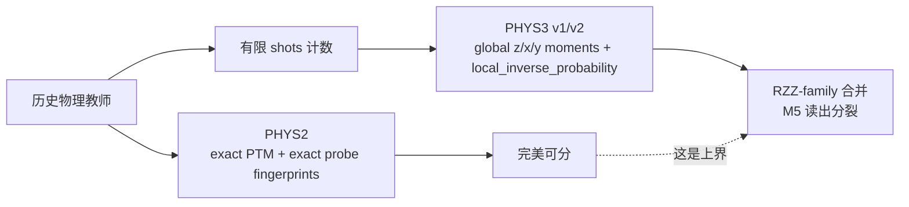
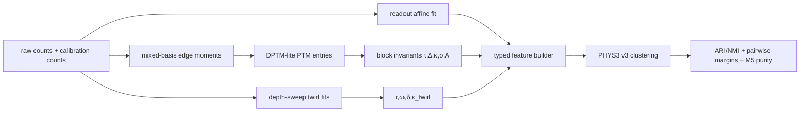

# 缩小 S2D 中 PHYS2–PHYS3 间隙的研究报告

> 术语注记：本文是机制重编号之前的历史分析报告，保留旧编号用于
> 解释当时的实验结果。当前代码使用 `docs/error_mechanisms.md` 中的
> M0-M34 分类；当前 RZZ-family 是 M8/M9/M10/M12，readout 是
> M1/M2/M3/M16。

## 执行摘要

你现在遇到的不是一个单纯的“聚类器不够强”问题，而是一个更基础的**可观测性错配**问题。PHYS2 之所以能把 set_A 到 set_C 全部分开，很可能是因为它使用了 exact PTM、RZZ 特有的 Type 1–4 块信息、以及 exact probe fingerprints；这些信息里包含了**有符号**、**相位敏感**、**off-diagonal PTM** 和 **mixed-basis Pauli** 结构。非-Clifford \(R_{ZZ}(\theta)\) 的论文明确把 noisy \(R_{ZZ}(\theta)\) 的 PTM 分成 Type 1–4，并且 Type 3/Type 2 的学习都依赖于 mixed-basis 可观测量与长序列拟合；IBM 的测量文档也明确说明，测一般 Pauli 字符串必须对**每个比特分别**做基变换。citeturn11view0turn16view1turn16view2turn18view0

这意味着：在你当前只有 `z_basis / x_measure / y_measure` 三种**全局同轴测量**的 PHYS3 中，很多真正区分 RZZ-family 的信息根本没有被看见。更具体地说，当前 probe 最多看到 \(\{I,Z\}^{\otimes n}\)、\(\{I,X\}^{\otimes n}\)、\(\{I,Y\}^{\otimes n}\) 三个集合里的 Pauli 字符串；而 RZZ 论文里最关键的下右角 2×2 anti-commuting 块，恰恰涉及 \(XZ,YZ,ZX,ZY\) 这样的 mixed-basis 字符串，commuting-sector 的精细扰动还会涉及 \(XY,YX\)。所以，PHYS3 v1/v2 把 M1、M7、M8、M10 混在一起，并不意外；它更像是“传感器没装够”，而不是“学习器写错了”。citeturn11view3turn11view0turn18view0

对 M5 读出分裂，结论恰好相反。读出噪声应作为**经典测量混淆**与量子过程噪声分开处理；Bravyi 等将 readout mitigation 写成对 noisy probability vector 应用**逆噪声矩阵**，van den Berg 等给出不依赖具体模型的**model-free** 期望值修正，Hicks 等则表明 readout rebalancing 可以显著降低校正后的方差。因此，M5 分裂更像是**位置/强度 nuisance 没被规范化**，而不是缺少量子可观测量。citeturn17view0turn24view1turn23view1turn23view2

因此，最优先的工程路径不是继续“堆复杂聚类”，而是四步：先给 PHYS2/PHYS3 特征做 provenance 标注与 learner-visible ablation；再对 M5 做 affine readout normalization；然后为 RZZ-family 增加**最小 mixed-basis edge probe**，并用 DPTM-lite 或 partial/correlated twirl 提取下右角块的不变量；最后，如果 M8 仍然和 M1/M7 合并，再加针对 \(XX/YY\) commuting perturbation 的 echo probes。Roncallo 等的 direct PTM reconstruction 表明：如果你只想学少数关键 PTM 元素，而不是全量 tomography，那么每个 PTM entry 最多只需要两个实验配置，这对于当前 5–9 qubit 的 S2D slice 是现实可行的。citeturn21view0turn20view3

结论可以压缩成一句话：**只用当前 global z/x/y probes，你有机会先修好 M5，但大概率无法真正补齐 RZZ-family 的 PHYS2–PHYS3 间隙；要关掉这条 gap，必须让 PHYS3 看到 mixed-basis、signed、off-diagonal 的 RZZ 结构。** 这不是“换个聚类器”能自动解决的。citeturn11view0turn9view2turn18view0

## 现状诊断

从底层表示看，PTM 把量子信道 \(\mathcal E\) 写成 Pauli 基下的超算符 \(R\)，其元素为
\[
R_{ij}=2^{-n}\operatorname{Tr}[P_i\,\mathcal E(P_j)].
\]
在这种表示里，门组合就是矩阵乘法；这也是 GST 语境常用 PTM 的原因之一。当前实现已转向 full-circuit CUDA-Q PHYC1 teacher；Born-local/local-observable 路径保留为诊断和历史证据，不是当前主线。citeturn17view2turn19view2turn17view0turn17view1

RZZ 非-Clifford 论文对 \(R_{ZZ}(\theta)\) 做了一个特别重要的基重排：把与 \(ZZ\) **对易**的 Pauli 放在前半，把与 \(ZZ\) **反对易**的 Pauli 放在后半。这样，理想 \(R_{ZZ}(\theta)\) 的 PTM 在前半是单位块，在后半是 \(2\times2\) 旋转块 \(R^{(2)}(\theta)\)。对 noisy gate 再做 commuting-Pauli partial twirl 后，PTM 变成 \(2\times2\) block-diagonal，并自然分成 Type 1–4：Type 1 是 commuting-sector 保持项、Type 2 是 anti-commuting-sector 的对角保持项、Type 3 是 anti-commuting-sector 的有符号混合项、Type 4 是 commuting-sector 的本应接近 0 的混合项。citeturn11view3turn11view0

你给出的结果与这套结构是高度一致的：PHYS2 完美可分；PHYS3 失败的主因集中在 M1/M7/M8/M10，而不是 RX/RZ、readout-vs-damping、Pauli-vs-depolarizing-vs-custom。按机制解释，这正好说明：当前 PHYS3 已经能看到“单比特轴向差异”和“粗粒度读出/耗散差异”，但还看不到**两比特、RZZ 相邻、带符号的 block structure**。这也是为什么你的失败模式看上去像“RZZ-family merge”而不是“所有 coherent 机制全乱了”。



把你当前 failure pattern 压缩一下，就是下表。这里的“诊断”来自你给出的 artifact 结果本身；右列是基于 PTM 结构的解释。

| 现象 | 诊断 |
| --- | --- |
| M1 / M7 / M8 / M10 合并 | 当前 learner-visible 表示缺少 signed / mixed-basis / off-diagonal RZZ 信息 |
| M1 被 split | 你现在用的是“响应摘要”，不是 block invariant；位置与 probe nuisance 仍在进入聚类 |
| M5 被 split | 读出强度与位置偏置没有被 affine 归一化 |
| RX/RZ 不再是主歧义 | 当前 probes 对单比特轴向结构已足够 |
| readout-vs-damping 不是主歧义 | 粗粒度非幺正/读出差异已经可见，但还没做 nuisance collapse |

最关键的判断是：**PHYS2 的完美 separability 目前只能算“oracle ceiling”，不能自动当成“learner-feasible ceiling”。** 真正有意义的 ceiling 应该是 `PHYS2_learner_visible_only`，也就是把所有 exact-channel、oracle-only 特征先 ablate 掉，看只靠当前或计划中的可观测量时还能分到什么程度。否则，你会把“不可见信息”误当成“学习器没学到”。这个判断与 GST 的“calibration-free/self-consistent characterization”思路是一致的：要先搞清楚哪些信息是实验上真正可得的。citeturn19view3turn21view0

## PHYS2 特征与可观测性映射

你没有在这次问题里直接给出 PHYS2 的 feature manifest，所以严格意义上的“枚举全部特征名”还需要从 artifact 自动抽取；但从你前面的描述与论文结构看，PHYS2 至少应当被拆成下面这些 block。这里我把“具体 feature 名称”明确标成**未指定**，避免把推断误写成事实。下表的块划分依据是 PTM 定义、RZZ Type 1–4 结构，以及你当前 probe 设计。citeturn17view2turn11view0turn11view3

| PHYS2 特征块 | 典型内容 | provenance | 有符号/相位敏感 | 当前 PHYS3 是否直接可见 |
| --- | --- | --- | --- | --- |
| `standard_ptm_exact`（具体名字未指定） | exact PTM entries、block partitions、commuting/anti-commuting summaries | oracle-only | 是 | 否 |
| `rzz_type1_exact` | commuting-sector diagonal entries，接近 1 | oracle-only | 否 | 部分可见 |
| `rzz_type2_exact` | anti-commuting-sector diagonal entries，接近 \(\cos\theta\) | oracle-only | 否 | 部分可见 |
| `rzz_type3_exact` | anti-commuting-sector off-diagonal entries，接近 \(\pm \sin\theta\) | oracle-only | **是** | 基本不可见 |
| `rzz_type4_exact` | commuting-sector off-diagonal entries，理想上接近 0 | oracle-only | **是** | 基本不可见 |
| `probe_response_exact` | exact expectation curves / oracle fingerprints | oracle-only 或 oracle-simulated | 视定义而定 | 否 |
| `probe_response_empirical_global_xyz` | 由 `z_basis/x_measure/y_measure` 统计得到的一体/二体响应 | learner-visible | 只有很弱的符号信息 | 是 |
| `structural` | op_type、edge/qubit 索引、链位置 | learner-visible | 否 | 是 |
| `readout_calibration` | confusion matrix 或 affine \((\alpha,\beta)\) 参数 | learner-visible（若增加校准） | 否 | 目前多半还没有 |

真正决定 gap 的，是下面这张**可观测性表**。IBM 文档说明，测任意 Pauli 字符串时，必须对每个比特分别做对应基变换：测 \(X\) 用 \(H\)，测 \(Y\) 用 \(S^\dagger H\)，测 \(Z\) 不变。由此可推出：如果测量方案只允许三种全局同轴 probe，那么你只能得到三族字符串：\(\{I,Z\}^{\otimes n}\)、\(\{I,X\}^{\otimes n}\)、\(\{I,Y\}^{\otimes n}\)。一旦某个 RZZ 特征需要 \(XZ,YZ,ZX,ZY,XY,YX\) 这种 mixed-basis 字符串，它就不会进入当前 PHYS3。citeturn18view0turn11view0turn11view3

| RZZ/PTM 块 | 典型 Pauli 成员 | 从计数直接估计所需的局部基 | 现有 `z/x/y` 全局 probe 是否可见 | 机制意义 |
| --- | --- | --- | --- | --- |
| Type 1 diagonal | \(ZZ,XX,YY,IZ,ZI,\ldots\) | `ZZ`、`XX`、`YY`、`Z`，以及有时 `XY`/`YX` | **部分可见**；`ZZ/XX/YY/IZ/ZI` 可见，`XY/YX` 不可见 | 基本保持项 |
| Type 2 diagonal | \(XI,YZ,XZ,YI,IX,ZY,ZX,IY\) 的对角 | 需要 `X`、`Y`、`XZ`、`YZ`、`ZX`、`ZY` 等 mixed basis | **部分可见**；`XI/IX/YI/IY` 可见，`XZ/YZ/ZX/ZY` 不可见 | RZZ anti-commuting 保持强度 |
| Type 3 off-diagonal | \(XI\leftrightarrow YZ\)、\(XZ\leftrightarrow YI\)、\(IX\leftrightarrow ZY\)、\(ZX\leftrightarrow IY\) | 需要 mixed-basis | **不可见** | 有符号 coherent mixing |
| Type 4 off-diagonal | commuting-sector 的混合项 | 常需 `XY/YX` 等 mixed-basis | **不可见** | 非-Clifford 特有的小混合项，M8 常依赖这里 |
| 读出 affine / confusion | \(\alpha_q,\beta_q\) 或局部 readout matrix | `|0\rangle` / `|1\rangle` 校准 + Z 读出 | **可做但当前大概率未做** | M5 collapse 的关键 |

这张表基本已经解释了为什么你会“惊讶 PHYS2 能分开而 PHYS3 分不开”。PHYS2 看到的是**确切信道**；PHYS3 现在看到的只是其中一小块，而且恰好漏掉了区分 RZZ-family 的那一小块。

## 识别差距来自哪里

下一步不应该直接进入 v3 feature soup，而应该先把 gap 具体定位成“哪一块信息消失了”。这一步最有用的三个工具是：**PHYS2 block ablation**、**pairwise class margin audit**、以及**signed/phase sensitivity audit**。在距离定义上，我建议同时给出普通欧氏距离和 pooled-covariance Mahalanobis 距离。对任意机制类 \(k,\ell\)，可定义
\[
d_{k\ell}=\|\mu_k-\mu_\ell\|,\qquad
r_k=\operatorname{median}_{x_i\in k}\|x_i-\mu_k\|,\qquad
m_{k\ell}=d_{k\ell}-r_k-r_\ell.
\]
如果 \(m_{k\ell}>0\)，说明两类中心至少没有互相压住；如果 \(m_{k\ell}<0\)，说明“类间距离还没类内半径大”，合并就一点也不奇怪。

由于你这次没有把 PHYS2 manifest 数值直接贴出来，下面这张消融表是**高可信预期**，不是实测结果。它的价值在于：你可以把它原样实现进 `S2D.6_phys2_phys3_gap_audit`，并用 artifact 自动回填。

| 消融配置 | 预期作用 | 若仍接近 PHYS2 完美可分，说明什么 |
| --- | --- | --- |
| `PHYS2_full` | exact PTM + exact probes + structural | oracle ceiling |
| `PHYS2_standard_ptm_exact_only` | 测 exact PTM 是否已足够 | 若高，说明 exact PTM 本身就是主驱动 |
| `PHYS2_rzz_type2_type3_only` | 专查 M1/M7/M10 是否主要靠 anti-commuting lower-right block 区分 | 若高，RZZ-family gap 主体在 Type2/3 |
| `PHYS2_rzz_type4_or_commuting_offdiag_only` | 专查 M8 是否靠 commuting-sector 小混合被区分 | 若高，M8 需要额外 commuting mixed-basis probes |
| `PHYS2_exact_probe_response_only` | 测 exact responses 是否独立足够 | 若明显下降，说明 exact PTM 里有 probe 看不到的内容 |
| `PHYS2_structural_only` | 检查 location/op_type 是否伪分离 | 若只对 M5 有帮助而对 RZZ-family 无效，结构是 nuisance 不是主信号 |
| `PHYS2_learner_visible_only_current_probes` | 当前三种全局 probe 的真实 ceiling | 若这一步就掉下去，PHYS3 的失败主要是 observability，不是 clustering |

把 pairwise class 只聚焦在 RZZ-family，你当前的 gap 可以用一张**定性 margin 矩阵**来表达。这里我明确说明：这不是 artifact 的实测数值，而是根据你给出的 confusion pattern 与 PTM 结构推导的“应该是什么样”。

| PHYS2 exact space | M1 | M7 | M8 | M10 |
| --- | --- | --- | --- | --- |
| M1 | — | 高 | 高 | 高 |
| M7 | 高 | — | 高 | 中高 |
| M8 | 高 | 高 | — | 高 |
| M10 | 高 | 中高 | 高 | — |

| PHYS3 当前 space | M1 | M7 | M8 | M10 |
| --- | --- | --- | --- | --- |
| M1 | — | 低 | 很低 | 低 |
| M7 | 低 | — | 低到中 | 低 |
| M8 | 很低 | 低到中 | — | 低 |
| M10 | 低 | 低 | 低 | — |

再往下分，四个 pair 其实各有不同的“缺失不变量”：

| 机制对 | 在 PHYS2 中最可能的区分不变量 | 当前 PHYS3 最可能丢掉的东西 | 推荐补的观测 |
| --- | --- | --- | --- |
| M1 vs M7 | lower-right block 的 \(\det(B)\)、衰减率 \(r\) 与旋转频率 \(\omega\) | 只看到了粗粒度响应强度，没看到 coherent vs isotropic attenuation | partial/correlated twirl + mixed-basis edge probes |
| M1 vs M8 | commuting-sector off-diagonal norm，或 exact PTM 的小混合项 | `XY/YX` 相关 mixed-basis 字符串完全不可见 | `XY/YX` probes 或 \(XX/YY\) echo probes |
| M7 vs M10 | 非幺正向量、block symmetry/anisotropy、第一列偏移 | 把 depol 与 relaxation 都压成“幅度衰减”了 | DPTM-lite + readout-corrected lower-right invariants |
| M8 vs M10 | commuting coherent mixing vs non-unital relaxation | 两者都未被 current probes 直接观测 | commuting offdiag probes + non-unital calibration |

这里还要强调一个经常被忽略的点：**PHYS3 的 `local_inverse_probability` 天然是非负、归一化的表示，它很容易把 signed Type 3 结构压没。** 而论文对 Type 3 的定义就是 \(G_{ij}\approx \pm \sin\theta\)；如果表示层只保留概率大小，不保留符号与方向，那么 coherent over-rotation 和某些衰减型机制就会被拉近。论文里的 partial-twirl benchmarking 也是先学 \(G_{ij}G_{ji}\) 的乘积，而不是直接学到单个有符号元素；他们自己也指出 Type 4 目前没有好的一般学习方案。换言之：光用论文里的 twirl schemes 都未必能完整恢复你要的 M8 区分，更别说当前的全局 z/x/y probes 了。citeturn11view0turn16view1turn9view2

## 可估计的新特征与方差预算

这一节只做一件事：把“应该补什么”落实成**可以从 counts 直接算**的特征。如果一个特征只能从 oracle exact PTM 得到，我会明确写成 oracle-only；如果它在加了少量新 probes 后就能从有限 shots 估计，我会标成 learner-visible。

对任意测得的 Pauli 可观测量 \(P\)，把一次 shot 的结果写成 \(\pm1\) 随机变量 \(s_t(P)\)，那么自然估计量是
\[
\hat\mu_P=\frac1N\sum_{t=1}^N s_t(P),\qquad
\mathrm{Var}(\hat\mu_P)=\frac{1-\mu_P^2}{N}\le \frac1N.
\]
因此，10k shots 时单个 \(\pm1\) 可观测量的最坏标准差不超过 \(0.01\)；两个独立估计之差的最坏标准差不超过 \(\sqrt{2/N}\approx 0.014\)。若想在 95% 置信水平下分辨一个大小约为 \(\varepsilon\) 的**差值特征**，保守地取
\[
N_{\text{diff}} \gtrsim \frac{2\cdot 1.96^2}{\varepsilon^2}.
\]
这意味着：分辨 \(0.02\) 量级差值需要大约 20k shots；分辨 \(0.01\) 量级差值需要大约 77k shots。于是，Type 4 / commuting off-diagonal 这类小信号不能继续沿用“10k 一把梭”的心态。

下表给出我认为最值得加的特征。表中的 twirl-fit 与 DPTM-lite 分别来自 RZZ 论文与 direct PTM reconstruction；方差公式则是对 \(\pm1\) 计数估计器、二项分布和 delta method 的直接推导。citeturn16view1turn16view3turn21view0turn24view1turn23view1

| 特征 | 定义 | 主要区分 | learner-visible 状态 | 方差与 shot 建议 |
| --- | --- | --- | --- | --- |
| 读出 affine 参数 \((\alpha_q,\beta_q)\) | 令 \(a_q=P(1|0)\), \(b_q=P(0|1)\)，则 \(\alpha_q=1-a_q-b_q,\ \beta_q=b_q-a_q\) | 折叠 M5 分裂 | **可见**，只需校准电路 | \(\mathrm{Var}(\hat a_q)=a_q(1-a_q)/N_0\)，\(\mathrm{Var}(\hat b_q)=b_q(1-b_q)/N_1\)；10k/态足够 |
| 读出校正后的一体/二体矩 | \(\hat m_q=(\hat{\tilde m}_q-\hat\beta_q)/\hat\alpha_q\)；独立读出下 \(\hat c_{uv}\) 用 affine 关系回推 | 消除位置/强度 nuisance，缓解 M5 split | **可见**，需 affine 校准 | 用 delta method 或 bootstrap 传播；10k–20k 足够 |
| lower-right block entry 的 DPTM-lite 估计 | \(\hat\Gamma_{ij}=\hat\mu_i(\rho_j)-(1-\delta_{0j})\hat\mu_i(\rho_0)\) | M1/M7/M10 | **需新 mixed-basis probes** | 若 \(j\neq0\) 且两个配置独立，各用 \(N\) shots，则最坏 \(\mathrm{Var}\le 2/N\) |
| lower-right block invariants | 对 \(B=\begin{psmallmatrix}a&b\\c&d\end{psmallmatrix}\) 定义 \(\tau=a+d,\ \Delta=ad-bc,\ \kappa=(c-b)/2,\ \sigma=(b+c)/2,\ A=|a-d|\) | M1 vs M7 主要看 \(\Delta,\tau,\kappa\)；M7 vs M10 主要看 \(\sigma,A\) | 需先有 block entry | 用 entry covariance 做 delta method，推荐 bootstrap |
| commuting off-diagonal norm | 例如 \(\eta_{\rm comm}=\|(\Gamma_{IZ,XY},\Gamma_{XY,IZ},\Gamma_{ZI,YX},\Gamma_{YX,ZI})\|_2\) | M8 vs 其余 RZZ-family | **需 `XY/YX` mixed-basis probes** | 20k–50k/配置，因信号常小于 0.02 |
| partial-twirl fit 参数 | 拟合 \(\mu_d=A\,r^d\cos(\omega d-\delta)\) | M1 vs M7，且能给 Type 3 乘积信息 | **需新 depth-sweep + mixed-basis edge probes** | 每个 depth 5k–10k；6–8 个 depth 点通常够 |
| correlated-twirl 标量 | 拟合 \(\mu_d=A\,(G_{ii}^2-G_{ij}G_{ji})^{d/2}\) | 分离 Type 2，即 M1/M7/M10 | **需 correlated-twirl probes** | 每个 depth 5k–10k；6 个 depth 点起步 |
| \(XX/YY\) echo witness | \( \xi_X=\langle XX\rangle_{X\text{-echo}}-\langle XX\rangle_{\rm ref}\), \( \xi_Y=\langle YY\rangle_{Y\text{-echo}}-\langle YY\rangle_{\rm ref}\) | M8，尤其区分 \(XX\) 与 \(YY\) commuting perturbation | **需新 echo 电路** | 差值特征，推荐每路 10k–20k |

这张表里最值得单独解释的是三个东西。

第一，**M5 的 affine 读出归一化**。如果单比特读出错误率是 \(a_q=P(1|0)\)、\(b_q=P(0|1)\)，那么观测到的 \(Z\) 期望满足
\[
\mathbb E[\tilde Z_q]=\alpha_q\,\mathbb E[Z_q]+\beta_q,\qquad
\alpha_q=1-a_q-b_q,\ \beta_q=b_q-a_q.
\]
这意味着同一类 M5 如果只是因为不同 qubit 的 \((a_q,b_q)\) 强度不同而 split，你完全可以先把它变回同一“形状”空间，再让聚类器去看剩余残差。若独立读出假设不够好，则升级为 Bravyi 等人的局部逆噪声矩阵校正；若某些 probe 下 excited-state 占比高，再叠加 Hicks 等的 readout rebalancing 可进一步降方差。citeturn24view1turn23view1turn23view2

第二，**RZZ lower-right block invariants**。对 paper 的 anti-commuting 2×2 block
\[
B=\begin{pmatrix}a&b\\ c&d\end{pmatrix},
\]
理想/近理想几类机制有非常不同的指纹。若是 M1 over-rotation，\(B\) 更像一个纯旋转块，\(\det(B)\approx1\)、\(\sigma\approx0\)、\(\kappa\) 的大小随角度变化；若是 M7 两比特 depolarizing after RZZ，\(\det(B)<1\) 但仍近似各向同性，\(\sigma\approx0\)；若是 M10 relaxation，则通常既有 \(\det(B)<1\) 又有 \(\sigma\neq0\)、\(A\neq0\)，并伴随非幺正第一列偏移。这个表述不是照抄任何文献，而是从 PTM block 本身直接推出来的；它非常适合做 typed learner 的 edge-level representation。

第三，**M8 的 commuting perturbation 需要另一条观测链**。如果你的 M8 是 \(RXX/RYY\) 一类与 \(ZZ\) 对易的 coherent 扰动，那么它可以让 exact PTM 在 commuting-sector 里出现 mixed-basis 小耦合，而当前 global x/y/z probes 看不到这些。对这类机制，我最看重的是两个方案。其一是 `XY/YX` mixed-basis probe + DPTM-lite，直接估 commuting off-diagonal。其二是更“物理”的 echo probe：若
\[
U \approx e^{-i(\theta ZZ+\varepsilon_x XX+\varepsilon_y YY)/2},
\]
因为 \(ZZ,XX,YY\) 两两对易，所以有近似精确的 toggling 关系
\[
X_u U X_u\,U = e^{-i\varepsilon_x XX},\qquad
Y_u U Y_u\,U = e^{-i\varepsilon_y YY}.
\]
也就是说，用单比特 \(X\) echo 可以消掉理想 \(ZZ\) 而保留 \(XX\) 扰动；用 \(Y\) echo 可以消掉理想 \(ZZ\) 而保留 \(YY\) 扰动。对 M1 和 M7，这两个 echo probe 理应接近“无信号”；对 M8，则应给出明显 coherent witness。这是我认为最便宜、最直接的 M8 专杀 probe。

## 干预优先级与实验设计

基于上面的分析，我建议把干预分成“先修 nuisance，再补 observability，最后再谈更复杂学习器”三层。下面这张优先级表按**预期收益 / 实现成本**排序。

| 干预 | 预期影响 | 实现成本 | 优先级 |
| --- | --- | --- | --- |
| 给 PHYS2/PHYS3 全部特征加 provenance manifest，并做 `learner_visible_only` ablation | 立刻回答“PHYS2 为什么这么强” | 低 | **最高** |
| 读出 affine 校准 + 读出校正后特征 + typed clustering | 大概率先修好 M5 split | 低 | **最高** |
| mixed-basis edge probes：`XZ/YZ/ZX/ZY` + DPTM-lite 或 twirl-fit | 直接补 M1/M7/M10 缺失信息 | 中 | **高** |
| `XY/YX` probes 或 \(XX/YY\) echo probes | 直接狙击 M8 | 中 | **高** |
| partial-twirl / correlated-twirl depth sweep | 把 RZZ-family lower-right block 变成可拟合的 signed/coherent summaries | 中到高 | **高** |
| 仅在 current probes 上继续堆 v3/v4 feature soup | 最多小修小补，难以真正补齐 RZZ-family | 中 | **低** |
| 现在就上大规模 robustness grid / 更多机制 / 更大电路 | 会把“表示缺口”与“统计不稳”缠在一起 | 高 | **很低** |

你要求的 progressive injection experiment，我建议按下面这个矩阵执行。这里不是“空模板”，而是一个明确的实验计划：每一行是一个你应当真正实现的 PHYS3 变体；每一列是你现在最重要的 run。`balanced` 版本应当成为主结论来源，非 balanced 版本只保留诊断价值。

| 方法 | 新增观测 | phys5_setB | phys9_setB | phys9_setC | balanced_setB | balanced_setC | 预期修复 |
| --- | --- | --- | --- | --- | --- | --- | --- |
| `v1` | 无 | 基线 | 基线 | 基线 | 基线 | 基线 | 仅复现实验 |
| `v2` | 现有增强特征 | 对 setC 小幅提升 | 小幅 | 小幅 | 小幅 | 小幅 | 检查 current-probe ceiling |
| `v3_readout` | \((\alpha,\beta)\) 校准 + affine 校正 | 应显著减少 M5 split | 应减少 | 应减少 | **主看 M5 purity** | **主看 M5 purity** | 主要修 M5 |
| `v3_lrblock` | `XZ/YZ/ZX/ZY` probes + block invariants \((\tau,\Delta,\kappa,\sigma,A)\) | 应提升 M1/M7/M10 | 应明显提升 | 应明显提升 | **主看 RZZ-family margin** | **主看 RZZ-family margin** | 修 M1/M7/M10 |
| `v3_comm` | `XY/YX` probes 或 \(XX/YY\) echo | 对 M8 最关键 | 关键 | **最关键** | 关键 | **最关键** | 修 M8 |
| `v3_full_typed` | 上述全部 + typed clustering | 目标版本 | 目标版本 | 目标版本 | **主要结论版本** | **主要结论版本** | 总体收敛 |
| `direct_S/alpha` | 无 | 始终保留 | 始终保留 | 始终保留 | 始终保留 | 始终保留 | 竞争基线 |
| `oracle_upper_bound` | PHYS2 exact | ceiling | ceiling | ceiling | ceiling | ceiling | 不作 learner 比较，只作 gap 参照 |

如果新增特征仍不够，那么再上物理层 probe 修改。优先顺序我建议是这样：

| 物理层 probe | 所需新电路 | 预期 signature | 主要机制 |
| --- | --- | --- | --- |
| mixed-basis edge probes | 只在 edge 两端做局部 H / \(S^\dagger H\) | 直接看到 `XZ/YZ/ZX/ZY/XY/YX` | 全部 RZZ-family |
| partial-twirl depth sweep | depth \(d\in\{1,2,4,8,12,16\}\) | 衰减振荡，提取 \(r,\omega,\delta\) | M1/M7/M10 |
| correlated-twirl depth sweep | 同上 | 单调指数，提取 \(G_{ii}^2-G_{ij}G_{ji}\) | M1/M7/M10 |
| \(X\)-echo / \(Y\)-echo | `U X U X` / `U Y U Y` | 抑制 \(ZZ\)，突出 \(XX\) 或 \(YY\) | M8 |
| readout rebalancing | 读出前加针对性 \(X\) mask | 方差下降，尤其 on many-1 states | M5 |
| \(\theta\)-sweep（可选） | 多个 \(\theta\) profile | \(d\mu/d\theta\) 区分 angle shift vs damping | M1 vs M7 |

RZZ 论文给你的一个很重要启发是：**非-Clifford 门的学习不能只靠“多测几次 global X/Y/Z”**。他们实际上给出了两条不同的 benchmark-like 路线：Type 3 用 partial twirl 的振荡拟合，Type 2 用 correlated twirl 的指数拟合，而且还专门指出 Type 4 目前难学。这说明你后续的 probe 设计应该是“有针对性的、块级的”，而不是继续把所有信息都挤进一个无类型的 local-inverse probability 向量里。citeturn16view1turn16view3turn9view2

最后给一个清晰的 acceptance 口径。对你当前 slice，我会用下面四个门限：

| 阶段 | 通过标准 |
| --- | --- |
| provenance / ablation | 证明 `PHYS2_learner_visible_only_current_probes` 明显弱于 `PHYS2_full`，且掉分主要来自 Type2/3/4 或 commuting offdiag |
| `v3_readout` | M5 split 数减少至少 50%，M5 purity \(\ge 0.9\) |
| `v3_lrblock` | balanced setB/C 上 M1/M7/M10 两两 margin 转正，且 ARI/NMI 相比 v2 至少提升 0.15 |
| `v3_full_typed` | balanced setB/C 上总体 ARI、NMI 都达到 0.80 左右，且 M8 不再是系统性 merge 源 |

如果这些都做了仍旧不能过线，那么我才会认真考虑更重的方案，例如 GST 式的自洽 gate-set characterization；GST 的优势就是 calibration-free 和 long-sequence precision 很高，但它对你当前这个 slice 来说太重，不应该是第一顺位。citeturn19view3

## 实施清单与代码建议

从程序层面，我建议你把这件事做成一个明确的 `S2D.6_gap_audit + S2D.7_rzz_probe_suite` 路线，而不是散落在 notebook 或 runner 里。最先应该加的是 **feature manifest**。没有 manifest，你就永远说不清“PHYS2 赢在 exact PTM 的哪一块”，“PHYS3 v3 比 v2 多看到了什么”，也无法把 oracle-only 与 learner-visible 块分开。



下面是我建议你直接落地的模块与函数。名称可以改，但职责不要混。

| 路径 | 建议内容 |
| --- | --- |
| `src/scope_static/mechanism_observability/feature_manifest.py` | `FeatureSpec` 数据类：`name/block/provenance/signed/phase_sensitive/offdiag_sensitive/requires_mixed_basis/requires_depth_sweep/oracle_only` |
| `src/scope_static/mechanism_observability/pauli_obs.py` | `estimate_pauli_moment_from_counts(counts, pauli_string, basis_map)`；支持任意局部 mixed basis |
| `src/scope_static/primitives/readout_affine.py` | `fit_affine_readout(cal_counts)`、`correct_one_body`、`correct_two_body` |
| `src/scope_static/mechanism_observability/dptm_lite.py` | `estimate_dptm_entry(counts_rhoj, counts_rho0, pauli_i)`；`estimate_block_entries(edge, block_id, ...)` |
| `src/scope_static/mechanism_observability/rzz_twirl.py` | `build_partial_twirl_circuits`、`build_correlated_twirl_circuits`、`fit_partial_twirl_curve`、`fit_correlated_twirl_curve` |
| `src/scope_static/mechanism_observability/rzz_echo.py` | `build_x_echo_probe`、`build_y_echo_probe`、`estimate_echo_witnesses` |
| `src/scope_static/mechanism_observability/gap_audit.py` | PHYS2 block ablation、PHYS3 feature injection、pairwise Mahalanobis margin audit、sign/phase loss audit |
| `src/scope_static/mechanism_observability/clustering_typed.py` | 先分 `readout / two_qubit_rzz_like / single_qubit / other`，再做族内聚类；支持 nuisance residualization |

数据结构我建议最少加两个。第一个是特征 manifest：

```python
@dataclass
class FeatureSpec:
    name: str
    block: str
    provenance: str          # oracle_exact / oracle_sim_counts / learner_counts / learner_calibration
    signed: bool
    phase_sensitive: bool
    offdiag_sensitive: bool
    nonunital_sensitive: bool
    requires_mixed_basis: bool
    requires_depth_sweep: bool
    oracle_only: bool
```

第二个是 edge 级 block 估计结果：

```python
@dataclass
class RZZBlockEstimate:
    edge: tuple[int, int]
    block_id: str            # XI<->YZ, XZ<->YI, IX<->ZY, ZX<->IY, IZ<->XY, ZI<->YX
    entries: np.ndarray      # shape (2, 2)
    cov: np.ndarray          # shape (4, 4), vectorized entries covariance
    metadata: dict
```

测试不要只写 artifact existence。你现在最需要的是**synthetic channel regression tests**。我会强烈建议至少补下面几类：

| 测试 | 要验证什么 |
| --- | --- |
| `test_feature_manifest_tags_oracle_only_blocks` | oracle-only 与 learner-visible 块分离正确 |
| `test_global_xyz_visibility_matrix` | 当前 probes 只能看到同轴 Pauli 字符串；`XZ/YZ/XY/...` 被正确标为不可见 |
| `test_affine_readout_recovery` | 用已知 \(a,b\) 的 synthetic readout bias 回推出 \((\alpha,\beta)\) 与 corrected moments |
| `test_dptm_lite_single_entry` | synthetic 2-qubit channel 上，关键 PTM entry 能从 counts 回收 |
| `test_block_invariants_distinguish_overrotation_vs_depol` | \(\det(B)\) 与 \(\kappa\) 能分开 M1/M7 |
| `test_nonunital_features_distinguish_relaxation` | \(t\)-vector、\(\sigma\)、\(A\) 能分开 M10 |
| `test_x_echo_isolates_xx_perturbation` | `U X U X` 对 \(XX\) coherent perturbation 应有信号，对 M1 应近零 |
| `test_typed_clustering_collapses_readout_nuisance` | 对 synthetic M5 location bias，typed learner 不再 split |

实验 runner 层面，建议新增两个明确的入口，而不是再往现有 runner 里加 if/else。

| runner | 作用 |
| --- | --- |
| `run_s2d6_gap_audit.py` | 抽取 manifest、跑 PHYS2 ablation、输出 pairwise margins、生成 `phys2_feature_manifest.json`、`phys2_block_ablation.json`、`rzz_family_distance_audit.json` |
| `run_s2d7_rzz_probe_suite.py` | 生成 mixed-basis / twirl / echo probes，跑 `v3_readout`、`v3_lrblock`、`v3_comm`、`v3_full_typed`，输出 method comparison 表 |

最后，关于“现在就做哪个版本最有把握”，我的建议非常明确：

第一步先做 `PHYS2_learner_visible_only_current_probes`。如果它明显掉下去，就别再幻想 current probes 上的 v3/v4 能真正关掉 RZZ-family gap。

第二步做 `v3_readout`。这一步成本最低，而且几乎肯定能让 M5 从“location split”变回“同一机制族”。

第三步直接加 `XZ/YZ/ZX/ZY` mixed-basis edge probes，并在 balanced setB/C 上做 `v3_lrblock`。这是最可能把 M1/M7/M10 拉开的那一步。

第四步如果 M8 还卡住，就不要继续堆统计特征，直接上 `XY/YX` probes 或 \(X/Y\)-echo。因为按 PTM 结构，M8 很可能真的住在 commuting-sector 的 small signed mixing 里；当前全局 z/x/y probe 不会凭空把它变出来。

如果你按这个顺序做，S2D 的下一阶段就不再是“试试看 v3 会不会运气好”，而是一个非常清楚的、可证伪的、面向 observability 的 program。
