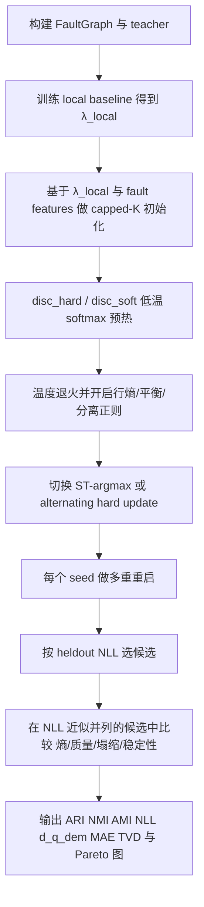

# 改善 Stage 2A 商数恢复的研究报告

## Status note

This report is a proposal for improving quotient recovery after the current
Stage 2A free-assignment test. It should not be read as the current Stage 2A
contract.

Some implementation-status statements below were written against an older repo
snapshot. For current implementation status, use `docs/SCOPE_STATIC_DISC.md`,
`configs/scope_static/d3_r1_STAGE2A_full.yaml`, and the emitted Stage 2A
metrics artifacts.

Use the terminology from `docs/SCOPE_STATIC_DISC.md`:

- **Stage 2A.0** is the current implemented synthetic identifiability test:
  free per-fault `S[j,k]`, random restarts, ARI/NMI, collapse/dead-prototype
  audits, and `delta_nll_known_orbit` against matched known-orbit oracles.
- **Stage 2A.1** is a proposed hardening study: local-logit initialization,
  temperature annealing, hard or straight-through assignments, prototype
  balance/separation penalties, and stricter `disc_soft` residual control.

The current Stage 2A.0 result can be recovery-negative even if likelihood is
good. Any Stage 2A.1 method must remain synthetic-first and must not use hidden
`omega(j)` in the learner, initializer, feature selection, or training objective.

## 执行摘要

基于你仓库当前公开可见的文档与源码，`scope_static` 目前已经实现了固定上下文的 DEM/Bernoulli fault-logit 学习栈，Stage 2 的正式问题被定义为：在保持 Stage 1 同一 DEM 奇偶映射似然不变的前提下，不再把隐藏轨道映射 `omega(j)` 直接给学习器，而是让模型通过学习赋值矩阵 `S[j,k]` 来发现 DEM-fault 层面的共享结构；Stage 2A 的主张边界也明确要求先在 synthetic teacher 上验证恢复能力，再进入 Google 数据的外部验证。与此同时，当前 `fields.py` 的工厂仍只暴露 `local`、`hard_orbit`、`soft_feature_orbit` 与 `dmle_qec`，`training.py` 已具备统一的 Adam 训练入口与 `regularization_loss()` 钩子，`metrics.py` 也已经有 `delta_nll_oracle`、`detector_rate_mae`、`local_correlation_error` 与按 seed 汇总阈值的基础设施，这意味着 Stage 2A 的最佳落地方向不是重写训练栈，而是在现有 field/objective/runner 之上新增“可硬化的发现式赋值层”和相应审计。citeturn13view0turn4view0turn8view0turn9view2turn39view1

就理论与实践结合后的判断而言，**你目前 Stage 2A 商数恢复不佳的核心原因，不是“模型不会拟合”，而是“自由软赋值的似然表示并不天然唯一”**。有限混合模型通常只在标签置换意义下可辨识，而且往往只是“generic identifiability”；一旦允许自由的软分配、过多原型、弱分离或极不平衡的簇质量，就会出现观测分布几乎相同、但 `S` 与原型参数完全不同的多组表示。MoE 理论文献也表明，softmax gating 与专家参数之间存在复杂耦合，强可辨识性需要额外条件；而混合模型的总体似然面还存在糟糕局部极值和过拟合冗余分量的问题。换言之，**“heldout NLL 很好但 ARI/NMI 很差”并不矛盾，它正是 Stage 2A 失败模式本身**。citeturn16academia0turn17academia0turn24academia0turn24academia3turn18academia2turn18academia3

因此，本报告给出的主建议非常明确：**Stage 2A 不应再把 `free-table softmax S` 当作主力结论模型，而应改为“硬化优先”的恢复路线**。最优先尝试的顺序是：先用 `local` 预拟合得到 `\hat\lambda_local` 作为初始化，再做 capped-`K` 的原型初始化，然后采用“低温 softmax 预热 → 交替硬赋值/straight-through 硬化 → 轻量平衡与分离正则 → 多重重启筛选”的训练方案；`disc_soft` 应保留，但在 Stage 2A 中只作为“预测增强”的次级模型，而不是主恢复结论模型。只有当 `disc_hard` 或“近硬”的 `disc_soft` 在 synthetic 上稳定恢复 `omega(j)` 时，才值得再往 Stage 4 的上下文条件化赋值 `S_\psi(c)` 推进。citeturn4view0turn45academia0turn20academia2turn20academia3turn34view0turn27academia0

下表先给出最简洁的结论版建议。表中的排序是我对“提高商数恢复成功率”的优先级判断，而不是对“提升 heldout NLL”的优先级判断。这个排序综合了混合模型可辨识性、MoE gating 理论、Gumbel/ST 文献、以及你仓库现有实现边界。citeturn16academia0turn24academia3turn45academia2turn34view1turn4view0

| 建议 | 结论 | 对恢复 `omega(j)` 的预期作用 |
|---|---|---|
| 将 `disc_hard` 训练主线改成“低温预热 + 硬化收敛” | 强烈建议 | 最大；直接压缩软分解自由度 |
| 用 capped `K` 而不是默认 `K=O` 或很大的 `K` | 强烈建议 | 很大；减少复制原型与空原型退化 |
| 从 `local` logits 做原型初始化，而不是纯随机初始化 | 强烈建议 | 很大；显著降低落入坏局部极值的概率 |
| 增加“行熵惩罚 + 轻量质量平衡 + 原型分离”三件套 | 强烈建议 | 很大；分别对应硬化、抗塌缩、抗复制 |
| 将 `disc_soft` 限定为小残差、稀疏残差 | 建议 | 中等到很大；防止 soft residual 吞掉商数信号 |
| ARI 作为主评估、NMI 作为辅评估，最好加 AMI | 建议 | 中等；避免被 NMI 的 chance bias 误导 |
| `S_\psi(c)` 的 NN 条件化版本放到第二阶段 | 建议 | 中等；太早上 NN 更容易先学会记忆而不是恢复 |
| Stage 2A 接受标准加入“熵、质量、塌缩率、跨重启稳定性” | 强烈建议 | 很大；防止只看 NLL 的假阳性 |

## 理论诊断

Stage 2A 的数学难点最好分成两个层次。**第一个层次**是“从观测 `y` 恢复 fault logits `\lambda` 是否可行”；你的 Stage 2 文档明确规定仍使用 Stage 1 的 DEM 奇偶映射似然，并在小系统上允许 global exact，在大系统上走 local-window exact 路径，同时还能从稀疏支撑直接计算 detector rate 与局部 pair correlation 误差。**第二个层次**才是“即便 `\lambda` 已经估得很好，` \lambda_j = \sum_k S_{jk}\alpha_k ` 这个分解是否唯一、是否会对齐隐藏 `omega(j)`”。对 Stage 2A 来说，真正经常失败的是第二层。换句话说，`NLL` 接近 oracle 只能说明“存在某种好表示”，不能说明“这个表示恰好就是隐藏商数”。这也是你文档里为什么明确写了 Stage 2A 的成功必须同时满足 partition recovery 与 predictive quality 两个轴。citeturn4view0turn39view1turn39view2

从统计理论看，有限混合模型通常只在**置换不变**意义下可辨识；更严格地说，Allman、Matias、Rhodes 给出的结果强调多类 latent-structure 模型往往只有 generic identifiability，而不是全局、无条件的逐点唯一性。对有限 product-measure mixture，Tahmasebi 等进一步把“可分离变量”的存在数量与可辨识性联系起来：需要足够多、足够区分不同成分的观测坐标，模型才会从观测分布唯一反推出成分结构。你这里的情形虽然不是标准的 Bernoulli product mixture，但结论有强烈类比意义：**如果不同隐藏轨道在你可见的 DEM 统计签名上分得不够开，那么 `S` 的恢复本来就会比 NLL 拟合难得多**。citeturn16academia0turn17academia0

对 softmax-gated MoE，近期理论工作也说明了类似问题。Nguyen 等关于 softmax-gated multinomial logistic MoE 的分析指出，softmax gate 与 expert 参数之间会发生耦合，从而拖慢甚至破坏参数估计；他们专门引入了“strong identifiability”等条件来区分哪些专家族更容易稳定恢复。换到你的记号里，这意味着：**只要 `S` 太软、原型太接近、`K` 过大、或门控参数化过强，`S` 与 `\alpha` 间就会形成“似然几乎不变但分解不同”的平坦谷与等价类**。这正是 `disc_hard` 能逼近 oracle NLL、却不一定恢复隐藏商数的理论原因。citeturn24academia0turn24academia3turn48academia1

这也解释了为什么**原型分离**与**轨道质量平衡**会显著影响恢复成功率。Kearns、Mansour、Ng 的分析表明，hard/soft assignment 方法在“簇重叠”和“簇质量熵”之间有系统性差异：hard assignment 往往更偏好低重叠、清晰分界的簇，而 soft EM 更容易接受重叠结构。对你的 Stage 2A，这意味着若真实 `omega(j)` 的轨道内 logit 差异本来小、不同轨道的 prototype logit 又相近，那么 soft 赋值几乎必然把多个真轨道揉成统计上等价的软组合；而若某些真轨道非常小，它们也更容易在训练中被大轨道吞没或被解释成残差噪声。citeturn45academia2turn41academia0turn41academia2

还要特别强调两个经典退化。第一是**标签置换**：即便恢复成功，簇标签本身也没有语义顺序，所以必须用 ARI、NMI 这类 permutation-invariant 指标，而不能看 prototype 索引是否逐项对齐。第二是**冗余原型/空分量**：过参数化混合模型会出现多余分量自动变空、复制已有成分、或引入不稳定后验的问题；这在 Stage 2A 并不是 bug，而是标准混合模型现象。你的文档已经把 dead prototype、collapse、overspecified `K` 与 underspecified `K` 作为 guardrail 列出，这与统计文献完全一致。citeturn32view0turn32view1turn4view0turn18academia3

可以把 Stage 2A 商数恢复的“经验上接近可辨识”的条件总结为下面这张表。它不是严格定理，而是把混合模型理论、MoE gating 理论、和你任务结构结合后的实践判据。citeturn16academia0turn24academia3turn18academia2

| 条件 | 为什么重要 | 失效时常见现象 |
|---|---|---|
| `K` 与真实 `O` 接近，或轻微过参数化但有 shrinkage | 降低等价分解数量 | 多余原型复制已有簇，ARI 低但 NLL 高 |
| prototype 之间存在最小分离 `min_{k\neq l} |\alpha_k-\alpha_l|` | 让不同簇在 logits 上可区分 | `S` 长期高熵、簇边界漂移 |
| 每个真轨道质量不太小 | 保证小簇不会被大簇吞没 | 小轨道消失、dead prototype 或 mass collapse |
| 行级赋值接近 one-hot | 消除软分解非唯一性 | 多种 `S` 都能给出近似相同 `\lambda` |
| 初始化靠近合理原型 | 避免坏局部极值 | 重启间差异极大 |
| 残差表达能力受控 | 防止残差模型抢走商数信号 | `disc_soft` NLL 好但 ARI 一直差 |

对你最重要的理论结论可以直接写成一句话：**Stage 2A 想回答的是“隐藏商数是否可恢复”，那么训练策略必须主动制造“可恢复性”条件，而不是只让优化器在自由软分解空间里找任意一个高似然解。**这也是为什么我后面所有建议都围绕“去自由度、加分离、控残差、硬化赋值、稳初始化、多重重启”展开。citeturn4view0turn24academia0turn18academia2

## 参数化方案比较

如果目标是**对齐隐藏 `omega(j)`**，那么不同 `S` 参数化方式的优劣并不主要由“可表达性”决定，而主要由“是否减少等价解”和“是否有利于形成低重叠簇”决定。标准自由表 `S` 的可表达性最强，但也最容易出现“表示好、恢复差”；而 hard EM/alternating、低温 softmax、ST-argmax 这类方案，虽然优化更难，却更接近你真正想要的商数恢复目标。Gumbel-Softmax 与 straight-through 技术的价值就在这里：它们允许你在自动微分框架中逐步把连续赋值逼向离散赋值。PyTorch 官方文档甚至直接把 `hard=True` 的实现说明为“前向返回 one-hot、反向沿 soft gradient 回传”的 straight-through 技巧。citeturn34view0turn34view1turn20academia2turn20academia3turn20academia0turn27academia0

从 MoE 与离散变量优化文献看，**硬化并不免费**。Gumbel-Softmax 本质上是有偏但低方差的连续松弛；straight-through 进一步是“离散前向 + 软梯度反向”的启发式。相关工作表明，STE 之所以常常可用，是因为某些选择下它的 coarse gradient 与真实目标梯度存在正相关，但它依然可能带来不稳定和失真；近年的 ST-GS 文献也反复指出温度高度敏感。也就是说，如果你要用 ST/Gumbel，就必须把它视为**恢复导向的工程折中**，而不是理论上无偏的估计器。citeturn27academia0turn26academia2turn35academia0turn20academia2turn20academia3

相比之下，**交替硬赋值**更贴近你真正的问题陈述。`k`-MLE 与 hard-EM/CEM 文献都指出，硬分配更新可以被解释为 complete-data likelihood 的局部搜索；它与软 EM 的差别，不只是数值优化不同，而是它显式倾向于低重叠 partition。代价是：它更依赖初始化，也更可能在坏局部点停住，因此必须和 careful seeding、重启、多阶段退火一起用。citeturn45academia0turn45academia3turn42search4turn18academia2

最后是你已经在 Stage 4 设想中的 `S_\psi(c)`。从统计上看，covariate-dependent mixture / MoE 的优势是参数规模可以从 `M(K-1)` 压缩到 `P_\psi`，并且在上下文变化时具备迁移潜力；近期 MoE 理论也开始分析 covariate-dependent gate 的参数收缩与模型选择性质。但在 Stage 2A，这类网络有一个明显风险：**如果你还没有先在固定上下文 synthetic 上证明“商数本身可恢复”，NN 条件化很容易直接学成一个高自由度的记忆器，进一步掩盖恢复问题**。所以它应当是 Stage 2A 后半程的压缩/迁移实验，而不是前半程的主力恢复工具。citeturn48academia0turn48academia1turn24academia3

下表给出各类参数化的综合比较。参数规模部分结合了你文档中的 Stage 2 参数核算口径：自由 per-fault assignment logits 约为 `M*(K-1)`，而压缩型 assignment 只有 `P_\psi`。citeturn4view0turn8view0

| 参数化 | 形式 | 识别性倾向 | 优点 | 主要风险 | 典型参数规模 | 对 Stage 2A 的建议 |
|---|---|---|---|---|---|---|
| 自由表 softmax `S` | `S_j = softmax(g_j)` | 弱 | 最灵活、最容易拟合 NLL | 软分解不唯一，易复制原型 | `K + M(K-1)` | 仅作 baseline，不宜作主结论 |
| 低温 softmax | `S_j = softmax(g_j / τ)` | 中 | 保留可微性，同时逐步变硬 | `τ` 敏感，太快会训练崩 | 同上 | 推荐作为预热阶段 |
| Gumbel-Softmax | `\tilde S_j = GS(g_j, τ)` | 中 | 可采样、适合探索离散解 | 有偏；温度敏感 | 同上 | 可用于中期探索 |
| ST-Gumbel / ST-argmax | 前向 one-hot，反向 soft gradient | 中到较强 | 更贴近离散 partition | 梯度失真、不稳定 | 同上 | 推荐用于末期硬化 |
| 交替硬赋值 | `z_j = argmax_k score_{jk}`，交替更新 `z,α` | 强 | 最符合 quotient recovery 目标 | 极依赖初始化；局部最优 | 连续参数仅 `K`，但隐状态规模仍为 `M` | **最推荐的主恢复方案** |
| NN 条件化 `S_\psi(c)` | `S_j = softmax(f_\psi(x_j,c))` | 取决于特征 | 参数压缩、可迁移 | 可能先学记忆，再学商数 | `K + P_\psi` | 仅在固定上下文恢复后再上 |

基于上表，我建议把 Stage 2A 的主训练路线明确成一个**两阶段参数化策略**：前半段用低温 softmax 保持可微与稳定，后半段切换到 ST-argmax 或 alternating hard update。这样既避免一上来就离散优化太难，又不会像原始自由 softmax 那样长期停留在“高似然软表示”而非“商数恢复”。citeturn34view0turn45academia0turn18academia2

## 正则化与归纳偏置

对 Stage 2A，正则化不是附属品，而是**把“可表示”问题变成“可恢复”问题**的核心工具。最实用的组合损失可以写成下面这种形式：

\[
\mathcal L
=
\mathcal L_{\text{NLL}}
+
\lambda_{\text{rowH}}\frac1M\sum_{j=1}^M H(S_j)
+
\lambda_{\text{bal}} D(\bar s\|\pi_0)
+
\lambda_{\text{sep}} \mathcal L_{\text{sep}}
+
\lambda_{\text{res}} \|\beta\|_1
+
\lambda_{\text{wd}}\|\psi\|_2^2
\]

其中 `H(S_j)` 是每个 fault 的行熵，`\bar s_k = M^{-1}\sum_j S_{jk}` 是 prototype 平均质量，`\pi_0` 是质量先验，`\mathcal L_sep` 是原型分离项。这个结构对应三件事：**行熵惩罚**让分配更硬，**质量约束**防止塌缩，**原型分离**防止复制原型。文献上，熵最小化与 probabilistic clustering 的 entropy regularization 都被用来减少不确定分配，而平衡式 clustering 与 MoE 则反复显示，如果没有某种 mass balancing，训练会偏向少数大簇/大专家。citeturn22academia3turn22academia1turn44academia2turn44academia0

这里最关键的是**不要把“行熵最小化”和“全局均匀平衡”混为一谈**。前者是你真正需要的：它鼓励每个 fault 只选少量 prototype，从而提高商数恢复的可辨识性。后者必须很轻：因为真实 `omega(j)` 可能本来就不均衡，若强推均匀质量，模型会为了满足先验而拆大簇、抬小簇，反而损伤真实恢复。比较合理的做法是把 `\pi_0` 设成弱均匀先验，或者更进一步设成**基于可见 fault 特征的质量先验**，例如允许某些局部拓扑模式对应更大的先验质量，但绝不使用隐藏 `omega(j)` 信息。citeturn22academia1turn41academia0turn48academia1

**原型分离损失**对你尤其有价值，因为它直接针对“多个原型复制同一真轨道”的常见退化。最简单的形式是对 `\alpha_k` 加 margin 或 repulsive penalty，例如

\[
\mathcal L_{\text{sep}} = \sum_{k<l}\exp\!\left(-\frac{|\alpha_k-\alpha_l|}{\tau_{\text{sep}}}\right)
\quad
\text{或}
\quad
\sum_{k<l}\max(0,m_{\text{sep}}-|\alpha_k-\alpha_l|).
\]

如果使用 `disc_soft`，还可以在 `( \alpha_k,\beta_k )` 的拼接向量上做 repulsive penalty。Bayesian repulsive mixture 的思想正是：通过对成分中心施加排斥，减少冗余、提高可解释性。对 Stage 2A，这一思路非常契合。citeturn47academia0turn18academia3

对 `disc_soft` 的残差部分，我建议默认使用**稀疏小残差**，而不是一开始就给它很强表达力。原因很简单：当残差分支太强时，模型会优先用残差解释局部差异，把本应由商数解释的结构“吸收”掉，于是 heldout NLL 提升了，但 `S` 与 `omega(j)` 的对齐反而更差。你当前仓库里 `SoftFeatureOrbitFaultLogitField` 已经对 `beta` 提供了 L2 正则入口；迁移到 discovery 版时，应当把 `beta` 的范数控制与 feature leakage audit 一起升级成默认审计，而不是可选项。citeturn8view0turn4view0

温度退火方面，文献与 PyTorch 实践都说明：Gumbel/softmax 温度直接控制离散程度，而且过度敏感。我的建议是采用**慢退火**而不是快退火：前 30% 训练用 `τ≈1.5~2.0`，中段线性或指数降到 `τ≈0.3`，最后 20% 再降到 `τ≈0.05~0.1`，并在最后切换到 ST-argmax 或 alternating hard。若一开始就把 `τ` 设得很低，通常只会把随机初始化噪声“冻结”下来。citeturn20academia2turn20academia3turn34view2turn34view3turn35academia0

下面给出我建议的默认正则项与作用分工。表中数值不是定理，而是面向你当前 repo 的实用默认值，设计原则是“先恢复，再拟合，不要反过来”。综合依据见表前后段落。citeturn22academia1turn47academia0turn44academia2turn8view0

| 正则项 | 目标 | 推荐默认值 | 说明 |
|---|---|---:|---|
| 行熵惩罚 `λ_rowH` | 让 `S_j` 近 one-hot | `1e-3 ~ 1e-2` | `disc_hard` 可略大，`disc_soft` 略小 |
| 质量平衡 `λ_bal` | 防单簇塌缩与死原型 | `1e-4 ~ 1e-3` | 只做轻量约束，不要强均匀 |
| 原型分离 `λ_sep` | 防原型复制 | `1e-3 ~ 1e-2` | 对 `α` 或 `(α,β)` 加 margin/repulsion |
| 残差稀疏 `λ_res` | 防残差抢解释权 | `1e-5 ~ 1e-3` | `disc_soft` 必开 |
| 网络 weight decay `λ_wd` | 压 NN gate 复杂度 | `1e-5 ~ 1e-4` | 仅对 `S_\psi(c)` |
| 温度退火 `τ` | 从稳定优化过渡到离散恢复 | `2.0 → 0.1` | 最后再切 ST/硬 EM |

如果只允许我挑三项最有用的偏置，我会选：**行熵惩罚、轻量质量平衡、原型分离**。这三项几乎一一对应了你当前最典型的三种失败：高熵软分配、单簇塌缩、复制原型。citeturn4view0turn22academia1turn47academia0

## 训练选择与实验矩阵

在 Stage 2A 中，训练与模型选择必须从“找最低 NLL”升级成“找低 NLL 且恢复稳定的解”。混合模型和 MoE 文献都高度一致地表明，局部极值很常见，初始化质量会显著影响最终解；因此，**重启不是锦上添花，而是识别性实验的一部分**。同时，因为 NMI 不做 chance adjustment，最近的研究还专门指出其偏倚问题，所以你在 synthetic 上应当把 ARI 作为第一恢复指标，NMI 仅作补充，最好同时记录 AMI 以免被 NMI 误导。citeturn18academia2turn25academia0turn32view0turn32view1turn29academia0

我建议把训练流水线明确化为“预拟合—初始化—退火—硬化—多目标筛选”的固定流程。之所以强调这点，是因为你仓库当前的 `fit_field()` 已经提供统一 objective、统一 regularization 入口；真正缺的是 discovery 特定的初始化、温度调度、交替更新与多重重启汇总，而不是通用训练器本身。citeturn9view2turn8view0turn4view0

下面这个流程图概括了推荐的 Stage 2A 训练管线。图本身是综合建议；它建立在你当前 repo 的 Stage 2 文档约束、现有训练接口、以及混合模型初始化/重启文献之上。citeturn4view0turn9view2turn42search4turn18academia2

真正影响结果的，不只是“训练多少步”，还包括“如何初始化”。对你这个任务，最稳的初始化策略不是随机，而是：

1. 先拟合 `local`，得到每个 fault 的 `\hat\lambda_local(j)`；  
2. 用 `\hat\lambda_local` 与可见 fault 特征做 `K` 个 prototype 初始化；  
3. 用最近原型或 `k`-means++ 风格的 careful seeding 初始化 `S`；  
4. 再进入 discovery 模型训练。  

这样做的理由是：`local` 已经把“每个 fault 大概有多危险”学出来了，而 Stage 2A 的难点主要是“共享结构如何分组”。把这两个步骤拆开，通常会比从随机 `S` 和随机 `α` 联合起步更稳。citeturn8view0turn42search4turn18academia2

在重启策略上，我建议把“层次化重启”写进 runner 默认：  
第一层是**初始化重启**，例如 8 个不同 seeds；  
第二层是**参数化重启**，例如 softmax、ST-argmax、alternating hard 三种 assignment 模式；  
第三层是**温度日程重启**，至少两条 schedule。  
最终选择时，先按 heldout NLL 排序，再在 `ΔNLL <= ε_select` 的近似并列模型中，选行熵更低、prototype 质量分布更健康、跨重启更稳定的解。若是 synthetic 分析，可以额外报告“oracle-by-ARI”的对照，但正式结果不应以 ARI 反向调超参数后再声称纯无监督恢复。citeturn18academia2turn25academia0turn4view0

实验设计方面，建议把 Stage 2A 扩成一个覆盖“可辨识性压力轴”的实验矩阵，而不是只做单个 teacher。因为根据 mixture identifiability 理论，原型分离、变量可分离性、`K` 设定与质量不平衡都会系统影响恢复；若这些轴没扫过，单次高 ARI 结果说服力有限。citeturn16academia0turn17academia0turn41academia2

下面是一张我建议的 synthetic 实验矩阵。由于你没有给出精确的 `M`、shot budget 与图规模，我按“先小后大、先 exact-global 后 local-window”的原则给出合理默认值。对 exact-global，要求 `B` 足够小，能 materialize TVD；对更大图，再走 local-window exact。这个划分也与仓库文档完全一致。citeturn4view0

| 配置族 | 主要轴 | 默认设置 | 目的 | 关键诊断 |
|---|---|---|---|---|
| `DISC01_exact_orbit_recovery` | 匹配 `K=O` | seeds=8, shots=`[1k,3k,10k,30k,100k]` | 核心恢复主张 | ARI、AMI、heldout `ΔNLL_oracle` |
| `DISC02_separation_sweep` | 原型间距 `Δα` | weak / medium / strong 三档 | 验证分离度阈值 | ARI vs `Δα` 曲线、重启方差 |
| `DISC03_mass_imbalance` | 轨道质量分布 | balanced / mild / severe | 验证小簇吞没风险 | 小簇 recall、dead prototype 率 |
| `DISC04_k_sweep` | `K<O`, `K=O`, `K>O` | `K ∈ {O-2,O-1,O,O+1,O+3}` | 验证欠设/过设 | NLL、ARI、inactive prototypes |
| `DISC05_soft_residual` | 有/无 residual | in-family / out-of-family | 区分恢复失败与残差抢解释权 | `disc_hard` vs `disc_soft` 差异 |
| `DISC06_feature_leakage_audit` | 特征泄漏 | visible-only vs forbidden-centered | 保证 Stage 2A 主张干净 | 恢复差异、单测必须通过 |
| `DISC07_exact_vs_local` | likelihood backend | global exact vs local-window exact | 验证 local route 不改变结论 | 指标偏差、阈值一致性 |
| `DISC08_capped_k_large_graph` | 大图 + capped `K` | `K ∈ {8,16,32,64}` 或围绕 `O` | 为 Stage 2B/4 预演压缩路线 | Pareto: mnats vs params |

训练超参数建议也应显式入表，而不是散在 YAML 中。原因很简单：Stage 2A 不是常规性能 benchmark，而是识别性实验，超参数本身就是实验条件的一部分。下表是我建议的起始默认。citeturn20academia2turn34view0turn45academia0turn9view2

| 项目 | 推荐默认 |
|---|---|
| 优化器 | Adam |
| `lr` | `5e-2` 先试；若加 ST/NN 则降到 `1e-2` |
| 预热步数 | 总步数的 30% |
| 总步数 | `400~1200`，视图规模而定 |
| 重启数 | `8`（自由/低温），`4`（alternating hard） |
| 温度 | `2.0 → 0.1` 慢退火 |
| `ε_select` | `0.002 ~ 0.01` nats/window |
| `ε_accept` | 保持你现有 `0.01` 量级 |
| prototype 激活阈值 | `mass_k > 1/M` 或更稳健的 `mass_k > 0.01` |
| collapse 判定 | `max_k mass_k > 0.9` |
| dead prototype 判定 | `mass_k < 1e-3` |

评价与可视化方面，除了你已经列出的 heldout NLL、`d_q_dem`、detector-rate MAE、local correlation error、TVD（可算时）外，我建议固定增加以下图表：  
其一，**prototype mass 条形图**，直接看是否塌缩；  
其二，**assignment entropy 直方图**，看“软恢复”还是“硬恢复”；  
其三，**真轨道 × 预测 prototype 的 contingency heatmap**，直观定位哪几类被合并或被拆分；  
其四，**Pareto 图：mnats/window vs 参数数**，把恢复性与压缩诚实一起展示；  
其五，**不同重启的 sorted `α_k` 轨迹图**，看是否存在多个等价局部解。你的仓库文档已经把 TVD、NLL、`d_q_dem`、detector-rate、local-correlation 纳入 Stage 2 指标体系；而 ARI/NMI 的置换不变性质则适合作为恢复面板。citeturn4view0turn32view0turn32view1turn39view1turn39view2

## 架构与仓库实现计划

从实现角度看，你的仓库当前结构非常适合“最小侵入式”扩展。`fields.py` 目前已经把 fault-logit 模型抽象成 `FaultLogitField`，并通过 `realized_logits()` 与 `regularization_loss()` 对训练器暴露统一接口；`training.py` 的 `fit_field()` 则统一处理 objective、optimizer、regularization 与 backend；`metrics.py` 已经包含与 Stage 2 评估高度相关的 nll delta、detector rate、local correlation 工具。因此，**不要另起一套发现式训练框架，直接沿用 field-factory + runner 的既有架构最稳**。citeturn8view0turn9view2turn39view0turn39view1

### 建议的模型与架构设计

最简单、最可维护的做法，是在 `fields.py` 中新增一个“发现式赋值头 + 原型头”的组合，而不是把每种 assignment 参数化都做成完全独立的大类。建议的概念结构如下：

- `DiscoveryHardFaultLogitField`
- `DiscoverySoftFeatureFaultLogitField`
- 可选：`FeatureConditionedAssignmentHead`
- 可选：`FreeAssignmentHead`
- 可选：`AlternatingHardAssignmentState`

这样 `disc_hard` 与 `disc_soft` 仍然是对外模型名，内部通过 `assignment_parameterization` 选择 `free_softmax`、`st_argmax`、`gumbel_st`、`alternating_hard`、`feature_conditioned_mlp` 等具体实现。这样做既保留了 Stage 2 文档里的模型名稳定性，也不会把工厂 API 炸开。这个建议与当前 `make_field()` 的简单工厂风格是兼容的。citeturn4view0turn8view0

下面给出建议的 NN 架构层级。这里的参数量公式是工程近似，目的是让你在 config 中能直接做 `P_discovery_total` 和 Pareto 图，而不是追求符号上的极致精确。citeturn4view0turn48academia0turn48academia1

| 架构 | 输入 | 输出 | 近似参数量 | 适用阶段 | 风险控制 |
|---|---|---|---:|---|---|
| 自由表 `S` | 无 | `[M,K]` logits | `M(K-1)` | Stage 2A baseline | 只做识别性探针 |
| 小 MLP gate | fault visible features `x_j∈R^{d_f}` | `K` logits | `d_f h + hK + h + K` | Stage 2A 后半 / Stage 4 预演 | 强 weight decay + 熵审计 |
| embedding+MLP gate | 离散 fault descriptors + 少量 dense feature | `K` logits | `Σ card(c)d_e + d_tot h + hK` | 有高基数类别特征时 | embedding dropout + L2 |
| attention gate | fault feature token 序列/支撑摘要 | `K` logits | 单层约 `O(d^2 + dK)` | 仅在明显存在结构化 token 输入时 | 先冻结 backbone，严控层数 |
| soft residual prototype | `S_j` + `phi_j` | `λ_j` | `K + Kr`（外加 assignment） | `disc_soft` | `β` 稀疏化与 leakage audit |

在 fault-visible 特征的选择上，Stage 2A 必须严格遵守你文档的“hidden `omega(j)` 不得泄漏”原则。因此我推荐只用三类特征：  
一类是**DEM 拓扑可见特征**，例如某 fault 触及多少 detector/observable 位、支撑大小、窗口覆盖情况；  
一类是**fault graph 层可见特征**，例如局部度数、共享 detector 次数、边界/体内标志；  
一类是**Stage 1 已允许的可见 residual feature**，但绝不能用 hidden orbit 去选特征、中心化特征或做 target encoding。只要这条守住，`disc_soft` 与未来 `S_\psi(c)` 才能保持 Stage 2A/4 主张干净。citeturn4view0

### 建议的代码改动

结合你仓库现状，我建议下面这套改动顺序。

首先，在 `src/scope_static/fields.py` 中新增 discovery 字段。`disc_hard` 的最小版本只需要：
- `assignment_logits`: shape `[M,K]` 或 `[M,K-1]`
- `alpha`: shape `[K]`
- `temperature`
- `assignment_mode`
- `regularization config`

`realized_logits()` 中根据 `assignment_mode` 生成 `S`，再计算 `lambda = S @ alpha`。`disc_soft` 再额外加 `beta: [K,r]` 与可见 `phi_j`，输出 `lambda_j = Σ_k S_{jk}(α_k + β_k^T φ_j)`。这样与现有 `HardOrbitFaultLogitField` / `SoftFeatureOrbitFaultLogitField` 的接口完全对齐。citeturn8view0

其次，在 `training.py` 中不要推翻 `fit_field()`，而是做两处增强：  
一处是让训练器支持**温度调度**与**assignment-mode 切换**，例如在第 `t_switch` 步从 `softmax` 切到 `st_argmax`；  
另一处是记录 discovery 特有的审计项，例如每 `N` 步的平均熵、prototype mass、分离度、dead prototype 数。现在的 `fit_field()` 已经会收 `field.regularization_loss()`，所以最小改动是给 field 增加 `regularization_terms()` 与 `discovery_audit_dict()`，训练器只负责记录。citeturn9view2

再次，在 `metrics.py` 中新增 Stage 2A 指标函数。已有的 `delta_nll_oracle`、`detector_rate_mae`、`local_correlation_error` 可以直接复用；建议新增：
- `assignment_entropy_mean`
- `prototype_masses`
- `num_active_prototypes`
- `collapse_flag`
- `dead_prototype_flag`
- `ari`
- `nmi`
- 最好再加 `ami`

如果你愿意引入 `scikit-learn`，则 `adjusted_rand_score` 与 `normalized_mutual_info_score` 可以直接使用，且 scikit 文档明确指出 ARI 做了 chance adjustment 且 permutation-invariant，而 NMI 是 permutation-invariant 但**不做 chance adjustment**；这恰好支持“ARI 主、NMI 辅”的评估策略。citeturn32view0turn32view1turn32view2

然后，在 `src/scope_static/experiments/` 下新增 `run_static_discovery.py`。它应当复用现有 `FaultGraph`、teacher、objective/cache、window plan 与输出文件结构，只额外负责：
- `local` 预拟合并缓存；
- discovery 初始化；
- 多重重启；
- best restart 选择；
- seed-aware summary；
- 生成 Pareto 与恢复诊断图。  

这一步与 Stage 2 文档中“推荐单独 runner，但复用 FaultGraph、WindowPlan、synthetic teachers、local-window likelihood”完全一致。citeturn4view0

最后，配置与测试建议如下表。它既响应你原来的 DISC01–03 规划，也把我前面建议的 separation/mass/leakage/capped-K 补齐了。citeturn4view0

| 文件/模块 | 需要新增或修改的内容 |
|---|---|
| `src/scope_static/fields.py` | `disc_hard`、`disc_soft`、assignment modes、正则项、审计接口 |
| `src/scope_static/training.py` | 温度 schedule、mode switch、审计日志 |
| `src/scope_static/metrics.py` | ARI/NMI/AMI、熵、质量、collapse/dead flags |
| `src/scope_static/experiments/run_static_discovery.py` | discovery runner、重启与选择逻辑 |
| `configs/scope_static/*.yaml` | DISC01–08 配置族 |
| `tests/test_discovery_fields.py` | 行归一化、`K=1`、one-hot equivalence、参数计数 |
| `tests/test_discovery_metrics.py` | ARI/NMI/AMI、collapse/dead、熵与质量 |
| `tests/test_discovery_runner.py` | 初始化、重启选择、输出 schema、feature leakage |

### 建议的默认超参数与重启策略

我建议把下面这一组作为 repo 中的默认 discovery 起始配置。它是面向“先证明恢复，再追求表达力”的。citeturn20academia2turn34view0turn45academia0turn4view0

| 项目 | `disc_hard` 默认 | `disc_soft` 默认 |
|---|---|---|
| `assignment_parameterization` | `free_softmax_then_st` | `free_softmax_then_st` |
| 初始化 | `local` warm start + kmeans++ seeding | 同左 |
| `K` | `O`, `O±1` 扫描 | `O`, `O+1` |
| 温度 | `2.0 → 0.1` | `2.0 → 0.2` |
| 熵惩罚 | `5e-3` | `1e-3` |
| 平衡惩罚 | `5e-4` | `5e-4` |
| 分离惩罚 | `5e-3` | `1e-3` |
| 残差稀疏 | 无 | `1e-4` |
| 重启数 | `8` | `8` |
| 选择规则 | 最佳 heldout NLL；并列时选更低熵、更健康质量分布 | 同左 |

## 风险、决策标准与八周路线

是否接受 Stage 2A，我建议不要再只看“ARI 高不高”或“NLL 靠不靠 oracle”，而要看一组联合决策标准。原因在于：如果只有 NLL 好，Stage 2A 的中心问题并未回答；如果只有 ARI 好但 NLL 差，也可能只是把 fault 硬分了类，却没有学到正确的 DEM likelihood。你的仓库文档本来就把 Stage 2A 定义成双轴成功，我建议把这一定义落实成可执行的 go/no-go 表。citeturn4view0

下面是我建议的 **Stage 2A 接受标准**。其中阈值部分沿用了你文档中已有的 `0.01` 量级，并补充了恢复性与稳定性审计。citeturn4view0turn32view0turn32view1

| 维度 | 接受条件 | 不满足时的含义 |
|---|---|---|
| 恢复主指标 | `exact_orbit`、`K=O` 时 mean ARI ≥ 0.90 | 商数未被稳定恢复 |
| 恢复辅指标 | AMI/NMI 同步高，且与 ARI 结论一致 | 可能存在簇数/质量偏差或 NMI 偏差 |
| 预测质量 | heldout `ΔNLL_oracle ≤ 0.01` | 拟合仍不够接近已知轨道 oracle |
| 赋值硬度 | 中位数行熵明显下降，末期接近 one-hot | 仍停留在软表示阶段 |
| 结构健康 | 无单簇塌缩；无系统性 dead prototype | `S` 退化，恢复结论不可信 |
| 跨重启稳定性 | 最优解与次优解 ARI/NLL 接近，质量分布相似 | 局部极值过多，结论脆弱 |
| K 扫描可解释 | `K<O` 变差，`K>O` 多余原型无害或变空 | 模型容量与恢复行为不一致 |

至于何时可以推进 Stage 4，我的标准比 Stage 2A 更严格：**只有当一种压缩型 assignment 参数化也能维持大部分恢复能力时，Stage 4 才值得做。**原因在于 Stage 4 的本质不是再做一个更大的自由表，而是学习一个可跨上下文迁移的赋值规则 `S_\psi(c)`。如果 Stage 2A 只有自由表 `S` 才能恢复，而任何压缩/条件化参数化一上来就丢失恢复，那就说明当前“发现到的商数”还不是一个可迁移对象，而只是固定图上的高自由度表示。此时强行上 Stage 4，极大概率会变成一个上下文记忆器。citeturn4view0turn48academia0turn48academia1

同样重要的是：**负结果也很有信息量**。如果在你做完“硬化、平衡、分离、控残差、稳初始化、多重重启”之后，`disc_hard` 依然只能匹配 oracle NLL 却持续恢复不了 `omega(j)`，那更可能说明的不是“训练还不够努力”，而是“在当前可观测 contract 下，隐藏商数对观测分布并不充分可辨识”。这时最诚实的结论应该是：Stage 2A 为“true quotient recovery”提供了反证型证据，Stage 2B/4 可以继续走“可迁移表征/预测改善”路线，但不能再把“恢复隐藏商数”当成中心主张。这个结论本身是有价值的。citeturn16academia0turn24academia3turn18academia2

### 八周行动表

下表给出一个我认为最稳的八周执行顺序。它的逻辑是：先把识别性实验做干净，再谈更复杂的 NN 与 transfer。每一周都应该产出可复现的 config、summary JSON 与图表，而不是只做笔记。citeturn4view0turn13view0

| 周次 | 目标 | 具体产出 | Go/No-Go |
|---|---|---|---|
| 第 1 周 | 补齐 discovery field 骨架 | `disc_hard` 最小实现、参数计数、单测 | 若 one-hot equivalence 不过，停止扩展 |
| 第 2 周 | 接入熵/平衡/分离正则与熵审计 | 审计字段、质量图、config 开关 | 若熵与质量日志不稳定，先修日志 |
| 第 3 周 | 做 `local` warm start 与 capped-K 初始化 | 初始化器、重启器、DISC01 smoke | 若随机/初始化差异极大，优先修初始化 |
| 第 4 周 | 接入 ST-argmax / alternating hard | 三种 assignment mode 对照 | 若硬化后 NLL 完全崩，回调温度 schedule |
| 第 5 周 | 跑 separation / mass / K sweep | DISC02/03/04 汇总表与热图 | 若 ARI 对 `Δα` 无规律，检查 teacher 与 leakage |
| 第 6 周 | 上 `disc_soft`，严查 feature leakage | DISC05/06、残差稀疏化 | 若 `disc_soft` 只提 NLL 不提 ARI，降残差自由度 |
| 第 7 周 | 加入压缩型 `S_\psi(c)` 小 MLP baseline | DISC08 小规模对照、Pareto 图 | 若 `P_\psi` 很小却保留恢复，进入 Stage 4 准备 |
| 第 8 周 | 做 Stage 2A 决策复盘 | acceptance report、负结果解释模板 | 通过则进 Stage 4；不通过则重写 Stage 2 结论边界 |

### 开放问题与局限

本报告基于你仓库当前可访问的公开文档与部分源码接口来制定实现方案；我无法从当前可见内容中完整确认 `fault_graph.py`、teacher 生成细节、现有 config schema 与 `pyproject` 依赖，因此某些实现建议——尤其是 `scikit-learn` 是否直接加入依赖、以及 feature schema 的字段命名——需要你在本地仓库中按实际代码结构落位。但这些不影响主结论：**Stage 2A 要想把“发现到一个好似然表示”提升为“恢复了隐藏商数”，最有效的方向不是继续增大自由度，而是系统地减少软分解退化。**citeturn13view0turn4view0turn8view0turn9view2

如果只保留一句最简明的结论，那就是这句：

**把 Stage 2A 从“自由软赋值拟合问题”改造成“受硬化、分离、平衡与初始化约束的识别性实验”。这样做，才有机会让学习到的 `S[j,k]` 真正对齐隐藏 `omega(j)`。** citeturn4view0turn16academia0turn24academia3turn45academia0
