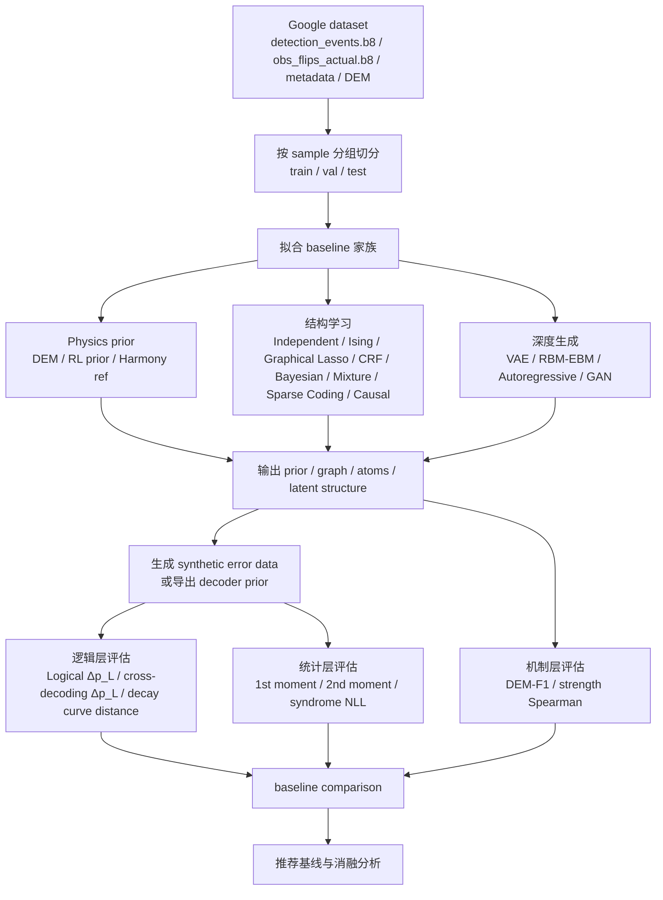

# Google 数据集上用于 error mechanism/location/strength 推断与 error data 生成的基线与指标深度调研报告

## 执行摘要

你当前的 learner 目标，不只是“译码更准”，而是要在 Google surface-code 数据上，从 learner-visible syndromes / responses 中**推断 error mechanisms、发生位置与强度，并进一步生成与真实实验一致的 error data**。这意味着评估体系必须同时覆盖三层：**下游逻辑效果、统计分布保真、机制级可解释性**。Google 数据集 README 显示，数据按 sample/patch/basis/cycles 组织，核心文件包括 `detection_events.b8`、`obs_flips_actual.b8`、`metadata.json`，并且已经给出了四条现成 pathway：correlated matching 与 Harmony，两者各有 SI1000 prior 与 RL-optimized prior 版本；这使它非常适合做“已有产业级/QEC-specific 基线 + 统计学习基线 + 生成模型基线”的三层比较。fileciteturn0file0 citeturn20view0turn20view1

Google 硬件数据没有真实的 mechanism/location/strength 标签，因此 teacher-learner 控制实验的作用正是提供带 evaluator-only 真值的训练与审计桥梁：先在有真值但 learner 不可见的环境中学习如何从无标签 syndrome-response surface 中提取可分类的机制结构，再把同一套可见表征、基线和生成/译码指标带回 Google 无标签环境中评估。

综合近十年、尤其近五年的 QEC / surface code / syndrome-statistics / error-model learning 文献，我的核心判断是：**最适合你当前任务的主 baseline 不是纯 decoder，而是“可生成、可解释、可投影到 mechanism/location/strength”的模型**。具体而言，最值得优先落地的五类 baseline 是：**DEM-based physics prior**、**RL/optimizer 优化 prior**、**pairwise Ising / 稀疏图模型**、**贝叶斯层次模型**、以及**稀疏字典学习 / probabilistic sparse coding**。这五类分别覆盖了物理先验、逻辑性能上界、局部结构恢复、跨 context 稳定性，以及“无标签机制发现”的最直接对应。citeturn20view0turn20view3turn20view4turn28view2turn28view0turn28view1turn29view0turn27view3turn39view3

如果只选一个**最强的逻辑参考系**，应使用 README 已提供的 **RL-optimized correlated matching / Harmony prior**；如果只选一个**最公平的弱基线**，应使用 **independent detector**；如果只选一个**最像你当前“机制发现”思路的统计基线**，应使用 **probabilistic sparse coding / dictionary learning**；如果只选一个**最适合作为可解释图结构对手**，应使用 **sparse Ising / graphical model**；如果只选一个**最适合作为不依赖 decoder 的 published generative reference**，应使用 **autoregressive generative model**，代表性 published baseline 是 qecGPT / Generative Decoding。citeturn21view0turn21view1turn39view3turn29view0turn20view0turn20view1

从指标层面，你之前提出的分层 metrics 是对的，而且建议保留。最重要的是把它们明确分成：**逻辑层**（Logical Δp_L、cross-decoding Δp_L、decay curve distance）、**统计层**（syndrome 1st/2nd moment、syndrome NLL）、**机制层**（DEM-F1、strength Spearman）。纯 decoder 型 baseline 往往只在逻辑层表现强；纯统计生成模型往往只在统计层表现强；真正与你的研究目标同向的 baseline，应该在机制层也能给出可比较输出。citeturn20view0turn20view1turn21view0turn21view1turn28view2

## 数据集与任务重述

Google 这份 surface-code 数据并不是单纯的“decoder benchmark”，而是一个天然适合**误差模型学习**的实验数据集：你能直接拿到检测事件比特流、实际 observable flips、元数据，以及官方/半官方路径下的已解码输出和 `error_model.dem`。README 说明它按 sample、patch、basis、cycles 层级组织，并同时包含理想/带噪电路、真实检测事件、真实 observable flips，以及 pathway-specific 的 prior / predicted flips。对于要做 mechanism/location/strength 推断的人来说，这意味着你可以同时进行三类实验：**对 held-out syndromes 的密度建模**、**对 DEM 或其投影的机制恢复**、以及**用生成数据反哺 decoder 的 cross-decoding 测试**。fileciteturn0file0

这份数据还自带极强的 baseline 语境。README 已把 **SI1000 prior**、**RL-optimized prior**、**Harmony decoder** 等路径放进目录结构；对应文献中，RL-optimized prior 被明确设计为“用 decoder logical error 作为优化目标来校准 prior”，并在 Google Sycamore 的 repetition / surface-code memory experiment 上分别比领先的 decoder-agnostic 方法提高约 16% 与 3.3%。Harmony 则是一个 MWPM-based ensembling 方法，能够把多个“noisy” decoder 融合到接近 maximum-likelihood 的性能，并利用 ensemble 共识度做 layered decoding。也就是说，**你的研究问题不是从零开始找对手，而是站在一个已经有强 QEC-specific priors 的数据基座上做更强的机制推断**。fileciteturn0file0 citeturn20view0turn20view1

对“机制发现”来说，最关键的结构化对象其实是 DEM。Stim 把电路级噪声压缩成 detector error model，PyMatching 又能直接消费这类 DEM 做 MWPM 解码；Sparse Blossom 则把这一路线推到可实时级。一个很自然的数学统一写法是：令 \(z_m\sim \mathrm{Bernoulli}(p_m)\) 表示第 \(m\) 个误差机制是否触发，\(A\in\{0,1\}^{D\times M}\) 是 mechanism-to-detector incidence，\(b\in\{0,1\}^{M}\) 是 mechanism-to-observable incidence，则 syndrome 与 observable flip 可写为
\[
s = A z \pmod 2,\qquad o = b^\top z \pmod 2.
\]
在这个表述下，你的 learner 与很多 baseline 的差别，实质上就是：**它们在多大程度上能学到 \(A\)、\(p_m\)、以及 context-conditioned 的 \(p_m(c)\)**。citeturn36academia1turn20view3turn20view4

## 基线版图与对比表

下面这张表把最值得纳入的 baseline 家族，按“数学形式—拟合流程—输入/GT—输出—复现性”压到同一张图里。前几行是**Google 数据天然存在的 QEC-specific baselines**；中间是**统计/图模型/贝叶斯类 baselines**；后面是**深度生成类 baselines**。其中有些方法原生就输出 mechanism-like 对象，有些只输出分布或图结构，需要后处理投影到 mechanism/location/strength。表中“未指明”表示原文或官方实现未明确给出该细节。相关方法来源见表内引用。fileciteturn0file0 citeturn20view0turn20view1turn20view3turn20view4turn28view2turn28view0turn28view1turn29view0turn27view3turn29view2turn39view3turn29view3turn30academia3turn39view1turn40view0turn21view0turn21view1turn27view1turn27view2turn27view4turn39view2

| Baseline | 方法概述与数学形式 | 训练/拟合流程 | 需要的输入/GT | 输出形式 | 可复现性 |
|---|---|---|---|---|---|
| DEM-based physics prior | 以 DEM 为生成先验，\(z_m\sim \mathrm{Bern}(p_m)\)，\(s=Az \bmod 2\)，\(o=b^\top z \bmod 2\)。最接近现有 correlated matching / MWPM 路线。citeturn36academia1turn20view3 | 从 `error_model.dem` 读入机制支撑与权重；可直接采样 synthetic syndromes，或将其作为 decoder prior。 | 需要 circuit/DEM；不需要 mechanism labels。 | DEM 机制集、机制权重、synthetic error data。 | 强。Stim、PyMatching、Sparse Blossom 公开可用。citeturn20view3turn20view4turn36academia1 |
| RL/optimizer 优化 prior | 在 DEM 支撑上调权，目标直接最小化 decoder 的 logical error：\(\min_\theta \hat p_L(\mathrm{Dec}_\theta)\)。本质是“有物理支撑、以逻辑效果为目标”的 prior calibration。citeturn20view0 | 初始化于 SI1000/DEM；迭代优化权重或 bias 参数；评价函数是 held-out logical failure。 | 只需 syndromes + observable flips；不需 mechanism labels。 | 优化后的 DEM 权重或 prior 参数。 | 中等。论文公开，但我未检索到官方公开仓库。citeturn20view0 |
| Harmony / decoder ensemble 参考线 | 不是 mechanism learner，而是 logical-performance reference。融合多个 MWPM-like decoder，近似 ML accuracy。citeturn20view1 | 训练/构造多个 noisy decoders；ensemble 投票与共识评分。 | syndromes + decoder outputs；不需 mechanism GT。 | 逻辑预测、共识分数。 | 中等。论文公开；官方代码未明确检索到。citeturn20view1 |
| Independent detector | 最弱无结构基线：\(q(s)=\prod_j \pi_j^{s_j}(1-\pi_j)^{1-s_j}\)。它等价于只拟合 detector 触发率，不拟合任何相关性。可视作 \(K=1\) 的 factorized Bernoulli。citeturn40view0 | 计数估计或 Beta-Bernoulli 平滑。 | 仅需 syndromes。 | 每个 detector 的边际概率，或 unary “pseudo-mechanisms”。 | 极强，十分钟内可复现；实现可用 pomegranate / 任意自写。citeturn39view2 |
| Pairwise Ising | 二值最大熵模型，匹配一阶/二阶统计：\[
q(s)\propto \exp\Big(\sum_i h_i s_i+\sum_{i<j}J_{ij}s_is_j\Big).
\]
适合学习 detector pair correlation。citeturn29view0turn29view1 | 常用 pseudolikelihood、\(\ell_1\) 稀疏化、或 CD/score matching。 | 仅需 syndromes；不需 GT。 | 偏置 \(h_i\)、耦合 \(J_{ij}\)、可采样分布。 | 中等；有大量通用实现，QEC-specific 官方实现未见。citeturn29view0turn29view1 |
| 图模型 / CRF / 因子图 | 若做无条件建模，更像 MRF / factor graph：\(q(s)\propto \exp(\sum_c \psi_c(s_c,x))\)；若把 patch/basis/cycles/坐标作为 context，则可做 conditional CRF。QEC 中 BP/DS-BP 也是因子图思路。citeturn29view2turn32view0turn32view1 | 设计局部 clique / 时间边 / 空间边；做最大似然、伪似然或变分/BP。 | 仅需 syndromes；若做条件模型可加入 metadata/context。 | 图结构、势函数、条件或联合分布。 | 强。pgmpy 适合 BN/MRF 原型，QEC 中 DS-BP 文献公开。citeturn27view1turn32view0turn32view1 |
| Graphical lasso / 稀疏逆协方差 | \[
\hat\Theta=\arg\max_{\Theta\succ0}\ \log\det\Theta-\mathrm{tr}(S\Theta)-\lambda\|\Theta\|_1.
\]
本质是学稀疏条件依赖图；原生假设偏高斯，直接用于 binary syndrome 有失配，但非常适合做 sparse graph baseline。citeturn26search4turn27view3 | 对 detector covariance / centered moments 做玻璃套索；必要时再投影到 binary sampler。 | 仅需 syndromes。 | 条件依赖图、精度矩阵。 | 强。GGLasso 开源。citeturn27view3 |
| 贝叶斯层次模型 | 将 mechanism 或 detector 强度写成 context-conditioned random effects，例如 \(\mathrm{logit}\,p_{m,c}=\mu_m+\alpha_{\text{sample}}+\beta_{\text{patch}}+\gamma_{\text{basis}}+\delta_{\text{cycles}}\)。其优势是共享统计强度与不确定性估计。QEC 中与 syndrome-statistics noise estimation 高度同向。citeturn28view0turn28view1turn27view4 | 用 MCMC / SVI / SMC 拟合；对静态与时变噪声都可扩展。 | syndromes；如拟合 decoder-oriented model，可加 observable flips。无 mechanism GT。 | 后验分布、均值/方差、context-level strength。 | 强。Pyro/PyMC/Stan 生态成熟；QEC 方向有 Kobori-Todo 与 Wagner。citeturn28view0turn28view1turn27view4 |
| EM / mixture of Bernoullis | \[
q(s)=\sum_{k=1}^K \pi_k\prod_j \theta_{kj}^{s_j}(1-\theta_{kj})^{1-s_j}.
\]
适合把 shot-level 数据分成若干“噪声工作点/隐状态”。citeturn40view0turn39view2 | E-step 估责任；M-step 更新 \(\pi_k,\theta_{kj}\)；选 \(K\) 用 BIC/held-out NLL。 | 仅需 syndromes。 | mixture components、每个 shot 的软分配、可生成数据。 | 强。pomegranate 等通用包可复现。citeturn39view2 |
| Sparse coding / 字典学习 | 最贴近“机制发现”：令 syndrome 由少数 dictionary atoms 叠加生成。概率版可写作 \(z\) 稀疏、\(q(s|z)=\mathrm{Bernoulli}(\sigma(Dz+b))\)，其中 atom 可解释成机制模板。citeturn39view3turn33academia8 | 交替更新 sparse codes 与 dictionary；或用变分 EM 做 probabilistic sparse coding。 | 仅需 syndromes。 | atoms、每 shot 的 sparse activations、可解释机制模板。 | 强。ProSper 提供多种 probabilistic sparse coding，包括 Binary Sparse Coding。citeturn39view3 |
| 因果发现 / 结构学习 | 目标是学 DAG / PAG / CPD：\(q(s)=\prod_j q(s_j\mid \mathrm{Pa}(j))\)。优点是能提出“传播/依赖方向”假设；缺点是 latent confounders 很强时可识别性差。citeturn27view2turn27view1 | PC/GES/NOTEARS/FCI 等结构学习，再拟合 Bernoulli/Logistic CPD。 | 仅需 observational syndromes；可加 metadata/time。 | 图结构、父节点集合、条件概率表。 | 强。causal-learn 与 pgmpy 都开源。citeturn27view2turn27view1 |
| VAE | \[
z\sim \mathcal N(0,I),\ q_\phi(z|s),\ p_\theta(s|z)=\prod_j \mathrm{Bernoulli}(s_j;\sigma(f_\theta(z))).
\]
适合 learned latent noise regimes / smooth generator。citeturn29view3 | 优化 ELBO；binary syndrome 用 Bernoulli decoder；可做 \(\beta\)-VAE 提升 disentanglement。 | 仅需 syndromes。 | latent code、生成器、可采样分布。 | 强；通用实现多，但我未检索到 surface-code 官方版。citeturn29view3 |
| GAN | \[
\min_G\max_D\ \mathbb E_{s\sim p_{\text{data}}}\log D(s)+\mathbb E_{z}\log\big(1-D(G(z))\big).
\]
适合样本级 realism，但原生无 tractable likelihood。citeturn30academia3 | 常用 WGAN/gradient penalty；binary 输出需 Gumbel-Softmax 或 straight-through。 | 仅需 syndromes。 | 生成器、synthetic data。 | 强；通用实现多，但 QEC-specific 官方实现未见。citeturn30academia3 |
| EBM / RBM / CRBM | \[
q(s)\propto e^{-E_\theta(s)},\quad E_{\text{RBM}}(v,h)=-a^\top v-b^\top h-v^\top Wh.
\]
对二值高阶相关很自然；若条件化 metadata，则可用 CRBM。citeturn39view0turn39view1 | Gibbs / persistent CD / AIS；条件版可并入 context。 | syndromes；条件版可加 metadata。 | 能量函数、隐变量、可采样分布。 | 中等到强；现代 RBM 训练已有公开代码。citeturn39view1 |
| Published decoder-agnostic generative baseline | autoregressive Transformer：\[
q(s)=\prod_j q(s_j|s_{<j},x).
\]
qecGPT 与 2025 Generative Decoding 都是无标签学习 joint distribution 的 published 例子，可视为“decoder-agnostic generative”参考。citeturn21view0turn21view1 | 无监督拟合 joint distribution；可直接 sample，也可转 ML decoding。 | syndromes，部分实现还联学 logical operators。 | exact/autoregressive likelihood、synthetic data、隐式后验。 | qecGPT 已 clone 为 `CHY-i/qecGPT`；只接受其原生入口结果，不接受本地 helper/proxy。citeturn21view0turn21view1 |

从“和你当前研究目标的贴合度”看，上表里最关键的分水岭是：**有没有原生 mechanism-like latent object**。DEM、贝叶斯层次 + DEM、稀疏字典学习最强；Ising/graphical model 次之，因为它们给的是边或耦合，不是高阶 mechanism；EM/mixture、VAE、GAN、autoregressive 模型主要给分布，不给直接可解释机制；Harmony 和 RL prior 更像“logical-performance reference”而非完整 mechanism learner。citeturn20view0turn20view1turn29view0turn39view3turn21view0turn21view1

另一个重要判断是：**QEC-specific baselines 的“强”与“合适”不是一回事**。RL prior 和 Harmony 在逻辑错误率上非常强，但如果你的论文核心 claim 是“无标签机制恢复”，那么它们更多是 logical reference，不是最公平的结构恢复对手。反过来，independent detector、Ising、sparse coding、hierarchical Bayesian 才是更合适的“结构学习 baseline 族谱”。citeturn20view0turn20view1turn28view1turn29view0turn39view3

## 分层指标体系与 baseline 对应

建议把最终评估写成一个非常清晰的三层框架。设 held-out 真实数据为 \(\mathcal D_{\text{real}}=\{(s_i,o_i,c_i)\}_{i=1}^N\)，其中 \(s_i\in\{0,1\}^D\) 为 syndrome，\(o_i\in\{0,1\}\) 为 actual observable flip，\(c_i\) 表示 context；模型 \(M\) 输出生成器 \(q_M(s\mid c)\)，以及可选的 mechanism 集 \(\hat{\mathcal M}\)、location \(\hat{\ell}\)、strength \(\hat a\)。基于这个记号，建议指标定义如下。Google/Surface-code 文献本身长期把 logical error 作为终极目标，而最近的 decoder prior / graphical noise model / generative decoding 工作则说明仅看 \(p_L\) 会遗漏大量结构信息，因此把这三层同时保留是必要的。citeturn37academia0turn20view0turn28view2turn21view0turn21view1

**逻辑层指标。**  
定义
\[
p_L(M)=\frac{1}{N}\sum_{i=1}^N \mathbf 1\!\left[\mathrm{Dec}_M(s_i)\neq o_i\right],
\qquad
\Delta p_L(M;R)=p_L(M)-p_L(R),
\]
其中 \(R\) 是参考路径，可选 **SI1000 DEM prior**、**RL prior**、或 **Harmony**。这个指标最适合比较“模型最终能不能帮助纠错”。如果 baseline 原生不输出 decoder prior，就把它先转成 synthetic data，再训练/校准下游 decoder。RL prior、Harmony、Transformer-类 generative decoder 在这项指标上预期会最强；independent detector 会明显最弱。citeturn20view0turn20view1turn21view0turn21view1

**Decay curve distance。**  
对每个 cycle 数 \(c\in\mathcal C\)，分别计算真实和模型诱导的逻辑错误率曲线 \(p_L^{\text{real}}(c)\)、\(p_L^{M}(c)\)，建议用 log-domain RMS 距离：
\[
d_{\text{curve}}(M)=
\sqrt{\frac{1}{|\mathcal C|}\sum_{c\in\mathcal C}
\left(\log p_L^{M}(c)-\log p_L^{\text{real}}(c)\right)^2 }.
\]
之所以用对数，是因为 surface-code 论文关心的是 error suppression / decay slope，而不是单点偏差。物理先验强、并能稳定泛化 across cycles 的 baseline 在这里更占优；纯 GAN 往往会出现“单点像、曲线不像”的失败模式。citeturn37academia0turn37academia2turn20view0

**统计层指标。**  
第一矩与第二矩建议分别定义为
\[
d_1(M)=\frac1D\sum_{j=1}^D |\hat \mu_j-\mu_j|,
\qquad
d_2(M)=\frac{\|\hat \Sigma-\Sigma\|_F}{\|\Sigma\|_F},
\]
其中 \(\mu_j=\mathbb E[s_j]\)，\(\Sigma_{jk}=\mathbb E[(s_j-\mu_j)(s_k-\mu_k)]\)。实际计算时，不建议对全 \(D^2\) 对求满矩阵；更建议**限定在 DEM 邻接、空间距离阈值内、或时间近邻内**，这样更接近“可由局部 fault 产生”的相关结构。独立 detector 会在 \(d_1\) 上不差，但在 \(d_2\) 上系统性失败；Ising/graphical model 与 EBM/RBM 通常会在 \(d_2\) 上明显更强。citeturn29view0turn27view3turn39view1

**Syndrome NLL。**  
对有 tractable likelihood 的模型，定义
\[
\mathrm{NLL}(M)= -\frac1N\sum_{i=1}^N \log q_M(s_i\mid c_i).
\]
若模型是 autoregressive、VAE、probabilistic sparse coding、Bayesian model，这个量都可直接或近似计算；对 GAN 这类 implicit model，NLL 不是原生指标，建议改报**masked pseudo-likelihood** 或“两样本分类器 AUC”作为替代，并在表中明确标注“不原生对应”。在 published decoder-agnostic generative baselines 中，autoregressive Transformer 路线最自然对应 syndrome NLL。citeturn21view0turn21view1turn29view3turn39view3turn30academia3

**机制层指标。**  
若真实或 evaluator-only audit 可给出参考机制集合 \(\mathcal M^\star=\{(e_k^\star,a_k^\star)\}\)，而模型输出 \(\hat{\mathcal M}=\{(\hat e_k,\hat a_k)\}\)，则首先按 hyperedge support 完全相同，或按 Jaccard / detector-overlap 阈值做 matching，然后计算
\[
P=\frac{TP}{TP+FP},\quad
R=\frac{TP}{TP+FN},\quad
F1=\frac{2PR}{P+R}.
\]
这就是 **DEM-F1**。机制 strength 则在 matched 机制上，计算
\[
\rho_s=\mathrm{Spearman}(\hat a_k,a_k^\star).
\]
对 context-normalized strength，建议先在每个 context 内做 rank 或 robust z-normalization，再汇总 Spearman。这个层面最适合 DEM-based、sparse coding、Bayesian hierarchical、以及部分图模型；对 GAN、纯 VAE、Harmony、RL prior，这一层要么弱、要么需要额外 explainability 投影。citeturn28view2turn28view0turn28view1turn39view3

**Cross-decoding \(\Delta p_L\)。**  
这项指标非常关键，因为它测的是“你生成的 error data 是否够真实，足以支持 decoder training / prior calibration”。定义为：用模型 \(M\) 生成 \(\tilde{\mathcal D}_M\)，据此训练或校准 decoder \(D_M\)，再到真实 held-out 数据上测
\[
\Delta p_L^{\text{cross}}(M;B)
=
p_L(D_M;\mathcal D_{\text{real}}^{\text{test}})
-
p_L(D_B;\mathcal D_{\text{real}}^{\text{test}}),
\]
其中 \(B\) 是参考 baseline，建议至少包括 SI1000 prior 与 RL prior。一个模型如果 syndrome moments 很好但 cross-decoding 很差，通常说明它只学到“表面统计”，没学到真正对逻辑错误有决定性的 rare correlated events。这个 failure mode 在 mixture、VAE、GAN 中很常见。citeturn20view0turn28view2turn21view0turn21view1

为了把“baseline–metric–failure mode”一眼看清，下面给出第二张对照表。这里的“强/中/弱/不原生”是基于文献能力边界与你任务目标之间的预期，不是已经在 Google 数据集上测得的排序；因此它应被理解为**实验前的合理先验**。citeturn20view0turn20view1turn28view2turn29view0turn39view3turn21view0

| Baseline | 对应的主指标 | 不对应或需投影的指标 | 预期表现 | 典型失败模式 |
|---|---|---|---|---|
| DEM-based physics prior | Logical Δp_L、curve、DEM-F1、strength Spearman、cross-decoding | syndrome NLL 依实现而定 | 若真实设备接近 DEM 假设，整体非常强 | 对 leakage、漂移、非 Pauli、高阶相关 rare events 不够灵活 |
| RL/optimizer prior | Logical Δp_L、cross-decoding | syndrome NLL、DEM-F1、strength Spearman 只弱对应 | logical 表现常是最强参考线之一 | 容易“为特定 decoder/目标而调”，不一定最保真 |
| Harmony | Logical Δp_L、confidence/risk stratification | 机制层指标基本不对应 | 逻辑层很强 | 不回答 mechanism/location/strength 问题 |
| Independent detector | 1st moment | 2nd moment、DEM-F1、strength、cross-decoding | 是极好的弱下界 | 完全忽视相关 fault |
| Pairwise Ising | 1st/2nd moment、pseudo-NLL、部分 cross-decoding | DEM-F1 只能 pairwise 投影；高阶 strength 不原生 | 对局部 pair correlation 通常强 | 把高阶 fault 错投影为多条 pair edges；可能学出伪长程耦合 |
| Graphical lasso | 2nd moment、稀疏 location 图 | 精确 binary NLL、DEM-F1 需投影 | 图结构简洁、可解释 | Gaussian 失配导致概率解释不稳 |
| 图模型 / CRF / 因子图 | 2nd moment、局部结构、conditional NLL | DEM-F1 需依据 clique/potential 投影 | 若 context 信息强，兼顾性能与解释性 | 图设计与推断复杂，易受近似推断误差影响 |
| 贝叶斯层次模型 | strength Spearman、跨 sample 泛化、uncertainty、部分 NLL | DEM-F1 需先规定 mechanism family | 对 drift / context 差异很强 | 若 local mechanism family 设得太粗，会欠拟合高阶结构 |
| EM / mixture | NLL、部分 moments、数据生成 | DEM-F1 / location / strength 对应弱 | 能抓 shot-level 模态切换 | 机制粒度粗，往往把“故障原因”学成“全局工作点” |
| Sparse coding / 字典学习 | DEM-F1、strength、可解释 location、部分 NLL | cross-decoding 取决于采样器质量 | 最像“无标签机制发现”的直接对手 | 非凸；如果 atoms 过多会碎片化，过少会合并机制 |
| 因果发现 / 结构学习 | location/依赖方向、graph sparsity | 逻辑层与 DEM-F1 都需后处理 | 适合挖 propagation 假说 | observational data + latent confounders 下可识别性弱 |
| VAE | syndrome NLL、generation、latent regime 压缩 | DEM-F1 / location / strength 不原生 | 作为深度生成弱-中基线合适 | posterior collapse、机制不可解释 |
| GAN | 样本 realism、某些 moments | syndrome NLL 不原生；机制层弱 | 可作为“只看样本像不像”的对手 | mode collapse、rare-event 覆盖差 |
| EBM / RBM / CRBM | binary 概率建模、2nd moment、部分 NLL、conditional generation | DEM-F1 需 explainability 投影 | 对二值高阶相关有吸引力 | 采样与归一化困难，训练不稳定 |
| Autoregressive generative | syndrome NLL、cross-decoding、分布生成 | 机制层几乎不原生 | 是 published decoder-agnostic generative 强参考 | likelihood 强但解释性弱，需另做 attribution |

## 可复现实验方案

最重要的实验设计原则是：**按 sample 分组，而不是按 shot 随机打散**。因为 README 的目录结构和实验组织方式本身就暗示了 sample/patch/basis/cycles 是强 context，随机打散 shots 会高估泛化。建议至少做两套 split。第一套是**grouped in-distribution split**：按 sample 分层，保证 patch、basis、cycles 分布在 train/val/test 中都覆盖。第二套是**temporal/OOD split**：如果 README 中存在按时间顺序或最后一段顺序采集的 experiment block，就把这段作为 test，用来测 drift robustness。这样可以直接检验贝叶斯层次模型与 mixture model 的优势，也能更公平地区分“拟合统计”与“学到稳定机制”。fileciteturn0file0

建议的最小可发表实验矩阵如下。  
第一层，**QEC-specific references**：SI1000 DEM、RL prior、Harmony。  
第二层，**结构学习 baselines**：independent detector、pairwise Ising、graphical lasso、Bayesian hierarchical、Bernoulli mixture、probabilistic sparse coding。  
第三层，**深度生成 baselines**：VAE、RBM/EBM、autoregressive generative；若资源允许，再加 GAN 作为“implicit 生成”对照。这样一共 10–12 个 baseline，既完整，又不至于把实验拖成工程泥潭。citeturn20view0turn20view1turn29view0turn27view3turn28view1turn40view0turn39view3turn29view3turn39view1turn21view0

建议的超参数起始范围如下，这里明确标注：**这些是实验建议，不是文献统一标准；原文未指明的地方，应在论文中写“未指明，本文自定网格”**。  
Ising：\(\lambda_J\in[10^{-4},10^{-1}]\) 对数网格，邻接半径 \(r\in\{1,2,3\}\)。  
Graphical lasso：\(\lambda\in[10^{-4},10^{-1}]\)，必要时加 latent-rank \(k\in\{0,4,8,16\}\)。  
Bernoulli mixture：\(K\in\{4,8,16,32,64\}\)。  
Probabilistic sparse coding：atoms \(K\in\{16,32,64,128\}\)，code sparsity \(T_0\in\{1,2,4,8\}\)。  
VAE：latent dim \(\in\{8,16,32,64\}\)，\(\beta\in\{0.1,0.5,1,2,4\}\)。  
RBM/EBM：hidden units \(\in\{64,128,256,512\}\)，CD-\(k\in\{1,5,10\}\)。  
Bayesian hierarchical：建议先用 SVI 起步，再对最优结构做 MCMC 校准。对应开源生态分别可用 GGLasso、pgmpy、causal-learn、Pyro、pomegranate、ProSper。citeturn27view3turn27view1turn27view2turn27view4turn39view2turn39view3

采样次数方面，建议对每个 model/context 至少生成与真实 held-out shots **等量**的 synthetic shots，再额外生成 \(2\times\) 与 \(5\times\) 两档，专门测 cross-decoding 是否随着 synthetic data 量增加而趋于饱和。因为某些模型在少量样本时逻辑层会差，但随着生成样本增多，其 prior calibration 会改善；另一些模型则会“越采样越暴露 rare-event 缺失”。这类曲线很有信息量。对于 syndrome NLL / moments / DEM-F1 / strength Spearman，建议每个 split 跑至少 3–5 个随机种子。citeturn21view0turn21view1turn28view2turn20view0

统计置信区间建议统一如下。  
对 \(p_L\) 与 \(\Delta p_L\)，若基础单位是 shot-level Bernoulli outcome，报告 95% Wilson 或 Clopper–Pearson 区间；若比较两个 decoder/基线，优先用**paired bootstrap**，因为它能利用同一批 syndrome 的配对信息。  
对 decay curve distance、moments、NLL，使用**按 sample 分组的 cluster bootstrap**，避免把同一 sample 内的相关 shot 当成完全独立样本。  
对 DEM-F1 与 strength Spearman，使用**机制级 bootstrap + sample-level bootstrap** 两种版本，并同时报告。前者测“机制匹配稳定性”，后者测“跨 context 泛化稳定性”。这些做法虽然是统计常规，但对 surface-code 数据尤其重要，因为 QEC 里 rare correlated events 会让 naive IID 误差条显著过窄。citeturn37academia0turn28view2turn20view0

下面给出推荐的评估 pipeline。它直接把“真实数据—baseline 拟合—synthetic generation—逻辑/统计/机制三层评估”串成一个闭环。



## 当前代码入口与外部仓库缓存

本报告中提到的 baseline 家族已经整理进机器可读 registry：`scope_static.mechanism_discovery.baseline_registry`。它把每个 baseline 标成四类状态：Google dataset pathway 可用、外部 GitHub 参考代码已 clone、外部原生入口待跑通、或论文/数据路径存在但未找到可直接运行的公开代码。当前外部参考代码统一放在被 git ignore 的 `external/baselines/`，其中包括 Stim、PyMatching、fusion-blossom、DMLE-QEC、pomegranate、coniii、GGLasso、pgmpy、Pyro、causal-learn、ProSper、qecGPT、PyTorch examples、PyTorch-GAN 和 RBM 参考实现；RL-optimized prior 与 Harmony 使用 Google README 提供的 decoder pathway，qecGPT 使用 `CHY-i/qecGPT` clone，但当前 D3/D5 suite 不写本地 helper/proxy，只有其原生入口能消费目标数据布局时才报告 runnable 结果。

真实性优先的 runner 口径如下：D3/D5 baseline suite 只把 Google dataset
pathway 或 cloned repo 自带的原生命令/脚本结果报告为 runnable baseline。
SCOPE-native 的轻量复现、接口占位、包装类 helper、或“同类方法”不作为外部
baseline 给分；在原生入口尚未跑通当前 Google D3/D5 数据布局前，这些条目会以
`not_run_external_adapter_missing` 进入 artifact，并记录对应 clone path 与
repo metadata。`scope_teacher_learner_latent_replay` 是我们自己的 comparable
adapter，不属于 baseline 默认列表，只能通过显式 SCOPE comparable config 单独运行。

可用下面的命令重新生成 baseline 覆盖与 clone 状态审计：

```bash
conda run -n aiqec scope-stage4-baseline-registry --strict-clones
```

## 结论与推荐

如果你的论文主轴是“**在 Google dataset 上，用 learner 从 syndrome/response surface 中推断 error mechanisms、location 和 strength，并生成 error data**”，那么最合适的 baseline 不是单一的一种，而是一个**五件套**：

**第一，DEM-based physics prior。**  
这是必须有的主 baseline。原因不是它一定会赢，而是它定义了当前 surface-code 工程里最自然的 mechanism 表达坐标系。它直接对应 `error_model.dem`、直接兼容 PyMatching / Sparse Blossom、也最容易把你的机制输出与官方路径放到同一个参照系里比较。若你的 learner 在 DEM-F1、strength Spearman、cross-decoding 上都显著优于纯 DEM prior，这会是非常强的结论。fileciteturn0file0 citeturn20view3turn20view4turn36academia1

**第二，RL/optimizer 优化 prior。**  
这是必须有的强逻辑参考线。因为它已经在 Google Sycamore surface-code memory 实验上显示出对 logical error 的直接收益。你的模型如果最终也想服务 decoder，那么必须证明：你不是只在机制解释上好看，而是在 Logical Δp_L 或 cross-decoding \(\Delta p_L\) 上至少接近它，最好还能在 NLL / DEM-F1 上超过它。最理想的论文叙事是：“RL prior 是 logical-optimal reference；我们的 learner 在保持接近 logical performance 的同时，额外恢复了 mechanism/location/strength。”citeturn20view0

**第三，Pairwise Ising 或稀疏图模型。**  
如果只能从统计学习家族里选一个最强、最公平、最紧的对手，我更推荐 **sparse Ising**，而不是直接上 graphical lasso。原因是 syndrome 是二值事件，Ising 的概率语义和二阶相关表达更贴切；graphical lasso 则是非常好的辅助图结构 baseline，但其高斯近似对 binary syndrome 先天失配。对你来说，Ising 是“我们是否真的学到超越 pairwise correlation 的机制”的关键对手。citeturn29view0turn29view1turn27view3

**第四，贝叶斯层次模型。**  
这是我最推荐你认真做的一条线。因为你已经在 controlled full-circuit teacher 中恢复了 context-relative location 和 context-normalized strength/effect，而 Google 数据的 sample/patch/basis/cycles 结构恰好适合 hierarchical formulation。这个 baseline 的优势不在于逻辑 error 一定最强，而在于它会成为“**你对 context-conditional strength 建模到底值不值得做**”的最直接对手。它还能自然给出 uncertainty，这对 mechanism audit 非常加分。fileciteturn0file0 citeturn28view1turn28view0turn27view4

**第五，probabilistic sparse coding / dictionary learning。**  
这是最像你当前工作形状的 baseline。atom 对应 mechanism 模板，sparse activation 对应“这一个 shot/局部轨迹里哪些机制触发”，dictionary 则对应“catalog-level mechanism library”。如果你的 learner 要强调“无标签机制发现”，而不是只是“学一个好分布”，那这条 baseline 非常关键。它很可能不会在 logical Δp_L 上压过 RL prior，但在 DEM-F1、strength Spearman、机制可视化、以及 error data 生成的可解释性上，是最值得跟你正面比较的基线。citeturn39view3turn33academia8

在深度生成类里，**autoregressive generative baseline** 最值得纳入，而 **GAN 不应成为主 baseline**。原因很简单：你的论文要比较 syndrome NLL 和 mechanism 恢复，而 qecGPT / Generative Decoding 这类 autoregressive 路线天然有 likelihood，还是 published 的 decoder-agnostic generative 参考；相反，GAN 不原生提供 NLL，也很容易在 rare-event 覆盖上出问题，更适合做“implicit generation 的负例/附录对比”，不适合做主线。citeturn21view0turn21view1turn30academia3

最终，如果你希望实验既有说服力、又不至于失控，我建议正式主表采用以下 8 个模型：**SI1000 DEM、RL prior、independent detector、pairwise Ising、Bayesian hierarchical、Bernoulli mixture、probabilistic sparse coding、autoregressive generative**。如果资源和篇幅允许，再把 **graphical lasso、VAE、RBM/EBM、Harmony** 放到扩展表或附录。这样主表已经足够覆盖：弱下界、强逻辑参考、统计结构、层次建模、机制发现、与 published generative reference。citeturn20view0turn20view1turn29view0turn28view1turn40view0turn39view3turn21view0

**开放问题与限制。**  
2026-06-04 更新：qecGPT 已 clone 为 `CHY-i/qecGPT`；当前限制不是“没有仓库”，而是只接受其原生入口结果，不补本地 helper/proxy 来适配 Google D3/D5。
本次检索中，我没有稳定找到 RL prior、Harmony、qecGPT、Generative Decoding 在 Google dataset 上的官方公开训练脚本，因此这些 baseline 的“代码可复现性”有差异；这不影响它们作为文献 baseline 的有效性，但会影响你排期上的工程成本。另一个限制是，文献里对“机制-level recovery”没有统一指标标准，因此你提出的 DEM-F1 与 strength Spearman 反而可能成为这项工作的贡献之一。最后，README 能确认数据组织、已有 pathways 与核心文件，但某些更细粒度采样细节或官方 pathway 的内部超参数并未在 README 中明确写出，应在论文里明确标注“未指明”。fileciteturn0file0 citeturn20view0turn20view1turn21view0turn21view1
