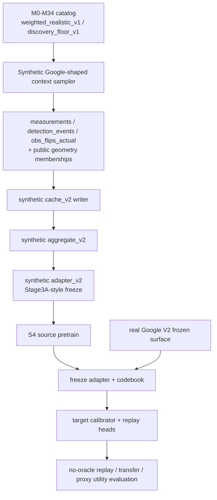

# AI_QEC S4 神经综合征响应发现与 Controlled-to-Google Bridge 技术方案

## Executive summary

`scope_static` 当前已经明确了三条工作面：固定上下文 DEM/Bernoulli 学习、受控物理机制 catalog 管线，以及 Stage 3 的 no-oracle 可见结构发现与 replay；仓库的近程目标不是单点分类器，而是“通过 discovery mechanism 构建 digital twin”，也就是先从 QEC 观测中学出紧凑、可审计的潜结构，再把它用于 generation、interpretation、transfer、drift 与 decoder-facing tests。Stage 3 的 Google V2 closeout 已经把主张边界钉死在“raw syndrome-response replay 优于 global/mean-only、assignment-shuffle、feature-scramble、public-stratified-null 控制”，而不是“恢复了真实硬件机制”；S4 则被仓库文档直接定义为下一步：在保持 no-oracle、no-surrogate-ID 与现有 controls 的前提下，引入带可审计 prototype 或 VQ bottleneck 的神经表示，并要求在 `raw_target_only` 和 `block_normalized` 上都优于 Stage 3 的 prototype mixture。

本文的仓库依据主要是 `CONTEXT.md`、`docs/STAGE3_ROADMAP.md`、`docs/SCOPE_TWIN.md`、`docs/label_manifest.md`、`docs/error_mechanisms.md` 和 `docs/RUNBOOK.md`。这些文档给出 S4 的 claim boundary、Google V2 visible surface、forbidden-feature 规则、catalog 机制范围和现有 artifact contract。

因此，我给出的主推荐不是“直接把 Google 数据喂进一个黑盒 Transformer”，而是一个**两段式 S4**：先在**synthetic Google-shaped visible surface** 上做 source pretraining，学习一个**几何注意力 encoder + VQ prototype bottleneck + block-wise replay decoder + context-conditioned prior**；随后**冻结 adapter 与 codebook**，只在 Google V2 上训练一个低容量 calibrator 与 replay heads，主打 no-oracle replay 改善、control degradation、catalog→Google 结构保留性，以及长期向 SCOPE-Twin 的 `c -> Θψ(c) -> pψ(y|c)` 方向平滑过渡。这个方案最符合仓库现有事实：一方面它复用 Google V2 现有的 cache/aggregate/adapter artifact contract；另一方面它把 S4 的离散 prototype 设计成 SCOPE-Twin 将来 orbit prototype / low-rank residual 的前置台阶，而不是另起一套不兼容的数据面。

更具体地说，我建议把 **geometry-attention + VQ** 作为默认主线，把 **MLP** 作为最低成本基线，把 **cache-level public-graph GNN** 作为第二阶段对照。VQ 比 Gumbel 更适合作为主线，因为仓库文档已经把“auditable prototype or VQ bottleneck”写成 S4 边界，而且 VQ 的 codebook 天然对应可审计 prototype；Gumbel 更适合作为 warm-up 或 collapse 备选。Google 端不应把 decoder correctness / decoder failure 当 learner target，因为现有 V2 forbidden-feature audit 已明确把“decoder correctness as learner target”列为禁止路径；但这些强标签与 proxy labels 仍然非常适合 evaluator-only 验收。

## 边界条件与成功准则

仓库已经反复定义了 S4 不能越过的边界。第一，Google 数据没有真值 hidden mechanism partition，也没有 `M0/M1/...` 这类 per-shot physical mechanism 标签，所以 Google 上不能宣称“真实机制恢复”；能宣称的是 no-oracle replay、transfer、calibration、decoder-facing utility 的改善。第二，learner path 只能使用 approved visible surface 与 public metadata，不能触碰 hidden/oracle-only 字段。第三，Stage 4 仍然是 visible-observation discovery stage，除非你把 latent 真正接到 `PhysDec_t` 与 circuit-level observation distribution 上，否则它不是完整的 CPTP/GKSL digital twin。

在 Google V2 现有 surface 上，允许学习器看到的是经验 detector marginal、observable flip、公开 detector geometry summary、公开 round/region 指示、经验 detector-detector covariance、经验 temporal covariance、经验 detector-logical coupling、以及 finite-shot/cross-replicate stability summary；而 `context_id`/`path`/`sample_id` one-hot、decoder correctness target、catalog M label、true hidden mechanism label、oracle PTM/Kraus/channel 都被显式列为 forbidden。公开上下文字段则包括 `dataset_family`、`basis`、`distance`、`rounds`、`round_band`、`region_family`、`patch_public_geometry_class` 等。这意味着 S4 的 context-conditioned prior 可以合法使用这些 public context，但不能把它们扩展成 surrogate identity shortcut。

S4 的成功不应只定义成“loss 下降”，而应同时对齐 Stage 3 的控制实验逻辑与 SCOPE-Twin 的六轴目标。SCOPE-Twin 明确把长期科学上限定义为 generation fidelity、interpretability、decoder utility、cross-context generalization、drift prediction 与 identifiability 六轴同时成立；在此之前，S4 至少要为其中的 generation fidelity、interpretability、cross-context generalization 与 identifiability 提供更强证据，并在 Google 上用强标签或 proxy label 做 evaluator-only 的 decoder utility 检查。

下表给出我建议的**S4 验收主线**。其中阈值是工程建议，不是仓库已写死的数值；仓库已经定义了 metric families 与 controls，而这些阈值是为方便你们把 claim boundary 操作化。

| 目标 | 主指标 | 建议通过线 |
|---|---|---|
| distribution replay 改善 | `raw_target_only` 主指标、`block_normalized` 辅指标 | 相对 Stage 3 B1/C 基线，跨 seed/fold 平均改善至少 5% 与 3% |
| prototype 可审计性 | active prototype count、dead code ratio、prototype cards、parameter accounting | dead code < 25%，prototype 使用分布不过度塌缩，所有 prototype 有可解释 block 画像 |
| control degradation | assignment-shuffle / feature-scramble / public-stratified-null 差值 | 三类 control 上的 replay 指标均显著劣化，且方向稳定 |
| catalog→Google 结构保留性 | frozen codebook coverage、proxy-consistency gain、domain-gap reduction | Google 中活跃 code 覆盖率充足，且优于随机 codebook / 无 source pretrain |
| Digital Twin 兼容性 | `π(k|c)`、prototype+low-rank residual、public-context transfer | latent 能自然映射到未来 orbit prototype / residual，而不是一次性黑盒 embedding |

## 推荐架构

仓库现在的 Google V2 path 已经把输入对象固定成**frozen visible surface**，也就是 `visible_features.npy + visible_feature_schema.json + split_manifest.json + forbidden_feature_audit.json` 这一套协议冻结产物；Stage 3 的发现模型则是 visible-only prototype mixture，验证选择依赖 validation visible NLL，而不是 evaluator labels。S4 最合理的工程解法，是在这个协议面上升级表示能力，而不是绕开协议去偷吃 raw-only 或 oracle-only 信息。

我建议的主架构如下。它保留 Stage 3 的 artifact contract，但把 flat row 先拆成 block tokens，再进入 geometry-attention encoder；离散瓶颈用 VQ codebook；decoder 用 block-wise replay heads；`π(k|c)` 只依赖 public context。这个结构和 SCOPE-Twin 的“context-to-orbit encoder / orbit prototype / low-rank residual”方向是同构的简化版。

```mermaid
flowchart LR
    X[Stage 3A frozen visible surface<br/>visible_features.npy + schema + split + audit] --> T[Block tokenizer<br/>marginal / spatial / temporal / logical / stability / meta]
    C[Public context c<br/>dataset_family basis distance rounds<br/>round_band region geometry] --> P[Context prior π(k|c)]
    T --> E[Geometry-attention encoder]
    E --> Z[latent z_e]
    Z --> Q[VQ codebook e_k]
    P --> Q
    Q --> K[prototype index k]
    K --> D[Block-wise replay decoder]
    C --> D
    D --> R1[raw-target-only replay]
    D --> R2[block-normalized replay]
    D --> R3[source-only proxy audits]
```

### encoder 选型建议

仓库文档对 SCOPE-Twin 的 Layer 1 已经写得很清楚：未来的 context encoder 可以用 message passing、attention、spectral encoding、handcrafted descriptors，GNN/Transformer/diffusion 都是可选；而 Google V2 visible surface 目前已经有公开 geometry、round-band、region-family 与 logical-support 等结构信号。基于这一点，我不建议把 MLP 当主线，也不建议第一版就把 full graph GNN 当默认；最稳妥的主线是**geometry-attention**，也就是“按 block 与公有几何 token 分组的 set/attention encoder”。

| 方案 | 输入视图 | 优点 | 缺点 | 建议定位 |
|---|---|---|---|---|
| MLP | 直接吃 flat `visible_features.npy` | 最快、最稳、最易做 matched-control | 很容易学到列级 shortcut，不善于建模 block 交互 | 必做基线 |
| Geometry-attention | block tokens + public context tokens | 最符合当前 frozen surface；对 block 交互更敏感；仍然易审计 | 比 MLP 重一些 | **主推荐** |
| Cache-level GNN | public detector graph / memberships / covariances | 最接近未来 context-to-orbit / graph twin | 实现更重，对数据管线要求更高 | 后续对照 |

我的具体建议是：**Phase 1 直接做 geometry-attention**。实现上不要追求复杂 Transformer 堆叠，2–4 层 attention block、每层 4–8 头就足够。token 设计也不需要过度 exotic：每个 feature block 一个 pooled token，再附上 `round_band / region_family / patch_public_geometry_class` 三类上下文 token，以及一个 global token，就能比 flat MLP 更自然地吸收现在 surface 中的结构信息。这个选择比 full GNN 更贴近当前 artifact contract，也更容易跟 Stage 3 A/B/C 的基线对齐。

### 离散瓶颈建议

VQ 与 Gumbel 都能实现离散 latent，但它们适合扮演的角色不同。VQ-VAE 的 codebook 更天然对应“可审计 prototype”，这和仓库在 S4 里强调的 auditable prototype / VQ bottleneck 是一致的；Gumbel-Softmax/Concrete 的优势在于优化更平滑、可微 relax 更直接，适合作为 warm-up 或 collapse 备选。

| 方案 | 核心形式 | 优势 | 风险 | 建议 |
|---|---|---|---|---|
| VQ | 最近邻 codebook `e_k` | prototype 审计最强；codebook 可直接做卡片化分析 | dead code / collapse | **主线默认** |
| Gumbel | `softmax((log α + g)/τ)` | 训练更顺、适合软 assignment | prototype 解释性弱于 VQ | warm-up 或备选 |
| Hybrid | 先 Gumbel 再 hard VQ | 兼顾可训练性与可审计性 | 控制更复杂 | collapse 时启用 |

我建议默认配置如下：`K=32`、code dimension `d=32`、commit 系数 `β=0.25`。Google 端如果 row 数很多，可以做 `K ∈ {16, 32, 64}` 的 K-stress，但不建议一开始就超过 64，因为仓库已经强调 K 选择必须审计、且 compression claim 不能偷换成 free assignment table；S4 的卖点应该是“共享 codebook + context-conditioned policy”，而不是“更多 code 更容易拟合”。

### decoder 输出统计量与 head 设计

当前 Stage 3C 的 generation 指标包括 `categorical_population_nll`、`gaussian_density_nll`、population cross entropy、raw visible-feature MAE、population MAE、expectation MAE；而 `label_manifest` 又明确指出，下一步更值得做的是 cross-context heldout NLL、masked conditional syndrome NLL、higher-order window NLL、logical-tail calibration、decoder failure CE/Brier、decoder-facing utility。S4 的 decoder 因此不该只输出一个“重构向量”，而应该输出**按 block 分头的统计对象**。

我建议 decoder 分成四个 head：

1. **raw replay head**：对 raw blocks 做离散化分箱或低维 categorical replay，直接服务 `raw_target_only`；
2. **continuous diagnostic head**：输出 block-wise `(μ, log σ^2)`，服务 Gaussian density 与 MAE 诊断；
3. **stability head**：专门回归 finite-shot / cross-replicate stability summary；
4. **source-only proxy head**：只在 synthetic adapter surface 上启用，用公开代理标签做语义对齐，不进入 Google learner path。

与其让 decoder 完全由 `k` 决定，我更建议采用**prototype + 低秩 context residual**：

\[
\eta_b(k,c)=\eta^{(0)}_{b,k}+A_{b,k}\,u(c), \qquad \mathrm{rank}(A_{b,k}) \le r,
\]

其中 \(u(c)\) 是 public context embedding，\(b\) 是 feature block。这样做的意义不是“更复杂”，而是让 S4 的 latent 结构和 SCOPE-Twin 未来的 orbit prototype / low-rank residual 保持同向：prototype 负责可审计主结构，context residual 负责公开上下文条件下的受控偏移。

### context-conditioned π(k|c)

SCOPE-Twin 的长期目标是从 context 直接映射到物理参数场 \(\Theta_\psi(c)\)，而不是静态地给每个样本一张 free assignment table；Stage 2 文档也明确说过，free assignment 更像 identifiability probe，不是 compression architecture。S4 恰好能用 `π(k|c)` 迈出这一步：用 public context 预测 prototype prior，而不是让所有 assignment 全部由 row-wise content 自由决定。

我建议把 prior 写成：

\[
\pi_\psi(k \mid c)=\mathrm{softmax}\!\big(W_2\,\sigma(W_1 u(c))\big),
\]

其中 \(u(c)\) 只来自 `dataset_family`、`basis`、`distance`、`rounds`、`round_band`、`region_family`、`patch_public_geometry_class` 这些 Google V2 public fields；`context_group` 继续留在 protocol-only 侧，不进入 learner-visible 输入。这样既能提升 transfer，又不会违反 Stage 3 对 context leakage 的边界。

## Controlled-to-Google bridge 设计

仓库已经给出了一个非常重要的实现暗示：Google V2 不是“随便读一下原始文件”，而是有明确的 **cache → aggregate → adapter → S3A freeze** 工厂路线，并且冻结产物必须包括 `visible_features.npy`、`visible_feature_schema.json`、`forbidden_feature_audit.json`、`split_manifest.json`、`adequacy_report.json`、`metrics.json`。同时，controlled catalog pipeline 也已经能生成 teacher-declared noisy QEC observations，并输出 mechanism records、sampling audit、teacher contracts 与 learner-visible replay artifacts。最可行的 bridge 方案，就是让 synthetic source 走**同一条 Google-shaped surface contract**，而不是另写一套不兼容的预处理。



### 从 M0–M34 catalog 到 Google-shaped visible surface

`error_mechanisms.md` 现在已经把 M0–M34 catalog 与 set_A / set_B / set_C / set_D 划分写清楚了，而且 Born-local 当前支持 M0–M10、M12–M34，不支持 M11 spectator crosstalk；另外还提供了 `weighted_realistic_v1` 与 `weighted_discovery_floor_v1` 两个加权 profile。基于这些现状，我建议桥接面按三档推进：**MVP 先做 set_B 的 supported 子集**，随后扩到 set_C，再扩 set_D。也就是说，第一版 source pretrain 不要把 M11 强行塞进去；那会把 bridge 的失败风险和机制契约未完成问题混在一起。

桥接面的 context sampler 应该显式采样下列公开上下文轴：`basis`、`distance`、`rounds`、`round_band`、`region_family`、`patch_public_geometry_class`，并让 synthetic contexts 产出和 Google cache v2 一样的公开几何结构：coords、boundary detector 集合、logical support detector 集合、round-band memberships、region-family memberships。由于 Google cache/aggregate 代码就是围绕这些字段组织单位行与 public_fields 的，因此 synthetic source 只要把这些公共成员关系写成同 schema，就能复用后续 surface builder。

### 数据合成流程与 projection pipeline

受控 bridge 的关键，不是“把机制标签传过去”，而是**把机制生成的 shot-level 观测投影成 Google V2 已认证的 visible surface**。我建议流程固定为：

1. `data_preparation` 生成 shot-level `measurements`、`detection_events`、`obs_flips_actual`；
2. synthetic cache writer 生成与 Google cache v2 同构的 `cache_context_*.npz` 与 `cache_manifest.json`；
3. aggregate 阶段按 `(context, round_band, region_family)` 形成 unit rows；
4. adapter 阶段写出标准 `S3A_protocol_freeze` 包；
5. S4 只吃这个 freeze 包，不回头读取 teacher labels。

这里最重要的一点是：Google V2 允许的可见 feature block 已经被仓库写死为经验 marginal、空间相关、时间相关、detector-logical coupling、stability 与 public geometry；bridge 不能为了 source-pretrain 提升而偷偷加入“机制名 embedding”或 oracle channel summary。source synthetic 里当然存在 exact `M*` labels，但它们应当被放进 **evaluator-only artifacts**，而不是 learner input。

在任何 S4 neural training 开始前，bridge surface 必须先通过一个硬门槛：

- `visible_feature_schema.json` 的 block 名称、block 顺序、dtype、维度和 normalization policy 与 Google V2 freeze 可比；
- `visible_features.npy`、`split_manifest.json`、`forbidden_feature_audit.json`、`adequacy_report.json` 和 `metrics.json` 全部存在；
- synthetic freeze 写出 schema hash、source config hash、teacher config hash 和 public context schema hash；
- learner-safe manifest 不含 exact `M*`、mechanism family、oracle PTM/Kraus/channel、sample/path/context surrogate ID；
- evaluator-only 标签单独落在 `source_evaluator_labels.json`，并有 loader 层面的 no-leakage audit；
- 如果 schema/hash 或 forbidden-feature audit 不通过，本阶段直接失败，不进入 source pretrain。

### proxy label 生成策略

`label_manifest.md` 已经把 Google 这边最强的标签分成了 strong labels、context labels、decoder/prior labels 与 DEM-derived proxy labels，并明确提醒：Google 不提供真实 per-shot physical mechanism labels，所以任何机制类标签都只能是 proxy，而不是 ground truth。bridge 设计最好在 synthetic source 侧**故意复制这种 label organization**，从而让 source 和 target 的 artifact 语义一致。

我建议 synthetic bridge 产出两层标签：

- **learner-visible / proxy-visible**：support size bucket、boundary/bulk、detector degree bucket、round-layer bucket、logical-support overlap bucket、fault-graph community、source detector-rate quantile；
- **evaluator-only**：exact `M*`、mechanism family、mechanism set、quotient alias class、teacher config hash。

这样做有两个好处。第一，source pretrain 可以用 learner-visible proxies 做弱辅助，而不破坏 no-oracle 边界。第二，Google target 端可以用同名 proxy 结构做对齐与评估，方便计算“catalog→Google 结构保留性”，而不必在 target 端发明新的标签体系。

### 训练与转移流程

Bridge 的训练和转移，我建议明确拆成**source pretrain**与**target adaptation**两段。

在 source pretrain 段，模型在 synthetic Google-shaped surface 上联合训练 encoder、VQ codebook、`π(k|c)` 与 replay decoder；模型选择严格沿用 Stage 3 规则，只看 validation visible replay 指标，不看 `M*` evaluator labels。随后冻结 adapter（包括 block tokenizer、encoder、codebook、标准化参数），只把一个**低容量 target calibrator**和**Google replay heads**暴露给 target 训练。这样，Google 端的学习就变成“在固定 prototype vocabulary 上重估 public-context prior 与小残差”，而不是重新学习一整套黑盒 latent。

如果 source/target visible statistics 差距较大，我建议优先使用一个**冻结 adapter 后的低容量对齐器**，而不是立刻 unfreeze 整个 encoder。这个 calibrator 可以配 `CORAL` 或 `MMD` 类型的 alignment loss；如果仍然不够，再把 DANN 当 fallback，而不是第一版默认。这样更符合“freeze adapter, apply to Google V2”的桥接要求，也更有利于审计 catalog→Google 的结构保留性。

### 关键对比实验与 matched controls

仓库已经把 Stage 3 controls 设计得很完整：assignment-shuffle、feature-scramble、context-shuffle、K-stress、public-stratified-null 等都已经有清晰语义和 acceptance logic；SCOPE-Twin 文档还要求 matched parameter / compute budget。S4 的实验矩阵不应推翻这些 controls，而应在它们之上增加 neural ablations 与 transfer ablations。

| 组别 | 目的 | 关键对照 |
|---|---|---|
| S3B1/S3C baseline | 现有 no-oracle replay 基线 | 原始 Google V2 Stage 3 流程 |
| S4-MLP-Continuous | 验证“神经化但无离散瓶颈”是否已足够 | 参数量匹配 geometry-attention 主线 |
| S4-Attention-Gumbel | 验证 soft categorical bottleneck | 与 VQ 同 K、同 decoder、同预算 |
| **S4-Attention-VQ** | 主推荐模型 | 与 MLP/Gumbel/GNN 做 matched budget |
| S4-GNN-VQ | 检查 public graph 是否带来额外收益 | 只用 cache-level public graph，不引入 oracle |
| Frozen adapter transfer | 检查 source pretrain 有无真实迁移收益 | 对照“train on Google only” |
| Frozen adapter + CORAL/MMD calibrator | 检查 domain-gap 缓解 | 对照“无 calibrator” |
| Random codebook / random adapter | 检查结构保留不是偶然 | 对照“学习过的 source adapter” |

## 训练目标与损失函数

S4 的损失设计，必须同时满足三件事：一是主优化方向仍然是 **visible replay**，而不是 mechanism classification；二是训练目标要和 Stage 3 的 `raw_target_only` / `block_normalized` scoring 对齐；三是 latent 结构要具备 prototype auditability 与 future twin compatibility。仓库对 model selection 的要求也已经很明确：validation visible NLL 可以用于选择，ARI/NMI 不可以。

设 \(x_i\in\mathbb R^D\) 为 frozen visible row，\(c_i\) 为 public context，\(z_i=E_\phi(x_i)\)，codebook 为 \(\{e_k\}_{k=1}^K\)，assignment posterior 为 \(q_\phi(k\mid x_i,c_i)\)，context prior 为 \(\pi_\psi(k\mid c_i)\)。我建议 source pretrain 的总损失写成：

\[
\mathcal L
=
\lambda_{\mathrm{replay}}\mathcal L_{\mathrm{replay}}
+\lambda_{\mathrm{vq}}\mathcal L_{\mathrm{vq}}
+\lambda_{\mathrm{prior}}\mathcal L_{\mathrm{prior}}
+\lambda_{\mathrm{ent}}\mathcal L_{\mathrm{ent}}
+\lambda_{\mathrm{bal}}\mathcal L_{\mathrm{bal}}
+\lambda_{\mathrm{stab}}\mathcal L_{\mathrm{stab}}
+\lambda_{\mathrm{proxy}}\mathcal L_{\mathrm{proxy}}
+\lambda_{\mathrm{align}}\mathcal L_{\mathrm{align}} .
\]

下面各项是我建议的具体定义。

### replay loss

为了和 Stage 3 headline 保持一致，建议把 replay loss 显式拆成 raw-target 与 block-normalized 两部分：

\[
\mathcal L_{\mathrm{replay}}
=
\alpha\,\mathcal L_{\mathrm{raw}}
+
(1-\alpha)\,\mathcal L_{\mathrm{bn}},
\qquad \alpha \in [0.6,0.8].
\]

其中

\[
\mathcal L_{\mathrm{raw}}
=
\sum_{b\in\mathcal B_{\mathrm{raw}}} w_b\,\bar \ell_b,
\qquad
\mathcal L_{\mathrm{bn}}
=
\frac{1}{|\mathcal B_{\mathrm{raw}}|}
\sum_{b\in\mathcal B_{\mathrm{raw}}}
\frac{\bar \ell_b}{\max(d_b,1)}.
\]

这里 \(b\) 对应 marginal、spatial、temporal、logical、stability 等 raw blocks；\(d_b\) 是 block 维度；\(\bar \ell_b\) 是 block 平均 NLL。建议 headline 训练权重偏向 raw blocks，meta/public geometry 仅作为 prior 调制与弱残差因素，不作为 headline loss 主导项。这样做直接对齐 Stage 3 的“raw-target-only 和 block-normalized 都要成立”这条边界。

### VQ 与 commitment loss

若使用 VQ，推荐 straight-through 版本：

\[
k_i^\star = \arg\min_k \|z_i - e_k\|_2^2,
\]

\[
\mathcal L_{\mathrm{vq}}
=
\|\operatorname{sg}[z_i]-e_{k_i^\star}\|_2^2
+
\beta \|z_i-\operatorname{sg}[e_{k_i^\star}]\|_2^2,
\]

其中 `sg` 是 stop-gradient，\(\beta\) 建议从 `0.25` 起步。VQ 的优势是 codebook 与 prototype card 非常好审计；如果出现 usage collapse，再切到 Gumbel warm-up。

若改用 Gumbel，则：

\[
q_\phi(k\mid x_i,c_i)
=
\mathrm{softmax}\!\left(\frac{\log \alpha_{ik} + g_{ik}}{\tau}\right),
\]

其中 \(\tau\) 建议从 `1.5` 退火到 `0.3`。但我仍建议把 Gumbel 保留给 optimization rescue，而不是主线。

### context prior、entropy 与 balance

为了让 latent 真正从 free assignment probe 走向 compressed/contextual policy，我建议显式加入 posterior-to-prior 正则：

\[
\mathcal L_{\mathrm{prior}}
=
\frac{1}{N}\sum_{i=1}^N
\mathrm{KL}\!\big(q_\phi(\cdot\mid x_i,c_i)\,\|\,\pi_\psi(\cdot\mid c_i)\big).
\]

同时用 batch-level balance 防止 dead code，用 target entropy 防止过早硬化：

\[
\bar q_k=\frac{1}{N}\sum_i q_\phi(k\mid x_i,c_i),
\qquad
\mathcal L_{\mathrm{bal}}=\mathrm{KL}(\bar q \,\|\, U_K),
\]

\[
\mathcal L_{\mathrm{ent}}
=
\left(
\frac{1}{N}\sum_i H(q_\phi(\cdot\mid x_i,c_i)) - H_t
\right)^2.
\]

其中 \(H_t\) 可以做线性退火，例如从 `0.45 log K` 退到 `0.10 log K`。这比单纯追求最硬 assignment 更稳，也更容易通过 seed-stability 审计。

### stability loss

Google V2 surface 本身就包含 finite-shot 与 cross-replicate stability summary，因此 S4 非常适合做 view-consistency。建议把一个 row 的两种合法扰动——例如 shotblock bootstrap、feature dropout、或同一 public unit 的 replicate summary——映射到相近 latent：

\[
\mathcal L_{\mathrm{stab}}
=
\frac{1}{N}\sum_i
\Big(
\|z_i^{(a)}-z_i^{(b)}\|_2^2
+
\mathrm{KL}(q_i^{(a)}\|q_i^{(b)})
\Big).
\]

这项损失的价值不在于 generic SSL，而在于它正好和现有 V2 可见 surface 的“稳定性摘要”语义一致。

### control-margin ablation

Stage 3 的灵魂是 matched controls。第一版 S4 主线应把 assignment-shuffle、feature-scramble、context-shuffle 与 public-stratified-null 保持为 evaluation-only 压力测试，避免模型被直接训练成“会过 control”。在主线稳定后，可以增加一个单独标记的 ablation：在小比例 minibatch 上构造 batch 内 assignment-shuffle 与 feature-scramble surrogate，然后要求原模型对它们保留 margin：

\[
\mathcal L_{\mathrm{ctrl}}
=
\max\!\big(0, m_a-(\ell_{\mathrm{shufA}}-\ell_{\mathrm{model}})\big)
+
\max\!\big(0, m_f-(\ell_{\mathrm{scrF}}-\ell_{\mathrm{model}})\big).
\]

其中 \(m_a,m_f\) 可从 `0.01–0.05` nats 起始，仅在 warm-up 后启用。带有这项 regularizer 的结果不能替代主线成绩单；报告时必须和不使用 `control-margin` 的同预算模型并列，确认 improvement 不是直接由 control-aware training 带来的。

### replay-proxy 与 alignment项

`replay-proxy` 我建议**只在 synthetic source 上默认启用**，且目标必须来自 visible/public proxy，而不是 exact mechanism label。一个简洁做法是预测 support-size bucket、boundary/bulk、logical-support bucket、fault-graph community 等代理标签：

\[
\mathcal L_{\mathrm{proxy}}
=
\sum_r \lambda_r\,\mathrm{CE}(\hat u_{ir},u_{ir}).
\]

在 Google target 上，\(\lambda_{\mathrm{proxy}}\) 默认应设为 `0`，尤其不要把 decoder correctness / decoder failure 放进 learner target；这些留给 evaluator-only。

如果 source/target 差距大，再加一个可选的 target calibrator alignment loss：

\[
\mathcal L_{\mathrm{align}}
=
\mathcal L_{\mathrm{CORAL}}(B_\gamma(z_t),z_s)
\quad \text{或} \quad
\mathrm{MMD}(B_\gamma(z_t),z_s).
\]

我建议第一版只训练一个小型 affine 或 low-rank calibrator \(B_\gamma\)，而不是 unfreeze 全部 adapter。

### 超参数建议

如果你们想要一个直接能开跑的默认点，我建议：

- encoder：2–4 层 geometry-attention，hidden dim `128`；
- codebook：`K=32`, `d=32`；
- optimizer：AdamW，lr `1e-3`，weight decay `1e-4`；
- `β=0.25`, `λ_prior=0.05`, `λ_bal=0.02`, `λ_ent=0.01`, `λ_stab=0.10`, `λ_proxy=0.05`（source-only）, `λ_align=0.01`（target optional）；
- replay mix：`α=0.7`；
- optional control-margin ablation：`λ_cm=0.20`，总 epoch 的前 20% 不启用，必须单独标记；
- K-stress：`16, 32, 64`。  

这些值的核心目标不是一次调到最优，而是**先在不破坏 Stage 3 guardrails 的条件下做出稳定 MVP**。仓库现有 Stage 3 已经证明过 validation-NLL-driven 选择与 K-stress / controls 的工作方式，所以 S4 先延续这个 protocol，风险最小。

## 评估协议与验收标准

评估协议上，我建议你们继续保持**两张成绩单**：一张是 synthetic source 的 evaluator-only recovery / audit 成绩单，另一张是 Google target 的 no-oracle replay / transfer / utility 成绩单。仓库 `SCOPE_STATIC_DISC` 已经明确警告过：不要把 synthetic recovery 与 Google external validation 混到一个“总成功”叙事里；Google 没有 hidden partition，所以 ARI/NMI 在 target 端不是默认主指标。

下面这张表是我建议的 S4 验收表。metric 名称与 guardrail 逻辑尽量贴现有 repo；阈值与相对基线是我建议的可操作版本。

| 维度 | 指标 | 计算方法 | 通过线 | 必要控制 | 必记 artifact |
|---|---|---|---|---|---|
| synthetic 恢复 | ARI / NMI / quotient metrics | source-only evaluator labels | 不弱于 matched-budget S3 baseline，且 seed 稳定 | K-stress、seed/fold stability | `source_recovery_metrics.json` |
| replay 改善 | `raw_target_only`、`block_normalized` | 相对 S3B1/S3C 与 null baselines | 平均提升 ≥ 5% / 3% | global-null、mean-only、public-stratified-null | `replay_metrics.json` |
| control degradation | shuffle/scramble gap | 原模型 - control 模型 | 所有 seeds 中 ≥ 80% 为正且均值显著 | assignment-shuffle、feature-scramble、context-shuffle | `control_margin_metrics.json` |
| prototype 审计 | active/dead code、prototype usage entropy、prototype cards | codebook 统计 + top-feature 可解释性 | dead code < 25%，无单 code 垄断 | random codebook 对照 | `codebook_usage.json`、`prototype_cards.json` |
| catalog→Google 保留性 | coverage、proxy-consistency gain、gap reduction | frozen codes on Google 的占用与 proxy 一致性 | 优于随机 adapter 与无 pretrain | random adapter、train-on-Google-only | `catalog_to_google_structure.json` |
| Google utility | logical-tail calibration、logical flip Brier、decoder failure CE/Brier | evaluator-only on target | 至少一项 utility 指标优于 S3 / public null | no-target-label training audit | `google_utility_eval.json` |
| protocol 合规 | forbidden feature count、label-free selection count | artifact 审计 | 全部为 0 | 全流程审计 | `protocol_audit.json` |

artifact logging 方面，最重要的是**继续遵守 Stage 3 bundle 风格**。Stage 3 文档已经给出一个很完整的 discovery bundle，且明确要求 downstream stages 通过 `scope_static.mechanism_discovery.artifacts` 读这些文件，而不是各写各的 ad hoc loader。S4 最好在此基础上增量扩展，而不是另起炉灶。

我建议 S4 最终 bundle 至少包含下列新增文件：

| 文件名 | 作用 | learner / evaluator |
|---|---|---|
| `adapter_manifest.json` | synthetic-google-shaped surface 来源、schema hash、source/target 版本 | learner-safe |
| `bottleneck_manifest.json` | `K`、code dim、assignment mode、entropy schedule | learner-safe |
| `codebook_usage.json` | active/dead code、occupancy、usage entropy | learner-safe |
| `prototype_cards.json` | 每个 prototype 的 block 均值、方差、context prior 偏好 | learner-safe |
| `source_recovery_metrics.json` | source evaluator-only ARI/NMI/quotient 审计 | evaluator-only |
| `google_transfer_metrics.json` | Google no-oracle replay/transfer 成绩单 | learner-safe |
| `catalog_to_google_structure.json` | transfer coverage、proxy consistency、domain-gap 分析 | mixed |
| `control_margin_metrics.json` | assignment-shuffle / feature-scramble / context-shuffle 结果 | learner-safe |
| `seed_stability.json` | prototype / replay 的跨 seed 稳定性 | learner-safe |
| `summary.md` | 一页式审阅摘要 | learner-safe |

## 实施路线与可交付物

仓库的组织方式已经很清楚：`src/scope_static/google` 负责 Google readers / visible surfaces / cache，`src/scope_static/mechanism_discovery` 放核心发现与审计逻辑，`src/scope_static/experiments/stage3` 放 CLI 入口；`pyproject.toml` 中也已经有 `scope-stage3b1-discovery`、`scope-stage3c-generator`、`scope-google-s3-visible-cache-v2` 这样的命名风格。S4 最好的落地方式，就是在**目录、脚本、config 命名**上完全平行延申。

### Phase 0: 桥接合同门槛

这一阶段的目标，不是把神经模型训好，而是把 **synthetic Google-shaped surface contract** 做出来，并通过现有 artifact 审计。Phase 0 是 S4 的进入门槛：只要 schema、hash、split、public context 或 forbidden-feature audit 不可比，后续 neural pretrain 与 transfer 都不应启动。

我建议新增这些核心文件：

```text
src/scope_static/google/s4_bridge_surface.py
src/scope_static/google/s4_bridge_cache.py
src/scope_static/mechanism_discovery/s4_bridge_artifacts.py
src/scope_static/experiments/stage4/synthetic_google_surface.py
configs/scope_static/stage4_synthetic_google_surface_v1.yaml
```

这一阶段的 MVP 很简单：给定受控 catalog 运行，产出一个与 Google V2 `S3A_protocol_freeze` 同构的目录树，并额外写出 `source_label_manifest.json` 与 `source_evaluator_labels.json`。验收时必须逐项比对 synthetic 与 Google V2 freeze 的 feature schema、block slice、normalization policy、split policy、public context schema 和 forbidden-feature audit。如果这个阶段没做稳，后面的 source pretrain 与 Google transfer 都会沦为 schema mismatch 调参。这个阶段最需要的是 CPU 与 I/O，而不是 GPU；如果用 full-circuit teacher，可能需要 CUDA-Q 环境，否则 Born-local / local-observable 路径即可先做 MVP。

### Phase 1: 神经瓶颈预训练

这一阶段才引入真正的 S4 模型。建议新增：

```text
src/scope_static/mechanism_discovery/s4_encoder.py
src/scope_static/mechanism_discovery/s4_bottleneck.py
src/scope_static/mechanism_discovery/s4_decoder.py
src/scope_static/mechanism_discovery/s4_losses.py
src/scope_static/mechanism_discovery/s4_metrics.py
src/scope_static/mechanism_discovery/s4_training.py
src/scope_static/experiments/stage4/source_pretrain.py
configs/scope_static/stage4_source_pretrain_v1.yaml
```

最小可行产物是：在 synthetic Google-shaped surface 上，用 geometry-attention + VQ 跑出一版可重复的 source bundle，包含 replay 改善、ARI/NMI evaluator-only 审计、K-stress、seed stability 与 codebook cards。只要这一步能稳定超过 MLP continuous baseline，你们就已经证明“神经化瓶颈在不破坏 no-oracle protocol 的情况下是有价值的”。这一步对算力的要求其实不高：1 张 24–40GB 显存的 GPU 就足以跑主线，geometry-attention 每个 seed 通常在数小时到十余小时量级；真正贵的是 ablation grid，而不是单次主线。

### Phase 2: Google 转移与验收

这一阶段新增：

```text
src/scope_static/mechanism_discovery/s4_transfer.py
src/scope_static/mechanism_discovery/s4_controls.py
src/scope_static/experiments/stage4/google_transfer.py
src/scope_static/experiments/stage4/ablation_grid.py
configs/scope_static/stage4_google_transfer_v1.yaml
configs/scope_static/stage4_ablation_grid_v1.yaml
```

MVP 是：冻结 source adapter+codebook，在 Google V2 freeze 包上训练一个低容量 calibrator + replay heads，证明相对于 Stage 3 B1/C 与 null/control baselines，`raw_target_only` 和 `block_normalized` 至少有稳定改善，同时不触发 forbidden-feature / target leakage。只要这一步做到，你们就已经拥有一个**严格对齐 repo claim boundary 的 S4**。此时还不需要宣称“数字孪生完成”，但可以很稳地宣称“source-structured prototype vocabulary 能迁移到 Google visible surface，并改善 no-oracle replay”。

### 接口草案与数据格式示例

下面这组接口草案，我是按当前 `mechanism_discovery + artifacts + experiments` 风格设计的，目的就是让 S4 能最小代价接进现有 repo。

```python
# src/scope_static/mechanism_discovery/s4_types.py
from __future__ import annotations

from dataclasses import dataclass
from pathlib import Path
from typing import Any

import numpy as np
import torch
from torch import nn


@dataclass(frozen=True)
class S4SurfaceBatch:
    x: torch.Tensor                  # [B, D] frozen visible rows
    block_slices: dict[str, slice]   # marginal/spatial/temporal/logical/stability/meta
    public_context: dict[str, torch.Tensor]
    source_domain: str               # "synthetic_google_shaped" | "google_v2"
    proxy_labels: dict[str, torch.Tensor] | None = None


@dataclass(frozen=True)
class S4CodeAssignments:
    q_probs: torch.Tensor            # [B, K]
    hard_index: torch.Tensor         # [B]
    prior_probs: torch.Tensor        # [B, K]
    codebook: torch.Tensor           # [K, d]


class SurfaceAdapter(nn.Module):
    def forward(self, batch: S4SurfaceBatch) -> dict[str, torch.Tensor]:
        """Return block tokens, context embedding, and latent z_e."""


class VQPrototypeBottleneck(nn.Module):
    def forward(
        self,
        z_e: torch.Tensor,
        context_embed: torch.Tensor,
    ) -> S4CodeAssignments:
        """Return posterior/prototype assignments with auditable codebook state."""


class S4ReplayModel(nn.Module):
    def forward(self, batch: S4SurfaceBatch) -> dict[str, Any]:
        """Return replay logits/means/variances, assignments, and audits."""


def run_stage4_source_pretrain(
    stage3a_dir: str | Path,
    output_dir: str | Path,
    config: dict[str, Any],
) -> dict[str, Any]:
    """Train S4 on synthetic Google-shaped frozen surface."""


def run_stage4_google_transfer(
    stage3a_dir: str | Path,
    pretrained_dir: str | Path,
    output_dir: str | Path,
    config: dict[str, Any],
) -> dict[str, Any]:
    """Freeze adapter/codebook and fit target calibrator + replay heads on Google V2."""
```

对应的 manifest 示例，我建议做成下面这样。关键点是把 learner-safe 与 evaluator-only 拆开，避免后面有人图省事把 `M*` 带回 learner path。

```json
{
  "schema": "scope_static_stage4_adapter_row_v1",
  "source_domain": "synthetic_google_shaped",
  "public_fields": {
    "dataset_family": "synthetic_surface_code",
    "basis": "X",
    "distance": 5,
    "rounds": 9,
    "round_band": "mid",
    "region_family": "boundary",
    "patch_public_geometry_class": "rotated_surface"
  },
  "feature_row_ref": {
    "stage3a_dir": "outputs/scope_static/PHYC_STAGE4_bridge/S3A_protocol_freeze",
    "row_index": 1842
  },
  "proxy_labels_visible": {
    "support_size_bucket": "s2",
    "logical_support_bucket": "touches_logical",
    "boundary_bulk": "boundary"
  },
  "evaluator_only": {
    "exact_mechanism_label": "M8",
    "mechanism_family": "G2_COHERENT_ZZ_PHASE",
    "quotient_alias": "coherent_2q_phase_family"
  }
}
```

### 计算资源与时间线假设

在不额外引入超大 raw-shot sequence 模型的前提下，S4 本质上仍是 surface-level 学习，所以资源需求远低于 full digital twin。一个保守但现实的估计是：

- bridge surface 构建：16–32 CPU cores，若干小时到一天；
- source pretrain 主线：1× 24–40GB GPU，单 seed 数小时到十余小时；
- Google transfer：1× 24GB GPU 通常足够；
- 完整 ablation grid：约 2–4 GPU-days；
- 如果加 cache-level GNN：再预留 1–2 GPU-days。

如果按“Phase 0 桥接合同门槛 → Phase 1 神经瓶颈预训练 → Phase 2 Google 转移与验收”三阶段推进，且每个阶段都要求至少 3–5 个种子复现，我会把总周期估成**六到八周**。这不是因为模型很大，而是因为 controls、artifacts 与 protocol 审计本身需要时间。这个时间线与 repo 当前“artifact-contract-first”的风格是匹配的。

## 风险与替代路径

第一个风险是 **VQ collapse / dead code**。这类问题在离散表示学习里很常见，VQ 的解释性优势与训练脆弱性基本是同一枚硬币的两面。我的建议不是一开始就放弃 VQ，而是提前把 fallback 设计进配置：如果 `dead_code_ratio > 0.25` 或 active code 急剧收缩，就切换到 “Gumbel warm-up → hard VQ fine-tune”，并同时降低 `K`、提高 balance 正则、对低使用率 code 做周期性 reset。这样既不放弃审计性，也不在第一阶段被优化问题拖死。

第二个风险是 **adapter mismatch**。如果 synthetic source 生成的是“像 Google 的数据”，而不是“按 Google V2 contract 生成的数据”，那么 transfer 失败时你们根本分不清是 representation 不行，还是 surface 就没对齐。最有效的缓解方法不是更换模型，而是要求 synthetic 端严格复用 Google V2 的 cache/aggregate/adapter contract，并对 feature schema、hash、split manifest 做逐项比对；只要 schema/hash 不一致，就直接判为 bridge 失败，而不是继续训。

第三个风险是 **source/target domain gap**。最稳健的缓解路线是：先冻结 adapter 与 codebook，只训练低容量 calibrator；若 gap 仍大，再尝试 CORAL 或 MMD；只有在这些低风险方法都无效时，再考虑部分 unfreeze 或 DANN。原因很简单：你们当前最值钱的不是极限精度，而是**catalog→Google 的结构保留性是否还能被审计**；大规模 unfreeze 往往会把这个可审计性冲淡。

第四个风险是 **surrogate identity leakage**。Google V2 明确禁止 `context_id/path/sample_id` one-hot，也禁止 decoder correctness target。S4 一旦加入 public context prior，就更容易不小心把这些公开字段放大成“近似 dataset ID shortcut”。因此，我建议把 `public-stratified-null`、`context-shuffle` 与 forbidden-feature audit 做成**硬门槛**，把 `π(k|c)` 的容量控制在低秩层面，不要让它单独变成一个强大的 context memorizer。

最后一个风险是 **过度主张**。即便 S4 在 Google 上显著优于 S3，你们依然不能把这件事说成“恢复了真实 Google 硬件的 error mechanisms”，因为仓库文档已经把这条线画得非常清楚：Google 没有 per-shot physical mechanism labels，也没有 hidden partition，Google 的角色是 external validation benchmark，而不是 oracle discovery benchmark。最安全、也最有说服力的表述是：**S4 在不突破 no-oracle 规则的前提下，改善了 Google V2 的 visible syndrome-response replay，并把 source catalog 学到的 prototype vocabulary 以可审计方式迁移到了目标域。**
